# 在使用卡尔曼滤波器进行目标跟踪时，我错过了什么

> 原文：<https://towardsdatascience.com/what-i-was-missing-while-using-the-kalman-filter-for-object-tracking-8e4c29f6b795>

## *不测量时如何估计*物体的速度

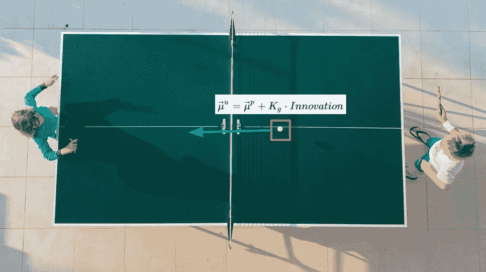

由 [Jure Zakotnik](https://unsplash.com/@jzakotnik?utm_source=unsplash&utm_medium=referral&utm_content=creditCopyText) 在 [Unsplash](https://unsplash.com/s/photos/ping-pong?utm_source=unsplash&utm_medium=referral&utm_content=creditCopyText) 上拍摄的照片

# 介绍

卡尔曼滤波器是一种复杂的算法，在大多数情况下，人们在没有完全理解其方程的情况下使用它。

当我开始使用卡尔曼滤波器时，我也是这样做的。我阅读了一堆试图直观地解释算法的教程，但这样做，忽略了关于协方差矩阵的作用的关键部分。

我正在开发的产品是一个基于检测的物体追踪器。其中，卡尔曼滤波器用于预测和更新给定视频流中对象的位置和速度，以及对每一帧的检测。在某些情况下，我们还想通过调整给定运动角度的对象的位置来考虑摄像机的倾斜和平移。当然，物体的速度应该不受这种摄像机运动的影响。

但是，当开始实施这一调整时，我意识到我并不真正理解速度是如何估算的。我假设在这个过程中的某个地方，有一个给定的先前和当前位置的速度的显式计算(在我们的例子中，速度从来没有被直接测量)。我还假设这个速度和位置的处理方式是一样的。令我惊讶的是，这两个假设都被证明是错误的。

这让我深入卡尔曼滤波器的方程，试图尽可能直观地找出到底发生了什么，但不要过于简化。这个博客总结了我在这个过程中学到的东西。

由于这不是一个介绍性的博客，我将假设你熟悉概率论的基本概念，如概率分布函数，高斯分布和贝叶斯定理。此外，我们将使用矩阵乘法和加法进行一些计算。所以如果你也熟悉这一点就更好了。

# 概观

卡尔曼滤波器是一种算法，设计用于在给定这些变量的连续测量值以及这些测量值中的不确定性量的情况下，估计一段时间内测量变量的值。卡尔曼滤波器还考虑了估计变量之间的给定关系。

让我们以在视频中跟踪乒乓球的过程为例，给定球的 2D 包围盒检测。检测可能包含给定 bbox 的坐标中的一些不准确性，或者由假阳性/假阴性引起的不准确性。

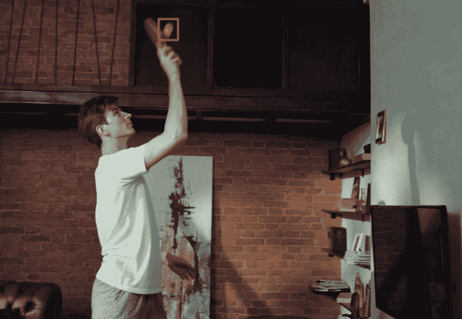

对几个连续帧的典型检测。bboxes 并不总是完美的，有时会完全丢失(假阴性)。(视频由 [cottonbro](https://www.pexels.com/video/man-bricks-wall-house-4115289/) 提供)

为了更平滑地跟踪球，我们将想要跟踪测量的 bbox 的中心坐标( *x* 、 *y* )、宽度和高度。假设一个运动的球的速度可以在短时间间隔内近似为常数，我们也想跟踪 x 和 y 的速度( *v_x* ， *v_y* )，希望得到这些预测:

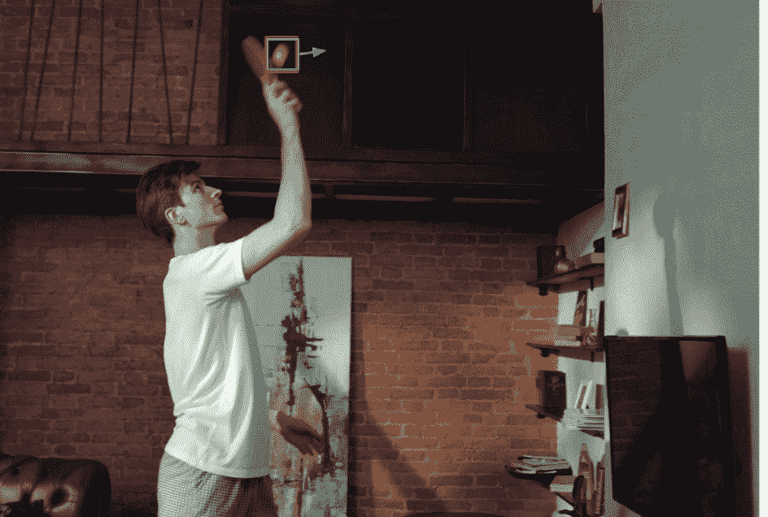

卡尔曼滤波器的预测是绿色的，平滑检测(红色)。(视频由 [cottonbro](https://www.pexels.com/video/man-bricks-wall-house-4115289/) 提供)

通常，当试图解释卡尔曼滤波器时，人们会使用一个使用位置和速度测量来跟踪对象的例子(例如 GPS 和速度计)。在我们的例子中，我们没有速度的直接测量。相反，**卡尔曼滤波器使用测得的位置和我们注入到其方程中的关于我们期望的运动行为(在这种情况下为恒定速度)的先验知识来推断该速度**。

**为了简单起见，从现在开始我们只讨论 *x* 和*v _ x*的跟踪(1D 跟踪的一个例子)。理解了 1D 发生的事情后，逻辑可以很容易地扩展到二维和三维，因为在我们的例子中，每个维度都完全独立于其他维度。**

# 假设

使用卡尔曼滤波器时有两个重要假设:

1.  传感器有噪声，其输出和噪声可以通过**高斯概率分布函数(PDF)** 精确建模。
2.  我们对实际状态的初始先验知识也是高斯 PDF。

在我们的示例中，传感器输出由 1D 高斯表示，其中均值等于实际传感器输出，方差是传感器的不确定性(主要根据经验测量)。

先验高斯是二维的(一个用于位置，一个用于速度)。使用 6 个数字可以完整地描述 2D 高斯:2 个用于其中心坐标向量(也称为平均值)，另外 4 个用于 2x2 协方差矩阵。

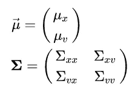

协方差矩阵的对角线对应于每个维度的方差，2 个非对角线元素是位置和速度之间的实际协方差。由于协方差的对称性，非对角线元素总是相同的，即，x 和 y 之间的相关性与 y 和 x 之间的相关性相同(我们将在后面更详细地讨论这个元素)。

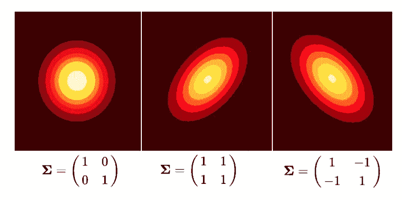

不同协方差矩阵对应的 2D 高斯分布

卡尔曼滤波器将尝试使用输入检测来更新平均值和协方差。常见的术语是将这种分布称为**系统状态**。

在我们的例子中，我们将使用下面的初始状态:

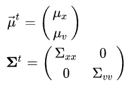

平均位置 *μ_x* 取自第一个检测到的 bbox 的 x 位置，我们假设一些初始速度 *μ_v* 。我们还假设，最初速度和位置之间没有协方差。我们可以用图形将这种初始状态绘制如下:

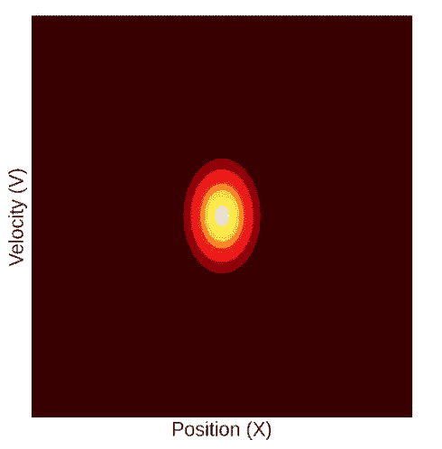

典型的初始状态。在这个阶段没有相关性(这将随时间变化)，因此高斯曲线具有轴对齐的椭圆形。

# 算法步骤

为了发挥它的魔力，卡尔曼滤波器有两个步骤:**预测**，在这个步骤中，它试图预测当前的状态，给定先前的状态和从那时起已经过去的时间。**更新，**尝试将预测状态与输入测量值结合。让我们用我们的例子来看看这是如何发生的。

# 预测步骤方程

给定经过的时间，为了预测下一个状态，卡尔曼滤波器使用状态转移矩阵( **F** )，(也称为物理模型)，该矩阵将前一个状态与当前状态联系起来。在我们的例子中，由于我们假设在短时间间隔内速度恒定(大约几帧)，状态转移矩阵为:

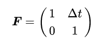

这样，如果我们把它乘以我们的状态均值向量，我们得到预测的均值:

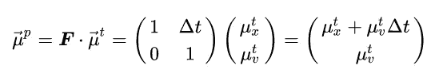

预测新的平均值是不够的。我们预计，如果时间已经过去，那么协方差矩阵(代表状态的不确定性)也将改变。为了预测新的协方差，我们将使用随机变量的线性变换公式([参见此处了解详情](https://stats.stackexchange.com/questions/173163/linear-transformation-of-gaussian-random-variable))并添加一个噪声对角矩阵。这种噪声被称为“过程噪声”,它包含了自我们上次更新状态以来经过的时间所产生的不确定性，并且在我们的物理模型中没有考虑到。因此，在我们的例子中，它可以表示非恒定速度和相机运动。通常用 **Q** 表示。因此协方差预测方程如下:

如果我们为初始状态解这个方程:

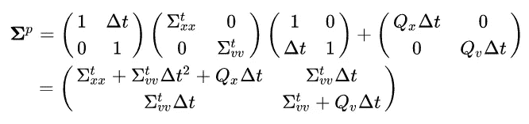

注意，除了过程噪声增加的额外不确定性之外，位置方差也增加了一个系数:

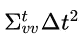

这个因素源于我们在将 **F** (物理模型)定义为非对角矩阵时引入的位置和速度之间的相关性。可以这样理解:给定预测位置是状态速度的函数，这个预测位置的不确定性就是我们之前状态的不确定性加上速度的不确定性乘以它们耦合的因子(平方，单位为)。

这里需要注意的另一件事是新引入的协方差因子:

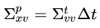

这意味着我们的高斯维度不再独立。这更容易用图形来解释，所以我们就这么做吧。

# 预测步骤直觉

从图形上看，更新步骤如下所示:

这里发生了什么？为什么我们的状态突然横过来了？这是因为位置和速度**不是**两个独立变量。状态的速度直接影响预测的位置。直觉上，这意味着更高的速度应该对应更远的位置，反之亦然。从数学上来说，这由我们的**状态转移矩阵(F)不是对角的**这一事实来表示。非对角线元素δt 将位置和速度联系在一起。

由于这种耦合，每个更新步骤都会在协方差矩阵中引入**非对角元素，这在图形上对应于我们的分布的移动，如上面的 GIF 所示。**

# 更新步骤直觉

这一步在数学上有点复杂，但直觉上也很简单。在该步骤中，卡尔曼滤波器将接收两个可能的状态作为输入(定义为高斯 pdf ),并输出一个新的状态，该状态结合了来自两者的信息。

在深入描述这一过程的方程之前，这里有**要点:**以统计最优的方式组合来自两个(或更多)pdf 的信息，相当于**将它们相乘**。由于高斯分布的特殊性质，这种乘法的乘积是另一种具有均值和协方差的高斯分布，可以通过(相对)简单的方程获得。

现在了解更多细节。更新过程可以被认为是贝叶斯推理。如果我们将我们正在跟踪的物体的实际位置(我们实际上不知道)定义为 **x** ，并且将实际测量的位置定义为 **m** ，我们得到以下更新等式:

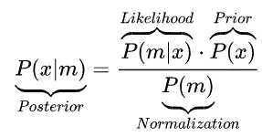

卡尔曼滤波器中使用的贝叶斯定理

让我们在卡尔曼滤波器的背景下理解这些术语:

*   **后验**:给定测量，实际位置的概率分布。这就是我们想要使用更新步骤来推断的内容。
*   **可能性**:给定实际位置，测量的概率分布。这被假设为实际位置周围的高斯分布(如“假设”部分所述)。
*   **先验**:在测量之前，尽我们目前所知的实际位置的概率分布(也称为预测状态)。这最初也被假设为高斯分布。
*   **归一化**:测量概率分布，对所有可能的位置求和。在这种情况下，不计算这部分，因为我们只关心更新均值和协方差，而不关心高斯振幅。

从这里我们可以推断出，更新后的状态将是预测状态和测量状态的产物(关于似然函数的更多信息，请查看本博客，关于卡尔曼滤波器中的似然性的更多信息，请查看本书[的第 4 章](https://drive.google.com/file/d/0By_SW19c1BfhSVFzNHc0SjduNzg/view?resourcekey=0-41olC9ht9xE3wQe2zHZ45A))。因为我们在这里处理的是高斯分布，这种分布的乘积将是另一种高斯分布，它的均值和协方差有封闭的方程。

**如果**我们有位置和速度的测量值(我们没有),更新步骤会是这样的:

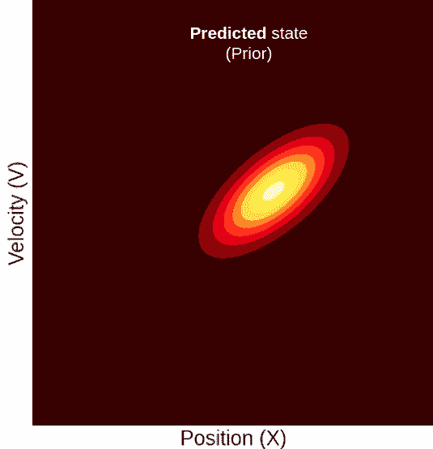

预测状态取自上述过程。测量的状态，类似于我们的初始状态，有一个轴对齐的椭圆形。这就是说，测量的位置和测量的速度来自两个独立的传感器，每个传感器的不确定性由高斯方差捕获。

但是，因为在我们的视频跟踪示例中，我们只有一个位置测量值，没有速度测量值，所以被测状态的概率只会在位置维度上衰减，但在速度维度上，它将具有均匀分布，因此看起来像这样:

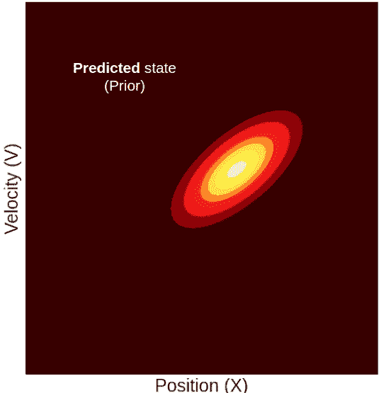

在这里，您可以看到一个测量位置，其平均值高于预测值。当然，更新状态的位置将介于两者之间。但是请注意，尽管我们只测量了位置，更新状态的**平均速度相对于预测状态也增加了**。如果我们回想一下预测状态的位置和速度是相关的，这意味着更远的位置与更高的速度相关联，就可以直观地理解速度的这种变化。有了这个性质，为什么测量某个位置会导致我们对平均速度的信念发生改变就变得很清楚了。

考虑两个高度相关的概率分布:例如，云量概率分布和降雨量概率分布。我们知道，大量的云与更多的雨密切相关。现在假设我们必须猜测昨天巴黎下了多少雨。在没有任何先验知识的情况下，你会猜测，比如说，3 毫米的降雨量(你猜测的平均值)。现在，有人告诉你昨天非常多云。利用这一先验知识，你肯定会更新你对降雨量的猜测。这正是卡尔曼滤波器中发生的情况。给定一个远位置测量，我们也将速度更新到一个更高的值。

# 均值更新方程

在这篇博客中，我们不会试图推导出“更新”方程(为此你可以在这里查看)，而是我们将展示它们并试图理解它们。

首先是一些定义:

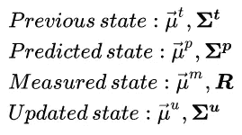

我们使用 **R** 到**来表示测量的状态协方差矩阵，因为这是卡尔曼滤波器教科书中常用的表示方法。在这个例子中，由于我们的测量是 1D，测量的状态可以用两个标量来表示:**

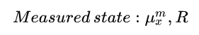

因为我们的测量和状态具有不同的维度，为了将两者结合起来，我们需要一个线性变换，将我们从状态空间带到测量空间。我们用矩阵 **H** 来表示这个转换。在我们的例子中，我们的测量只有一个维度(位置),而状态有两个维度(位置&速度),因此要在它们之间转换，我们可以使用:

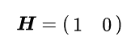

这样，如果我们将预测平均值乘以 **H** ，我们将只得到平均值的测量部分:

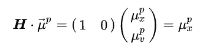

现在是真正的方程式。我们将首先给出更新状态的均值和协方差的完整方程，然后将它们分解成更有意义的分量，以便我们可以更好地理解发生了什么。

完全更新的均值等式(对于我们的 1D 视频跟踪示例)为:

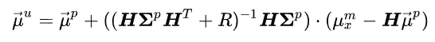

这是一个相当复杂的等式，所以让我们来分解它。首先，我们将传感器“创新”定义为:

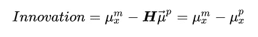

其仅仅是测量位置和平均预测位置之间的差。它被称为创新，因为它可以被认为是我们从传感器获得的新(创新)信息。

其次，我们将“卡尔曼增益”定义为:

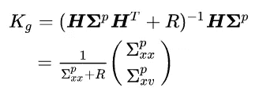

卡尔曼增益是我们将新的传感器信息合并到更新的状态中的因子。

将这些定义代入等式，我们得到:

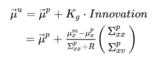

让我们进一步细分到位置更新和速度更新。对于**更新后的位置**我们得到:

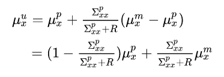

这个等式很有道理。更新的平均值将是预测的和测量的平均值的加权平均值，权重因子与它们各自的相对不确定性成比例。

假设我们有一个完美的零方差传感器。这将导致预测的测量值等于传感器测量值(这是应该的——这是完美的。).另一方面，如果与预测状态的方差相比，传感器噪声很大(高度不确定性),则情况正好相反，完全忽略测量，仅使用预测位置。正如你所料。

现在对于**平均速度更新**:

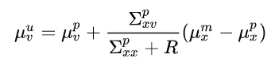

在这种一般形式下没有太多意义(至少我想不到)，所以让我们尝试插入我们之前导出的单个协方差预测步骤的结果，看看是否有帮助。如果我们假设零过程噪声(Q=0，这是不现实的，但对于更简单和更直观的方程是好的),我们得到预测的协方差是:

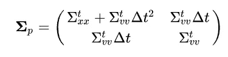

记住“ **t** ”上标只是“上一步”的意思；进入速度更新，我们得到:

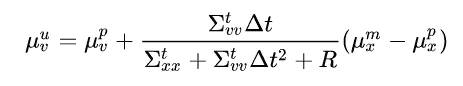

我们将分子和分母乘以δt，得到:

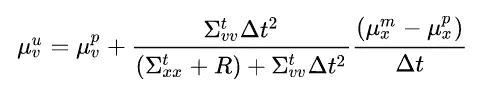

让我们想想这个等式的不同部分以及它们所包含的内容。最后一部分:

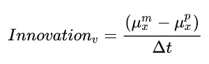

是速度创新。就像位置创新一样，这是预测的状态速度和我们实际到达测量位置所需的速度之间的差异。现在，我们希望更新后的状态中包含多少这种创新？这取决于我们之前状态下速度的不确定性，相对于测量速度的不确定性。**但是等等**，我们没有测到速度！**从位置测量中推断出**。那么我们如何定义这个推断速度的不确定性呢？

速度是使用先前的位置和测量的位置来推断的，因此它的不确定性是它的两个分量的不确定性的总和是有意义的。因此，我们可以将推断的速度不确定性定义为:

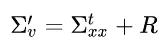

如果我们回忆一下:

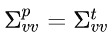

我们还可以定义一个广义的预测速度不确定性，该不确定性也考虑了自上次更新以来所经过的时间，如下所示:

将这些定义代入等式，我们得到:

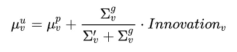

这个等式更直观。也就是说，更新的速度将等于预测的速度加上速度创新的一部分。当推断的速度不确定性非常大(相对于预测的速度)时，这个分数将接近零，而当反过来时，这个分数将接近 1。

# 协方差更新方程

完整的协方差更新方程如下所示:

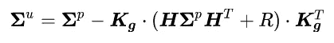

我们可以插入上面获得的卡尔曼增益和以下事实:

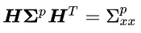

获得:

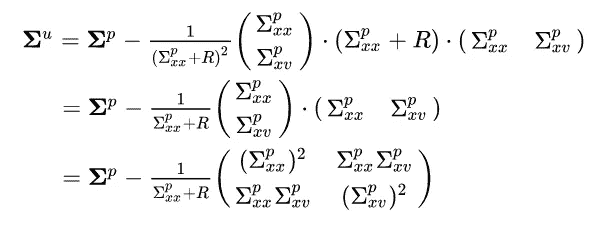

我们将相对测量不确定度定义为:

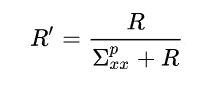

这个常数就是相对于位置总不确定度的测量不确定度。如果我们把这个代入方程(在我会告诉你更多的代数之后),我们会得到:

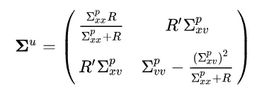

我们来分解一下:更新后的位置不确定度是预测位置不确定度和测量位置不确定度的调和平均值。调和平均值是一种通过接近两个元素中较小的一个来组合两个元素的平均值。所以如果:

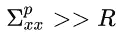

然后:

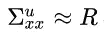

反之亦然。

更新的位置-速度协方差也是直观的。它是预测协方差的缩小版本，比例因子是相对测量不确定性。因此，对于完美的测量，这些元素将接近零，而对于噪声测量，它们将保持不变。

现在更新速度方差。乍一看，这似乎没有多大意义，因此，正如我们之前所做的那样，让我们插入之前导出的单个协方差预测步骤的结果。

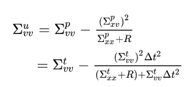

我们可以再次使用我们上面定义的推断速度不确定性和广义速度预测不确定性来获得:

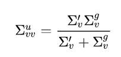

我们再次得到更新的方差是推断速度不确定性和广义速度预测不确定性的调和平均值。所以基本上总是接近两者中较小的一个。

最后，我们有:

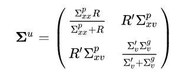

让我们总结一下从这个等式中可以学到什么。位置方差和速度方差都可以表示为两个不确定性(每个不确定性都有与之相关的不确定性)的调和平均值。位置-速度协方差也随着我们对测量相对于先验的确定程度而缩小。如果你回到显示更新过程的图表，这也是非常直观的原因。

# 总结

在这篇博客中，我试图把我试图直观理解卡尔曼滤波方程的过程写下来。这是图形和数学直觉的混合体，在我看来，它们是相辅相成的。希望它能帮助你更好地理解“引擎盖下”到底发生了什么，也许现在这个复杂的算法变得更容易理解了。

这里要补充一点，物体跟踪等算法不可掉以轻心。这些算法，在错误的人手中，可能被用来犯下侵犯公民权利的罪行，因此只能由专业人士开发，并受到严格的监管。