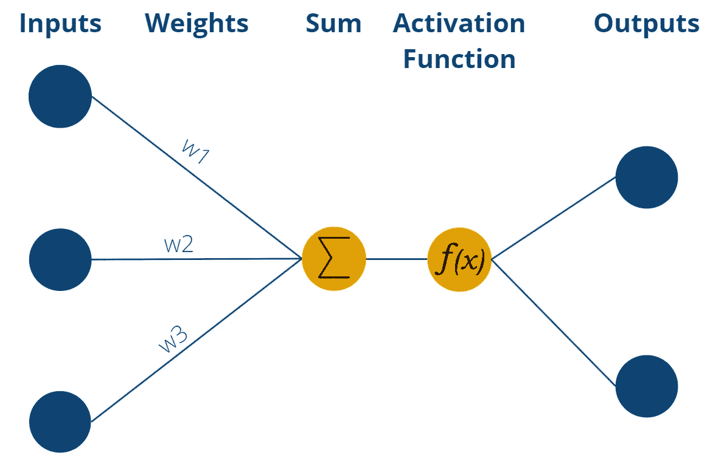
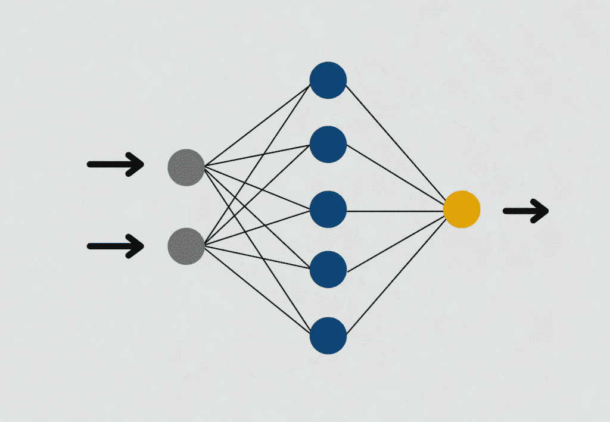

# 什么是感知器？

> 原文：<https://towardsdatascience.com/what-is-a-perceptron-5ac56720d8cf>

## 了解神经网络的构建模块

拉蒙·萨利内罗在 [Unsplash](https://unsplash.com?utm_source=medium&utm_medium=referral) 上的照片

感知器是来自[监督学习](https://databasecamp.de/en/ml/supervised-learning-models)领域的算法，代表了[神经网络](https://databasecamp.de/en/ml/artificial-neural-networks)的基本构建模块。在其最简单的形式中，它由一个使用加权输入值计算输出值的单个神经元组成。

 [## 人工智能基础:监督学习

### 监督学习是人工智能和机器学习的一个子类。它的特点是…

medium.com](https://medium.com/nerd-for-tech/basics-of-ai-supervised-learning-8505219f07cf) 

# 感知器是如何工作的？

感知器最初是一个数学模型，由于它学习复杂关系的能力，后来才被用于计算机科学和机器学习。在其最简单的形式中，它由一个所谓的神经元组成，模仿人脑的结构。

感知器有几个输入端，它在这些输入端接收数字信息，即数值。根据应用的不同，输入的数量可能会有所不同。输入具有不同的权重，这表明输入对最终输出的影响程度。在学习过程中，权重被改变以产生可能的最佳结果。

感知器的结构|来源:作者

然后，神经元本身形成输入值乘以输入权重的总和。这个加权和被传递给所谓的激活函数。在神经元的最简单形式中，正好有两个输出，因此只能预测二进制输出，例如，“是”或“否”或“活动”或“不活动”等。

Sigmoid 函数曲线|来源:作者

如果神经元具有二进制输出值，则使用其值也在 0 和 1 之间的函数。经常使用的激活函数的一个例子是 sigmoid 函数。函数值在 0 和 1 之间变化，实际上几乎只取这些值。除了 x = 0，还有一个陡升，从 0 跳到 1。因此，如果感知器的加权和超过 x = 0，并且感知器使用 sigmoid 作为激活函数，则输出也相应地从 0 变为 1。

# 哪个例子说明了感知器是如何工作的？

作为一个感知机如何工作的例子，让我们仔细看看一个政治家的工作。她是国会议员，一项新的法律必须投票表决。因此，政治家必须决定她是否同意该法案(在我们的例子中弃权是不可能的)。因此，感知器有一个二进制输出，即批准或拒绝。

政治家们可以从各种信息来源中获得决策所需的信息。一方面，有一份由议会发布的背景资料的资料文件。此外，政治家可以在互联网上了解各种问题，或者与同事讨论这些问题。这位政治家根据她认为可靠的程度来衡量她的输入，即她的信息来源。例如，她给议会信息文件的权重相对较低，因为她担心研究不够详细，应该已经倾向于某个方向。然后，她将可用信息的总和与权重一起传递给激活函数。

在这个例子中，我们可以把这个想象成我们政治家的头。她现在决定，根据输入的信息，她是否应该同意拟议的法律。即使输入的小细节也能导致政治家观点的巨大变化。

# 什么是多层感知器？

这个简单的模型已经可以用于许多应用程序，但在理解和学习更复杂的关系时很快就达到了极限。因此，在实践中，重点主要是几层感知器，然后将它们组装起来，形成所谓的[人工神经网络](https://databasecamp.de/en/ml/artificial-neural-networks)。

 [## 人工神经网络直观指南

### 人工神经网络(ANN)是人工智能和人工智能领域最常用的术语

medium.com](https://medium.com/illumination/intuitive-guide-to-artificial-neural-networks-5a2925ea3fa2) 

这些所谓的多层感知器以这样一种方式相互连接，即只有第一层神经元接收来自网络外部的输入。另一方面，在后续层中，先前层的输出充当当前层的输入。只有[神经网络](https://databasecamp.de/en/ml/artificial-neural-networks)最后一层的神经元是输出，然后被用作实际结果。

神经网络结构|来源:作者

与我们的政策例子相关，我们可以更仔细地观察政治家的信息来源。例如，议会的信息文件由各种研究助理的工作组成，他们的加权工作已被纳入最终产品。反过来，这些合作者也可以表示为网络中的个体感知器。

# 有哪些偏向神经元？

在多层感知器中，使用所谓的偏置神经元。这些是特殊的输入神经元，然而，它们没有外部意义，而是假定一个在学习过程中也会改变的恒定值。这允许激活函数的曲线向下或向上移动。

例如，偏差类似于[线性回归](https://databasecamp.de/en/ml/linear-regression-basics)中使用的常数，有助于模型更好地拟合输出值，从而改善结果。

# 哪些应用使用了感知器？

[神经网络](https://databasecamp.de/en/ml/artificial-neural-networks)基于感知机，主要用于机器学习领域。这里的目标主要是学习以前数据中的结构，然后预测新的值。一些例子是:

*   [**图像中的物体识别**](https://databasecamp.de/en/use-case/cnn-in-tensorflow) : [人工神经网络](https://databasecamp.de/en/ml/artificial-neural-networks)可以识别图像中的物体或将图像归入某一类。例如，公司在自动驾驶中使用这一属性来识别汽车应该做出反应的对象。另一个应用领域是在医学中，例如，当检查 X 射线图像以检测癌症的早期阶段时。

 [## 利用卷积神经网络进行图像分类

### 卷积神经网络(CNN 或 ConvNet)是神经网络的一个子类型，主要用于

towardsdatascience.com](/using-convolutional-neural-network-for-image-classification-5997bfd0ede4) 

*   [**顾客情感分析**](https://databasecamp.de/en/use-case/bert-sentiment-analysis) :通过互联网，顾客有很多渠道公开对品牌或产品的评价。因此，公司需要跟踪客户是否大部分满意。有了一些被分类为好或坏的评论，可以训练高效的模型，然后这些模型可以自动对大量评论进行分类。
*   **垃圾邮件检测**:在许多邮件程序中，有可能将具体的电子邮件标记为垃圾邮件。这些数据用于训练机器学习模型，这些模型直接将未来的电子邮件标记为垃圾邮件，这样最终用户甚至不会看到它们。

# 感知器的优缺点是什么？

感知器的使用具有以下优点和缺点。

## 优势

*   借助单层感知器，特别是多层感知器，即所谓的[神经网络](https://databasecamp.de/en/ml/artificial-neural-networks)，可以在[监督学习](https://databasecamp.de/en/ml/supervised-learning-models)的领域中学习复杂的预测。
*   根据数据，可以很容易地增加输入的数量，以便在预测中包含不同的相关值。
*   受过训练的感知器相对容易解释，学习到的权重可以用来说明输入有多重要。

## 不足之处

*   单个感知器很少能提供真正好的结果。对于强大的模型，通常必须建立具有许多神经元的不同层。
*   尤其是多层感知器只对大型数据集有效。
*   训练多层感知器通常是耗时且资源密集的。
*   在许多层中，权重的可解释性丧失了，并且形成了一个“黑箱”,其良好的预测无法真正得到解释。

# 这是你应该带走的东西

*   感知器是来自监督学习领域的算法，代表神经网络的基本构建块。
*   当单个感知器被构建并连接成多层时，它被称为多层感知器或神经网络。
*   感知器由输入、权重、激活函数和输出组成。
*   它可以用来学习数据中的复杂关系，并将它们应用到新的、以前看不到的数据中。

*如果你喜欢我的作品，请在这里订阅***或者查看我的网站* [*数据大本营*](http://www.databasecamp.de/en/homepage) *！此外，媒体允许你每月免费阅读三篇文章***。如果你想让***无限制地访问我的文章和数以千计的精彩文章，不要犹豫，通过点击我的推荐链接:*[【https://medium.com/@niklas_lang/membership】](https://medium.com/@niklas_lang/membership)每月花$ ***5*** 获得会员资格***

** [## 使用 MongoDB 介绍 NoSQL 数据库

### NoSQL 数据库实用指南

towardsdatascience.com](/introducing-nosql-databases-with-mongodb-d46c976da5bf)  [## 了解反向传播算法

### 了解人工智能的支柱

medium.com](https://medium.com/codex/understanding-the-backpropagation-algorithm-7a2e3cb4a69c)  [## 梯度下降初学者指南

### 关于梯度下降法你需要知道的一切

towardsdatascience.com](/beginners-guide-to-gradient-descent-47f8d0f4ce3b)**