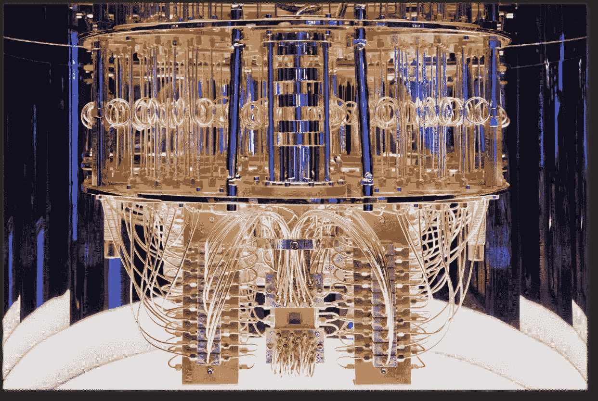
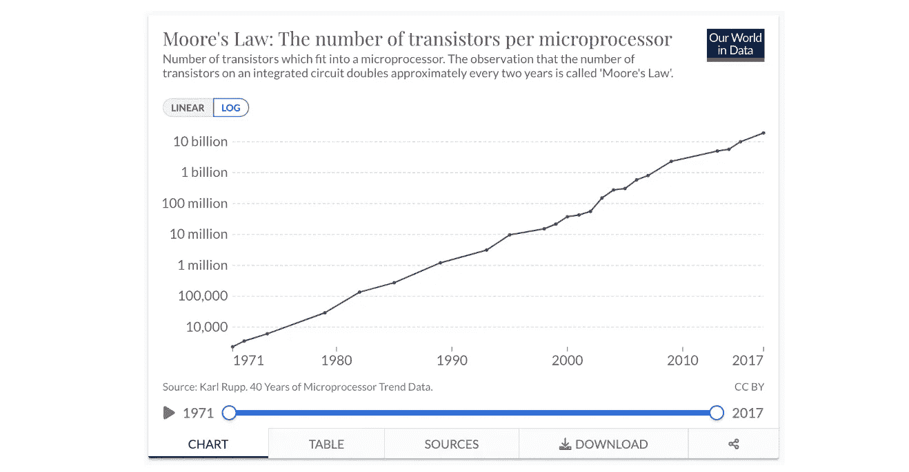
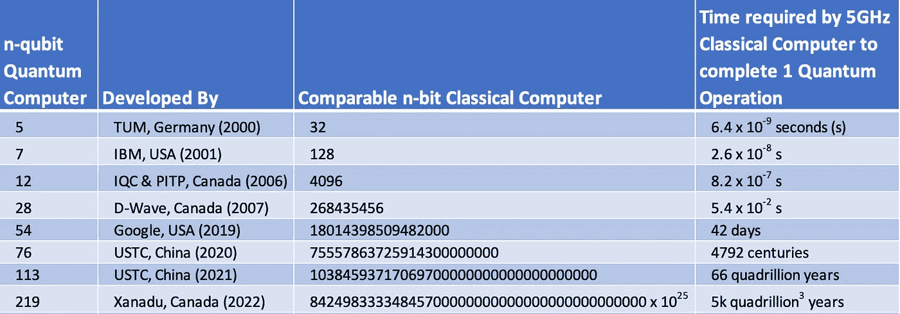

# 什么是量子计算机？

> 原文：<https://towardsdatascience.com/what-is-a-quantum-computer-f1c44e87a379>

## 量子计算机是一项将产生重大影响的新兴技术

图 1: IBM 量子系统一号(CES 2020) /来源[链接](https://www.flickr.com/photos/ibm_research_zurich/50252942522/in/photolist-259cSVy-BQdkR9-qmk5LP-2gXtBc6-2h9m1yg-2gXtB8D-bxArJX-GGdJyp-RmgoS5-SrvZqe-RmgpA9-SotsYf-D1r1VN-CAC6Cu-sjVfC1-2e18V4e-23R2fqS-D3K7hF-22aMzXU-skqXf4-2kRqbZu-2jyFt2u-pBDsAH-2jHrEJR-GMYPvN-2mcZGGs-2m5EWgN-Sp2BiY-Gg6k1A-RDtabK-RDtahM-2jPWQrN-2kRpFVS-2m6JM8u-AZeohj-RDt9Zn-2fkcZ7A-RDta7r-RDtaeF-2kRq6pU-GG3pec-2mKrhmi-R1s5af-R1s6yN-R1s6dC-2mKAkR4-FKQbj4-2mK2RJE-24VJTSD-bxQShv/) (CC BY-ND 2.0)

量子计算和人工智能可以结合起来，产生更大的影响。这篇博文的目标是介绍量子计算机的基本概念，并试图揭开它们的神秘面纱。量子计算机使用在微观(亚原子)水平上观察到的物质属性来执行计算和解决问题。相比之下，目前的计算机(自 20 世纪 50 年代以来)在相对宏观(半导体元素)的水平上使用物质的属性。量子计算机的进展将在不久的将来产生重大影响。它可以使当前的互联网加密标准变得无用，减少药物开发时间，改变人工智能等等。量子计算机已经展示了(例如， [*肖尔算法*](https://en.wikipedia.org/wiki/Shor's_algorithm) )与非量子(又名*经典计算机*)计算机相比的指数加速。这篇文章概括了以下内容。

1.  量子计算背后的物理学
2.  它将如何/为什么超越基于芯片的计算
3.  会更好地解决哪些问题

# 经典到量子物理学

通过利用硅半导体的独特特性，向数字世界的过渡成为可能。它只有在满足某些条件后才导电，否则就像绝缘体一样。这种行为被用来执行基本级操作，例如与/或逻辑、基本算术运算等。通过硅门。计算机就是建立在这些基础之上的。

经典物理学在元素水平(如硅、铜)描述物质的属性，我们控制并使用这些属性进行计算、数据存储和信息处理及传输。

同样，量子物理/力学在微观亚原子水平上解释物质的性质，即电子和光子。量子计算机在亚原子水平上控制和利用物质的属性来执行计算。经典物理和量子物理的区别不仅仅在于尺度或大小。经典物理学的规则在量子层面失效了。我们需要一套全新的方法和工程来建造量子计算机。

表 1:经典物理和量子物理之间的高度差异

自从量子力学的框架第一次被开发出来已经有一个多世纪了，但是科学家们对量子水平上的观察的含义还没有达成共识。 [*哥本哈根解释*](https://en.wikipedia.org/wiki/Copenhagen_interpretation) ，这是归功于尼尔斯·玻尔和维尔纳·海森堡的最普遍接受的版本。甚至阿尔伯特·爱因斯坦也没有完全接受*哥本哈根解释*。事实上，爱因斯坦的广义相对论并不符合量子力学，他最初拒绝量子力学，因为它的不确定性。

# 硅基计算的终极之路

1965 年，戈登·摩尔预测计算机的速度大约每两年翻一番。它被编码为摩尔定律，至今仍被证明是正确的。在此期间，硅晶体管的尺寸不断缩小。最初的尺寸是一个拇指指甲的大小，即 1950 年代的 1cm。现在在 2022 年，它是 3 纳米(即小于 1cm 的~7 个数量级)，接近硅原子的大小(. 2 纳米)。物理上不可能将硅晶体管的尺寸缩小到原子尺寸以下来获得进一步的加速。因此，一些人呼吁终止基于半导体计算的摩尔定律。计算创新的下一阶段可能由量子计算机引领。

图 2:对数标度中的摩尔定律图表/来源:[ourworldindata.org](https://ourworldindata.org/grapher/transistors-per-microprocessor)&卡尔鲁普(CC BY 4.0)

# 量子解

更高级软件和架构的创新，例如机器学习和分布式/并行计算的形式，已经提供了克服一些计算限制以解决更困难问题的手段。但与这些解决方案不同，量子计算机从头开始提供计算增益。它有可能引领计算领域的下一波创新，以解决棘手的问题。量子计算的计算收益将比摩尔定律预测的快几个数量级。由于加速发生在基础层，它可以与更高层次的创新相结合，如机器学习，如 [*量子机器学习*](https://en.wikipedia.org/wiki/Quantum_machine_learning) (例如 [*谷歌量子人工智能*](https://quantumai.google/) *)，*以及作为托管云服务提供的商品化&*(例如* [*亚马逊 Braket 量子计算机*](https://aws.amazon.com/braket/quantum-computers/) *s)* 。

# 量子特性

量子计算的两个基本属性是:

1.  叠加
2.  纠缠

在我们进入它们之前，掌握一个*量子位*的概念是很重要的。

**量子位(vs 比特)**

经典计算、存储和通信中的信息单位是一个*位*，用二进制数 0 或 1 表示。它们是硬件(硅晶体管)级别的低电荷和高电荷(电压)的数字表示。硬件单元的状态总是 0(低电压)或 1(高电压)。在量子水平上，事情并不是那么分散的。在亚原子粒子被观察到(测量到)之前，它处于 0 和 1 两种状态，也就是说，一个电子可以向上或向下旋转。量子系统中的这种信息或状态单位被称为量子位。

**a)叠加**

这种在量子系统中同时为 0 和 1 的现象被称为*叠加。*叠加表示量子比特(qubits)的所有可能状态。不同状态的叠加在测量过程中坍缩成特定的状态。这在薛定谔的猫的思想实验中得到了说明，在这个实验中，一只猫和一个放射源一起被放在一个密封的盒子里，在人们观察盒子里的情况之前，它被认为是既活又死的。

**b)纠缠**

这是一种现象，其中两个或更多的亚原子粒子具有相同的状态属性(例如，0 或 1)，尽管它们之间有距离。没有人能解释这是为什么或如何发生的。如果亚原子粒子之间存在某种通信来实现这一点，信号的传播速度必须超过光速，根据爱因斯坦的相对论，这是不可能的。爱因斯坦将纠缠称为“超距幽灵行动”。

# 量子计算机与经典计算机

量子计算机有多个处于纠缠态的量子比特，同时进行所有可能的量子比特组合。它们被折叠成所需的状态以解决特定的问题。由于一个量子位可以同时处于 0 或 1 状态，一台 *n 量子位*量子计算机可以同时处理 *2ⁿ* 状态。经典计算机需要双倍的位数(内存)或处理速率来实现双倍的速度。在量子计算机中，只需再增加一个量子比特(即量子比特)，速度就会翻倍。因此，它可以比一次处理一个状态的经典计算机获得指数级的加速。理论上，一台 28 量子位的量子计算机相当于超过 268 百万位(2 ⁸)的硅基经典计算机，如表 2 所示。

*量子优势*是量子计算机可以在合理的时间内解决经典计算机无法解决的问题的既定目标。2019 年 10 月，谷歌声称他们用 54 量子位实现了量子优势。

表 2:基于比特/量子比特大小比较经典计算机和量子计算机

表 2:第 1 列和第 2 列摘自来源[ [1](https://en.wikipedia.org/wiki/Quantum_supremacy) 和[ [2](https://analyticsindiamag.com/race-quantum-supremacy-complete-timeline/) ]。第三列是基于量子特性的外推。第四栏是我的理论比较，不代表任何官方价值。事实上，我的值可能被低估了，因为谷歌证实了他们在 2019 年实现量子优势的 *54 量子位*(表 2 第 5 行)量子计算机在 200 秒内完成了一项超级计算机需要 10，000 年才能完成的任务。

将量子位添加到架构中并不是一件容易的事情，因为它们对环境条件非常敏感，这会导致量子属性的损失。量子计算机需要接近绝对零度的温度，即大约-460 华氏度，才能运行。

# 量子计算机用例

并不是所有的问题都会受益于量子计算机，正如我在之前的帖子中所讨论的，机器学习与传统软件开发相比，并不是所有的问题都能得到更好的解决。

  

值得注意的是，目前量子计算机的使用仅限于特定的问题，包括一些 NP 难题，这需要在大的搜索空间中筛选。量子计算机已经在一些领域有所作为:

1.  药物发现
2.  加密破解
3.  最佳化

由于叠加性质，量子计算机可以在一个周期内模拟整个解搜索空间的所有组合，而经典计算机需要多次迭代。因此，量子计算机最适合搜索和组合优化问题。上面列出的用例就属于这一类。

# 摘要

量子计算机非常有前途，已经开始解决现实世界的问题。只要我们能够通过控制亚原子粒子运行的环境来保持它们的量子特性，我们就能够在架构中添加更多的量子位。确定哪些问题更适合量子计算机和构建量子算法是活跃的研究领域。迄今为止， [*格罗弗算法*](https://en.wikipedia.org/wiki/Grover%27s_algorithm) 和 [*肖尔算法*](https://en.wikipedia.org/wiki/Shor's_algorithm) 是最受欢迎的量子算法，与非量子算法相比，它们分别提供了多项式和指数加速。

在未来，经典计算机和量子计算机将共存，并将相互补充。经典计算机更适合于顺序任务(例如，在我的笔记本电脑上写这篇博客)和事务性任务(例如，计算购物车余额)，而量子计算机将用于解决具有大解决方案搜索空间的更困难的问题。

# 资源

1.  [https://en.wikipedia.org/wiki/Quantum_supremacy](https://en.wikipedia.org/wiki/Quantum_supremacy)
2.  [https://analyticsindiamag . com/race-quantum-supreme-complete-timeline/](https://analyticsindiamag.com/race-quantum-supremacy-complete-timeline/)
3.  [量子叠加——维基百科](https://en.wikipedia.org/wiki/Quantum_superposition)
4.  [波粒二象性——维基百科](https://en.wikipedia.org/wiki/Wave%E2%80%93particle_duality)
5.  [量子机器学习—维基百科](https://en.wikipedia.org/wiki/Quantum_machine_learning)
6.  [谷歌量子人工智能](https://quantumai.google/)
7.  [https://research.ibm.com/quantum-computing](https://research.ibm.com/quantum-computing)
8.  [亚马逊 Braket 量子计算机——亚马逊网络服务](https://aws.amazon.com/braket/quantum-computers/)
9.  [亚马逊 Braket——量子计算入门| AWS 新闻博客](https://aws.amazon.com/blogs/aws/amazon-braket-get-started-with-quantum-computing/)
10.  [肖尔算法—维基百科](https://en.wikipedia.org/wiki/Shor's_algorithm)
11.  [https://en.wikipedia.org/wiki/Grover's_algorithm](https://en.wikipedia.org/wiki/Grover's_algorithm)
12.  [非结构化问题的量子加速:解决两个二十年前的问题——微软研究](https://www.microsoft.com/en-us/research/blog/quantum-speedups-for-unstructured-problems-solving-two-twenty-year-old-problems/)
13.  [哥本哈根解读—维基百科](https://en.wikipedia.org/wiki/Copenhagen_interpretation)
14.  [测不准原理—维基百科](https://en.wikipedia.org/wiki/Uncertainty_principle)
15.  [https://phys . org/news/2015-11-quantum-迭加原理-事件. html](https://phys.org/news/2015-11-quantum-superposition-events.html)
16.  [https://www . scientific American . com/video/how-do-a-quantum-computer-work/](https://www.scientificamerican.com/video/how-does-a-quantum-computer-work/)
    【https://en.wikipedia.org/wiki/Schr%C3%B6dinger%27s_cat】T21
17.  [https://www . scientific American . com/article/quantum-computers-competition-for-supremity/](https://www.scientificamerican.com/article/quantum-computers-compete-for-supremacy/)
18.  [https://www . popular mechanics . com/science/green-tech/a 30915638/quantum-memory-entangled/](https://www.popularmechanics.com/science/green-tech/a30915638/quantum-memory-entangled/)
19.  [https://phys . org/news/2015-11-quantum-迭加原理-事件. html](https://phys.org/news/2015-11-quantum-superposition-events.html)
20.  [https://www . mcgill tribune . com/sci-tech/the-universe-at-odds-quantum-mechanics-vs-general-relativity 040418/](https://www.mcgilltribune.com/sci-tech/the-universe-at-odds-quantum-mechanics-versus-general-relativity040418/)
21.  [https://www . technology review . com/2019/01/29/66141/什么是量子计算/](https://www.technologyreview.com/2019/01/29/66141/what-is-quantum-computing/)
22.  【https://en.wikipedia.org/wiki/NP-hardness 
23.  [https://Cambridge quantum . com/the-journal/future-quantum-drug-discovery/](https://cambridgequantum.com/the-journal/future-quantum-drug-discovery/)