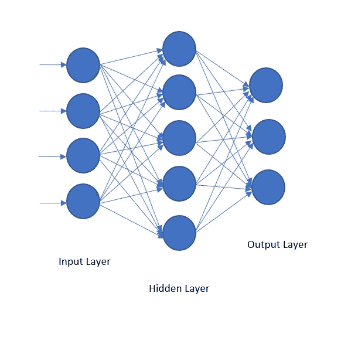
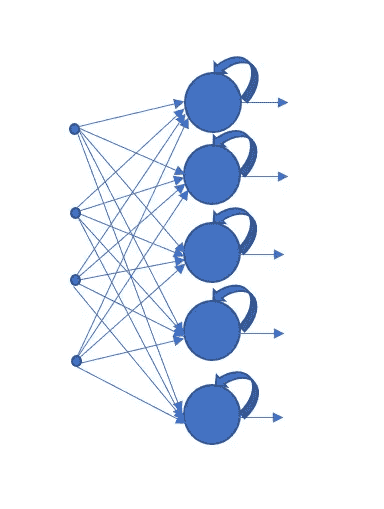
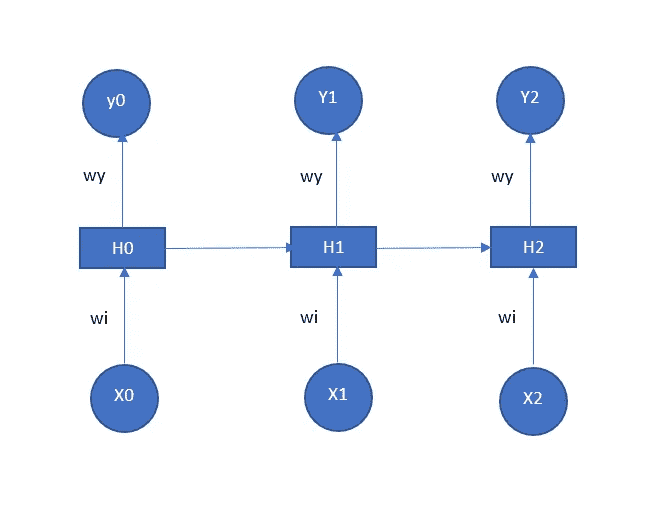
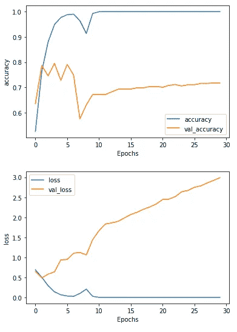
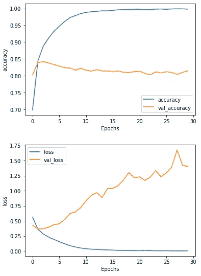
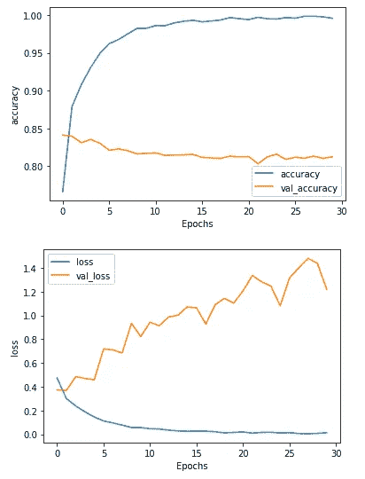

# 在 Keras 和 Tensorflow 中为 NLP 项目实现 SimpleRNN、GRU 和 LSTM 模型

> 原文：<https://towardsdatascience.com/what-is-a-recurrent-neural-network-and-implementation-of-simplernn-gru-and-lstm-models-in-keras-f7247e97c405>


阿特·哈廷顿在 [Unsplash](https://unsplash.com?utm_source=medium&utm_medium=referral) 上拍摄的照片

# 在 Keras 和 Tensorflow 中为 NLP 项目实现 SimpleRNN、GRU 和 LSTM 模型

## 递归神经网络介绍及情感分析中三种递归神经网络在 Tensorflow 和 Keras 中的实现

递归神经网络(RNNs)是深度学习中最先进的算法之一，尤其适用于序列数据。它被用于许多备受瞩目的应用，包括谷歌的语音搜索和苹果的 Siri。它变得如此受欢迎的原因是它的内存。RNNs 是第一个可以记住输入的深度学习算法。在 LSTM 和 GRU 发明之后，rnn 变得非常强大。在本文中，我们将使用所有这三种类型的 rnn 进行一个自然语言处理项目。

我们将讨论 RNNs 如何工作，并在深度学习领域带来如此多的效率。对于情感分析任务，将有一个简单的 RNN、GRU 和 LSTM 的实际实现。

> 我将非常简要地讨论一个简单的递归神经网络如何为复习者工作，然后深入到实现中。如果您愿意，可以跳过这一部分，直接进入 Tensorflow 实现部分。

## 什么是递归神经网络？

因为递归神经网络有内部记忆，所以可以从输入和前几层记住重要的东西。这就是它比常规神经网络更有效的原因，rnn 是文本数据、时间序列、金融数据、天气预报等序列数据的首选算法。

## 递归神经网络如何工作？

为了真正理解递归神经网络如何工作以及它为什么特殊，我们需要将它与常规的前馈神经网络进行比较。

以下是常规前馈神经网络的图片演示:



作者图片

在前馈神经网络中，信息从一层移动到另一层。我们使用来自输入层的信息来计算隐藏层。如果有几个隐藏层，则仅使用前一个隐藏层的信息来计算下一个隐藏层。计算输出图层时，仅使用前一图层的信息。因此，当我们计算输出层时，我们忘记了输入层或其他层。

但是，当我们处理文本数据、时间序列数据或任何其他顺序数据时，记住前面的层中有什么也很重要。

在 RNN，信息在内部循环。因此，当 RNN 计算输出图层时，它会考虑前一个图层以及前一个图层。因为它有短期记忆。这里有一个图片演示:



作者图片

如图所示，信息在这一层循环。当循环发生时，它具有来自最近过去的信息。下面是 RNN 结构的展开版本，可以更好地理解它的工作原理:



作者图片

这里，x0、x1 和 x2 表示输入。H0、H1 和 H2 是隐藏层中的神经元，y0、y1 和 y2 是输出。

如上图所示，每个时间戳都从前一个神经元和输入中获取信息。信息在一层中循环。

这非常重要，因为前一个神经元可能包含关于下一个神经元的重要信息。例如，考虑这个句子，

> 天空是蓝色的

如果我只知道“是”这个词，我无法想象接下来会发生什么。但是如果我知道两个连续的单词“sky is ”,那么我们可能会想到单词“blue”。

但这也是递归神经网络的一个局限。RNNs 只有短期记忆。但是短期记忆始终不足以发现接下来会发生什么。举个例子，

> 她是中国人，她的语言是…

在这里，仅仅记住前面的两三个单词并不能让我们知道语言是什么。我们要一路走来记住“中国人”这个词。只有到那时，我们才能预测这种语言的名称。

这就是长短期记忆(LSTM)或门控循环单元(GRU)有所帮助的时候。它们都是简单 RNN 的更高级版本。解释它们的机制超出了本文的范围。本文的重点是展示如何在 TensorFlow 中实现它们。

## 资料组

我将使用 Tensorflow 附带的 IMDB 数据集。这是一个大型电影评论数据集。数据是文本数据，标签是二进制的。它已经为我们分离了 25000 个训练数据和 25000 个测试数据。点击了解关于[该数据集的更多信息。对于练习一些自然语言处理任务来说，这是一个非常好的数据集。该数据集的每一行都包含预期的文本数据，标签为 0 或 1。所以，它代表好的情绪或坏的情绪。](https://www.tensorflow.org/datasets/catalog/imdb_reviews)

让我们深入研究这个项目。

以下是进口货:

```
import numpy as np
import tensorflow as tf
import tensorflow_datasets as tfds
```

我正在导入 IMDB 数据集及其信息:

```
imdb, info = tfds.load("imdb_reviews",
                      with_info=True, as_supervised=True)
```

在单独的变量中设置训练和测试数据:

```
train_data, test_data = imdb['train'], imdb['test']
```

## 数据预处理

将所有文本作为一个列表，将标签作为一个单独的列表将会很有帮助。因此，训练句子和标签以及测试句子和标签作为列表被检索如下:

```
training_sentences = []
training_labels = []testing_sentences = []
testing_labels = []for s,l in train_data:
    training_sentences.append(str(s.numpy()))
    training_labels.append(l.numpy())for s,l in test_data:
    testing_sentences.append(str(s.numpy()))
    testing_labels.append(l.numpy())
```

将标签转换为 NumPy 数组:

```
training_labels_final = np.array(training_labels)
testing_labels_final = np.array(testing_labels)
```

在这里，我设置一些重要的参数是必要的模型。我将在此之后解释它们是什么:

```
vocab_size = 10000
embedding_dim=16
max_length = 120
trunc_type= 'post'
oov_tok="<OOV>"
```

这里，vocal_size 10000。这意味着这个模型将使用 10000 个独特的单词。如果 IMDB 数据集超过 10000 个单词，多余的单词将不会用于训练模型。所以，通常情况下，我们会小心翼翼地取这个数。请随意尝试不同的 vocab_size。

下一个参数是‘embedding _ dim’。它表示将用于表示每个单词的向量的大小。这里 embedding_dim 是 16 意味着，大小为 16 的向量将表示每个单词。您也可以在此尝试不同的号码。

每段文本或预测标签的最大长度为 120 个单词。这就是 max_length 参数所表示的内容。如果文本比原来大，它将被截断。

下一个参数 trunc_type 设置为‘post’。这意味着文本将在末尾被截断。

如果有一个未知单词将由 oov_tok 表示。

数据预处理从标记 NLP 项目中的文本开始。

```
from tensorflow.keras.preprocessing.text import Tokenizer
from tensorflow.keras.preprocessing.sequence import pad_sequencestokenizer = Tokenizer(num_words = vocab_size, oov_token=oov_tok)
tokenizer.fit_on_texts(training_sentences)
word_index = tokenizer.word_indexword_index
```

以下是 word_index 的部分输出:

```
{'<OOV>': 1,
 'the': 2,
 'and': 3,
 'a': 4,
 'of': 5,
 'to': 6,
 'is': 7,
 'br': 8,
 'in': 9,
 'it': 10,
 'i': 11,
 'this': 12,
 'that': 13,
 'was': 14,
 'as': 15,
 'for': 16,
 'with': 17,
 'movie': 18,
```

因此，每个单词都有一个唯一的整数值。这里我们用这些整数值代替单词来安排句子。此外，如果句子少于我们设置的 max_length 120 个单词，请使用填充。这样，我们将为每个文本提供相同大小的向量。

```
sequences = tokenizer.texts_to_sequences(training_sentences)
padded = pad_sequences(sequences, maxlen=max_length, 
                       truncating = trunc_type)testing_sequences = tokenizer.texts_to_sequences(testing_sentences)
testing_padded = pad_sequences(testing_sequences, maxlen=max_length)
```

数据预处理完成。

## 模型开发

这是有趣的部分。

> **简单的 RNN**

第一个模型将是简单的递归神经网络模型。

在这个模型中，第一层将是嵌入层，其中句子将通过嵌入向量表示为 max_length。下一层是一个简单的 RNN 层。然后是致密层。这是模型

```
model = tf.keras.Sequential([
    tf.keras.layers.Embedding(vocab_size, embedding_dim,
                             input_length=max_length),
    tf.keras.layers.SimpleRNN(32),
    tf.keras.layers.Dense(10, activation='relu'),
    tf.keras.layers.Dense(1, activation='sigmoid')
])
model.summary()
```

输出:

```
Model: "sequential_8"
_________________________________________________________________
Layer (type)                 Output Shape              Param #   
=================================================================
embedding_8 (Embedding)      (None, 120, 16)           160000    
_________________________________________________________________
simple_rnn (SimpleRNN)       (None, 32)                1568      
_________________________________________________________________
dense_16 (Dense)             (None, 10)                330       
_________________________________________________________________
dense_17 (Dense)             (None, 1)                 11        
=================================================================
Total params: 161,909
Trainable params: 161,909
Non-trainable params: 0
_________________________
```

看每一层的输出形状。第一层输出形状为(120，16)。记住我们每个句子的 max_length 是 120，嵌入维数是 16。请随意更改这些数字并检查结果。

在第二层中，我们将 32 作为 SimpleRNN 层中的参数，输出形状也是 32。

这里，我们将使用 binary_crossentropy 的损失函数、“adam”优化器以及作为准确性的评估度量来编译模型。

```
model.compile(loss='binary_crossentropy',
              optimizer='adam',
              metrics=['accuracy'])
```

我将训练 30 个纪元的模型。

```
num_epochs=30
history=model.fit(padded, training_labels_final, epochs=num_epochs, validation_data = (testing_padded, testing_labels_final))
```

输出:

```
Epoch 1/30
782/782 [==============================] - 17s 20ms/step - loss: 0.6881 - accuracy: 0.5256 - val_loss: 0.6479 - val_accuracy: 0.6355
Epoch 2/30
782/782 [==============================] - 15s 19ms/step - loss: 0.5035 - accuracy: 0.7632 - val_loss: 0.4880 - val_accuracy: 0.7865
Epoch 3/30
782/782 [==============================] - 15s 20ms/step - loss: 0.2917 - accuracy: 0.8804 - val_loss: 0.5812 - val_accuracy: 0.7457
Epoch 4/30
782/782 [==============================] - 16s 20ms/step - loss: 0.1393 - accuracy: 0.9489 - val_loss: 0.6386 - val_accuracy: 0.7952
Epoch 5/30
782/782 [==============================] - 15s 19ms/step - loss: 0.0655 - accuracy: 0.9768 - val_loss: 0.9400 - val_accuracy: 0.7277
Epoch 6/30
782/782 [==============================] - 16s 20ms/step - loss: 0.0360 - accuracy: 0.9880 - val_loss: 0.9493 - val_accuracy: 0.7912
Epoch 7/30
782/782 [==============================] - 15s 20ms/step - loss: 0.0273 - accuracy: 0.9900 - val_loss: 1.1033 - val_accuracy: 0.7491
Epoch 8/30
782/782 [==============================] - 16s 20ms/step - loss: 0.0993 - accuracy: 0.9639 - val_loss: 1.1237 - val_accuracy: 0.5752
Epoch 9/30
782/782 [==============================] - 15s 19ms/step - loss: 0.2071 - accuracy: 0.9136 - val_loss: 1.0613 - val_accuracy: 0.6309
Epoch 10/30
782/782 [==============================] - 15s 20ms/step - loss: 0.0267 - accuracy: 0.9928 - val_loss: 1.4416 - val_accuracy: 0.6720
Epoch 11/30
782/782 [==============================] - 16s 20ms/step - loss: 0.0031 - accuracy: 0.9996 - val_loss: 1.6674 - val_accuracy: 0.6721
Epoch 12/30
782/782 [==============================] - 15s 20ms/step - loss: 5.8072e-04 - accuracy: 1.0000 - val_loss: 1.8338 - val_accuracy: 0.6714
Epoch 13/30
782/782 [==============================] - 15s 19ms/step - loss: 2.5399e-04 - accuracy: 1.0000 - val_loss: 1.8619 - val_accuracy: 0.6824
Epoch 14/30
782/782 [==============================] - 15s 20ms/step - loss: 1.4048e-04 - accuracy: 1.0000 - val_loss: 1.8995 - val_accuracy: 0.6927
Epoch 15/30
782/782 [==============================] - 15s 20ms/step - loss: 8.4974e-05 - accuracy: 1.0000 - val_loss: 1.9867 - val_accuracy: 0.6934
Epoch 16/30
782/782 [==============================] - 15s 20ms/step - loss: 5.2411e-05 - accuracy: 1.0000 - val_loss: 2.0710 - val_accuracy: 0.6940
Epoch 17/30
782/782 [==============================] - 17s 22ms/step - loss: 3.2760e-05 - accuracy: 1.0000 - val_loss: 2.1278 - val_accuracy: 0.6980
Epoch 18/30
782/782 [==============================] - 16s 20ms/step - loss: 2.0648e-05 - accuracy: 1.0000 - val_loss: 2.2035 - val_accuracy: 0.6988
Epoch 19/30
782/782 [==============================] - 15s 19ms/step - loss: 1.3099e-05 - accuracy: 1.0000 - val_loss: 2.2611 - val_accuracy: 0.7031
Epoch 20/30
782/782 [==============================] - 15s 20ms/step - loss: 8.3039e-06 - accuracy: 1.0000 - val_loss: 2.3340 - val_accuracy: 0.7038
Epoch 21/30
782/782 [==============================] - 16s 20ms/step - loss: 5.2835e-06 - accuracy: 1.0000 - val_loss: 2.4453 - val_accuracy: 0.7003
Epoch 22/30
782/782 [==============================] - 16s 20ms/step - loss: 3.3794e-06 - accuracy: 1.0000 - val_loss: 2.4580 - val_accuracy: 0.7083
Epoch 23/30
782/782 [==============================] - 20s 26ms/step - loss: 2.1589e-06 - accuracy: 1.0000 - val_loss: 2.5184 - val_accuracy: 0.7112
Epoch 24/30
782/782 [==============================] - 18s 23ms/step - loss: 1.3891e-06 - accuracy: 1.0000 - val_loss: 2.6400 - val_accuracy: 0.7055
Epoch 25/30
782/782 [==============================] - 20s 25ms/step - loss: 8.9716e-07 - accuracy: 1.0000 - val_loss: 2.6727 - val_accuracy: 0.7107
Epoch 26/30
782/782 [==============================] - 20s 25ms/step - loss: 5.7747e-07 - accuracy: 1.0000 - val_loss: 2.7517 - val_accuracy: 0.7105
Epoch 27/30
782/782 [==============================] - 17s 22ms/step - loss: 3.7458e-07 - accuracy: 1.0000 - val_loss: 2.7854 - val_accuracy: 0.7159
Epoch 28/30
782/782 [==============================] - 18s 23ms/step - loss: 2.4265e-07 - accuracy: 1.0000 - val_loss: 2.8592 - val_accuracy: 0.7158
Epoch 29/30
782/782 [==============================] - 17s 22ms/step - loss: 1.5808e-07 - accuracy: 1.0000 - val_loss: 2.9216 - val_accuracy: 0.7172
Epoch 30/30
782/782 [==============================] - 17s 22ms/step - loss: 1.0345e-07 - accuracy: 1.0000 - val_loss: 2.9910 - val_accuracy: 0.7174
```

30 个周期后，训练精度变为 1.00 或 100%。完美，对吧？但验证准确率为 71.74%。没那么糟。但是巨大的过度拟合问题。

这将是很好的，看看如何精度和损失随着每个时代的变化。

```
import matplotlib.pyplot as pltdef plot_graphs(history, string):
    plt.plot(history.history[string])
    plt.plot(history.history['val_'+string])
    plt.xlabel("Epochs")
    plt.ylabel(string)
    plt.legend([string, 'val_'+string])
    plt.show()plot_graphs(history, 'accuracy')
plot_graphs(history, 'loss')
```



作者图片

验证精度在开始时波动很大，然后稳定在 71.74%。另一方面，训练精度稳步上升到 100%,除了一个下降。

但是验证的损失曲线看起来很糟糕。它一直在上升。我们希望损失减少。

## 门控循环单元(GRU)

这是 RNN 模型的改进版本。它比简单的神经网络模型更有效。它有两个门:复位和更新。在本次演示中，我将用具有相同数量单位的双向 GRU 层替换 SimpleRNN 层。

这是模型

```
model = tf.keras.Sequential([
    tf.keras.layers.Embedding(vocab_size, embedding_dim,
                             input_length=max_length),
    tf.keras.layers.Bidirectional(tf.keras.layers.GRU(32)),
    tf.keras.layers.Dense(10, activation='relu'),
    tf.keras.layers.Dense(1, activation='sigmoid')
])
model.summary()
```

输出:

```
Model: "sequential_6"
_________________________________________________________________
Layer (type)                 Output Shape              Param #   
=================================================================
embedding_6 (Embedding)      (None, 120, 16)           160000    
_________________________________________________________________
bidirectional_6 (Bidirection (None, 64)                9600      
_________________________________________________________________
dense_12 (Dense)             (None, 10)                650       
_________________________________________________________________
dense_13 (Dense)             (None, 1)                 11        
=================================================================
Total params: 170,261
Trainable params: 170,261
Non-trainable params: 0
```

正如你所看到的，除了 GRU 层，所有层的输出形状与前一层完全相同。因为是双向的，所以这里 32 变成了 64。

我将使用与之前完全相同的参数来编译模型，并为相同数量的时期训练模型。

```
model.compile(loss="binary_crossentropy",
             optimizer='adam',
             metrics=['accuracy'])history=model.fit(padded, training_labels_final, epochs=num_epochs,
            validation_data = (testing_padded,testing_labels_final))
```

输出:

```
Epoch 1/30
782/782 [==============================] - 50s 60ms/step - loss: 0.5664 - accuracy: 0.6990 - val_loss: 0.4313 - val_accuracy: 0.8025
Epoch 2/30
782/782 [==============================] - 43s 56ms/step - loss: 0.3638 - accuracy: 0.8440 - val_loss: 0.3667 - val_accuracy: 0.8394
Epoch 3/30
782/782 [==============================] - 44s 56ms/step - loss: 0.2852 - accuracy: 0.8882 - val_loss: 0.3695 - val_accuracy: 0.8420
Epoch 4/30
782/782 [==============================] - 43s 55ms/step - loss: 0.2330 - accuracy: 0.9120 - val_loss: 0.3979 - val_accuracy: 0.8381
Epoch 5/30
782/782 [==============================] - 42s 54ms/step - loss: 0.1942 - accuracy: 0.9323 - val_loss: 0.4386 - val_accuracy: 0.8334
Epoch 6/30
782/782 [==============================] - 44s 56ms/step - loss: 0.1573 - accuracy: 0.9472 - val_loss: 0.4546 - val_accuracy: 0.8290
Epoch 7/30
782/782 [==============================] - 44s 57ms/step - loss: 0.1223 - accuracy: 0.9612 - val_loss: 0.5259 - val_accuracy: 0.8244
Epoch 8/30
782/782 [==============================] - 44s 56ms/step - loss: 0.0897 - accuracy: 0.9729 - val_loss: 0.6248 - val_accuracy: 0.8234
Epoch 9/30
782/782 [==============================] - 44s 57ms/step - loss: 0.0690 - accuracy: 0.9788 - val_loss: 0.6511 - val_accuracy: 0.8169
Epoch 10/30
782/782 [==============================] - 50s 64ms/step - loss: 0.0514 - accuracy: 0.9847 - val_loss: 0.7230 - val_accuracy: 0.8223
Epoch 11/30
782/782 [==============================] - 45s 57ms/step - loss: 0.0402 - accuracy: 0.9882 - val_loss: 0.8357 - val_accuracy: 0.8167
Epoch 12/30
782/782 [==============================] - 52s 67ms/step - loss: 0.0323 - accuracy: 0.9902 - val_loss: 0.9256 - val_accuracy: 0.8140
Epoch 13/30
782/782 [==============================] - 49s 63ms/step - loss: 0.0286 - accuracy: 0.9915 - val_loss: 0.9685 - val_accuracy: 0.8184
Epoch 14/30
782/782 [==============================] - 45s 58ms/step - loss: 0.0232 - accuracy: 0.9930 - val_loss: 0.8898 - val_accuracy: 0.8146
Epoch 15/30
782/782 [==============================] - 44s 57ms/step - loss: 0.0209 - accuracy: 0.9927 - val_loss: 1.0375 - val_accuracy: 0.8144
Epoch 16/30
782/782 [==============================] - 43s 55ms/step - loss: 0.0179 - accuracy: 0.9944 - val_loss: 1.0408 - val_accuracy: 0.8131
Epoch 17/30
782/782 [==============================] - 45s 57ms/step - loss: 0.0131 - accuracy: 0.9960 - val_loss: 1.0855 - val_accuracy: 0.8143
Epoch 18/30
782/782 [==============================] - 43s 55ms/step - loss: 0.0122 - accuracy: 0.9964 - val_loss: 1.1825 - val_accuracy: 0.8105
Epoch 19/30
782/782 [==============================] - 45s 57ms/step - loss: 0.0091 - accuracy: 0.9972 - val_loss: 1.3037 - val_accuracy: 0.8097
Epoch 20/30
782/782 [==============================] - 44s 56ms/step - loss: 0.0089 - accuracy: 0.9972 - val_loss: 1.2140 - val_accuracy: 0.8125
Epoch 21/30
782/782 [==============================] - 45s 58ms/step - loss: 0.0076 - accuracy: 0.9976 - val_loss: 1.2321 - val_accuracy: 0.8136
Epoch 22/30
782/782 [==============================] - 45s 58ms/step - loss: 0.0119 - accuracy: 0.9962 - val_loss: 1.1726 - val_accuracy: 0.8072
Epoch 23/30
782/782 [==============================] - 46s 59ms/step - loss: 0.0093 - accuracy: 0.9969 - val_loss: 1.2273 - val_accuracy: 0.8029
Epoch 24/30
782/782 [==============================] - 45s 57ms/step - loss: 0.0065 - accuracy: 0.9978 - val_loss: 1.3390 - val_accuracy: 0.8118
Epoch 25/30
782/782 [==============================] - 50s 64ms/step - loss: 0.0053 - accuracy: 0.9984 - val_loss: 1.2323 - val_accuracy: 0.8088
Epoch 26/30
782/782 [==============================] - 44s 56ms/step - loss: 0.0081 - accuracy: 0.9973 - val_loss: 1.2998 - val_accuracy: 0.8123
Epoch 27/30
782/782 [==============================] - 44s 57ms/step - loss: 0.0043 - accuracy: 0.9986 - val_loss: 1.3976 - val_accuracy: 0.8098
Epoch 28/30
782/782 [==============================] - 41s 53ms/step - loss: 0.0039 - accuracy: 0.9989 - val_loss: 1.6791 - val_accuracy: 0.8043
Epoch 29/30
782/782 [==============================] - 42s 54ms/step - loss: 0.0037 - accuracy: 0.9987 - val_loss: 1.4269 - val_accuracy: 0.8101
Epoch 30/30
782/782 [==============================] - 41s 53ms/step - loss: 0.0059 - accuracy: 0.9982 - val_loss: 1.4012 - val_accuracy: 0.8150
```

如您所见，30 个时期后，训练集的最终准确度为 0.9982 或 99.82%，验证准确度的准确度为 81.50%。训练精度略低于简单的 RNN 模型，但验证精度显著提高。

仍然存在过度拟合的问题。但是在 NLP 项目中，一些过度拟合是正常的。因为不管你的训练集里有什么词库，验证数据可能还是会有一些新词。

每个历元的精度和损耗图将更好地显示每个历元的精度和损耗是如何变化的。我将使用上一节中的 plot_graphs 函数来绘制图形。

```
plot_graphs(history, 'accuracy')
plot_graphs(history, 'loss')
```



作者图片

训练的准确率逐渐提高，随着 epochs 的增加达到 99%以上。但是验证准确率上升到了 85%,并保持相当稳定。

如您所见，验证损失仍在上升。但是如果你注意 y 轴上的数字，对于简单的 RNN，验证损失从 0.5 变成了 3.0。但是对于这个 GRU 模型，它从 0.4 上升到 1.7。因此，总体验证损失要小得多。

> **长期短期模型(LSTM)**

我还想展示一个 LSTM 模型的实现。LSTM 模型和 GRU 模型的主要区别是，LSTM 模型有三个门(输入、输出和遗忘门)，而 GRU 模型有两个门，如前所述。

在这里，我将只取代 GRU 层从以前的模型，并使用 LSTM 层。模型如下:

```
model = tf.keras.Sequential([
    tf.keras.layers.Embedding(vocab_size, embedding_dim, input_length=max_length),
    tf.keras.layers.Bidirectional(tf.keras.layers.LSTM(32)),
    tf.keras.layers.Dense(10, activation='relu'),
    tf.keras.layers.Dense(1, activation='sigmoid')
])
model.compile(loss='binary_crossentropy',optimizer='adam',metrics=['accuracy'])
model.summary()
```

输出:

```
Model: "sequential_5"
_________________________________________________________________
Layer (type)                 Output Shape              Param #   
=================================================================
embedding_5 (Embedding)      (None, 120, 16)           160000    
_________________________________________________________________
bidirectional_5 (Bidirection (None, 64)                12544     
_________________________________________________________________
dense_10 (Dense)             (None, 10)                650       
_________________________________________________________________
dense_11 (Dense)             (None, 1)                 11        
=================================================================
Total params: 173,205
Trainable params: 173,205
Non-trainable params: 0
```

模型摘要看起来几乎接近于上一节中的 GRU 模型。输出形状完全相同。但是 params #在 LSTM 层是不同的。因为如前所述，LSTM 模型有三个门，而不是两个门。我会再训练 30 个纪元:

```
num_epochs=30
history = model.fit(padded, training_labels_final, epochs=num_epochs, validation_data = (testing_padded, testing_labels_final))
```

输出:

```
Epoch 1/30
782/782 [==============================] - 46s 54ms/step - loss: 0.4740 - accuracy: 0.7665 - val_loss: 0.3732 - val_accuracy: 0.8413
Epoch 2/30
782/782 [==============================] - 38s 48ms/step - loss: 0.3010 - accuracy: 0.8789 - val_loss: 0.3687 - val_accuracy: 0.8397
Epoch 3/30
782/782 [==============================] - 37s 48ms/step - loss: 0.2380 - accuracy: 0.9079 - val_loss: 0.4850 - val_accuracy: 0.8311
Epoch 4/30
782/782 [==============================] - 38s 48ms/step - loss: 0.1890 - accuracy: 0.9306 - val_loss: 0.4697 - val_accuracy: 0.8355
Epoch 5/30
782/782 [==============================] - 41s 53ms/step - loss: 0.1453 - accuracy: 0.9494 - val_loss: 0.4581 - val_accuracy: 0.8305
Epoch 6/30
782/782 [==============================] - 42s 54ms/step - loss: 0.1118 - accuracy: 0.9622 - val_loss: 0.7176 - val_accuracy: 0.8212
Epoch 7/30
782/782 [==============================] - 41s 53ms/step - loss: 0.0952 - accuracy: 0.9676 - val_loss: 0.7107 - val_accuracy: 0.8230
Epoch 8/30
782/782 [==============================] - 41s 52ms/step - loss: 0.0769 - accuracy: 0.9753 - val_loss: 0.6845 - val_accuracy: 0.8205
Epoch 9/30
782/782 [==============================] - 39s 49ms/step - loss: 0.0567 - accuracy: 0.9824 - val_loss: 0.9333 - val_accuracy: 0.8163
Epoch 10/30
782/782 [==============================] - 42s 54ms/step - loss: 0.0564 - accuracy: 0.9826 - val_loss: 0.8228 - val_accuracy: 0.8171
Epoch 11/30
782/782 [==============================] - 42s 54ms/step - loss: 0.0466 - accuracy: 0.9862 - val_loss: 0.9426 - val_accuracy: 0.8177
Epoch 12/30
782/782 [==============================] - 44s 56ms/step - loss: 0.0445 - accuracy: 0.9861 - val_loss: 0.9138 - val_accuracy: 0.8144
Epoch 13/30
782/782 [==============================] - 44s 57ms/step - loss: 0.0343 - accuracy: 0.9897 - val_loss: 0.9876 - val_accuracy: 0.8149
Epoch 14/30
782/782 [==============================] - 42s 53ms/step - loss: 0.0282 - accuracy: 0.9919 - val_loss: 1.0017 - val_accuracy: 0.8152
Epoch 15/30
782/782 [==============================] - 41s 52ms/step - loss: 0.0251 - accuracy: 0.9932 - val_loss: 1.0724 - val_accuracy: 0.8158
Epoch 16/30
782/782 [==============================] - 41s 53ms/step - loss: 0.0267 - accuracy: 0.9912 - val_loss: 1.0648 - val_accuracy: 0.8117
Epoch 17/30
782/782 [==============================] - 43s 55ms/step - loss: 0.0258 - accuracy: 0.9922 - val_loss: 0.9267 - val_accuracy: 0.8109
Epoch 18/30
782/782 [==============================] - 40s 51ms/step - loss: 0.0211 - accuracy: 0.9936 - val_loss: 1.0909 - val_accuracy: 0.8104
Epoch 19/30
782/782 [==============================] - 38s 49ms/step - loss: 0.0114 - accuracy: 0.9967 - val_loss: 1.1444 - val_accuracy: 0.8134
Epoch 20/30
782/782 [==============================] - 38s 48ms/step - loss: 0.0154 - accuracy: 0.9954 - val_loss: 1.1040 - val_accuracy: 0.8124
Epoch 21/30
782/782 [==============================] - 38s 49ms/step - loss: 0.0196 - accuracy: 0.9941 - val_loss: 1.2061 - val_accuracy: 0.8128
Epoch 22/30
782/782 [==============================] - 41s 53ms/step - loss: 0.0093 - accuracy: 0.9971 - val_loss: 1.3365 - val_accuracy: 0.8032
Epoch 23/30
782/782 [==============================] - 42s 54ms/step - loss: 0.0155 - accuracy: 0.9953 - val_loss: 1.2835 - val_accuracy: 0.8123
Epoch 24/30
782/782 [==============================] - 43s 55ms/step - loss: 0.0168 - accuracy: 0.9948 - val_loss: 1.2476 - val_accuracy: 0.8160
Epoch 25/30
782/782 [==============================] - 38s 48ms/step - loss: 0.0108 - accuracy: 0.9967 - val_loss: 1.0810 - val_accuracy: 0.8091
Epoch 26/30
782/782 [==============================] - 39s 50ms/step - loss: 0.0132 - accuracy: 0.9960 - val_loss: 1.3154 - val_accuracy: 0.8118
Epoch 27/30
782/782 [==============================] - 42s 54ms/step - loss: 0.0056 - accuracy: 0.9985 - val_loss: 1.4012 - val_accuracy: 0.8106
Epoch 28/30
782/782 [==============================] - 40s 51ms/step - loss: 0.0046 - accuracy: 0.9986 - val_loss: 1.4809 - val_accuracy: 0.8134
Epoch 29/30
782/782 [==============================] - 40s 51ms/step - loss: 0.0074 - accuracy: 0.9977 - val_loss: 1.4389 - val_accuracy: 0.8104
Epoch 30/30
782/782 [==============================] - 41s 52ms/step - loss: 0.0126 - accuracy: 0.9958 - val_loss: 1.2202 - val_accuracy: 0.8124
```

如你所见，训练精度和验证精度非常接近 GRU 模型。剧情是这样的:

```
plot_graphs(history, 'accuracy')
plot_graphs(history, 'loss')
```



作者图片

验证损失这次更好。

## 结论

在这篇文章中，我想解释什么是递归神经网络，以及为什么对于序列数据它比常规神经网络更好。然后演示了一个简单的 RNN、GRU 和 LSTM 模型的实现，该模型使用相同的数据集执行自然语言处理任务。这是一个特别的情感分析项目。

这篇文章展示了 GRU 和 LSTM 模型的准确性结果看起来相似。但这并不是一个普遍的结论。对于不同的项目，您可能会看到不同的结果。事实上，如果你改变一些参数，如神经元的数量，GRU 或 LSTM 单位，层数，你可能会看到这个项目的结果有很大的不同。

请随时在 [Twitter](https://twitter.com/rashida048) 、[脸书页面](https://www.facebook.com/Regenerative-149425692134498)上关注我，并查看我的新 [YouTube。频道](https://www.youtube.com/channel/UCzJgOvsJJPCXWytXWuVSeXw)。

## 更多阅读

[](/convolutional-neural-network-good-understanding-of-the-layers-and-an-image-classification-example-a280bc02c13e) [## 卷积神经网络:对层的良好理解和图像分类示例

### 包含了大量的信息

towardsdatascience.com](/convolutional-neural-network-good-understanding-of-the-layers-and-an-image-classification-example-a280bc02c13e) [](/developing-a-convolutional-neural-network-model-using-the-unlabeled-image-files-directly-from-the-124180b8f21f) [## 开发一个卷积神经网络模型使用未标记的图像文件直接从…

### 使用图像生成器将图像自动标记为子目录

towardsdatascience.com](/developing-a-convolutional-neural-network-model-using-the-unlabeled-image-files-directly-from-the-124180b8f21f) [](/exploratory-data-analysis-with-some-cool-visualizations-in-pythons-matplotlib-and-seaborn-library-99dde20d98bf) [## 利用 Python 的 Matplotlib 和 Seaborn 库中一些很酷的可视化工具进行探索性的数据分析

### 探索国际足联数据集

towardsdatascience.com](/exploratory-data-analysis-with-some-cool-visualizations-in-pythons-matplotlib-and-seaborn-library-99dde20d98bf) [](/30-very-useful-pandas-functions-for-everyday-data-analysis-tasks-f1eae16409af) [## 30 个非常有用的熊猫函数，用于日常数据分析任务

### 熊猫小型张

towardsdatascience.com](/30-very-useful-pandas-functions-for-everyday-data-analysis-tasks-f1eae16409af) [](/a-beginners-guide-to-match-any-pattern-using-regular-expressions-in-r-fd477ce4714c) [## 使用 R 中的正则表达式匹配任何模式的初学者指南

### 这比你想象的要容易

towardsdatascience.com](/a-beginners-guide-to-match-any-pattern-using-regular-expressions-in-r-fd477ce4714c)