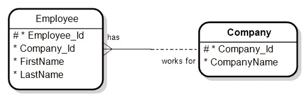
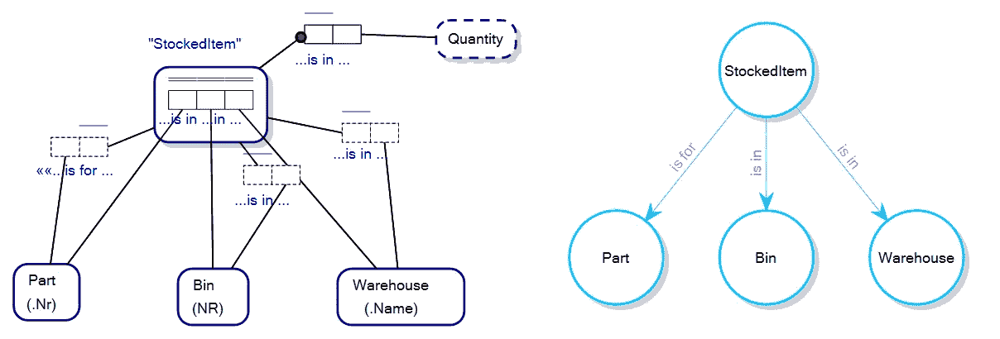
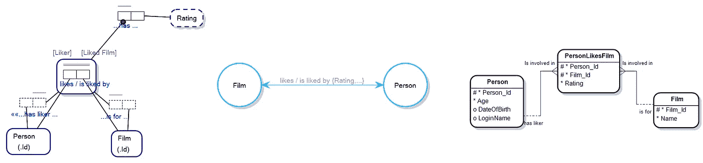

# 什么是关系知识图？

> 原文：<https://towardsdatascience.com/what-is-a-relational-knowledge-graph-bb747b27ff3f>

## 探索图形数据库和知识图的未来

图片作者。背景图片，由[米卡·鲍梅斯特](https://unsplash.com/@mbaumi) [在 Unsplash](https://unsplash.com/photos/Wpnoqo2plFA?utm_source=unsplash&utm_medium=referral&utm_content=creditShareLink)| Unspash.com 拍摄的免版税照片

如果关系知识图这个术语还没有出现在你的雷达上，我想它很快就会出现了。Bob Muglia 是雪花公司的前首席执行官，现在是一家推广新模式的初创公司的董事会董事。

在 FactEngine 工作时，我早期的命名思想倾向于引入术语*图形数据库*，在 FactEngine 中，我在寻找一个术语来充分描述图形和关系数据库的合并，而不是术语*多模型数据库*。

无论从哪个角度看，图形数据库和关系数据库的合并变得越来越明显，我相信关系知识图这个术语将会一直存在。

[属性图模式工作组](https://ldbcouncil.org/gql-community/pgswg/)的出现标志着图形数据库市场的成熟，例如，将关系数据库中常见的特性引入图形数据库和知识图。

这个由研究人员和图形数据库供应商组成的小组已经认识到，现存的图形数据库缺乏支持关系数据库的正式形式的技巧，并且没有意识到要将 21 世纪的现象带入 21 世纪。在网上搜索这个团体的名字，会返回各种各样的宣言和支持。

尽管您可能听不到该组织吹捧该组织是关系数据库领域标准的领导者，但我怀疑就像《动物庄园》中的场景一样，盛大的声明将是“现在我们有了这些标准，一些数据库比其他的更平等”。

关系知识图采用了一种完全不同的观点，即任何数据库都可以被看作是图数据库，甚至是关系数据库，如果你采用一种支持这种观点的体系结构，那么你就可以拥有两个世界的优点。

图形数据库供应商长期以来一直吹捧图形数据库在某些查询中比关系数据库更快。当你考虑到[微软吹嘘它拥有世界上最快的数据库](https://cloudblogs.microsoft.com/sqlserver/2017/09/27/sql-server-2017-fast-faster-and-the-fastest-database-everywhere-you-need-it/#:~:text=SQL%20Server%202017%20is%20the,any%20workload%20your%20application%20needs.)，SQL Server，一个支持图形结构/查询的关系数据库时，这种说法是可疑的。

在理论层面上，声称在许多图形数据库中数据存储在硬件层面的方式加快了图形查询的速度也是可疑的。例如，即使关系数据库在硬件级存储为一组列分隔的固定结构矩形/表状结构，也无法阻止将硬件级数据作为图形结构加载到内存中，并针对内存中的图形结构运行查询，除了分页之外，需要将查询恢复到仍在磁盘上的*数据的图形数据库目前也面临同样的问题…以图形方式将图形结构加载到内存中以执行这些快速查询。*

那么，是什么阻碍了关系数据库采用这种架构，并在图形数据库的游戏中击败它们呢？图数据库和关系数据库在元模型级别上真的有概念上的区别吗？

## 输入相关知识图表

普通关系数据库的[元模型](https://en.wikipedia.org/wiki/Metamodeling)阻止了普通图形数据库的图形查询。例如，外键关系缺少自然语言谓词，告诉您诸如“雇员为公司工作”之类的事情，其中雇员和公司是表/节点，而图形数据库供应商可能有一个结构为“雇员为公司工作”。

早在 1985 年，ORACLE 的 Richard Barker 的“ *Case Method，Entity Relationship modeling”*在描述关系数据库的实体关系图中允许这样做，但是由于缺少关系数据库上的图形查询语言，这从未(据我所知)在关系数据库的元模型级别上实际实现用于查询，因为关系数据库的查询语言[Structure Query Language(SQL)](https://en.wikipedia.org/wiki/SQL)无论如何都不支持在其语法中使用自然语言谓词。

带有自然语言谓词的风格化 Barker 实体关系图，图片由作者提供。

关系知识图是数据库或数据库之上的架构，其中数据库可以被视为图形数据库或关系数据库。

当我们考虑一个在经典关系视图(实体关系图)和图形视图(属性图模式)之间变化的实际模式时，我们可以直观地理解这是如何工作的:

图形数据库的支持者经常说“在图形数据库中没有多对多的表”(正如上面 ERD 视图中的 PersonLikesFilm 表)。这预先假定了其他关系数据库的数据不会作为图形存储在内存中以供查询，并且忽略了图形数据库中的“是的”这种类型，但是“多对多表数据”通常在硬件级别存储为链表(扁平表),而在概念内存级别将*概念化为图形。*

这种观点还预先假定，没有一种概念上的方法既有多对多(或多对多……同样)的关系，也有有效的优势。这可以通过采用类似[的对象角色建模](https://en.wikipedia.org/wiki/Object-role_modeling)来克服:

对象-角色模型及其对应的属性图模式。图片作者。

对象-角色模型及其对应的属性图模式和实体关系图。图片作者。点击放大。

我们到达了目的地:关系知识图允许你将你的数据库概念化为关系数据库或图形数据库。选择权在你。

这意味着您可以在数据库上编写 SQL 查询或图形查询。选择权在你。

有经验的玩家会很快说:“我们不是已经得到了吗？SQL Server 之类的产品不是已经满足了 SQL 和图形查询的需求吗？”

简单的回答是，大部分情况下没有，因为我看到的所有包含图形特性的关系数据库都采用了添加特殊的表类型来管理图形查询，结果导致数据库的多语言混乱，可能会使任何使用它的人感到困惑。[我几年前写过这个](https://victormorgante.medium.com/sql-server-2017-2019-an-opportunity-lost-2f3ee978bfda)。也就是说，许多关系数据库供应商仍然将图形与表关系分开处理。

关系知识图的不同之处在于，不需要在其他关系数据库上采用不同的图表集来进行图表查询，您只需要在现有数据库结构上有一个*语义层来满足图表查询的编写……并让数据库管理系统来考虑如何在底层数据库结构上处理这些查询。不久前，我[在《走向数据科学》上写过这个](/the-factengine-architecture-6d90ac09b8b8)。*

*也就是说，关系知识图同样可以被称为 ***图知识关系*** ，但是在知识图炒作周期的当前状态下，它可能听起来不那么酷。也就是说，关系知识图并不预先假定*数据如何存储在硬件层，以及这个或那个数据库声称拥有世界上最快的数据库，无论它们如何在硬件层存储数据。**

## **关系知识图的优势是什么？**

**关系知识图的主要优势在于:**

1.  **在决定项目使用什么样的数据库时，只需要考虑数据库的硬件级实现，以及它的查询执行速度(如果这是先决条件的话);**
2.  **在概念层次上，你可以选择如何描绘你的数据库；作为图形数据库或关系数据库；**
3.  **自然语言语义内置于语义层，在数据库的核心元模型上运行，帮助您理解模型；**
4.  **根据您实现关系知识图的方式，您可以选择要使用的数据库。关系知识图可以与数据库管理系统无关。也就是说，从概念上来说，当涉及到实现时，您并不局限于一种或另一种数据库技术。然而，关系知识图供应商可能会限制您使用一个底层数据库；**
5.  **实体/节点类型可以有一个多列/属性主键，而不是像当前图形数据库中常见的只有一个 object-id 或属性；和**
6.  **在 FactEngine 的情况下，你可以在你的数据库上写[受控的自然语言查询](/natural-language-queries-for-real-this-time-5383bf42ad2a)。我觉得这将成为关系知识图的标准；**

## **概括起来**

1.  ***关系知识图*是一个术语，在不久的将来，这个术语很可能会出现在你的雷达上，这完全是因为推广这个术语的新参与者的重要性。**
2.  **行业趋势是图形数据库采用关系数据库的结构和严密性，这种方式必然会导致关系数据库理论和图形数据库理论的概念合并；**
3.  **关系知识图允许您从概念上摆脱数据库在硬件级别的存储方式；和**
4.  ***关系知识图，或知识关系图*充分强调，通过采用描述*存储什么*数据而不是*如何存储*数据的语义层，推动力是添加到数据库的知识。**

**感谢阅读。如果时间允许，我会写更多关于知识图表、图表数据库、语义建模和关系数据库的文章。**

**— — — — — End — — — —**