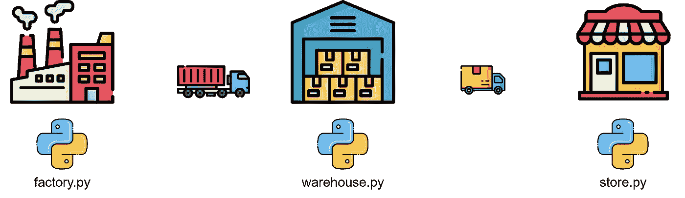
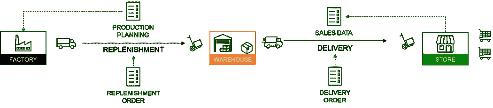
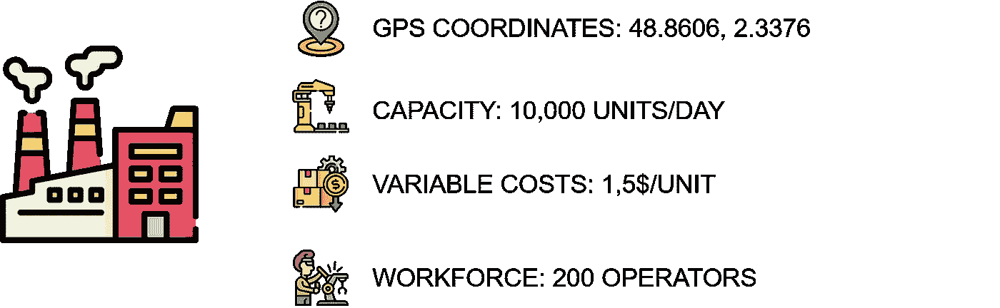
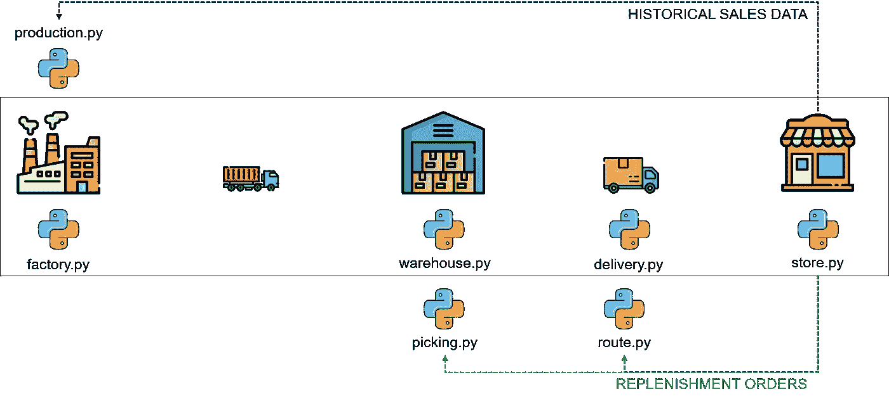
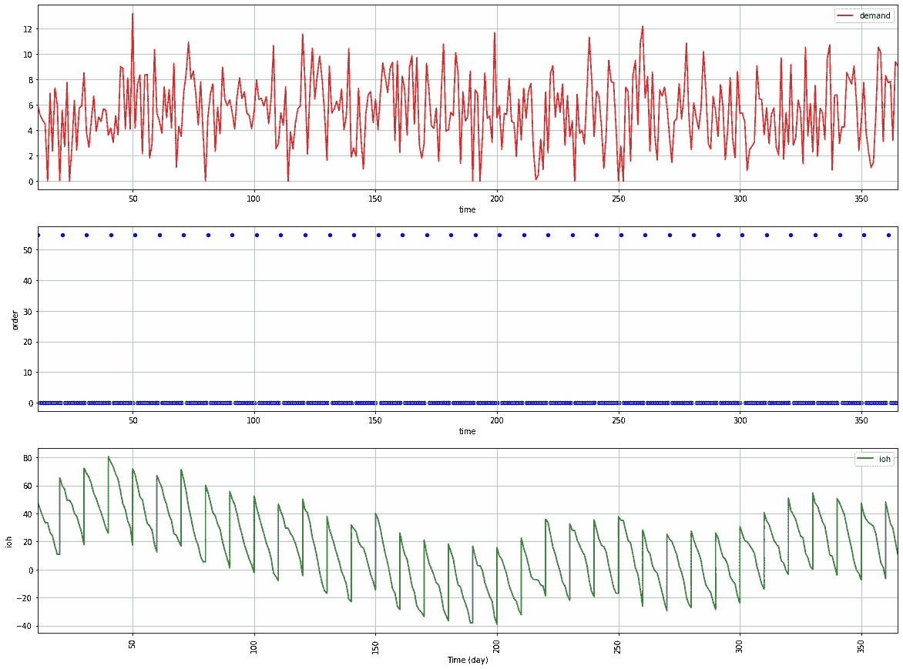
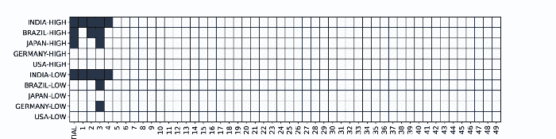
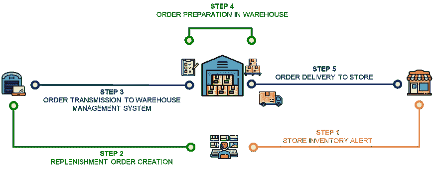
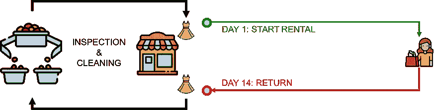

# 什么是供应链数字孪生？

> 原文：<https://towardsdatascience.com/what-is-a-supply-chain-digital-twin-e7a8cd9aeb75>

## 使用 python 创建代表供应链网络的模型，以优化您的运营并支持战略决策。

(图片由作者提供)

数字孪生是物理对象或系统的数字复制品。

供应链数字模型是一种计算机模型，代表供应链中涉及的各种组件和流程，如仓库、运输网络和生产设施。

使用 Python 的供应链数字双胞胎—(图片由作者提供)

在以前的文章中，我分享了为特定应用设计的 python 模型的例子，如[运输路线优化](https://www.samirsaci.com/transportation-network-analysis-with-graph-theory/)、[供应链网络设计](https://www.samirsaci.com/robust-supply-chain-networks-with-monte-carlo-simulation/)或[生产计划](https://www.samirsaci.com/production-fixed-horizon-planning-with-python/)。

在本文中，我们将尝试后退一步，构建一个**供应链数字双胞胎**，它将代表您从生产到商店交付的**完整的**端到端操作。

💌新文章直接免费放入你的收件箱:[时事通讯](https://www.samirsaci.com/#/portal/signup)

# 什么是供应链数字孪生？

## 面向目标的网络

供应链是一个由**流程**和**库存点**组成的面向目标的网络，用于向客户交付货物和**服务**。

要使用 Python 创建供应链的数字双胞胎，首先需要定义组成供应链的各种组件和流程。

端到端供应链网络—(图片由作者提供)

这可能包括创建数据结构来表示[仓库](https://www.youtube.com/watch?v=OdLeRR4rvt0&list=PLvINVddGUMQWRel1u0RIBbKIYRUQBdrt9)、[运输操作](https://www.youtube.com/watch?v=ddthuvFQdGY&list=PLvINVddGUMQXkAtacSSmUavDoRFQbmvAW)和[生产设施](https://www.youtube.com/watch?v=130AKb2DejM)，并定义这些组件之间的关系。

## 数据和参数

接下来，您需要收集供应链各种组件和流程的数据，例如

*   仓库的位置和 [**容量**](https://www.youtube.com/watch?v=KR_ziEiPcDk)
*   [交通网络的路线和容量](https://www.youtube.com/watch?v=PYkN24PMKd8)
*   生产设备的生产率
*   顾客和商店需求

工厂参数—(图片由作者提供)

这些数据可以存储在数据库或其他数据存储系统中，或者直接连接到您的仓库管理系统和 ERP。

## 模拟块

一旦有了供应链组件和流程的数据，就可以使用 Python 创建复制供应链行为的算法和模拟。

其他优化模型—(图片由作者提供)

这可能涉及使用优化算法来

*   使用来自商店模型的补货订单*(输入)*确定[到*(输出)*](https://www.youtube.com/watch?v=lhDBTlsGDVc)[的最高效路线将商店](https://www.youtube.com/watch?v=PYkN24PMKd8)交付
*   改进您仓库的[拣货流程](https://www.samirsaci.com/improve-warehouse-productivity-using-order-batching-with-python/) *【输出】*[准备门店补货订单](https://www.youtube.com/watch?v=XejgbF2m_8g) *【输入】*
*   [根据商店销售历史数据(输入)建立的需求预测，安排生产](https://www.youtube.com/watch?v=130AKb2DejM)(输出)

# 构建块的示例

总的来说，用 Python 创建一个供应链数字双胞胎将涉及数据收集和分析、算法开发和[模拟建模](https://www.youtube.com/watch?v=YNvOX3CT3hQ)的组合。

这可能需要对供应链管理的深刻理解和 Python 编程的经验。

让我们举三个用 Python 构建的基本块的例子。

## 如何模拟仓库操作？

我们定义了一个仓库类，它具有仓库的位置、容量和库存的属性。

**add_inventory** 和 **remove_inventory** 方法可以分别用于从仓库的库存中添加和删除项目。

这是一个简单的例子，你可以通过考虑[流程生产率](https://www.youtube.com/watch?v=KR_ziEiPcDk)、[仓库成本结构](https://www.youtube.com/watch?v=aJnrEElPvvs)、[劳动力管理](https://www.youtube.com/watch?v=OdLeRR4rvt0)或[拣货流程](https://www.youtube.com/watch?v=XejgbF2m_8g)来添加额外的属性和方法来改进模型。

在这个阶段，确保让运营团队和持续改进工程师参与进来，以确保您的模型能够复制实际的运营。

现实生活中发生的瓶颈、非生产性任务和质量问题必须包含在您的模拟中，以验证您的模型。

**💡不要忘记“双胞胎”** 如果你的模型离现实太远，就会失去可信度。

事实上，如果你的最终目标是使用你从这个模型中获得的洞察力，确保用于构建它的假设和参数得到所有利益相关者的验证。

这意味着匆忙设计一个带有粗略假设的快速而肮脏的模型是没有用的。

如果您使用这些结果来推动持续改进计划或挑战他们的管理，您可以确信运营部门会仔细分析这些结果。

例如，确保考虑:

*   您的工厂和仓库中每个工人的合理生产率和容量
*   评估运营稳健性时的外部约束，如假期、劳动法规或设备采购限制*(例如，您不能在一天内将提货能力翻倍)*
*   运输限制，如卡车采购、道路限制或交通堵塞

## 如何模拟公路运输？

我们定义了一个卡车类，它具有卡车的位置、容量和负载的属性。

**move_to** 方法可用于将卡车移动到新的位置，而 **load_cargo** 和 **unload_cargo** 方法可分别用于装载和卸载货物。

上述解决方案可以通过添加[装载和卸载](https://www.youtube.com/watch?v=nz69i6l7SzI)时间、用于提前期计算的时间戳、[成本参数](https://www.youtube.com/watch?v=aJnrEElPvvs)或详细说明[处理单元](https://youtube.com/shorts/tdXXg8snK1s)(托盘、纸箱……)来改进。

## 如何模拟门店库存管理？

我们定义了一个 Store 类，它具有商店位置和库存的属性。

**place_order** 方法可用于订购给定的商品和数量。

*   如果商店库存中有足够的商品，订单将被履行，库存也将相应地更新。
*   否则，将打印一条错误消息。

您可以通过以下方式改进它

*   添加[要求交货日期](https://www.youtube.com/watch?v=qhLqu6M7lcA)
*   管理几个[处理单元](https://youtube.com/shorts/tdXXg8snK1s)
*   包括出库销售和[提前期](https://www.youtube.com/watch?v=YNvOX3CT3hQ)

外向销售将代表最重要的参数，因为它与需求相关联。

您可以通过以下方式测试供应链的弹性

*   模拟该需求的[可变性(例如使用正态分布)](https://www.samirsaci.com/inventory-management-for-retail-stochastic-demand-2/)
*   创造季节性和高峰期，复制促销和系列发布
*   预测未来的销售和新店开张，对你的网络进行压力测试，并获得如何改进的见解

需求可变性对不良库存规则的影响示例—(图片由作者提供)

# 后续步骤

*关注我的媒体，获取更多与数据分析和供应链管理相关的文章*

## 连接积木

现在你已经完成了基本的独立积木，你需要把它们连接起来

*   您的商店正在使用 ERP 向仓库管理系统发送补货订单
*   你的仓库[准备订单](https://www.youtube.com/watch?v=XejgbF2m_8g)，[包装物品](https://www.youtube.com/watch?v=COcoxQ8NhzM)并放在托盘上
*   托盘装在卡车上
*   卡车[将托盘](https://www.youtube.com/watch?v=PYkN24PMKd8)运送到仓库

并添加外部参数如客户需求或[原材料](https://www.youtube.com/watch?v=1q4RqR0mgFY)供应约束。

## 模拟几个场景来回答业务问题

场景 1:商店需求翻倍

*   对仓库容量会有什么影响？
*   为了避免商店缺货，我们需要多少天的库存？

场景 2:您将所有本地仓库合并到一个中央配送中心:

*   **对服务水平会有什么影响？**
*   **能否通过工厂直接发货(针对部分 SKU)来降低运输和仓储成本？**

场景 3:您希望减少 25%的仓库库存

*   **工厂的最大补货周期应该是多少？**
*   **避免缺货所需的需求计划的最低精确度是多少？**
*   **对工厂生产水平的稳定性会有什么影响？**

场景 4:您希望停止空运以减少二氧化碳排放

*   **对商店的补货提前期会有什么影响？**
*   **配送计划员需要提前多长时间创建补货订单？**

对于每种情况，您可以操作与问题相关的参数，看看您的整体性能会降低多少。

然后，您可以调整其他指标(仓库容量、补货提前期等)，直到您重新达到初始目标。

这将向您展示供应链中的改进，以获得适应这些新业务需求的稳健性水平。

供应链网络设计方法—(图片由作者提供)

你可以从供应链网络设计的方法论中获得灵感(本文中的)，我们尝试模拟 50 种场景的需求波动，假设需求呈正态分布。

对于每个场景，我们使用 python 的线性编程来寻找工厂的最佳组合，以最低的成本生产和向市场交付产品。

50 个场景的结果—(图片由作者提供)

您可以决定您希望实现哪种组合来提高健壮性，同时降低成本。

## 数字孪生 x 可持续性:绿色库存管理

(图片由作者提供)

绿色库存管理可以定义为以环境可持续的方式管理库存。

对于分销网络而言，这可能涉及一系列旨在减少订单传输、准备和交付的环境影响的流程和规则。

(图片由作者提供)

> *如果我们降低商场补货频率，会对二氧化碳排放量产生什么影响？*

使用数据分析来模拟商店补货频率的变化，并衡量对整体环境影响的影响。

<https://www.samirsaci.com/green-inventory-management-case-study/>  

## 数字孪生 x 可持续发展:时尚循环经济

(图片由作者提供)

**循环经济**是一种旨在最大限度减少浪费和最大限度提高资源效率的经济模式。

它包括设计注重寿命、重复使用和回收的产品和工艺。

(图片由作者提供)

一些公司已经实施了一种**订阅模式**，在这种模式下，客户支付一笔固定费用，就可以在**的特定时期**内获得一种产品或服务。

使用数据分析来模拟循环订阅模式的几种情况对快速时尚零售商的减排和用水的影响。

<https://www.samirsaci.com/how-sustainable-is-your-circular-economy/>  

## 供应链分析

现在您已经有了供应链的副本，您可以使用参数并使用数据来执行

**描述性分析:**使用[仪表盘和可视化工具](https://youtu.be/0AZfe7DuT_U)监控您的流程

一套工具，提供可见性和整个供应链的单一事实来源，以跟踪您的货件、检测事故并衡量您的运营绩效。

*   [道路交通网络可视化](https://www.samirsaci.com/road-transportation-network-visualization/)，萨米尔萨奇
*   [使用数据面板](https://www.samirsaci.com/deploy-logistics-operational-dashboards-using-datapane/)部署物流运营仪表板，Samir Saci

**诊断分析**:自动化根本原因分析流程

这可以概括为事件根本原因分析。

*   [使用数据分析的物流绩效管理](https://www.samirsaci.com/logistic-performance-management-using-data-analytics/)，Samir Saci
*   [交付周期可变性和供应链弹性](https://www.samirsaci.com/lead-times-variability-and-supply-chain-resilience/)，Samir Saci

**预测和说明性分析**:将预测和优化模型添加到您的数字双胞胎中，以改进订购规则或计划

支持运营，以了解最有可能的结果或未来情景及其业务影响。因此，您可以协助运营解决问题，优化资源，以达到最佳效率。

*   [零售销售预测的机器学习—特征工程](https://www.samirsaci.com/machine-learning-for-retail-sales-forecasting-features-engineering/)，Samir Saci
*   [如何:机器学习驱动的需求预测](https://medium.com/towards-data-science/how-to-machine-learning-driven-demand-forecasting-5d2fba237c19)，[尼古拉斯·范德普特](https://medium.com/u/3f853e2def3c?source=post_page-----e7a8cd9aeb75--------------------------------)
*   [利用 Python](https://www.samirsaci.com/production-fixed-horizon-planning-with-python/) 、Samir Saci 进行生产固定水平规划
*   [使用 Python](https://www.samirsaci.com/optimize-warehouse-value-added-services-with-python/) 、Samir Saci 优化仓库增值服务
*   [使用 Python 的寻路算法提高仓库生产率](https://www.samirsaci.com/improve-warehouse-productivity-using-order-batching-with-python/)，Samir Saci
*   [商店交付计划的机器学习](https://www.samirsaci.com/machine-learning-for-store-delivery-scheduling/)，Samir Saci

欲知详情，

您的数字孪生可以被视为一个核心模型，您可以在其中添加解决特定问题的模型。

# 关于我

让我们在 [Linkedin](https://www.linkedin.com/in/samir-saci/) 和 [Twitter](https://twitter.com/Samir_Saci_) 上连线，我是一名[供应链工程师](https://www.samirsaci.com/about/)，正在使用数据分析来改善物流运营并降低成本。

如果你对数据分析和供应链感兴趣，可以看看我的网站

<https://samirsaci.com> 