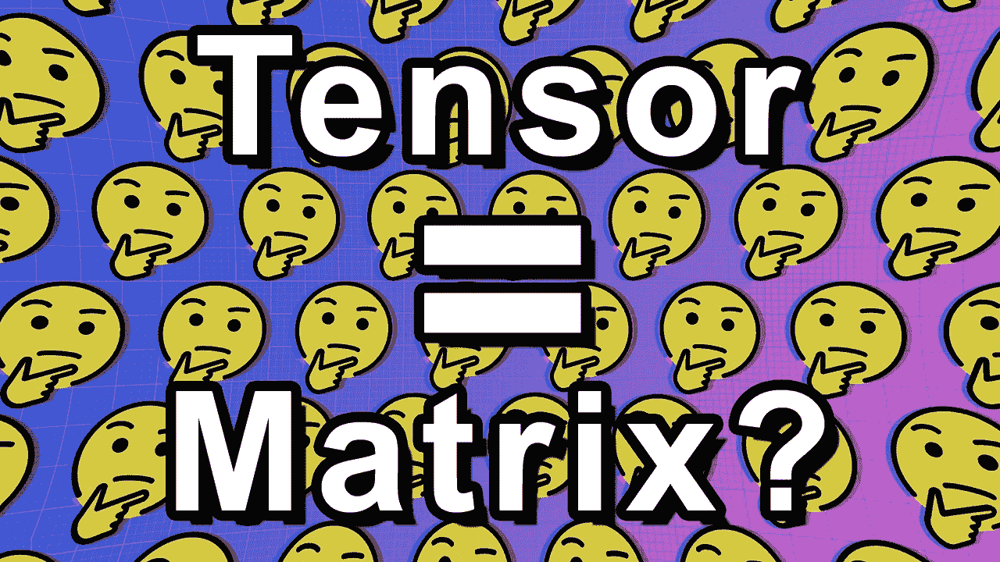
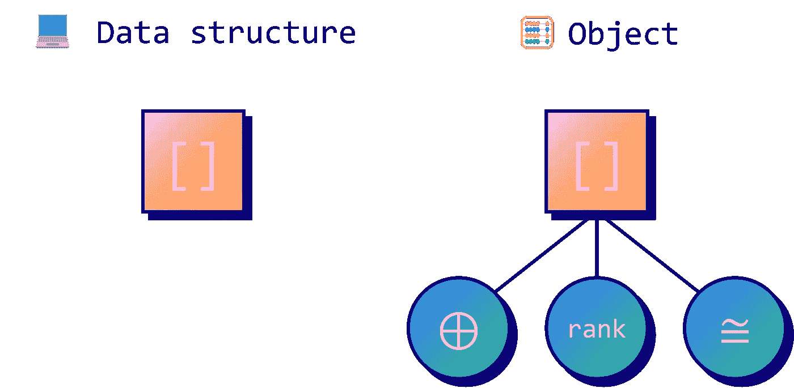
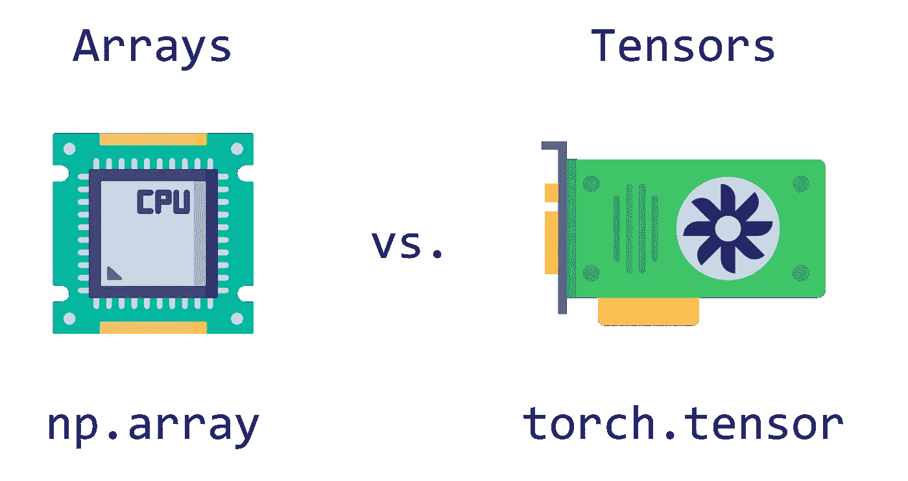
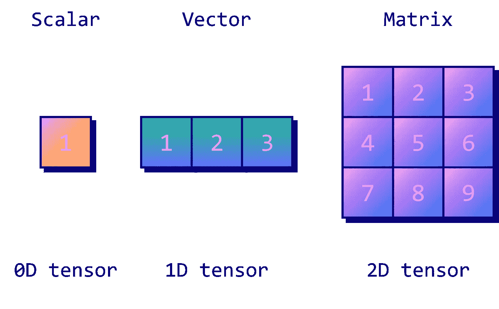

# 什么是机器学习中的张量？

> 原文：<https://towardsdatascience.com/what-is-a-tensor-in-deep-learning-6dedd95d6507>

## 张量、数组和矩阵的区别



作者图片

张量到底是什么？

大多数深度学习实践者都知道它们，但无法精确指出一个**精确的定义**。

TensorFlow，PyTorch:每个深度学习框架都依赖于同一个基本对象: **tensors** 。它们被用来存储深度学习中的几乎所有东西:输入数据、权重、偏见、预测等。

然而，他们的定义非常模糊:仅[维基百科类别](https://en.wikipedia.org/wiki/Category:Tensors)就有**超过 100 页**与张量相关。

在本文中，我们将对以下问题给出一个明确的答案:什么是神经网络中的张量？

# 💻计算机科学中的张量

那么为什么会有这么多定义呢？

很简单:不同的字段有不同的定义。**数学**中的张量与**物理**中的张量不太一样，与**计算机科学**中的张量不同。



作者图片

这些定义可以分为两类:作为数据结构的张量或作为对象的张量(在[面向对象编程](https://en.wikipedia.org/wiki/Object-oriented_programming)的意义上)。

*   **数据结构**:这是我们在计算机科学中使用的定义。张量是存储特定类型值的多维数组。
*   **对象**:这是其他领域使用的定义。在[数学](https://en.wikipedia.org/wiki/Tensor_(intrinsic_definition))和[物理](https://en.wikipedia.org/wiki/Infinitesimal_strain_theory)中，张量不仅仅是一个数据结构:它们也有一个属性列表，就像一个特定的产品。

这就是为什么你看到很多人(有时相当学究气地)说“*张量是* ***不是*** *n 维数组/矩阵*”:他们说的不是数据结构，而是具有属性的**对象。**

甚至同样的单词也有**不同的意思**。例如，在计算机科学中，2D 张量是一个矩阵(它是一个秩为 2 的张量)。在线性代数中，二维张量意味着它只存储两个值。秩也有一个完全不同的定义:它是其线性无关的列(或行)向量的最大数量。

在计算机科学中，我们只对专注于**数据结构**的定义感兴趣。从这个角度来看，张量确实是矩阵的 n 维*的推广。*

但是当我们在深度学习的背景下谈论张量时，我们仍然忽略了一个重要的细微差别...

# 深度学习中的🧠张量



*Freepik 和 smashingstocks 创建的图标—* [*Flaticon*](https://www.flaticon.com/free-icons/)

那么为什么它们被称为“张量”而不是“多维数组”呢？好吧，是短了点，但这就是全部了吗？实际上，人们在谈论张量时会做一个隐含的假设。

PyTorch 的[官方文档](https://pytorch.org/tutorials/beginner/examples_tensor/polynomial_tensor.html#:~:text=PyTorch%3A%20Tensors,-A%20third%20order&text=A%20PyTorch%20Tensor%20is%20basically,used%20for%20arbitrary%20numeric%20computation.)给了我们一个实用的答案:

> *numpy 数组和 PyTorch 张量最大的区别是 PyTorch 张量既可以运行在* ***CPU 上，也可以运行在****GPU 上。*

在深度学习中，我们需要以高度并行的方式计算大量矩阵乘法的性能。这些矩阵(以及一般的 n 维数组)通常在 GPU 上存储和处理，以加快训练和推理时间。

这是我们之前的定义中所缺少的:深度学习中的张量不仅仅是 n 维数组，还有一个隐含的假设，即它们可以在 GPU 上运行。

# ⚔️·努皮 vs 皮托奇

让我们看看 NumPy 数组和 PyTorch 张量的区别。



作者图片

这两个对象非常相似:我们可以用几乎相同的语法初始化一个 **1D 数组**和一个 **1D 张量**。它们还共享许多方法，可以很容易地相互转换。

你可以在这个地址找到这篇文章[中使用的代码。](https://github.com/mlabonne/how-to-data-science/blob/main/What_is_a_Tensor_in_Deep_Learning.ipynb)

```
**NumPy Array**: [1 2 3]**PyTorch Tensor**: tensor([1, 2, 3])
```

初始化 2D 数组和 2D 张量并不复杂。

```
**NumPy Array**: [[1 2 3]
              [4 5 6]]**PyTorch Tensor**: tensor([[1, 2, 3],
                        [4, 5, 6]])
```

我们说过张量和数组的唯一区别是张量可以在 GPU 上运行。所以说到底，这种区分是基于性能的。但这种推动有那么重要吗？

让我们比较一下 NumPy 数组和 PyTorch 张量在矩阵乘法上的性能。在下面的例子中，我们随机初始化 **4D 数组/张量，并将它们乘以**。

```
>>> **1.32 s**
```

```
>>> **25.2 ms**
```

正如我们所看到的，PyTorch 张量完成的性能优于 NumPy 数组:它们完成乘法**的速度比**快 52 倍！

我们可以将这种表现归因于不同的因素，例如:

*   NumPy 数组使用 *float64* 格式，而 PyTorch tensors 则利用了更高效的 *float32* 格式。然而，即使当 NumPy 数组转换为 *float32* 时，PyTorch 张量仍然快 40 倍。
*   PyTorch 张量存储在 GPU 上，不像 NumPy 数组。但是，如果我们在 CPU 上重复同样的实验，PyTorch 张量仍然能够平均快 2.8 倍。

即使将这两个因素结合起来，PyTorch 张量也被证明要快 1.4 倍，这表明 NumPy 数组对于矩阵乘法来说性能确实较差。

这就是张量的真正力量:它们快得惊人！性能可能会因维度、实现**、**和硬件而异，但这种速度是张量(而不是数组)在深度学习中如此常见的原因。

# 📝结论

在本文中，我们根据以下内容编写了张量的定义:

1.  它们在**计算机科学**(数据结构)中的用途；
2.  更具体的说，在**深度学习**(他们可以在 GPU 上运行)。

我们可以用一句话来总结:

> *张量是* ***n 维数组*** *隐含假设它们可以* ***在 GPU 上运行。***

最后，我们看到了张量和数组之间的性能差异，这激发了深度学习对张量的需求。

所以下一次有人试图向你解释张量不完全是矩阵的推广，你会知道他们在张量的特定定义中是正确的，但在计算机科学/深度学习中不是。

如果你在寻找更多 n 维的数据科学和机器学习内容，请**在 twitter 上关注我**[**@ maxime labanne**](https://twitter.com/maximelabonne)。你可以在这个地址找到本文[中使用的代码。📣](https://colab.research.google.com/drive/1azq12DApWgLgdWuYB3wh0TcwJVAfVxCL?usp=sharing)