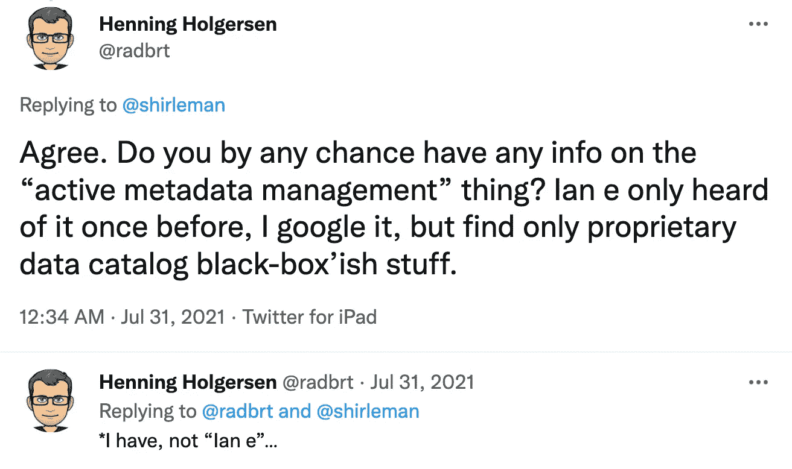
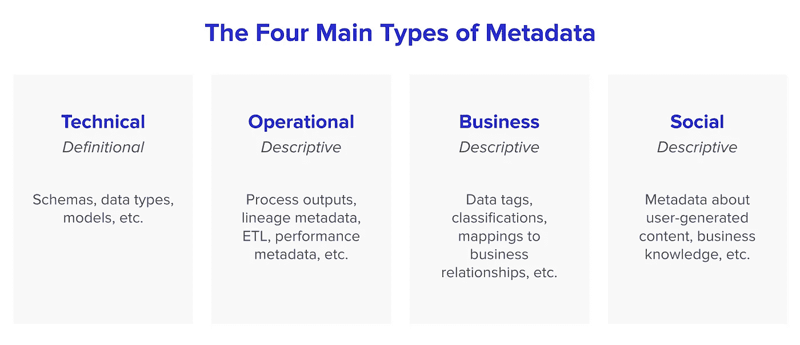
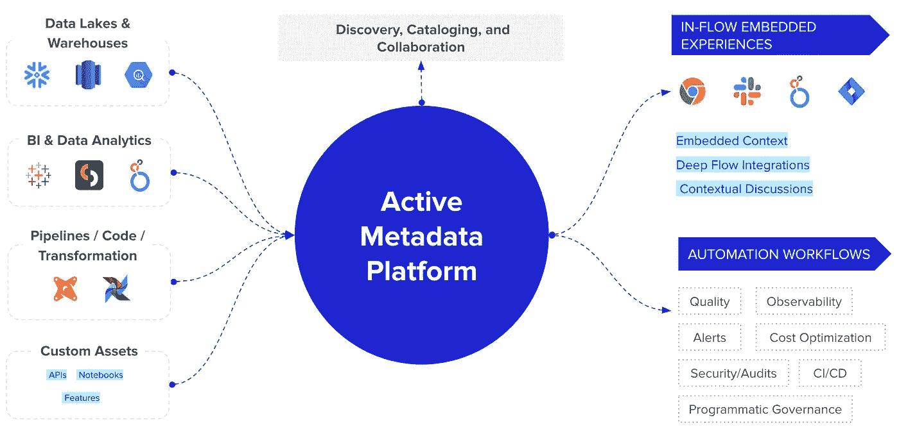

# 什么是活动元数据，为什么它很重要？

> 原文：<https://towardsdatascience.com/what-is-active-metadata-and-why-does-it-matter-add3408c228>

## 活跃的元数据就像热门的八卦。原因如下。

马修·费尼在 [Unsplash](https://unsplash.com/?utm_source=unsplash&utm_medium=referral&utm_content=creditCopyText) 上的照片

就像数据网格或度量层一样，*活动元数据*是数据世界最新的热门话题。正如在数据堆栈中流行的每一个新概念一样，突然出现了供应商更名为“活动元数据”的爆炸式增长，广告无处不在，以及……混乱。

每个人都在谈论活动元数据，这一定很容易理解，对吗？

亨宁·霍尔格森在推特上发推文。[来源。](https://twitter.com/radbrt/status/1421373747114676229)

安德鲁·帕迪拉在推特上发推文。[来源。](https://twitter.com/AndrewPadilla1/status/1421463366258741254)

显然不是！我谈论活动元数据已经有一年多了，但是我仍然经常看到这样的问题。

活动元数据听起来可能有点可怕，但事实并非如此。它是现代数据工具箱中的必备工具，所以如果您仍然想知道它的含义，那么这篇文章就是为您准备的。

我已经用尽可能少的术语分解了活动元数据背后的思想。请继续阅读，了解什么是活动元数据，它看起来像什么，您实际上可以如何使用它，它如何适应现代数据堆栈，以及它为什么如此重要。

# 什么是活动元数据？

我可以在这里开始说一些术语，但是你和我都会在几秒钟内睡着。所以让我们来打个比方。

想象一下，你得到了一条最有趣的科技八卦——苹果正在向娱乐性大麻领域扩张，以真正帮助人们“改变思维”。

你不可能把这么激动人心的事情保密。世界必须知道。所以你把它贴在你的博客上，blogspot.applefansunite.com。完成了，对吧？

就像 Hyperloop 隧道中的汽车一样，我们都知道它不会去任何地方。你不能只是把故事放在某个地方，然后希望人们会发现它。你必须把它送到人们手中。

你磨砺你的公关能力，将新闻发送给科技记者和新闻网站，你瞧，很快它就无处不在了。已经被迷化了，你爷爷刚刚还问为什么苹果农在你们群聊上说这个莫莉姑娘。

> *元数据就是这样的信息。如果它被动地坐在自己的小世界里，没有人看到或分享它，这有什么关系吗？但是如果它*主动*移动到人们已经在的地方，它就成为一个更大的对话的一部分，并为其添加背景。*

# 主动元数据和被动元数据有什么区别？

**被动元数据**是将元数据聚合和存储到静态数据目录中的标准方式。这通常包括基本的技术元数据——模式、数据类型、模型等。

把被动元数据想象成在个人博客上发布信息。偶尔，它会被发现并在黑客新闻上疯传。但是大部分时间它只是被忽视和不被使用，即使人们确实需要知道它。

**活动元数据**使元数据能够轻松快速地在整个数据堆栈中流动，在数据堆栈中的每个工具中嵌入丰富的上下文和信息。它通常比被动元数据更复杂，包括操作、业务和社会元数据以及基本的技术信息。

把活动元数据想象成一个病毒故事。它出现在你已经生活过的每一个地方，看起来就像是几秒钟。它会立即与其他信息进行交叉检查和结合，将一个相关背景的网络整合到一个更大的趋势或故事中。它引发了对话，最终让每个人变得更加博学和见多识广。

*元数据的四种主要类型。(图片由作者提供。)*

# 为什么活动元数据很重要？

> *简单来说，没有人愿意去另一个网站“浏览元数据”。*

随着我们拥抱互联网，数据在早期爆炸，公司意识到他们需要管理所有的新数据。

我们进入了元数据管理的黄金时代。像 [Informatica](https://www.informatica.com/) 、 [Collibra](https://www.collibra.com/us/en) 和 [Alation](https://www.alation.com/) 这样的新公司诞生了，他们大肆宣传数据目录的重要性。人们需要一种方法来整理他们所有的选择，所以我们得到了像 Gartner 的[元数据管理魔力象限](https://www.gartner.com/en/documents/3993025)这样的报告。数十亿美元的公司出现了，公司在元数据管理上花费了数亿美元。

然而就在去年，Gartner 发布了他们的活动元数据市场指南，并宣称“传统的元数据实践是不够的……”

这是因为被动数据目录通过添加…另一个工具解决了“工具太多”的问题。他们从数据栈的不同部分聚集元数据，并且它停滞在那里。用户采用受到影响，这些令人兴奋的工具变成了昂贵的货架。

活动元数据将元数据发送回数据堆栈中的每个工具，随时随地为人们提供他们需要的数据上下文——在 BI 工具中，当他们想知道指标的实际含义时，在 Slack 中，当有人发送数据资产的链接时，在查询编辑器中，当他们试图找到正确的列时，在吉拉中，当他们为数据工程师或分析师创建票证时。

# 活动元数据如何融入现代数据堆栈？

活动元数据作为现代数据堆栈之上的一层。

它利用开放 API 连接数据堆栈中的所有工具，并在双向流中来回传送元数据。这使得活动元数据可以带来上下文，比如说，从雪花到 Looker，Looker 到 Slack，Slack 到吉拉，吉拉又回到雪花。

*现代数据栈中的活跃元数据。(图片由作者提供。)*

# 活动元数据的 4 个特征

根据 [Gartner 新的活动元数据市场指南](/the-gartner-magic-quadrant-for-metadata-management-was-just-scrapped-d84b2543f989)，活动元数据是一个永远在线、智能驱动、面向行动、API 驱动的系统，与其被动、静态的前身相反。

这可以分解为活动元数据的四个关键特征。

*   **始终开启**:活动元数据始终开启。这意味着不需要等待人们手动输入或解析元数据，而是在现代数据堆栈的每个阶段不断收集元数据，包括日志、查询历史、使用统计等。
*   **智能**:活动元数据不仅仅是收集元数据。它是关于不断处理元数据来连接这些点，并从中创造情报。这意味着使用活动元数据，随着时间的推移，随着人们更多地使用它和观察更多的元数据，系统只会变得更加智能。
*   **面向行动**:主动元数据不仅仅止于智能。它应该通过管理建议、生成警报并使人们更容易做出决策来推动行动，甚至在没有人工干预的情况下自动做出决策，如在检测到数据质量问题时停止下游管道。
*   **默认打开**:主动元数据平台使用 API 来挂钩现代数据栈的每一部分。这使得神奇的用户体验成为可能，将数据从业者从无休止的工具和上下文切换中解救出来。这被称为嵌入式协作，即工作发生在你最不费力的地方。

# 活动元数据的 5 个使用案例

有几十个，如果不是几百个，活动元数据的用例。(足够自己写几篇文章了—即将推出！)让我们来看几个我最喜欢的。

*   **清除陈旧或未使用的资产**:使用活动元数据定期计算每项资产(如数据表、仪表板等)上次使用的时间和/或使用它的人数。如果它是在过去 30 天内使用的，太好了！如果某项资产在过去 60 天内未被使用，请自动将其归档。如果在过去的 90 天或 120 天内没有人接触过它，请彻底清除它。
*   **动态分配计算资源**:假设 90%的用户在一个财务季度的最后一周登录了一个 BI 工具。活动元数据可用于在该周之前自动扩大计算资源，并在之后再次缩小计算资源。
*   **丰富 BI 工具的用户体验**:使用活动元数据将上下文带入仪表板，而不是在 BI 工具和数据目录之间切换。相关的元数据(如业务术语、描述、所有者和血统)可以被推入 BI 工具。然后，当有人在查看每个表时，他们可以了解谁拥有它，数据来自哪里，等等。这些信息甚至可以在自动生成的报告中用作标签。

*用活动元数据丰富 BI 工具。(图片来自作者。)*

*   **识别流行资产**:使用活动元数据为每个资产创建一个定制的相关性分数。这可以基于来自查询日志、沿袭和 BI 仪表板等地方的使用信息。那么最受欢迎的相关资产应该更频繁地出现在搜索中，并更频繁地检查数据质量问题。
*   **通知下游消费者**:如果首席执行官最终在数据团队面前看到一个坏掉的仪表板，那就太糟糕了。活动元数据可用于在数据存储发生变化时检查问题，并通知下游数据用户潜在的问题。例如，当数据存储被爬行时，新的元数据将与以前的元数据进行比较。如果有任何潜在的重大变更(例如，添加或删除列)，沿袭可以用于查找谁拥有该数据存储，并通过 Slack、吉拉、电子邮件等通知他们。

# 活动元数据的未来

随着元数据成为大数据，大数据成为庞然大物，活动元数据不仅仅是一个美好的梦想。这是必要的，也是理解当今数据的唯一方式。

管理、处理和分析元数据是现代数据团队的新常态。然而，被动地手动完成这项工作是不可能的。这就是为什么看到活动元数据在去年成形并成为人们对现代元数据期望的事实上的标准是如此令人兴奋。

所有这些用例——像自动调整的管道、自动数据质量警报和持续验证的计算——在几年前听起来几乎是不可能的。今天，它们实际上触手可及。随着活动元数据在未来几年继续发展，我非常兴奋地看到智能数据梦想成为现实。

**想了解更多关于第三代数据目录和活动元数据兴起的信息吗？** [**查看我们的电子书**](https://atlan.com/resources/data-catalog-primer/) **。**

**觉得这个内容有帮助？在我的时事通讯《元数据周刊》上，我每周都写关于活动元数据、数据操作、数据文化和我们的学习建设的文章。** [**在此订阅。**](https://metadataweekly.substack.com/)