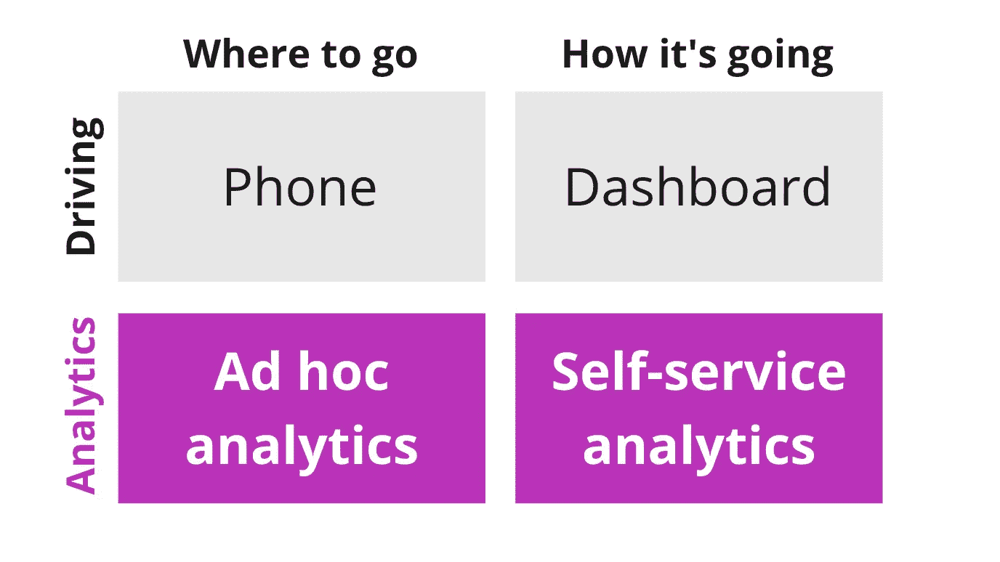
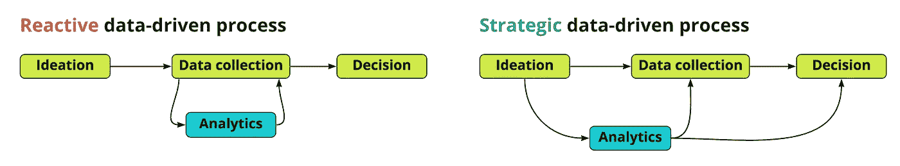
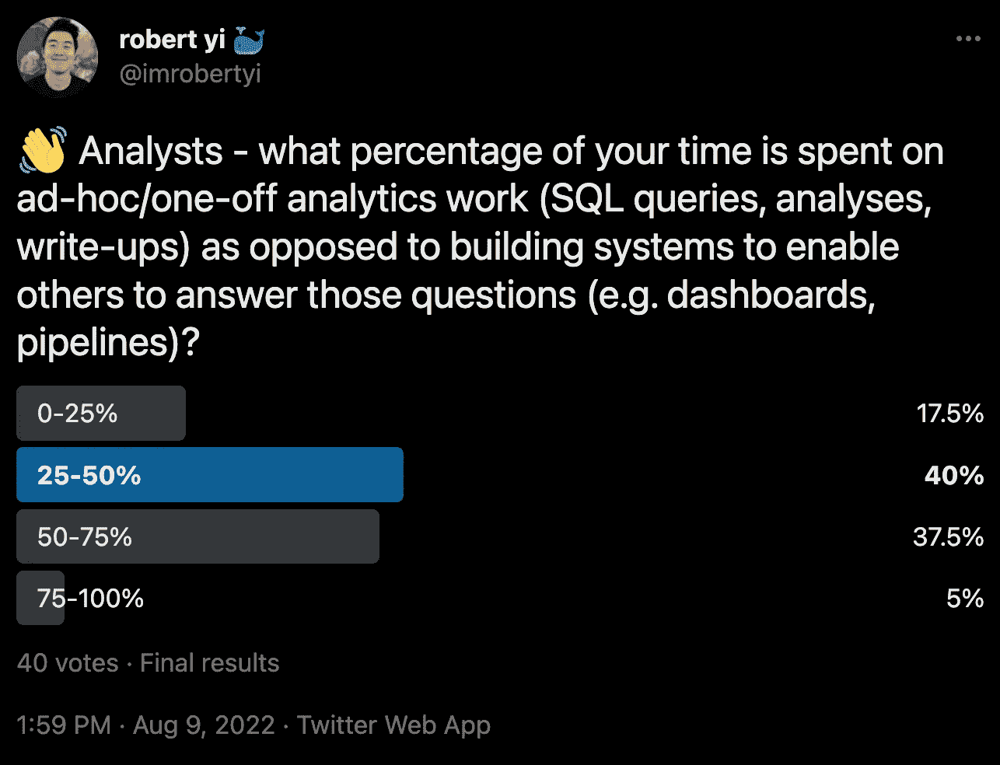

# 什么是即席分析，为什么要关注它？

> 原文：<https://towardsdatascience.com/what-is-ad-hoc-analytics-and-why-should-you-care-d59a45d466fe>

## 将所有数据消费归入自助服务并不像我们希望的那样有效

在 20 世纪 80-90 年代的美国，有一段时间，全世界都梦想建造越来越复杂的汽车仪表盘。我记得在《回到未来》中，我看着克里斯托弗·洛伊德的时光机德罗宁，我想我(和世界上的其他人)潜意识里认为，只要我们增加足够多的屏幕和开关，一个简单的汽车仪表盘可以做任何事情。

左图:20 世纪 80 年代著名的时光机 DeLorean 仪表盘回到了未来。右图:另一款来自《霹雳游侠》的充满未来感、仪表板厚重的 80 年代汽车内饰。来源:维基共享资源( [1](https://commons.wikimedia.org/wiki/File:TeamTimeCar.com-BTTF_DeLorean_Time_Machine-OtoGodfrey.com-JMortonPhoto.com-04.jpg) 和 [2](https://commons.wikimedia.org/wiki/File:KITT_Dashboard_(5483762812).jpg) )。

但是[对我们所有 8 岁的孩子来说，不幸的是]，仪表板从来没有像我们希望的那样成为导航需求的最终解决方案。我们现在通常在驾驶时利用两种截然不同的数据来源:仪表板，当然，还有手机。虽然仪表盘帮助我们评估我们的汽车在运输途中的状态(我们的汽车怎么样？)，手机在帮助我们决定去哪里以及如何到达那里方面有着独特的优势。我们的导航需求压倒了我们 80 年代的梦想，我们获取汽车数据的方法也相应地出现了分歧。

企业决策很像开车。强大的企业同样利用数据来回答我们的仪表板和电话回答的同样两个问题:我们做得怎么样(仪表板)，我们要去哪里(电话)？分析团队负责为这些目的提供和解释隐喻电话和仪表板，它们分别是:

*   **即席分析:**直接回答问题的工作。
    *示例:一次性工作、数据拉取请求、利益相关方问题。*
*   **自助分析:**让系统回答问题的工作。
    *例子:仪表盘、数据 app。*

电话=即席分析。仪表板=自助服务分析。图片作者。

但就像我们 80 年代和 90 年代的内心孩子一样(也许下意识地听从他们的暗示)，数据行业一直在追逐一个谬论，即日益复杂的仪表板是我们决策需求的万能药方，导致大量无人维护的仪表板，让人想起未来 80 年代的汽车设计。但是，就像在驾驶时一样，您需要数据来告知您要去哪里和如何做，以便作为一个组织做出正确的决策，因此，临时和自助服务分析是使组织能够做出数据驱动的决策的关键。

> 自助工作使涉众能够自己进行基本的探索，而临时分析帮助他们回答不可避免地会出现的更复杂的问题。

在接下来的内容中，我将阐述为什么 ad hoc analytics 需要成为一等公民，并且我们将讨论为此我们可以做些什么。

# 你为什么要在乎？

临时工作需要提升有三个主要原因:

## **1。临时分析对于做出数据驱动的决策至关重要**

我们开车很长一段时间都没有手机，但现在很难想象在没有手机的情况下决定去哪里以及如何到达那里。我们要用纸质地图吗？求我们的朋友推荐？多么古老！

即席分析就像电话。它们通过回答最关键的问题来帮助我们在企业决策的世界中导航:“我们应该投资哪个收购渠道？”，“如果没有 A/B 测试，我们如何评估这个特性的成功？”这类问题通常不能单独通过仪表板来回答，而只能通过仔细的特别分析、与利益相关者的深入合作以及专家分析师的框架和解释来回答。

## **2。临时工作可能是分析工作中最痛苦或最有收获的部分**

并非所有的临时工作都是相同的。分析界很少讨论的一点:有两种不同的特别请求:**战略** **分析**和**快速问题**。快速问题是对*数据*和单独数据的请求，而战略分析是对*解释*的请求。快速问题的大量涌入可能导致低工作满意度，分析师被[视为 SQL 猴子](https://robertyi.substack.com/p/the-analyst-isnt-your-bitch)，而战略分析工作可能导致高工作满意度，分析师被视为有价值的思想伙伴。这里的诀窍是:在每个*快速问题的背后，*总有一个*战略要求*。

找到快速问题背后的战略要求可以提升分析的角色，使其更具战略性，而不是被动反应。*图片作者。*

为分析团队构建流程和最佳实践，以有意识地发现数据拉取请求背后的战略问题，可以大幅提高工作满意度。但这只有在临时工作被视为合法的工作流程，而不是被掩盖时才会发生。

## **3。临时工作占用了*多*的时间**

我们在 Twitter、LinkedIn 和个人网站上对人们进行了调查，发现大约 **40-50%** 的分析师时间花费在临时请求上，即使使用健壮的工具来实现自助服务行为(Looker、metabase、dbt 等)。).临时工作不仅痛苦，还会占用大量时间。

大约 40-50%的分析时间花在临时工作上。图片作者。

# 你能做些什么呢？

## 1.使特设工作成为一等公民。

仅仅认识到临时工作是有效的工作会有很大的帮助。对于团队领导，确保将临时工作适当纳入分析师的绩效评估中。对于 ICs，学习如何有效地做到这些:避免被动地、不假思索地响应请求，而是在编写一行 SQL 之前，与利益相关者合作，让自己参与到[揭示潜在的战略目标](https://medium.hyperquery.ai/why-analytics-sucks-64d779da83ff)中。对于利益相关者，要学会问问题，让分析师更深入地参与决策过程。

## 2.建立临时工作的制度和标准。

临时工作需要流程化和标准化。为分析师构建模板以确保工作标准化，推动利益相关方遵循他们自己的流程以简化对话，将工作存储在一个集中、可发现的位置。我们构建了 [hyperquery](http://hyperquery.ai) 正是为了更容易地完成和共享战略性的临时工作，但目标是[流程改进](https://medium.hyperquery.ai/why-analytics-sucks-64d779da83ff)，而不是工具。

## 结论

虽然自助式仪表板世界肯定比过去几代人的数据沙漠更好，但仍有许多工作要做，并且将所有数据消费归入自助式服务并不像我们希望的那样有效。临时工作的策略需要成为任何强大的分析计划的关键部分。

*有兴趣了解更多关于超级支持您的临时工作流的信息吗？通过* [*联系我 Robert @ hyperquery . ai*](mailto:robert@hyperquery.ai)*，通过*[*hyperquery . ai*](http://hyperquery.ai)*查看我们专用的即席分析平台。*