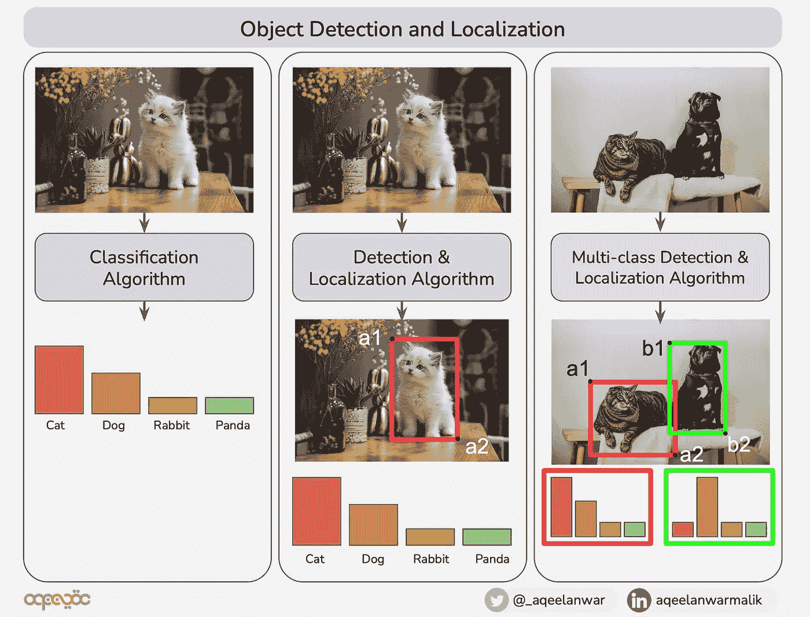
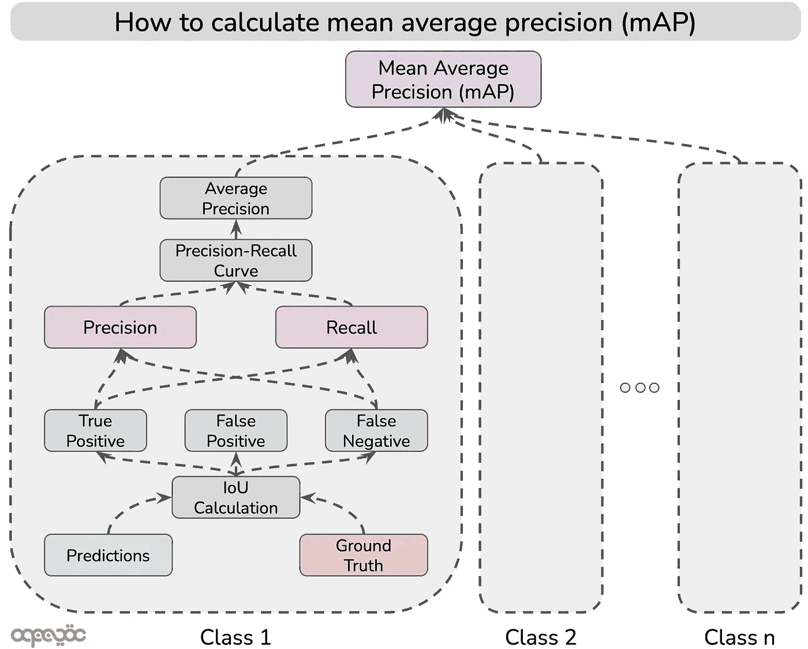
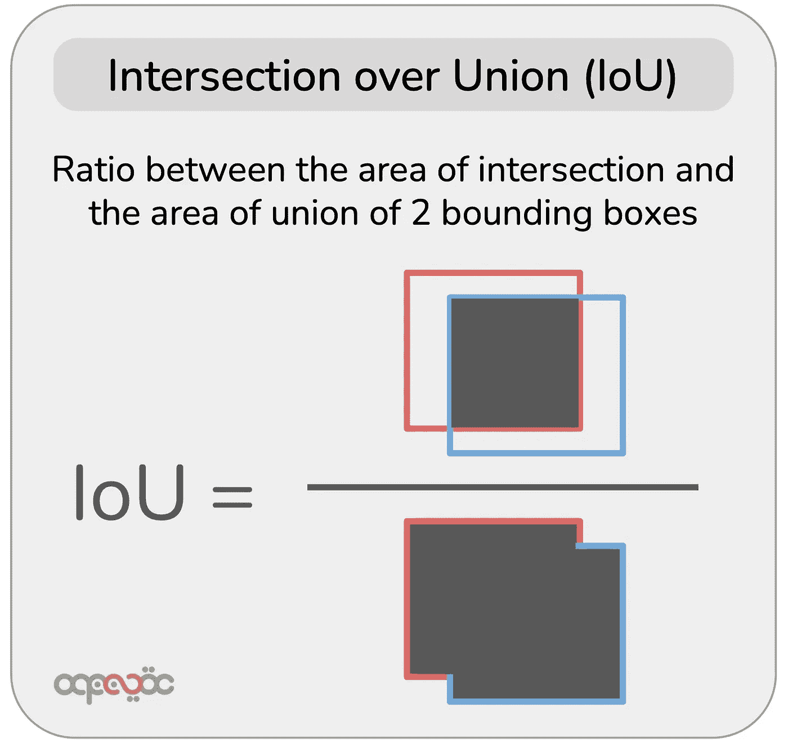
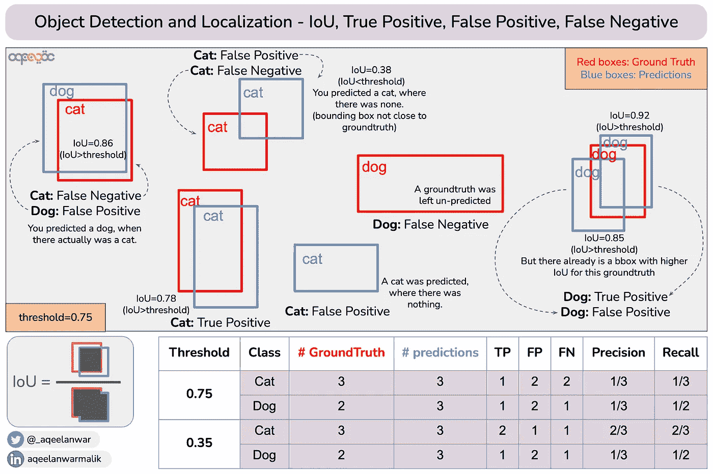
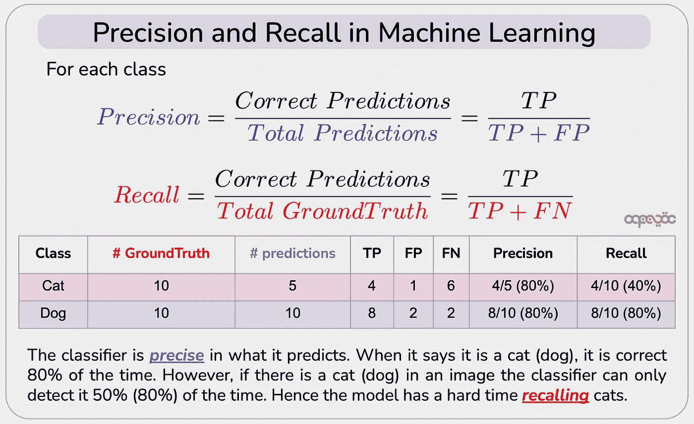
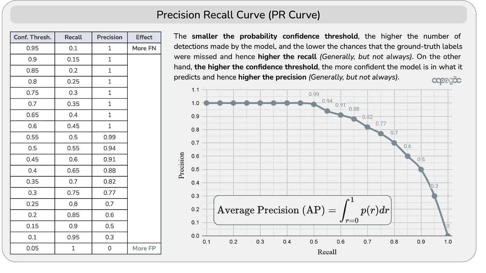
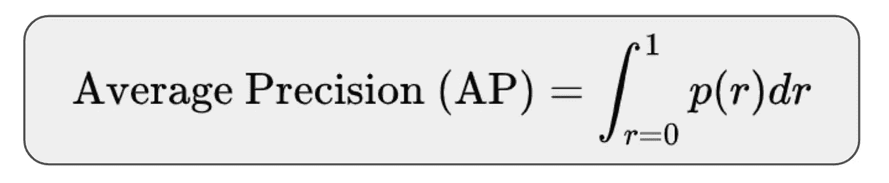
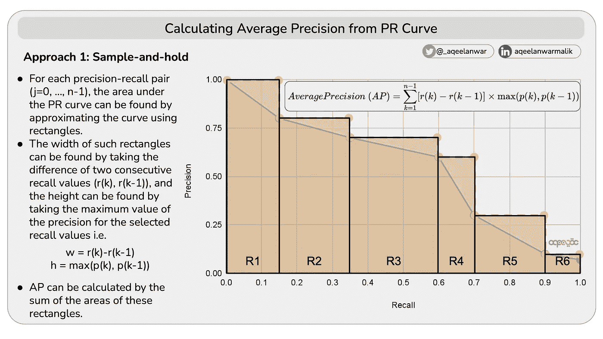
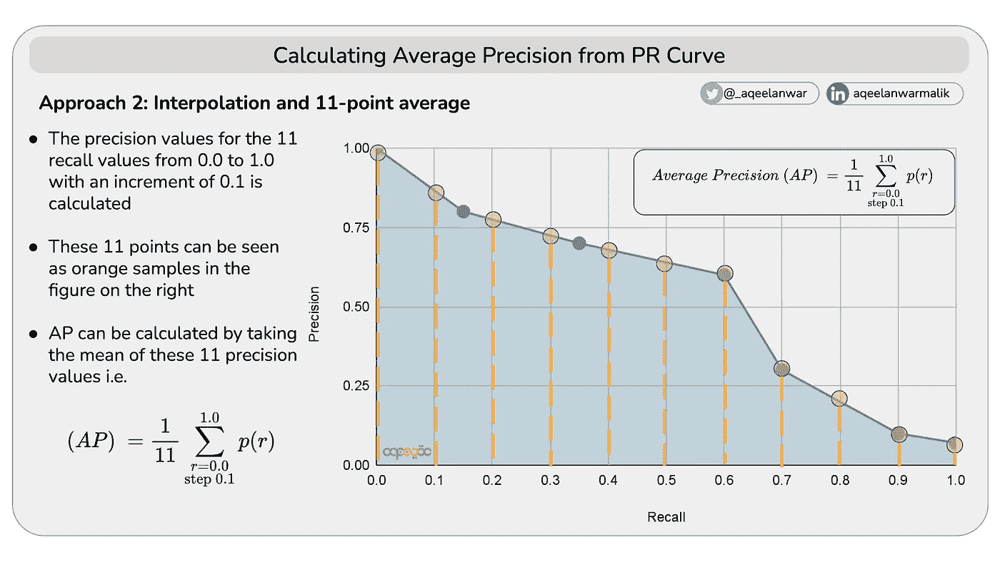
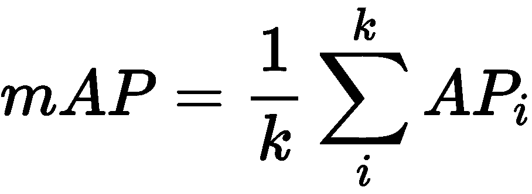

# 目标检测和定位算法的平均精度是多少，如何计算？

> 原文：<https://towardsdatascience.com/what-is-average-precision-in-object-detection-localization-algorithms-and-how-to-calculate-it-3f330efe697b>

## 理解目标检测和定位算法的平均精度的一步一步的可视化指南

# 什么是物体检测和定位？

物体检测和定位是机器学习中发展最快的领域之一。这种算法是标准分类算法的扩展。对于给定的输入图像，分类算法将输出感兴趣类别的概率分布。旨在不仅检测图像中感兴趣类别的存在，而且使用包围盒来定位它们。此外，它还可以处理同一图像中多个类的存在。

考虑下图，该图将分类算法与对象检测和定位进行了比较。

分类与检测定位算法的区别——图片由作者修改自 [Steve Tsang](https://unsplash.com/@stevetsang?utm_source=medium&utm_medium=referral) 在 [Unsplash](https://unsplash.com?utm_source=medium&utm_medium=referral) 上的照片、 [Priscilla Du Preez](https://unsplash.com/@priscilladupreez?utm_source=medium&utm_medium=referral) 在 [Unsplash](https://unsplash.com?utm_source=medium&utm_medium=referral) 上的照片

因此，它不仅预测了类标签，还告诉我们预测的类在图片中的位置。因此，为了评估对象检测和定位算法的性能，我们需要评估预测的类是否是实际的类，以及预测的边界框有多接近地面事实。

# 评估指标

目标检测和定位算法的性能通过称为平均精度(AP)(和平均平均精度)的度量来评估。在我们进入 AP 是什么的细节之前，让我们先弄清楚它不是什么。

> AP 不是不同类的平均精度。

AP 是在 IoU、混淆矩阵(TP、FP、FN)、精度和召回率等其他几个指标的帮助下计算出来的，如下图所示。

要理解 AP，我们首先需要理解这些指标。

## 1.并集交集(IoU):

IoU 量化了两个边界框(地面真实和预测)的接近程度。它是一个介于 0 和 1 之间的值。如果两个边界框完全重叠，则预测是完美的，因此 IoU 为 1。另一方面，如果两个边界框不重叠，则 IoU 为 0。IoU 的计算方法是取两个键合框的相交面积与并集面积之比，如下所示。

并集上的交集—作者图片

## 2.真阳性、假阳性、假阴性:

如果预测边界框和基本真实边界框的类别标签相同，并且它们之间的 IoU 大于阈值，则预测被认为是正确的。

基于 IoU、阈值和基本事实的类别标签以及预测的边界框，我们计算以下三个度量

*   **真阳性:**模型预测某个位置存在边界框(阳性)，并且是正确的(真)
*   **假阳性:**模型预测一个边界框存在于一个特定的位置(阳性)，但它是错误的(假)
*   **假阴性:**该模型没有预测到某一位置的边界框(阴性)，并且它是错误的(假的)，即在该位置存在地面真实边界框。
*   **真否定:**模型没有预测到一个边界框(否定)，它是正确的(真)。这对应于背景，没有边界框的区域，并且不用于计算最终度量。

下面的例子将有助于澄清 TP、FP 和 FN。

IoU、TP、FP、FN —作者图片

## 3.精确度，回忆

基于 TP、FP 和 FN，*对于每个标记的类*，我们计算两个参数:精度和召回率。

*   **Precision:** 告诉我们我们的模型有多精确，即在检测到的所有猫中，有多少是真正的猫。因此，它是真阳性与由模型做出的 cat 预测总数(相当于真阳性和假阳性之和)之间的比率，如下所示。
*   **回忆:**告诉我们模型从图像中回忆类别的能力，即在输入图像中的所有猫中，模型能够检测到多少只。因此，它是由如下所示的模型产生的真阳性和地面真实猫的总数(相当于真阳性和假阴性的总和)之间的比率。

机器学习中的精确度和召回率—作者图片

从上图可以看出，分类器在预测时是 ***精确*** 。当它说它是猫(狗)的时候，它 80%的时候都是正确的。然而，如果图像中有一只猫(狗)，分类器只能在 50% (80%)的时候检测到它。于是模特有了不好过的 ***回忆*** 猫。

## 4.精确回忆曲线

理想情况下，我们希望精确度和召回率都很高，即无论检测到什么都是正确的，并且模型可以检测到一个类的所有出现。精确度和召回率的值取决于模型检测到多少真阳性。指定边界框 TP、FP 和 FN 取决于以下两点

*   预测标签与基本事实标签的比较
*   两个盒子之间的借据

对于多类分类问题，模型输出包围盒属于某一类的条件概率。类的概率越大，边界框包含该类的机会就越大。概率分布连同用户定义的阈值(在 0 到 1 之间)用于分类边界框。

这个概率置信阈值越小**，模型做出的检测的数量就越多，错过真实标签的机会就越低，因此**的召回率就越高** *(通常，但不总是)*。另一方面，**置信度阈值**越高，模型对其预测越有信心，因此**精确度** *(通常，但不总是)*。我们希望精确度和召回率都尽可能高，因此，基于置信度阈值的值，在精确度和召回率之间存在折衷。**

> **精确度-召回率曲线绘制了不同置信度阈值的精确度值与召回率的关系。**

有了精确召回曲线，我们可以直观地看到什么样的置信度阈值对我们是最好的(对于我们给定的应用程序)。下面是 PR 曲线的一个过于简化的例子

精确召回曲线—作者图片

## 5.平均精度

为您的应用程序选择一个置信度值可能很难，而且很主观。平均精度是一个关键的性能指标，它试图消除对选择一个置信度阈值的依赖性，其定义如下

> 平均精度是 PR 曲线下的面积。

AP 将 PR 曲线总结为一个标量值。当精确度和召回率都很高时，平均精确度就很高，而当精确度和召回率中的任何一个在置信阈值范围内很低时，平均精确度就很低。AP 的范围在 0 到 1 之间。

平均精确度是精确度-召回曲线下的面积-作者提供的图像

以下两种方法通常用于求 PR 曲线下的面积。

## 方法 1 —用矩形近似 PR 曲线:

*   对于每个精确召回对(j=0，…，n-1)，PR 曲线下的面积可以通过使用矩形近似曲线来找到。
*   这种矩形的宽度可以通过取两个连续召回值(r(k)，r(k-1))的差来找到，而高度可以通过取所选召回值的精度的最大值来找到，即 w = r(k)-r(k-1)，h = max(p(k)，p(k-1))
*   AP 可以通过这些矩形的面积之和来计算，如下所示

从 PR 曲线计算平均精度—作者提供的图像

## 方法 2 —插值法和 11 点平均法

*   计算从 0.0 到 1.0 的 11 个召回值的精度值，增量为 0.1
*   在右图中，这 11 个点可以被视为橙色样本
*   AP 可以通过取这 11 个精度值的平均值来计算，如下所示

从 PR 曲线计算平均精度—作者提供的图像

## 6.平均精度:

可以为每个类计算 AP 值。平均精度是通过对所有考虑的类取 AP 的平均值来计算的。即

平均平均精度-所有 k 类的平均精度(AP)的平均值-按作者分类的图像

# 摘要

平均精度(mAP)量化了目标检测和定位算法的性能。为了理解 mAP，我们需要理解 IoU、真阳性、真阳性、假阳性、假阴性、回忆、精度和精度-回忆曲线是什么。在本文中，我们详细介绍了这些概念，以及它们如何帮助我们计算地图。

**如果这篇文章对你有帮助，或者你想了解更多关于机器学习和数据科学的知识，请关注**[**Aqeel an war**](https://medium.com/u/a7cc4f201fb5?source=post_page-----51587a95f847-----------------------------------)**，或者在**[***LinkedIn***](https://www.linkedin.com/in/aqeelanwarmalik/)***或***[***Twitter***](https://twitter.com/_aqeelanwar)***上联系我。你也可以订阅我的邮件列表。***