# Python 的“with”语句背后是什么？

> 原文：<https://towardsdatascience.com/what-is-behind-the-python-with-statement-89c74be3a6bd>


图片由 [Pixabay](https://pixabay.com/?utm_source=link-attribution&utm_medium=referral&utm_campaign=image&utm_content=3129361) 的[鲁迪和](https://pixabay.com/users/skitterphoto-324082/?utm_source=link-attribution&utm_medium=referral&utm_campaign=image&utm_content=3129361)彼得·斯皮特林拍摄

## 您可以编写支持“with”语句的定制函数和类

我相信你一定曾经在 Python 中使用过“with”语句，只要你不是几天前才开始学习的 Python 新手。众所周知，我们可以使用 with 语句创建资源的“上下文”,而不必担心随后关闭或释放它。

由于这种语法在 Python 中是独一无二的，您有没有想过幕后到底发生了什么？在本文中，我将深入介绍 Python with 语句，并提供一些在程序中灵活使用它的想法。

# 1.为什么使用“with”语句？


图片来自 [Pixabay](https://pixabay.com/?utm_source=link-attribution&utm_medium=referral&utm_campaign=image&utm_content=1683134) 的[尤拉杰·沃尔高](https://pixabay.com/users/coyot-2009089/?utm_source=link-attribution&utm_medium=referral&utm_campaign=image&utm_content=1683134)

让我们从一些基本的开始。with-statement 最常见的用例之一是在 Python 问题中打开文件。假设我们想打开一个文本文件并向其中写入一些内容，然后关闭它。最简单的代码如下。

## 1.1 一个不好的例子

```
# Bad Example
f = open('my.txt', 'w')
f.write('Hello!')
f.close()
```

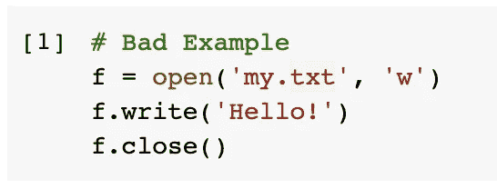

上面的代码将打开一个名为`my.txt`的文件，然后将字符串`Hello!`写入其中。然后，我们需要关闭文件流来释放这个资源，以避免内存泄漏之类的问题。

然而，这是一个不好的例子。如果在我们操纵文件的过程中出了问题，程序将永远不会到达`close()`方法。

## 1.2“常规”解决方案

因此，更好的解决方案是将`close()`方法放在 finally-block 中，后面跟着一个 try-except 块。

```
# Try Except
f = open('my.txt', 'r')
try:
    print(f.readline())
except:
    pass
finally:
    f.close()
```

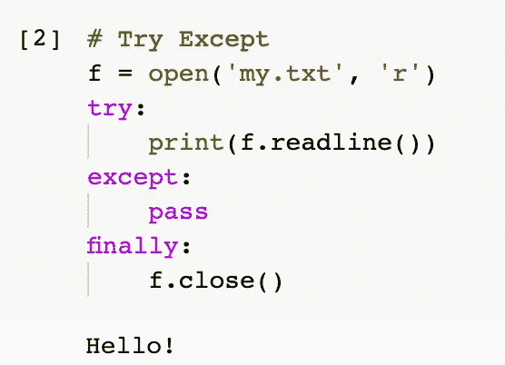

上面的代码这次以读取模式打开文件，然后读取第一行并打印出来。“finally”块确保`close()`方法被保证执行，即使可能有错误。

## 1.3 推荐的解决方案

推荐的解决方案是在 Python 中使用 with 语句。代码非常简单，如下所示。

```
# With Statement
with open('my.txt', 'r') as f:
    print(f.readline())
```

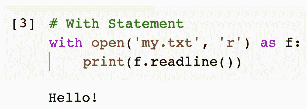

我们将该文件作为变量`f`打开，然后我们可以在这个 with-statement 块中使用该文件来做我们想做的任何事情。我们不会费心关闭文件。它也保证最终会被摧毁。同样，我们不能在上下文之外使用变量`f`。

另外值得一提的是，从 Python 3.1 开始，我们可以在 with 语句中放置多个逗号分隔的上下文表达式。

```
with open('my.txt', 'r') as f_source, open('my_new.txt', 'w') as f_dest:
    f_dest.write(f_source.readline() + ' Again')
```

此外，从 Python 3.10 开始，我们可以使用括号将多个表达式分组，这样代码就可以分成多行，从而提高可读性。

```
with (
    open('my.txt', 'r') as f_source,
    open('my_new.txt', 'w') as f_dest
):
    f_dest.write(f_source.readline() + ' Again')
```

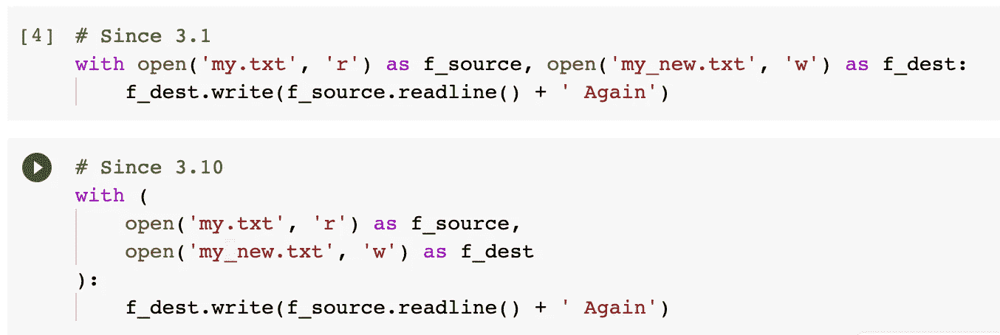

顺便说一下，上面的代码打开原始文件`my.txt`作为源文件，打开一个新文件`my_new.txt`作为目标文件。然后，它从源文件中读取并写入作为目标的新文件。

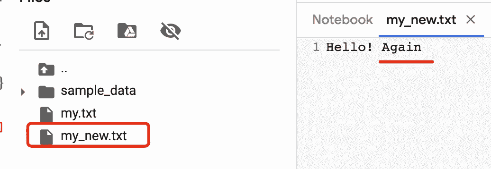

# 2.“带”定制类


图片来自 [Pixabay](https://pixabay.com/?utm_source=link-attribution&utm_medium=referral&utm_campaign=image&utm_content=911804) 的 [bodobe](https://pixabay.com/users/bodobe-1222375/?utm_source=link-attribution&utm_medium=referral&utm_campaign=image&utm_content=911804)

所有的回顾都已经在前面的章节中完成了。现在我们应该从一些深入的东西开始。为什么`open()`方法支持 with-statement？我们能创建支持它的定制课程吗？

## 2.1 简单的例子

答案是肯定的。让我们从一个简单的类开始作为例子。

```
class Person: def __init__(self, name):
        self.name = name

    def greeting(self):
        print(f'Hello, my name is {self.name}!')
```

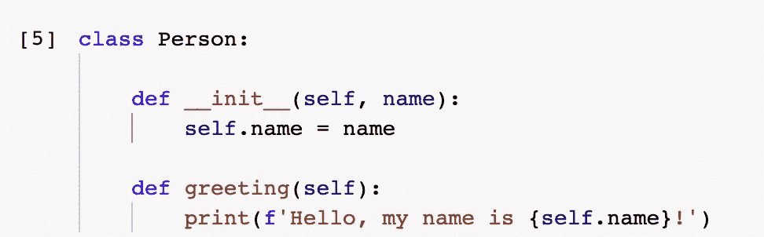

类`Person`只有两个方法，一个是 init 方法，它将`name`值作为类的属性。然后，还有一个`greeting()`方法，用这个人的名字打印一条问候消息。

我们试试它的`greeting()`方法。

```
Person('Chris').greeting()
```

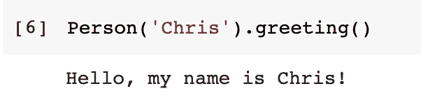

现在，假设我们想在使用 with 语句的上下文中创建这个人。我们能做到吗？

```
with Person('Chris') as p:
    p.greeting()
```

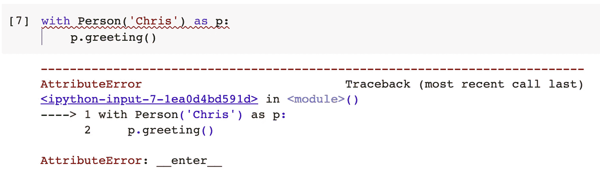

显然，我们不能。然而，错误提醒了我们应该做什么。

## 2.2.__enter__ 和 __exit__ 方法的实现

为了能够使用 with 语句，我们需要实现`__enter__()`方法。事实上，还有另一个叫做`__exit__()`的方法是可选的。让我们看看下面的代码。

```
class Person: def __init__(self, name):
        self.name = name

    def greeting(self):
        print(f'Hello, my name is {self.name}!') def __enter__(self):
        print('Creating a person object in a context...')
        return self def __exit__(self, exc_type, exc_value, exc_tb):
        print("exception type:", exc_type)
        print("exception value:", exc_value)
        print("exception traceback:", exc_tb)
        print('Object disposed')
```

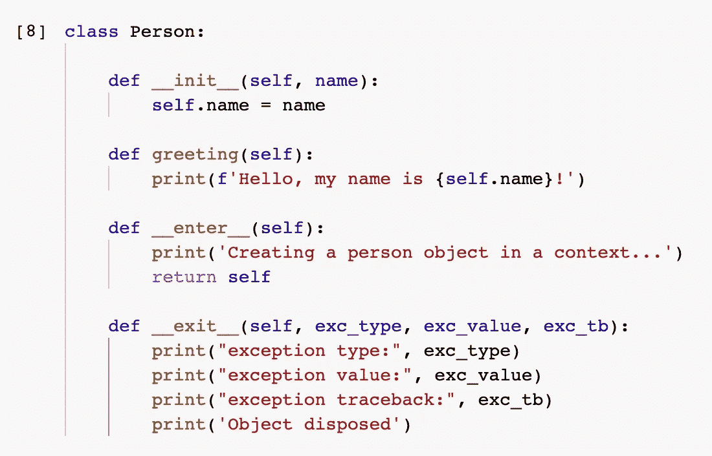

这里，当使用 with 语句创建对象时，将执行`__enter__()`方法。它必须返回对象，也就是它自己。

当上下文结束并且需要释放对象时，将调用`__exit__()`方法。它还有 3 个参数，如果有异常，这些参数将捕捉异常的一些细节。

现在，让我们再试一次代码。

```
with Person('Chris') as p:
    p.greeting()
```

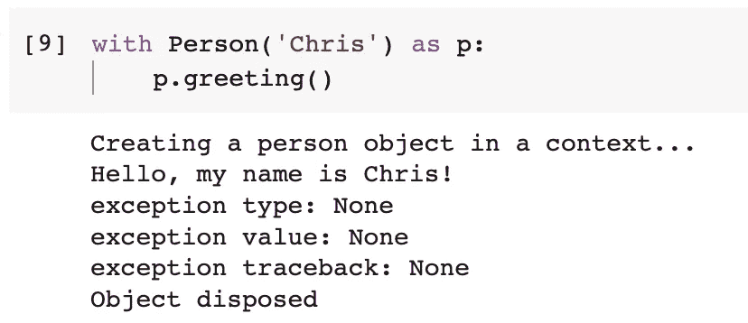

从输出中我们可以看到，`__enter__()`方法在其他任何事情之前被调用，然后执行 with 语句的主体，也就是问候消息。最后，调用`__exit__()`方法并释放对象。

## 2.3 在 With 语句中处理异常

上面的代码中没有发生异常，所以所有与异常相关的参数都是`None`。

```
with Person('Chris') as p:
    a = 1/0
    p.greeting()
```

在这段代码中，我添加了`a = 1/0`，这肯定会导致错误。让我们看看 with-statement 将如何表现。

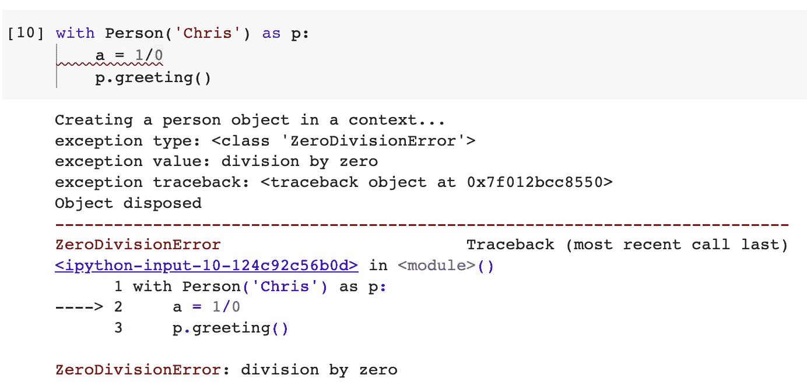

异常类型、值和追溯现在可用，因为有一个异常。这些回调参数使我们能够相应地处理异常。

# 3.“带”定制功能


图片来自 [Pixabay](https://pixabay.com/?utm_source=link-attribution&utm_medium=referral&utm_campaign=image&utm_content=96240) 的 [Uwe Baumann](https://pixabay.com/users/weinstock-25534/?utm_source=link-attribution&utm_medium=referral&utm_campaign=image&utm_content=96240)

好吧，大多数时候我们可能想在函数中使用 with 语句，而不是创建一个对象。`open()`函数就是这样一个例子。也就是说，我们用这个函数写一个 with 语句，并给出我们想要打开的文件名。然后，它在这个上下文中打开文件，当离开上下文时，连接被破坏。

我们可以使用 Python 内置的`contextlib`来做到这一点。具体来说，我们需要在这个模块中使用`contextmanager`。

```
from contextlib import contextmanager
```

然后，我们可以用`contextmanager`作为装饰来定义函数。

假设我们要与一个数据库建立连接。让我们用伪代码来做这件事。

```
[@contextmanager](http://twitter.com/contextmanager)
def get_db_connection(connection_str):
    db_con = 'connected to' + connection_str
    try:
        yield db_con
    finally:
        print('the connection is closed')
```

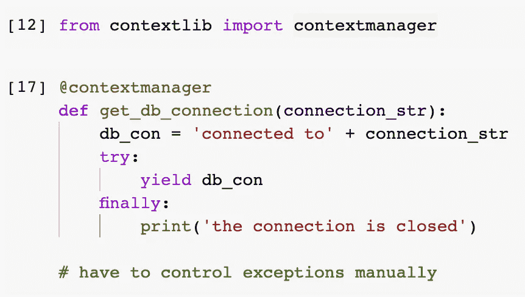

该代码模拟连接到一个数据库。请注意，我们需要使用`yield`关键字来返回数据库连接。此外，我们需要使用 try-except 块，并确保异常得到处理，并且应该在 finally 块中释放资源。

现在我们可以在 with 语句中使用这个函数。

```
with get_db_connection('mysql') as con:
    print(con)
```

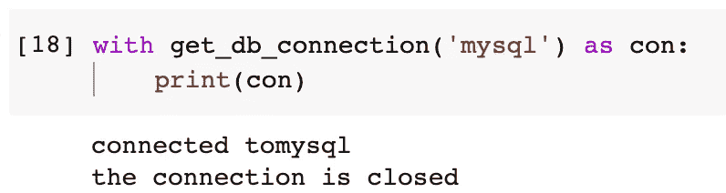

# 摘要


图片来自 [Pixabay](https://pixabay.com/?utm_source=link-attribution&utm_medium=referral&utm_campaign=image&utm_content=2468874) 的 [garageband](https://pixabay.com/users/garageband-4200899/?utm_source=link-attribution&utm_medium=referral&utm_campaign=image&utm_content=2468874)

在这篇文章中，我已经介绍了我们什么时候需要使用 with 语句以及如何使用它。还解释了这种语法背后的机制。除此之外，我还介绍了如何编写一个支持 with 语句的类或函数。通过以这种方式实现一个类或一个函数，我们可以以一种非常 Pythonic 化的方式简化接口的使用。

[](https://medium.com/@qiuyujx/membership) [## 通过我的推荐链接加入灵媒-陶

### 作为一个媒体会员，你的会员费的一部分会给你阅读的作家，你可以完全接触到每一个故事…

medium.com](https://medium.com/@qiuyujx/membership) 

如果你觉得我的文章有帮助，请考虑加入 Medium 会员来支持我和成千上万的其他作者！(点击上面的链接)

> 除非另有说明，所有图片都是作者的