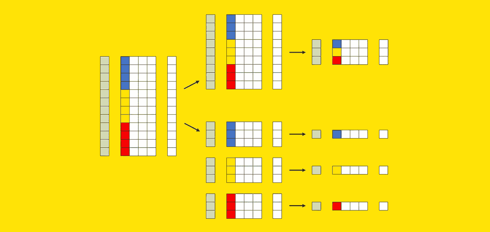
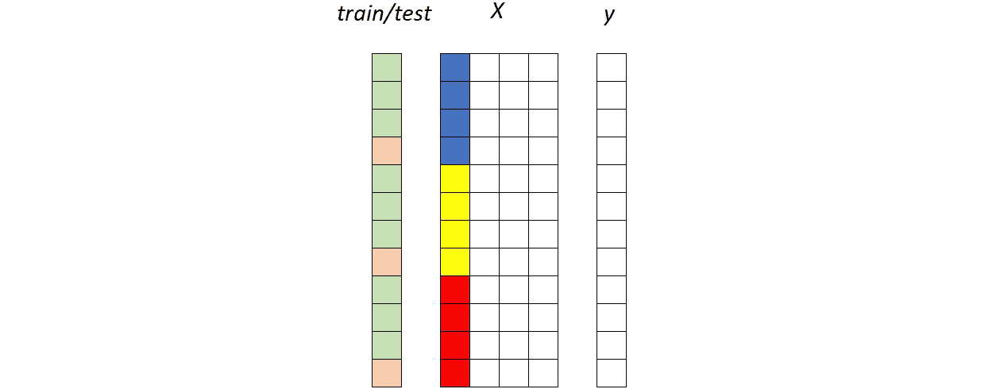
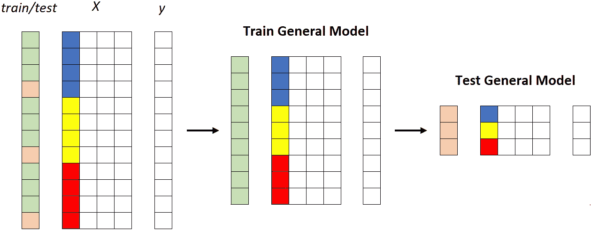
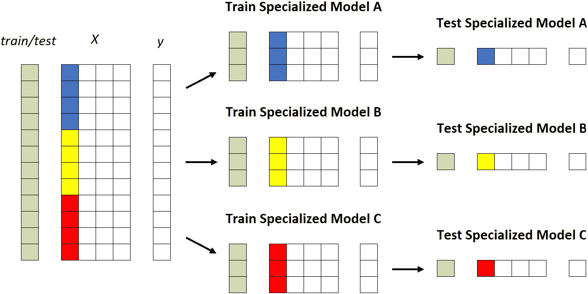
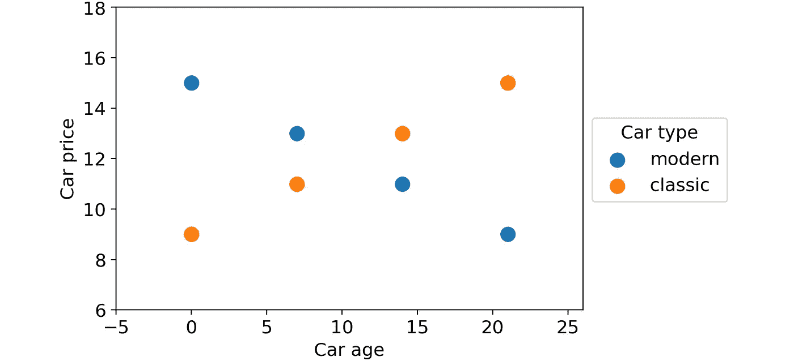
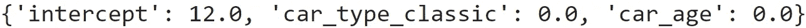
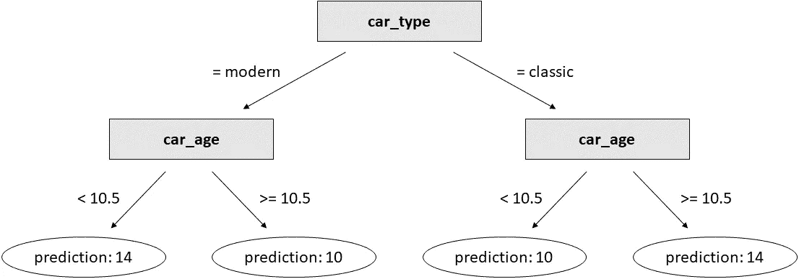
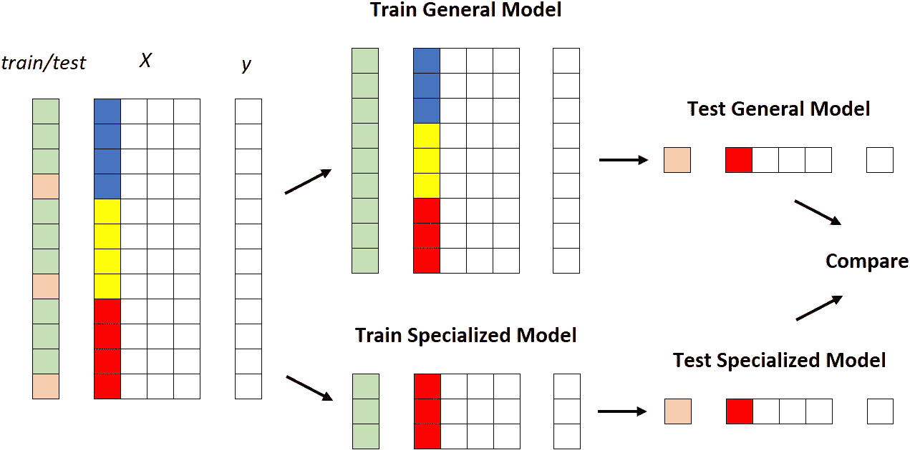
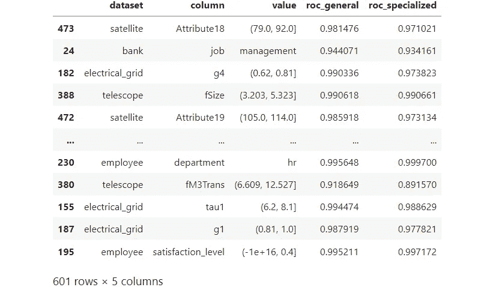
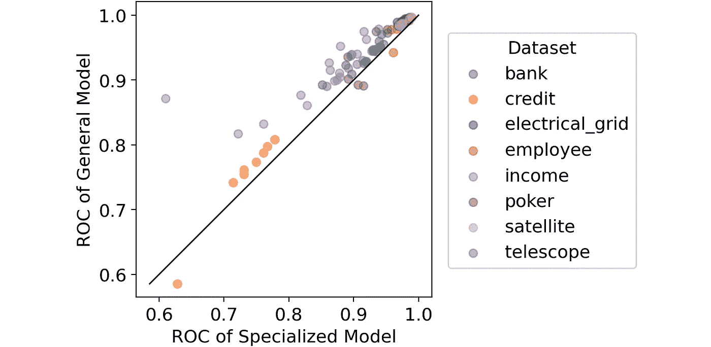

# 一个通用模型和多个专用模型哪个更好？

> 原文：<https://towardsdatascience.com/what-is-better-one-general-model-or-many-specialized-models-9500d9f8751d>

## 比较针对不同组训练几个 ML 模型与针对所有数据训练一个唯一模型的有效性



[图片由作者提供]

我最近听到一家公司宣称:

> "我们有 60 个生产中的客户流失模型."

我问他们为什么这么多。他们回答说，他们拥有在 12 个国家运营的 5 个品牌，因为他们想为每个品牌和国家的组合开发一个模型，所以总共有 60 个模型。

所以，我问他们:

> “你试过只用一种型号吗？”

他们认为这没有意义，因为他们的品牌彼此非常不同，他们经营的国家也是如此:“**你不能训练一个单一的模型，并期望它对品牌 A 的美国客户和品牌 B 的德国客户都很好。**

由于我在业内经常听到这样的说法，我很好奇**调查这一论点是否反映在数据中，或者这只是没有事实依据的猜测**。

这就是为什么在本文中，我将系统地比较两种方法:

*   将所有数据输入到一个模型中，即**一个**一个**通用模型**；
*   为每个细分市场建立一个模型(在前面的例子中，是品牌和国家的组合)，又名**多个** **专门模型**。

我将在 Pycaret(一个流行的 Python 库)提供的 12 个真实数据集上测试这两种策略。

# 通用模型与专用模型

这两种方法到底是如何工作的？

假设我们有一个数据集。数据集由预测器矩阵(称为 *X* )和目标变量(称为 *y* )组成。此外， *X* 包含一个或多个可用于分割数据集的列(在前面的示例中，这些列是“brand”和“country”)。

现在让我们试着用图形来表示这些元素。我们可以使用 *X* 的其中一列来可视化分段:每种颜色(蓝色、黄色和红色)标识一个不同的分段。我们还需要一个额外的向量来代表训练集(绿色)和测试集(粉红色)的分裂。



训练集的行用绿色标记，而测试集的行用粉色标记。X 的彩色列是细分列:每种颜色代表不同的细分市场(例如，蓝色代表美国，黄色代表英国，红色代表德国)。[图片由作者提供]

考虑到这些因素，下面是这两种方法的不同之处。

## 第一种策略:通用模型

在整个训练集上拟合唯一的模型，然后在整个测试集上测量其性能:



通用模型。所有分段(蓝色、黄色和红色)都被馈送到同一个模型。[图片由作者提供]

## 第二种策略:专业化模式

第二个策略包括为每个片段建立一个模型，这意味着重复训练/测试程序 *k* 次(其中 *k* 是片段的数量，在本例中为 3)。



专门的模型。每个部分都被提供给不同的模型。[图片由作者提供]

注意，在实际的用例中，段的数量可能是相关的，从几十到几百。因此，**与使用一个通用模型**相比，使用专用模型存在一些实际缺点，例如:

*   维护工作量更大；
*   更高的系统复杂度；
*   较高的(累积)训练时间；
*   更高的计算成本；
*   存储成本更高。

那么，为什么会有人想这么做呢？

# 对通用模型的偏见

**专业化模型的支持者声称，一个独特的通用模型在某个特定的细分市场**(比如美国客户)**上可能不够精确，因为它也已经了解了不同细分市场**(比如欧洲客户)的特征。

我认为这是**因使用简单模型**(如逻辑回归)而产生的错误认知。我举个例子解释一下。

假设我们有一个汽车数据集，由三列组成:

*   汽车类型(经典或现代)；
*   车龄；
*   汽车价格。

我们希望使用前两个特征来预测汽车价格。这些是数据点:



一个玩具数据集，包含两个部分(经典和现代汽车),显示与目标变量相关的非常不同的行为。[图片由作者提供]

如你所见，基于车型，有两种完全不同的行为:久而久之，现代车降价，而老爷车加价。

现在，如果我们对整个数据集进行线性回归训练:

```
linear_regression = LinearRegression().fit(df[["car_type_classic", "car_age"]], df["car_price"])
```

得出的系数为:



玩具数据集上训练的线性回归系数。[图片由作者提供]

这意味着对于任何输入，模型将总是预测相同的值 12。

一般来说，**如果数据集包含不同的行为**(除非你做额外的特征工程)，简单模型就不能很好地工作。因此，在这种情况下，人们可能会尝试训练两个专门的模型:一个用于老爷车，一个用于现代车。

但是，让我们看看，如果我们使用决策树，而不是线性回归，会发生什么。为了使比较公平，我们将生长具有 3 个分裂(即 3 个决策阈值)的树，因为线性回归也具有 3 个参数(3 个系数)。

```
decision_tree = DecisionTreeRegressor(max_depth=2).fit(df[["car_type_classic", "car_age"]], df["car_price"])
```

这是结果:



在玩具数据集上训练的决策树。[图片由作者提供]

这比我们用线性回归得到的结果好得多！

关键是**基于树的模型(如 XGBoost、LightGBM 或 Catboost)能够处理不同的行为，因为它们天生就能很好地与特性交互**。

这就是为什么没有理论上的理由来支持几个专门化模型而不是一个通用模型的主要原因。但是，一如既往，我们不满足于理论解释。我们还想**确定这个推测是由真实数据**支持的。

# 实验的细节

> 在这一段中，我们将看到测试哪种策略效果更好所需的 Python 代码。如果你对细节不感兴趣，你可以直接跳到下一段，我在那里讨论结果。

我们旨在定量比较两种策略:

*   训练一个通用模型；
*   培养许多专业模特。

比较它们最明显的方法如下:

1.  取一个数据集；
2.  根据一列的值选择数据集的一个段。
3.  将数据集分成训练数据集和测试数据集；
4.  在整个训练数据集上训练通用模型；
5.  在属于该片段的训练数据集的部分上训练专用模型；
6.  比较通用模型和专用模型的性能，两者都在属于该段的测试数据集部分上。

图形化:



X 中的彩色列是我们用来对数据集进行分层的列。[图片由作者提供]

这很好，但是，因为我们不想被偶然的机会愚弄，我们将重复这个过程:

*   对于不同的数据集；
*   使用不同的列对数据集本身进行分段；
*   使用同一列的不同值来定义段。

换句话说，这就是我们将要做的，用伪代码:

```
for each dataset:
  train general model on the training set
  for each column of the dataset:
    for each value of the column:
      train specialized model on the portion of the training set for which column = value
      compare performance of general model vs. specialized model
```

实际上，我们需要对这个程序做一些小的调整。

首先，我们说了我们正在使用数据集的列来分割数据集本身。这适用于分类列和数值很少的离散数值列。对于剩余的数字列，我们必须通过宁滨使它们分类。

其次，我们不能简单地使用所有的列。如果我们这样做，我们将会惩罚专门化的模型。事实上，如果我们选择一个基于与目标变量没有关系的列的段，就没有理由相信专门化的模型可以表现得更好。为了避免这种情况，我们将只使用与目标变量有某种关系的列。

此外，出于类似的原因，我们不会使用分段列的所有值。我们将避免过于频繁的值(频率超过 50%)，因为期望在大部分数据集上训练的模型与在整个数据集上训练的模型具有不同的性能是没有意义的。我们还将避免测试集中少于 100 个案例的值，因为结果肯定不重要。

有鉴于此，这是我用过的完整代码:

```
for dataset_name in tqdm(dataset_names):

  # get data
  X, y, num_features, cat_features, n_classes = get_dataset(dataset_name)

  # split index in training and test set, then train general model on the training set
  ix_train, ix_test = train_test_split(X.index, test_size=.25, stratify=y)
  model_general = CatBoostClassifier().fit(X=X.loc[ix_train,:], y=y.loc[ix_train], cat_features=cat_features, silent=True)
  pred_general = pd.DataFrame(model_general.predict_proba(X.loc[ix_test, :]), index=ix_test, columns=model_general.classes_)

  # create a dataframe where all the columns are categorical: 
  # numerical columns with more than 5 unique values are binnized
  X_cat = X.copy()
  X_cat.loc[:, num_features] = X_cat.loc[:, num_features].fillna(X_cat.loc[:, num_features].median()).apply(lambda col: col if col.nunique() <= 5 else binnize(col))

  # get a list of columns that are not (statistically) independent 
  # from y according to chi 2 independence test
  candidate_columns = get_dependent_columns(X_cat, y)

  for segmentation_column in candidate_columns:

    # get a list of candidate values such that each candidate:
    # - has at least 100 examples in the test set
    # - is not more common than 50%
    vc_test = X_cat.loc[ix_test, segmentation_column].value_counts()
    nu_train = y.loc[ix_train].groupby(X_cat.loc[ix_train, segmentation_column]).nunique()
    nu_test = y.loc[ix_test].groupby(X_cat.loc[ix_test, segmentation_column]).nunique()
    candidate_values = vc_test[(vc_test>=100) & (vc_test/len(ix_test)<.5) & (nu_train==n_classes) & (nu_test==n_classes)].index.to_list()

    for value in candidate_values:

      # split index in training and test set, then train specialized model 
      # on the portion of the training set that belongs to the segment
      ix_value = X_cat.loc[X_cat.loc[:, segmentation_column] == value, segmentation_column].index    
      ix_train_specialized = list(set(ix_value).intersection(ix_train))
      ix_test_specialized = list(set(ix_value).intersection(ix_test)) 
      model_specialized = CatBoostClassifier().fit(X=X.loc[ix_train_specialized,:], y=y.loc[ix_train_specialized], cat_features=cat_features, silent=True)
      pred_specialized = pd.DataFrame(model_specialized.predict_proba(X.loc[ix_test_specialized, :]), index=ix_test_specialized, columns=model_specialized.classes_)

      # compute roc score of both the general model and the specialized model and save them
      roc_auc_score_general = get_roc_auc_score(y.loc[ix_test_specialized], pred_general.loc[ix_test_specialized, :])
      roc_auc_score_specialized = get_roc_auc_score(y.loc[ix_test_specialized], pred_specialized)  
      results = results.append(pd.Series(data=[dataset_name, segmentation_column, value, len(ix_test_specialized), y.loc[ix_test_specialized].value_counts().to_list(), roc_auc_score_general, roc_auc_score_specialized],index=results.columns),ignore_index=True)
```

为了更容易理解，我省略了一些实用函数的代码，比如`get_dataset`、`get_dependent_columns`和`get_roc_auc_score`。然而，你可以在[这个 GitHub repo](https://github.com/smazzanti/general_vs_specialized_models) 中找到完整的代码。

# 结果

为了对通用模型和专用模型进行大规模的比较，我使用了 [Pycaret](https://github.com/pycaret/pycaret) (一个拥有 [MIT 许可](https://github.com/pycaret/pycaret/blob/master/LICENSE)的 Python 库)中提供的 12 个真实世界的数据集。

对于每个数据集，我找到了显示与目标变量存在某种显著关系的列(p-value < 1% on the Chi-square test of independence). For any column, I have kept only the values that are not too rare (they must have at least 100 cases in the test set) or too frequent (they must account for no more than 50% of the dataset). Each of these values identifies a segment of the dataset.

For every dataset, I trained a general model (CatBoost, with no parameter tuning) on the whole training dataset. Then, for each segment, I trained a specialized model (again CatBoost, with no parameter tuning) on the portion of the training dataset that belongs to the respective segment. Finally, I have compared the performance (area under the ROC curve) of the two approaches on the portion of the test dataset that belongs to the segment.

Let’s take a glimpse at the final output:



Results of the simulation on 12 real datasets. Each row is a segment, which is identified by the combination of dataset, column, and value. [Image by Author]

In principle, to elect the winner, we could just look at the difference between “roc_general” and “roc_specialized”. However, in some cases, this difference may be due to chance. So, I have also calculated when the difference is statistically significant (see [本文](/is-your-model-the-best-one-or-the-luckiest-one-7cfd1f43ea6)详细介绍了如何判断两个 ROC 得分之间的差异是否显著)。

因此，我们可以在两个方面对 601 比较进行分类:一般模型是否优于专门模型，以及这种差异是否显著。这是结果:


601 比较的摘要。“一般>专业”是指一般模型的 ROC 曲线下面积比专业模型高，“专业>一般”则相反。“显著”/“不显著”表示这种差异是否显著。[图片由作者提供]

很容易看出，通用模型在 89%的情况下都优于专用模型(601 中的 454 + 83)。但是，如果我们坚持重要的案例，**通用模型在 95%的情况下优于专用模型**(87 次中的 83 次)。

出于好奇，让我们也将 87 个重要案例可视化在一个图中，专业化模型的 ROC 得分在 *x* 轴上，一般模型的 ROC 得分在 *y* 轴上。



比较:专业模型的 ROC 与一般模型的 ROC。仅包括显示显著差异的片段。[图片由作者提供]

对角线上方的所有点表示通用模型比专用模型表现更好的情况。

但是，怎么更好呢？

我们可以计算两个 ROC 分数之间的平均差。结果发现，在 87 个显著案例中，**通用模型的 ROC 平均比专用模型**高 2.4%，这是很多！

# 结论

在本文中，我们比较了两种策略:使用在整个数据集上训练的通用模型与使用在数据集的不同部分上专门训练的许多模型。

我们已经看到**没有令人信服的理由使用专门的模型**，因为强大的算法(如基于树的模型)可以自然地处理不同的行为。此外，从维护工作、系统复杂性、培训时间、计算成本和存储成本的角度来看，**使用专门的模型会带来一些实际的复杂性**。

我们还在 12 个真实数据集上测试了这两种策略，总共有 601 个可能的片段。在这个实验中，**通用模型在 89%的时间里表现优于专用模型。如果只看有统计学意义的病例，这个数字会上升到 95%，ROC 评分平均增加 2.4%。**

你可以在 [this GitHub repo](https://github.com/smazzanti/general_vs_specialized_models) 中找到本文使用的所有 Python 代码。

*感谢您的阅读！我希望你喜欢这篇文章。如果你愿意，* [*在 Linkedin 上加我*](https://www.linkedin.com/in/samuelemazzanti/) *！*