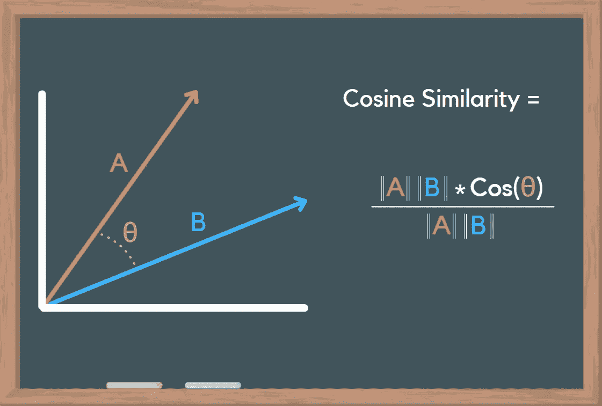
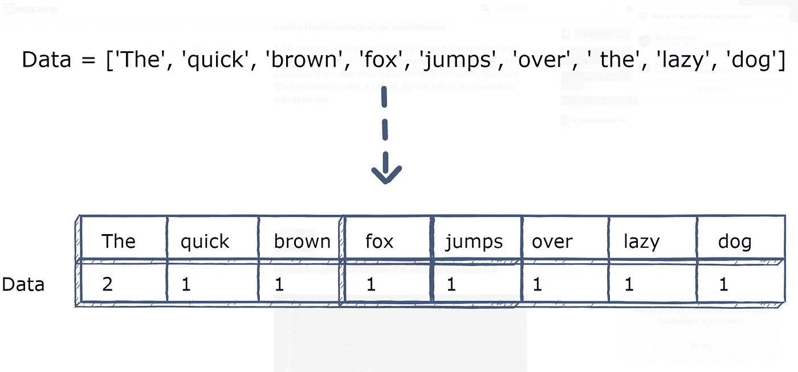
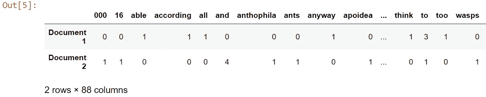
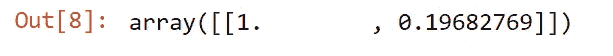
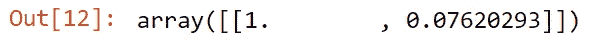
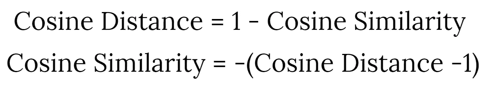
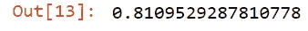
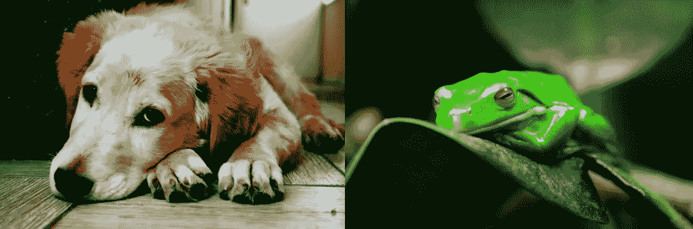
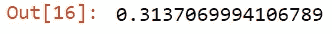

# 余弦相似度是什么？如何在 Python 中比较文本和图像

> 原文：<https://towardsdatascience.com/what-is-cosine-similarity-how-to-compare-text-and-images-in-python-d2bb6e411ef0>

## 机器学习的伟大工具

内森·杜姆劳在 [Unsplash](https://unsplash.com/s/photos/similar?utm_source=unsplash&utm_medium=referral&utm_content=creditCopyText) 上的照片

在构建机器学习应用程序时，计算相似性非常有用。如果您需要根据内容的相似程度对文档进行聚类，或者如果您正在构建一个模型来匹配图像，您将需要一种方法来确定哪些相似哪些不相似。使用数字数据很容易做到这一点，但是我们如何确定文档或图像的相似性呢？

**余弦相似度**是一种计算两个向量相似度的方法，取点积并除以每个向量的大小，如下图所示:

作者图片

使用 python，我们实际上可以将文本和图像转换成矢量，并应用同样的逻辑！Scikit-learn、PIL 和 Numpy 使这一过程更加简单。在本文中，我将通过几个例子展示如何使用余弦相似性，以及如何使用 python 计算余弦相似性。

**与文本数据的余弦相似度**

将文本转换为向量的过程在自然语言处理中非常常见。有许多不同的方法来矢量化文本，本文很好地解释了其中一些方法。每种方法都有优点和缺点，但它们本质上都实现了相同的结果:将文本转换成数字。

图片由 [Edpresso 团队](https://www.educative.io/profile/view/6547532599525376)在 [Educative.io](https://www.educative.io) 上拍摄

让我们在 python 中尝试一下——首先，我们需要加载我们的文本数据，并使用 sklearn 的文本计数矢量器来创建这个向量。对于这个例子，我想比较两个相似的段落，所以我将使用“蜜蜂”维基百科页面的第一段和蜜蜂电影的第一行。

作者 Jupyter 笔记本截图

现在我们已经得到了这些文本向量，我们可以使用一种叫做**术语频率逆文档频率** (TFIDF)的计算方法来比较每个文本向量的相似性和差异。我知道这听起来很混乱，但这基本上是一种衡量某个单词相对于文档中其他所有单词的独特性的方法。这是在 0-1 的范围内计算的，最常用的词接近 0，最独特的词接近 1。这是我们的 bee 文档的样子:

一旦我们有了这个数据框架，我们只需要运行余弦相似度函数，我们就会得到结果

作者 Jupyter 笔记本截图

这意味着根据余弦相似度，蜜蜂电影的第一行与“蜜蜂”维基百科页面的第一段只有 19%的相似度。乍一看，这似乎很低，但是让我们将第一个文档与其他文档进行比较，看看有什么不同。

作者 Jupyter 笔记本截图

这两个文档只有 7.6%的相似性，这是有道理的，因为单词“Bee”在第三个文档中甚至没有出现过一次。

对于较大的文档，这一过程可以很容易地放大，从而减少计算中的统计误差。如果两个 50 个单词的文档有 50%相似，这可能是因为一半的单词是“the”、“to”、“a”等。但是，当你在 1000 字的文档中有 50%的相似性时，你可能在处理剽窃。余弦相似度对于分析文本非常有用-作为一名数据科学家，您可以选择什么%被视为太相似或不够相似，并查看该临界值如何影响您的结果。

还有其他确定文本相似性的方法，如 [Jaccard 的索引](https://en.wikipedia.org/wiki/Jaccard_index)，这很方便，因为它没有考虑重复的单词。

**与图像的余弦相似度**

你大概能猜到，这个过程和上面那个很像。幸运的是，我们不必做所有的 NLP 的东西，我们只需要上传图像，并将其转换为 RGB 值的数组。多亏了 PIL 和 Numpy，这个过程非常简单！对于这个例子，我将比较两张狗的图片，然后比较一只狗和一只青蛙，以显示得分差异。

这是我将要比较的两张狗的照片:

左图由[布鲁诺塞尔韦拉](https://www.pexels.com/@bruzewalker)在[像素](https://www.pexels.com)上拍摄，右图由[凯文罗哈斯](https://www.pexels.com/@click-instant2021)在[像素](https://www.pexels.com)上拍摄

下面是我用来上传图片并将其转换成矢量的代码:

为了向您展示计算余弦相似性的另一种方法，我将使用 Scipy 和 spatial.distance 函数。余弦距离和余弦相似度的计算几乎相同，只有一个微小的差异。John R. Ladd 的这篇文章很好地解释了这种差异以及它们与欧氏距离的关系，但对于这个例子，我们需要知道的是

作者图片

现在我们知道了这一点，我们可以使用 Scipy 计算余弦距离，然后将其转换为余弦相似度。我是这样做的:

作者 Jupyter 笔记本截图

这意味着这些狗的照片有 81%相似，这是有道理的，只要看着它们，你就可以知道它们有基本相同的主题和调色板。如果我们拍一张完全不同的照片，并与第一张狗的照片进行比较，会怎么样呢？大概是这样的:

左图由[布鲁诺·塞尔韦拉](https://www.pexels.com/@bruzewalker)在[像素](https://www.pexels.com)上拍摄，右图由[格莱布·科罗夫科](https://www.pexels.com/@1138093)在[像素](https://www.pexels.com)上拍摄

作者 Jupyter 笔记本截图

正如所料，这两幅图像明显不如前两幅相似。30%仍然相对较高，但这可能是因为它们都在左上角有大面积的黑暗区域，以及一些小的颜色相似性。就像文本示例一样，您可以确定什么是“足够相似”的临界值，这使得余弦相似性非常适合聚类和其他排序方法。

也可以使用 HSL 值而不是 RGB，或者将图像转换为黑白，然后进行比较，这可能会产生更好的结果，具体取决于您正在处理的图像类型。无论你是想建立一个人脸检测算法，还是一个能从青蛙图像中准确分类狗图像的模型，余弦相似度都是一个方便的计算方法，可以真正改善你的结果！

**结论**

我希望这篇文章很好地介绍了余弦相似性以及使用它来比较数据的几种方法。作为数据科学家，我们有时会忘记数学的重要性，所以我相信学习一些理论并理解我们的代码如何以及为什么工作总是有好处的。希望你能从这些例子中得到一些概念，并制作出你自己的酷项目！

如果你有兴趣了解更多关于余弦相似性的知识，我强烈推荐[这段 youtube 视频](https://www.youtube.com/watch?v=m_CooIRM3UI&t=372s&ab_channel=codebasics)。或者如果你想了解更多关于自然语言过程的知识，你可以看看我的[关于情感分析的文章](/building-a-sentiment-analysis-model-using-yelp-reviews-and-ml-ensemble-methods-80e45db6d0c7)。我也很乐意在未来讨论更多类似的主题，如果您有兴趣了解更多关于某个函数、方法或概念的信息，请告诉我。

感谢您的阅读！

**想从我这里得到更多？**

1.  [在 Medium 上跟随我](https://bench-5.medium.com/)
2.  通过使用[我的推荐链接](https://bench-5.medium.com/membership)注册媒体来支持我的写作
3.  在 [LinkedIn](https://www.linkedin.com/in/benchamblee/) 和 [Twitter](https://twitter.com/Bench__5) 上与我联系