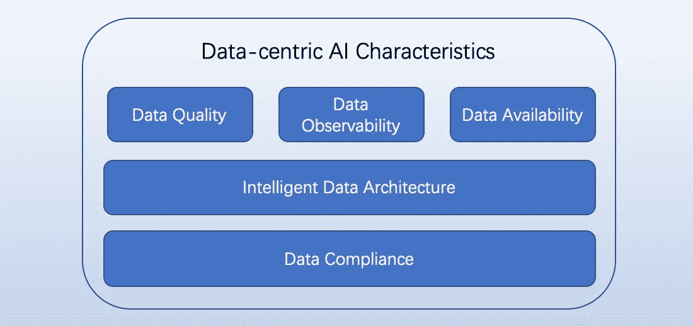

# 什么是以数据为中心的 AI 工程？

> 原文：<https://towardsdatascience.com/what-is-data-centric-ai-engineering-d29b3468062e>

## 重塑 MLOps 加速 AI 民主化

[真诚媒体](https://unsplash.com/@sincerelymedia?utm_source=unsplash&utm_medium=referral&utm_content=creditCopyText)在 [Unsplash](https://unsplash.com/images/sports?utm_source=unsplash&utm_medium=referral&utm_content=creditCopyText) 上拍摄的照片

人工智能/人工智能的过去十年是历史性的。随着机器感知的突破性里程碑和 AlphaGo 的梦幻般胜利，AGI(人工通用智能)和 SSL(自我监督学习)也上路了。普华永道预测，到 2030 年，人工智能将为全球经济贡献[15.7 万亿美元](https://www.forbes.com/lists/ai50/)。IDC 预测，到 2024 年，人工智能研究和应用投资将达到 5000 亿美元。

人工智能可以显著提高组织和个人的性能和可扩展性。人工智能的应用和民主化势在必行。运营 ML 自动化已经成为在生产中服务 AI 模型的良好实践。开源 [MLflow](https://mlflow.org) 和 [Kubeflow](https://www.kubeflow.org) 和亚马逊 [SageMaker](https://aws.amazon.com/sagemaker/) 是 ML 运营的领先工具。

## MLOps 够吗？

根据 [wiki](https://en.wikipedia.org/wiki/MLOps) 的说法，MLOps 是一套在生产中可靠有效地部署和维护 ML 模型的实践。MLOps 够吗？让我们重温一下人工智能的两个独特特征:

AI/ML 从 2016 年开始快速进化。我们对正在进行的人工智能里程碑感到兴奋，例如 DeepMind 的 AlphaFold 和 OpenAI 的 GPT-3 和 DALL E 2。此外，扬·斯托伊察指出，超大规模计算需求的增长速度几乎是著名的摩尔定律的 17.5 倍。这种快速增长要求人工智能运营成为可扩展的开放平台，这为运营自动化和人工智能应用更新带来了挑战。

此外，AI 应用吸引眼球。越来越多的企业开始采用人工智能来提高运营效率和实现数字化转型。但速度和能力成为许多组织在人工智能转型中的瓶颈。

因此 MLOps 对于 ML 部署和服务操作可能是足够的。协调从系统到数据生成、特性、模型、价值和业务的 ML 生命周期变得很困难。

## 人工智能民主化的挑战

将人工智能民主化对于推进人工智能并使其造福全人类至关重要。这项工作似乎是一项长期的任务，因为有五个已知的挑战。

1.  第一个挑战是如何分享新的算法和框架，并使它们在其他用例中可用。有两个细节:如何工程化这些算法，快速规模化；以及如何通过开源、商业 API 或其他方式提供专有建模。
2.  AI 民主化也意味着数据民主化，然后如何在治理下共享数据(包括数据安全和隐私)变得和模型共享一样重要。
3.  第三个是人工智能伦理，一个负责任的人工智能的考虑因素的广泛集合，包括安全、安保、人类关注和环境考虑。
4.  人工智能最近的胜利与释放其全部潜力相比相形见绌。下一个飞跃期待 AGI，自我监督学习和 RL。每个里程碑都具有挑战性和意义。
5.  最后，随着数据和模型的指数级增长，人工智能基础设施和平台对许多用户来说已经变得非常昂贵，尽管云解决方案可以缓解这一点。

## 什么是以数据为中心的 AI？为什么重要？

数据为[食品](https://www.deeplearning.ai/wp-content/uploads/2021/06/MLOps-From-Model-centric-to-Data-centric-AI.pdf)的 AI/ML。以数据为中心的人工智能是一个转折点，同时面临以模型为中心的挑战。以数据为中心的人工智能意味着以数据为中心的思维模式，有三种**数据实践:数据优先实践、智能数据架构和数据合规性。数据优先实践优先考虑数据质量、数据可用性和数据可观察性。**数据质量**可以用以下七个指标来衡量:**

1.  准确性:定义的准确数据
2.  一致性:引用和管道中定义相同的数据
3.  完整性:没有缺失的记录或值
4.  元数据:语义和可观察性的丰富数据
5.  及时性:最新的数据和及时的服务反馈
6.  相关性:满足要求的相关数据
7.  有效性:数据大小现在很重要

好的数据比只有大数据更重要。以数据为中心的人工智能源于 ML 建模和操作的数据质量。**数据可用性**表示 AI 实验、建模、训练和服务的数据就绪性 SLA(服务水平协议)。它在数据质量上不同于数据及时性，即保持数据本身(数据值)是最新的。云计算人员可能认为处理人工智能的数据可用性很简单。但是，如果你训练过一个超级大的模型，或者为一个大规模的模型提供特色服务，你就会改变主意。与处理 [S3](https://aws.amazon.com/s3/) 可用性相比，这是一个不同的世界。**数据可观察性**探索数据属性和模式，并提供对数据谱系、度量、统计和状态的可见性，然后可用于调试系统。

数据合规确保数据被正确用于 AI。它可以根据法规解决安全和隐私问题。可能对联邦学习有借鉴意义。

以数据为中心的人工智能解释(作者)

## 引入以数据为中心的人工智能工程

人工智能工程是一个开发和实践领域，旨在提高、操作和扩大人工智能/人工智能在生产中的规模。人工智能工程可以解决人工智能转型和人工智能民主化中的上述挑战。它是人工智能研究和应用之间的桥梁。从数据收集和特征工程到建模、培训、验证、服务和监控，它超越了 ML 运营自动化的 MLOps。它可以系统地解决数据质量、模型优化、用户有效性，以及工程学科的数据和模型治理。

智能数据架构可以用智能增强 AI 工程。在数据科学和模型训练之前，我们首先需要收集数据，进行预处理，并正确存储。AI/ML 过程包括许多步骤，从数据收集到特征工程、建模、训练、验证和服务。所有这些都依赖于数据平台和架构。高效的数据管道和有效的数据栈是 AI/ML 成功的关键。这需要一个用于数据工程的智能现代数据堆栈。

有了上面的阐述，以数据为中心的 AI 工程就是以数据为中心的 AI 的工程框架。它可以系统地编排人工智能的生命周期。并且可以用**三个工程级别**来描述:studio(或 IDE)、低代码/无代码、智能嵌入式。每一级都可以分为子级。例如，亚马逊 SageMaker Studio 支持笔记本/IDE、数据牧马人(用于功能工程)、自动驾驶(AutoML 功能)和 JumpStart(预构建的解决方案和预训练的模型)。Amazon SageMaker Canvas 就是一个低代码或者无代码 ML 服务的例子。从亚马逊 EML (Elastic ML)演变而来的 SageMaker 是一个领先的 MLOps 框架，但 AI 工程的旅程才刚刚开始。智能嵌入式是一个完全集成和管理的人工智能解决方案，其中智能是数据的一部分，无需明确的培训和服务。这可能意味着开箱即用的智能体验。所有这些级别都需要可靠、高效和可扩展，尽管它们可能处于不同的操作自动化程度，并且关注不同的用户。

## TL；速度三角形定位法(dead reckoning)

以数据为中心的人工智能工程是人工智能转型的有效解决方案，可以推动人工智能民主化。针对 AI 成熟度模型在组织中开发和应用人工智能也是一个很好的实践。

**想了解更多以数据为中心的人工智能工程吗？关注我或在 LinkedIn 上联系** [**【陆晖】胡**](https://www.linkedin.com/in/luhui) **。**

## 额外资源

1.  吴恩达，MLOps:从以模型为中心到以数据为中心的人工智能:[https://www . deep learning . AI/WP-content/uploads/2021/06/MLOps-From-Model-centric-to-Data-centric-AI . pdf](https://www.deeplearning.ai/wp-content/uploads/2021/06/MLOps-From-Model-centric-to-Data-centric-AI.pdf)
2.  使用 TensorFlow 和 Amazon SageMaker 创建、训练和部署万亿字节数据的十亿参数语言模型:[https://AWS . Amazon . com/blogs/machine-learning/create-train-and-deploy-a-billion-parameter-language-model-on-terabytes-of-data with-tensor flow-and-Amazon-SageMaker/](https://aws.amazon.com/blogs/machine-learning/create-train-and-deploy-a-billion-parameter-language-model-on-terabytes-of-data-with-tensorflow-and-amazon-sagemaker/)