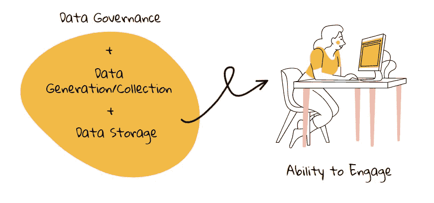
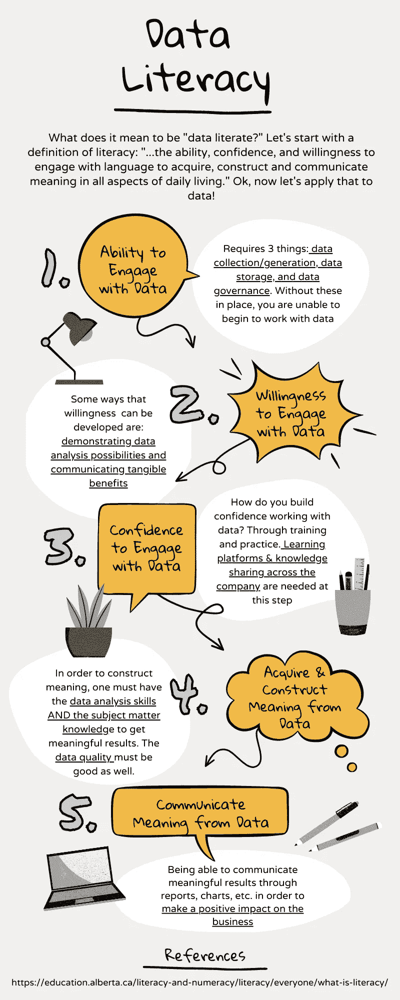

# 什么是数据素养？

> 原文：<https://towardsdatascience.com/what-is-data-literacy-9b5c3032216f>

# 什么是数据素养？

## …为什么它很重要？

数据素养是一个很难界定的术语。它可以用来包含太多的东西，因此它可能会失去意义——如果它是所有与数据相关的东西，那么这个术语就没有什么帮助了。

在 [canva](http://www.canva.com) 上创建的图形

我认为定义数据素养的最佳方式是从素养的定义开始，然后将其应用于数据世界。这有助于我理解这个话题，因为一般读写能力是我更熟悉的一个概念。艾伯塔教育部将识字定义为:

> “… *在日常生活的各个方面，运用语言获取、构建和交流意义的能力、信心和意愿。*[【1】](https://education.alberta.ca/literacy-and-numeracy/literacy/everyone/what-is-literacy/)

在本文中，我将解构这句话，并将它的每一部分应用于数据，以便对“什么是数据素养？”这个问题给出一个全面的答案

## 1.处理数据的能力

能够在学校或组织中处理数据(至少)需要什么？

首先，数据必须存在。这可能像 Excel 电子表格一样简单，也可能像包含数百个数据库的基于云的数据湖一样复杂。不管来源是什么，它一定是以某种方式收集或生成的。

理想情况下，还会有围绕数据存储和检索的治理。这使得数据是可靠的，并且最终用户在处理数据时有信心。

在 [canva](http://www.canva.com) 上创建的图形

因此，在一个人成为组织中的“数据素养”之前，这三个要素是必需的:数据收集/生成、数据存储系统和数据治理。回到我们的比喻，这类似于说我们需要首先有一种语言和有组织的系统(如字典)来存储我们的语言，然后人们才能识字。

## 2.愿意与数据打交道

在成为“数据专家”之前，他们必须看到执行数据分析的价值。如果对他们来说没有价值，那么他们为什么愿意走这条学习之路呢？

对我来说，有很多方法可以鼓励与数据的互动。我心目中最大的两个是 1。展示数据分析的可能性；2 .传达拥有数据进行决策的切实好处。

当我看到用数据讲述故事的酷酷的 Tableau 仪表盘时，它激励我努力提高自己的技能，这样我就能创造出更有用、更有趣的视觉效果。它也可以挑战我对数据和数据软件的先入之见。

再举一个例子:如果你从事金融行业，我告诉你，利用你现有的数据创建一个更好的预测方法可以让你的底线提高 __%,你为什么不愿意试一试呢？听到成功案例和有积极成果的案例研究肯定会增加整个组织使用数据的意愿。

## 3.处理数据的信心

在 [canva](http://www.canva.com) 上创建的图形

大多数技能都需要训练和实践来培养自信，数据技能也不例外。为了让组织中的员工掌握数据知识，必须提供培训和学习机会。

我喜欢在我现在的公司 Stanley Black & Decker，我有足够的机会学习和实践新的软件和概念。这无疑增加了我在日常工作中处理数据的信心(和能力)。

我不指望任何人不练习和向他人学习就能成为有文化的人。事情不是这样的——就像睡在你的数学课本上不会通过渗透或其他方式增加你的数学知识。

## 4.从数据中获取和构建意义

好了，现在我们开始说正经事了。

从数据中构建意义是一个巨大的飞跃——就像从知道西班牙语词汇到能够构建一个连贯的句子。这比拥有您需要的数据、工具和技能更进了一步。这需要真正理解数据及其含义。

为了在数据中找到意义，你需要专业知识来了解数字告诉你什么(以及期望值是什么)。通常，这包括与公司中“最接近”数据的人会面。虽然他们可能不知道如何建立一个仪表板，但他们可以告诉你数据的含义和它应该是什么样子。然后，你必须利用这些知识来指导你分析过程的每一步，以确保你得到一个有意义的结果。

## 5.从数据中传达意义

在 [canva](http://www.canva.com) 上创建的图形

在数据扫盲之旅的最后一步，您能够将数字“告诉”您的内容告诉其他人。这包括了解您的受众，并能够与报告和仪表板简洁地交流。

与我们的识字概念相比，最后一步是从写下一个有意义的句子到对另一个人说一个句子，记住他们的理解能力(即，他们是否和你说同样的俚语，你是否给了他们足够的语境来理解你的观点，等等)。)

同样，如果是给高管和销售经理的，你会设计出不同的报告。为了传达你的结果，你必须考虑他们已经知道什么和他们想知道什么(以及他们可能想要多少细节)。

从数据分析实践中传达有意义的结果是让企业走出去并真正做出改变的原因。这是推动持续改进的动力，也是数据分析/数据科学团队对公司有价值的原因。

## 信息图表摘要

为了使我的交流更简洁，这里有一张信息图，是这篇文章的摘要！我希望这对您的组织或您个人的学习有所帮助。

在 [canva](http://www.canva.com) 上创建的图形