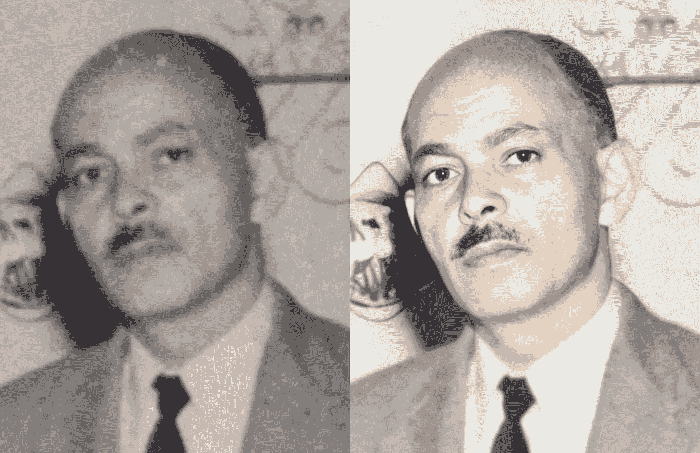
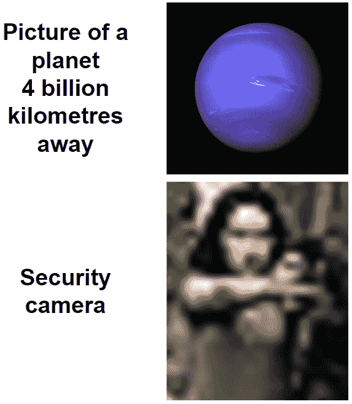
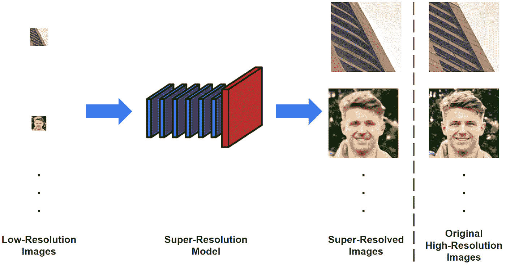
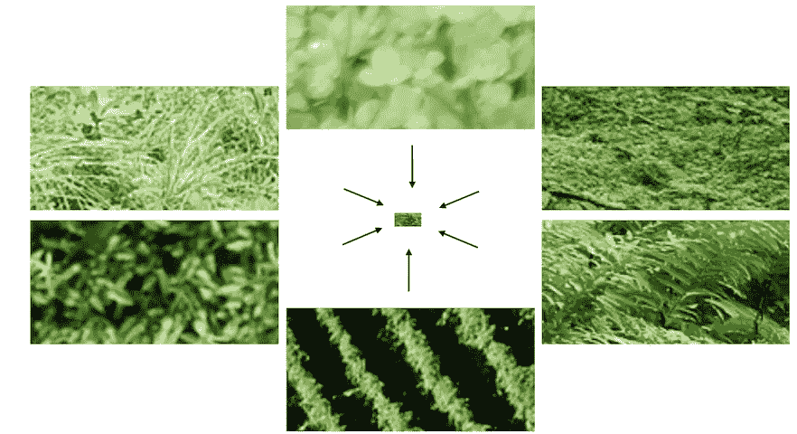
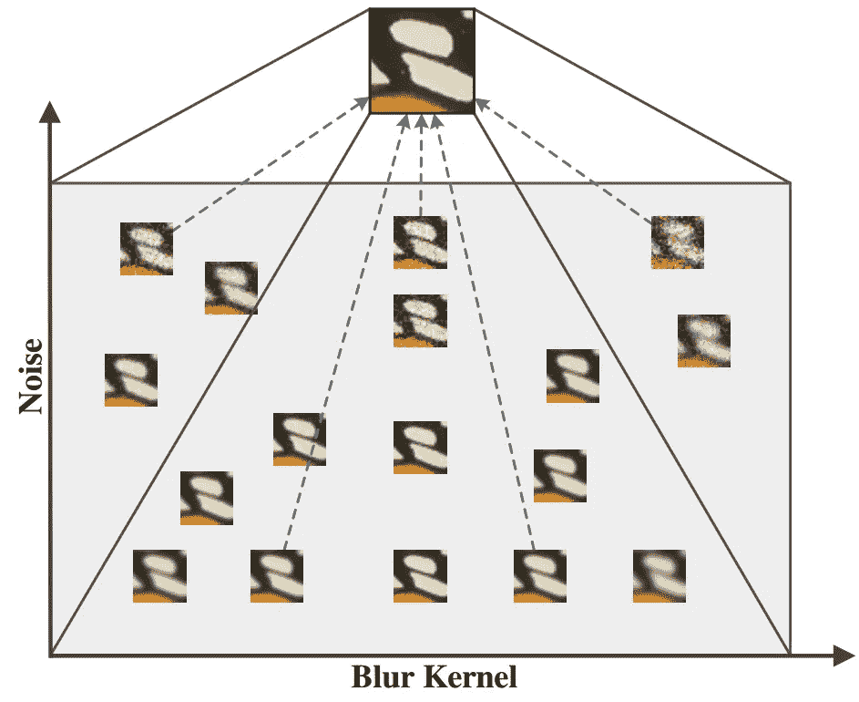
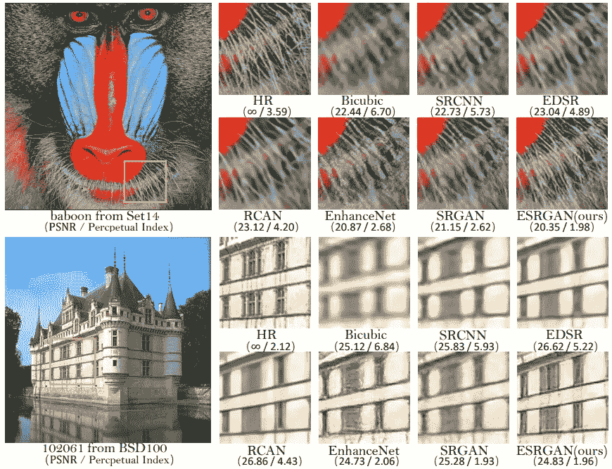
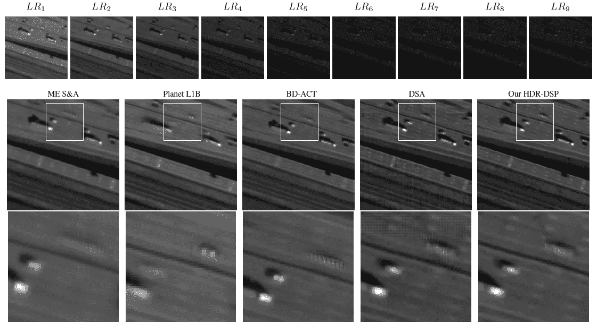
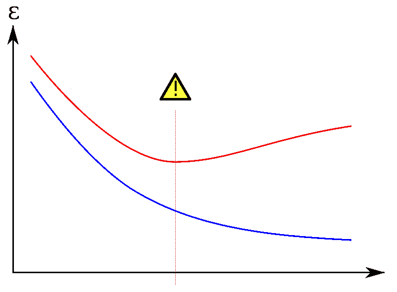

# 什么是“图像超分辨率”，我们为什么需要它？

> 原文：<https://towardsdatascience.com/what-is-image-super-resolution-and-why-do-we-need-it-9c3bd9dc233e>

## 对该领域、其应用和当前问题的介绍

你有没有见过旧的单色图片(通常是灰度)有几个人工制品，然后被彩色化，看起来好像是最近用现代相机拍摄的？这是*图像恢复*的一个例子，它可以更一般地定义为在给定损坏图像的情况下检索基础高质量原始图像的过程。

图像恢复的例子，包括着色和去除诸如噪声和模糊之类的伪影。图片来自[维基媒体](https://commons.wikimedia.org/wiki/File:Restoration_using_Artificial_intelligence.jpg)

许多因素会影响图像的质量，最常见的是次优的拍摄条件(例如，由于运动模糊、照明条件差)、镜头属性(例如，噪声、模糊、镜头眩光)和后处理伪影(例如，有损压缩方案，即以不可逆的方式执行压缩从而导致信息丢失的方法)。

另一个影响图像质量的因素是分辨率。更具体地说，低分辨率(LR)图像包含少量表示感兴趣对象的像素，这使得很难分辨出细节。这可能是因为图像本身很小，或者是因为物体远离相机，从而导致它在图像中占据很小的区域。超分辨率(SR)是人工智能(AI)的一个分支，旨在解决这个问题，由此给定的 LR 图像可以被放大以检索具有更高分辨率的图像，从而获得更可辨别的细节，然后可以用于下游任务，如对象分类、人脸识别等。LR 图像的来源包括可能输出低质量图像的摄像机，如移动电话和监控摄像机。

一个模因强调了一个讽刺，即能够捕捉数十亿公里外的行星的高质量图像，而在地球上拍摄照片，而距离相机仅几米远的物体几乎无法分辨。图片作者，灵感来自[对](https://www.facebook.com/people/Sarcasm/100047415961281/)[脸书](https://www.facebook.com/SarcasmLol/photos/a.1533243200337792/5774207709574632/?type=3)的讽刺。由 [NASA](https://unsplash.com/@nasa?utm_source=unsplash&utm_medium=referral&utm_content=creditCopyText) 在 [Unsplash](https://unsplash.com/?utm_source=unsplash&utm_medium=referral&utm_content=creditCopyText) 拍摄的海王星照片，由 [Vitaliy Izonin](https://www.pexels.com/@vitaliy-izonin-2479301/) 在 [Pexels](https://www.pexels.com/photo/a-woman-in-gray-shirt-holding-a-gun-11709382/) 拍摄的持枪者照片。

在本文的其余部分，将讨论以下内容:

1.  那么为什么不使用更好的相机呢？
2.  不是已经有了可以放大图像的工具吗？
3.  [基于深度学习的图像超分辨率](#0bfc)
4.  我们如何检查超分辨率方法是否有效？
5.  如何获得用于训练和评估超分辨率方法的低分辨率图像？
6.  [超分辨率的应用](#a951)
7.  [道德考量](#67a6)
8.  可以做些什么来消除这些担忧？
9.  [结论](#41ce)

# 那么为什么不用更好的相机呢？

在这一点上，你可能会问自己“为什么我们不使用质量更好的相机，而不是去开发可以给我们同样结果的算法？”

这是一个很好的观点，但确实存在实际的考虑。例如，虽然现代移动电话相机确实捕捉相当好质量的图像，但是它们仍然产生几个缺陷，主要是由于需要使用足够紧凑以适合电话而不使其太笨重的镜头和图像传感器，同时还相对便宜。

就闭路电视而言，不难理解的是，摄像机的成本通常会随着质量的提高而增加，而质量更高的镜头也需要更多的存储空间(除非使用激进的压缩方案来显著降低图像质量，从而使高质量摄像机的使用变得毫无意义)，从而导致额外的成本。这对于需要几十个、几百个、甚至几千个摄像机的建筑尤其重要；在这种规模下，任何成本都会成倍增加，并可能导致这种系统缺乏吸引力，以至于不能完全安装，从而危及安全性。

最后——也许是最明显的——已经存在大量用低质量相机拍摄的图像，这些图像可能包含重要信息。因此，至少，我们需要一种方法来提高这些现有图像的质量。

# 不是已经有可以放大图像的工具了吗？

你也可能会问自己“但是我们不能用基本的图像编辑软件程序，比如微软画图，来增加图像的尺寸吗”？

事实上，诸如双线性插值和双三次插值之类的插值方法通常是许多应用程序中的首选工具，包括通常使用双线性插值的 web 浏览器。然而，这些算法相对简单，速度很快，从而满足了用户对软件程序快速反应的要求，但却不能产生高保真图像。事实上，合成的图像往往包含大量的像素，实际上并没有使它更容易辨别细节。

提高分辨率意味着增加像素数量，这也意味着需要以某种方式推断缺失的信息。这可能是插值等简单技术无法产生令人满意的结果的主要原因，因为它们没有利用从查看其他类似样本中获得的任何知识来学习如何推断缺失的数据并创建高质量的图像，而这正是 SR 方法的设计目的。

超分辨率任务概述:给定低分辨率图像，超分辨率网络的任务是提高图像质量，以产生超分辨率图像。这些图像可以描绘任何东西，从建筑物到人脸，到卫星图像等等。为了进行比较，展示了原始的高分辨率图像，上面的照片由[索拉萨克](https://unsplash.com/@boontohhgraphy?utm_source=unsplash&utm_medium=referral&utm_content=creditCopyText)在 [Unsplash](https://unsplash.com/s/photos/building?utm_source=unsplash&utm_medium=referral&utm_content=creditCopyText) 拍摄，下面的照片由[拉尔斯·博·尼尔森](https://unsplash.com/es/@lbnielsen?utm_source=unsplash&utm_medium=referral&utm_content=creditCopyText)在 [Unsplash](https://unsplash.com/?utm_source=unsplash&utm_medium=referral&utm_content=creditCopyText) 拍摄。作者创作的低分辨率和超分辨率图像。

新信息的产生也意味着 SR 任务是一个重要的不适定问题，因为有多种方法来超分辨图像。换句话说，对于任何给定的 LR 图像，可能存在几个似是而非的图像。在存在上述进一步降低图像质量的其他因素的情况下，该问题变得更加复杂，其中传感器噪声、模糊和压缩是最常见的。尽管如此，大多数方法只输出单一的超分辨率图像，尽管[最近的一系列研究](https://doi.org/10.1109/CVPRW53098.2021.00072)也在探索为给定的 LR 图像生成多个似是而非的图像的方法。

超分辨率的问题:[许多高分辨率图像可以降采样为单个低分辨率图像](https://openaccess.thecvf.com/content/CVPR2021W/NTIRE/html/Lugmayr_NTIRE_2021_Learning_the_Super-Resolution_Space_Challenge_CVPRW_2021_paper.html) …

…相反地，[单幅 LR 图像可以超分辨为多幅 HR 图像](https://arxiv.org/abs/1712.06116)

# 基于深度学习的图像超分辨率

研究人员长期以来一直在开发允许使用各种技术(例如基于稀疏表示的方法)来检索底层高质量图像的方法。然而，可以说是深度学习和卷积神经网络的出现带来了最重大的飞跃，开创性的工作是董*等人*在 2014 年提出的[超分辨率卷积神经网络(SRCNN)](https://doi.org/10.1007/978-3-319-10593-2_13) 。从那以后，人们不仅在神经网络的设计和结构方面，而且在用于训练和评估这些网络的数据方面做了大量的工作。

各种 SR 方法产生的结果的例子，包括简单的双三次插值和被认为是第一个基于深度卷积神经网络的 SRCNN 方法。图片来源于[王*等* (2018)提出 ESRGAN 的论文](https://arxiv.org/abs/1809.00219)。

众所周知，基于深度学习的方法需要大量的数据来进行稳健的训练，通常需要在*监督*设置中的地面实况，以便模型知道最终目标是什么。在 SR 的情况下，这意味着具有原始高分辨率图像和低分辨率图像；然而，在现实世界中很难获得这样的图像对——通常一张照片要么是高分辨率的，要么是低分辨率的，并且它们不能同时被捕获。

虽然可以使用不同的相机设置或不同的相机来捕捉两个图像(一个捕捉高质量的图像，另一个捕捉低质量的图像)，但实际上这并不是一项容易的任务，因为图像理想地需要具有相同的内容。这避免了增加额外的复杂性，这可能使网络更难训练。例如，一个捕获和另一个捕获之间的场景可能存在差异，例如移动的车辆或鸟，而图像不太可能彼此完全对齐。

# 我们如何检验超分辨率方法是否有用？

训练和评估 SR 方法时的图像质量通常使用客观度量来判断，例如[峰值信噪比(PSNR)](https://en.wikipedia.org/wiki/Peak_signal-to-noise_ratio) 和[结构相似性指数(SSIM)](https://doi.org/10.1109/TIP.2003.819861) ，它们被称为全参考图像质量评估(FR-IQA)度量。

虽然对这些方法的详细解释超出了本文的范围，但足以说明的是，FR-IQA 算法通常试图通过计算高分辨率图像中的像素与待评估图像中的对应像素之间的差异来产生与人类主观质量感知相关的质量评级，并因此假设图像完全对准；因此，即使是垂直或水平方向上最小的偏移也可能造成严重破坏，并导致指标显示所评估的图像质量差，即使它实际上与高分辨率图像相同。这就是为什么要比较的图像彼此完全对齐很重要的主要原因。

虽然确实存在仅使用待评估的图像(即，不将其与高分辨率对应物进行比较)来预测主观质量的无参考(NR-IQA)度量，例如 [BRISQUE](https://doi.org/10.1109/TIP.2012.2214050) 和 [NIQE](https://doi.org/10.1109/LSP.2012.2227726) ，但是这些度量往往是不可微分的，因此不能在神经网络的训练期间使用。然而，在已开发的 SR 方法的评估过程中，这种度量被更频繁地使用。

# 如何获得用于训练和评估超分辨率方法的低分辨率图像？

为了解决上述问题，通常使用*退化模型*对高分辨率图像进行综合退化，定义要应用于数据集中的图像的伪影的类型和大小，以便产生相应的合成低分辨率图像。由于降质图像是直接从高分辨率图像中获取的，因此这些图像对被完美地对齐，并且可以结合 FR-IQA 度量用于训练和评估。

然而，这样的图像可能并不真正代表真实世界的图像，因此在合成图像上训练的模型在真实世界的应用中往往会崩溃。因此，也有一些努力，例如[“零拍摄”SR (ZSSR)](https://doi.org/10.1109/CVPR.2018.00329) 方法，该方法试图在*自监督*设置中避免使用低/高分辨率图像对，其利用的观察结果是图像往往在不同的尺度和位置具有重复出现的模式。这允许仅在低分辨率图像上训练算法。然而，有人认为不是所有的图像都符合这种假设(例如，图像具有大量不同的内容，或者相反，具有大量一致的区域)，导致这种类型的方法不适用于这种图像。

# 超分辨率的应用

超分辨率方法可以应用于几乎任何类型的图像内容，无论是自然场景、建筑物，甚至是动画图像。为这些内容类型设计的超分辨率方法通常更多地针对娱乐行业，例如通过改善图像质量来改善最终用户体验，从而使观看体验更加愉悦。

还存在更多针对安全和执法的应用，例如人脸图像的超分辨率、车辆牌照和多光谱卫星图像等。

9 幅 SkySat 图像的真实多重曝光序列的超分辨率；具有不同曝光的原始低分辨率图像显示在顶部，使用五种不同方法的结果显示在中间一行。最后一行显示了对图像特定区域的详细观察。图片来自 [Nguyen 等人(2022)](https://arxiv.org/pdf/2205.02031.pdf)

到目前为止，上述方法已经被假定为一次对一幅图像进行操作，因此它们被称为单幅图像 SR (SISR)方法。然而，也可以对视频序列中的图像(在这里它们被称为“帧”)执行 SR，除了空间信息(即图像内容)之外，还允许利用时间信息(即跨时间的信息)。当与仅使用单个图像相比时，附加信息应该能够实现更好的结果。

总之，给定一个低质量的图像——无论来源如何——可以设计和实现能够提高图像质量的方法，以便产生更清晰的细节和更有用的信息。

# 道德考量

在大多数应用中，需要考虑伦理问题。这与图像超分辨率特别相关，因为整个图像基本上是由机器生成的。

如果没有约束，超分辨率模型理论上可以生成与原始图像毫无关系的图像。虽然这听起来有点牵强，但这实际上是一些方法的问题，尤其是那些基于[生成对抗网络(GANs)](https://en.wikipedia.org/wiki/Generative_adversarial_network) 的方法。

基于 GAN 的方法通常被训练为通过使用*鉴别器*来优先生成永久令人满意的图像，该鉴别器被训练为区分“真实”图像和“虚假”图像。它的目的是驱动*发生器*(负责创建图像的网络的一部分)产生更逼真的图像，这些图像能够欺骗鉴别器，使其认为这些图像是真实的照片。然而，这可能以损失一些对原始图像内容的保真度为代价，尤其是如果要超分辨率的图像质量特别差的话。

这一特性实际上是某些应用程序所需要的，比如使用[语义分割遮罩](https://arxiv.org/abs/1903.07291)或文本描述的图像合成，就像流行的 [DALLE 2](https://openai.com/dall-e-2/) 系统所做的那样。

然而，有些应用需要更多的关注，例如安全和执法。当超分辨率图像或视频包含识别犯罪者的潜在有用信息时，产生原始图像中不存在的信息是不可接受的。例如，汽车牌照的超分辨率不能产生实际上不在犯罪现场附近的车辆的信息。

当涉及到人的时候，这一点可能更加重要。具体来说，算法不能输出不在场景中的人的面部。在这些情况下，至关重要的是，所采用的任何方法都必须能够保留主体的身份，以确保嫌疑人被绳之以法，同时避免身份的改变，以免错误的人被错误地指控和定罪——而实际的罪犯仍然逍遥法外。

法院的程序也是如此，一个案件可能会因使用超分辨率图像而受到损害，在这种情况下，可以推断出无关的信息。即使正确的罪犯受到审判，任何对不利于罪犯的证据的怀疑都可能导致他们被释放。因此，这些方法的稳健性至关重要，不仅可以确保公平审判，还可以避免指控错误的人，避免根据错误信息进行调查的风险。

超分辨率图像出现的方式——以及以可能不好看为代价创建忠实于原始内容的图像，或者创建看起来令人愉快但可能包含与原始图像中描述的不同细节的图像之间的平衡——在很大程度上由所谓的*损失函数*控制。

损失函数本质上是在神经网络被训练时评估它们的输出，并且一次可以使用多个。事实上，损失函数的选择是 GANs 问题的一部分，其中一个函数倾向于测量生成图像的真实性。用更专业的术语来说，假设 GAN 本质上重新创建了概率分布，那么损失函数确定了生成的分布和正在建模的真实数据的分布之间的差异。

然而，这种损失函数不能单独使用，这是由于神经网络可能采取简单的方式，生成看起来很好但与原始图像没有相似之处的图像。因此，也采用测量像素级差异的函数(典型地使用[均方误差(MSE)](https://en.wikipedia.org/wiki/Mean_squared_error) 和密切相关的[峰值信噪比(PSNR)](https://en.wikipedia.org/wiki/Peak_signal-to-noise_ratio) )，试图约束模型的输出至少与原始图像相似。

然后由模型的设计者决定如何使用损失项的权重，这取决于预期的应用。因此，仍然可能的是，更多的重要性被给予在感觉上令人愉快的内容，而不是对原始内容的忠实再现。

大多数超分辨率方法采用至少一个基于像素的损失，以防止明显的属性，如皮肤或头发颜色发生剧烈变化。然而，眼睛颜色等较小的细节很容易在退化过程中丢失，然后由超分辨率算法来确定要使用的颜色。因此，这将受到训练集中受试者眼睛颜色分布的很大影响。

然而，也有人研究设计超分辨率模型，不仅处理低分辨率图像，而且[利用图像](https://basurafernando.github.io/papers/XinYuCVPR18.pdf)中描绘的人的*属性*。这有可能通过消除在没有任何信息的情况下需要使用的一些猜测工作来提高超分辨率算法的鲁棒性。

执法人员已经要求目击者描述一些特征，比如这个人的性别、年龄、有无胡须等等。这些照片有时被用来制作法医素描，这些素描可以向公众传播，这样任何认出素描中描绘的嫌疑人的人都可以提供导致逮捕的信息。

人们还创造了一些方法，通过将草图与现实世界的照片进行比较，自动确定草图中描绘的对象的身份，这些方法适用于各种草图类型，例如使用[软件程序](https://www.researchgate.net/publication/322141089_Matching_Software-Generated_Sketches_to_Face_Photos_with_a_Very_Deep_CNN_Morphed_Faces_and_Transfer_Learning)获得的草图和由法医艺术家手绘的用于现实世界调查的草图。

这些属性也可以用作辅助信息，以帮助指导超分辨率模型产生更能代表实际高分辨率图像的图像。

但是如果提供了错误的属性会发生什么呢？至少在[于*等人* (2018)](https://basurafernando.github.io/papers/XinYuCVPR18.pdf) 的作品中，这种效果通常相当微妙，其中属性的变化更多地是为了微调最终结果。也就是说，性别等一些属性会导致明显不同的结果，如图[于*等* (2018)](https://basurafernando.github.io/papers/XinYuCVPR18.pdf) 图 4 所示。因此，必须小心确保不提供错误的属性，或者至少记住属性可能是不正确的，因此在解释超分辨率图像时最终结果可能受到负面影响。

然而，调整属性的能力允许创建多个图像(与仅生成一个图像的大多数超分辨率方法相反)，因此当确切属性未知或不确定时，通过产生多个似是而非的例子而不是一个图像，实际上可以允许更大的鲁棒性。

用来训练模型的*数据*呢？对超分辨率模型的性能有什么影响？众所周知，基于深度学习的方法需要大量的数据来避免诸如 [*过度拟合*](/overfitting-vs-underfitting-a-conceptual-explanation-d94ee20ca7f9) 之类的影响，其中模型调整其参数的方式使得它在训练数据上工作得非常好，但在对看不见的数据进行测试时却崩溃了。因此，用于训练这些模型的数据越多，这种风险就越低。

过度拟合的示例，训练错误显示为蓝色，验证集错误显示为红色。这两个误差都是训练周期数的函数。当验证集的误差开始增加，而训练集的误差继续减小时，模型很可能过度拟合。图片由[维基共享资源](https://commons.wikimedia.org/wiki/File:Overfitting_svg.svg)上的[大可~commonswiki](https://commons.wikimedia.org/wiki/User:Dake~commonswiki) 拍摄。

另一个问题是如何选择各种 [*超参数*](https://en.wikipedia.org/wiki/Hyperparameter_(machine_learning)) 。超参数控制着网络的训练方式，因此仔细调整它们非常重要。具体来说，数据集中的数据通常分为三个部分:一个*训练*集、一个*验证*集和一个*测试*集。

顾名思义，训练集用于训练模型，而测试集仅用于评估模型在从未见过的数据上的性能。这有助于确定模型的通用性，以及是否出现过拟合等现象。

同时，验证集包含用于在训练时评估模型性能的数据。因此，在训练模型时，它可以被视为代表一个测试集。应该在这个集合上调整参数，以防止性能偏向于训练集合中的数据(这可能不会使模型具有通用性)，并且还防止性能根据测试数据进行调整(测试数据为我们提供了关于看不见的数据的真实世界性能的指示，因此它仅用于评估目的是至关重要的；否则，实际应用程序的性能可能会比预期的差)。

另一个主要问题涉及数据中各种属性和组的表示(在数量方面)的任何差异，通常称为 [*类别不平衡*](/handling-imbalanced-datasets-in-machine-learning-7a0e84220f28) 。在人脸超分辨率的情况下，这些属性的范围可以从每个对象的图像数量到属于特定人口统计组的对象数量。例如，许多数据集往往比任何其他人口统计数据包含更多的“白人”，这可能导致模型在这些图像上表现良好，但在代表性不足的类上表现不佳。

虽然在超分辨率领域中没有很好地研究这些效应(特别是在客观性能度量方面)，但是当更详细地研究超分辨率图像时，可以进行一些观察。如上所述，眼睛颜色的潜在差异就是这样一种观察结果。还观察到，如果在包含涂有口红的许多女性对象的数据集上训练该模型，并且该模型确定该对象是女性，则男性的嘴唇可能看起来有口红。受试者的年龄也可能受到训练数据集中年轻受试者与年长受试者的比例的影响；例如，如果数据集主要包含年轻的主题，模型可能会使主题看起来更年轻(这不一定总是坏事……)。

在其他领域中也进行了工作来抵消由给定数据集中的类别不平衡引起的问题。例如， [*数据扩充*](https://en.wikipedia.org/wiki/Data_augmentation) 常被用作人为增加数据使用量的手段。此外，用于确定模型稳健性的函数也可以进行调整，以适应任何类别失衡。“平衡数据集”如 [FairFace](https://github.com/joojs/fairface) 和[野外平衡脸(BFW)](https://github.com/visionjo/facerec-bias-bfw) ，其中人口统计组由相同数量的受试者代表，也已经被创建，因此可以帮助确保任何由阶级代表差异引起的偏见几乎被消除。

# 可以做些什么来消除这些担忧呢？

有几种方法可以用来避免为特别敏感的应用程序生成错误信息。前一节已经给出了一些可能的解决方案，但现在还将考虑一些其他方法。

也许防止产生错误数据的最明显的方法之一是在这样的应用中避免使用 GANs。虽然它们确实倾向于产生看起来相当真实的图像，但是如果其中的信息不正确，它们将毫无用处。因此，更传统的基于 CNN 的方法可能更合适。然而，如果在这种架构中使用 [*感知损失*](/perceptual-losses-for-image-restoration-dd3c9de4113) ，则必须小心，这也旨在使图像看起来更有吸引力。

另一个相当明显的方法是使用专门为手头的任务训练和开发的模型。例如，如果任务是超分辨率人脸图像，那么使用在普通场景上训练的模型不能期望产生可靠的结果。

如上所述，*损失/损失函数*的选择也很关键。应该使用测量像素级差异的损失来帮助确保超分辨率结果在纹理、结构和颜色方面与原始高分辨率图像中的内容有很大的相似性。

可以考虑的另一种方法是使用更大量的训练数据。众所周知，基于深度学习的模型往往需要大量的数据来避免诸如[过拟合](https://en.wikipedia.org/wiki/Overfitting)之类的问题，但使用更多样化的数据也可以帮助网络学习更多的可能性，如如何超解析图像，并在对其训练集之外的图像(即，对其没有遇到的图像)进行操作时使其更加鲁棒。

如前所述，[最近的一系列研究](https://doi.org/10.1109/CVPRW53098.2021.00072)正在探索开发超分辨率方法的途径，这些方法能够预测看似合理的超分辨率图像的空间，因为信息的丢失实际上意味着多个图像可能会被降级以产生相同的低质量图像。这意味着，不是像通常那样只生成一个图像，而是可以输出多个图像。图像之间的差异将降低仅基于一个潜在错误结果得出任何结论的风险。

能够使用补充信息的模型也可以用于产生具有不同细节的一系列图像(而不仅仅是单个图像)，例如在上面提到的[于*等人* (2018)](https://basurafernando.github.io/papers/XinYuCVPR18.pdf) 的工作中，其可以使用描述人脸的属性来实现人脸超分辨率。

属性不需要仅仅与图像内容相关，但是它们也可以描述图像中的退化。例如，已经设计了一些方法来[将这些信息整合到现有的基于深度学习的方法](https://arxiv.org/abs/2110.14638)中，以帮助指导超分辨率模型逆转影响图像的退化，并产生更好的图像。

退化信息可以输入到现有的基于深度学习的图像超分辨率模型中，例如使用[元注意块](https://arxiv.org/abs/2110.14638)

最后，可以考虑原始图像的质量水平。例如，如果质量太低(如上所述，可以使用 IQA 度量主观地或客观地确定)，则图像可以被直接丢弃。然而，考虑到要处理的数据量可能有限，丢弃有限的可用数据可能是不可取的。在这种情况下，图像仍然可能是超分辨率的，但需要记住的是，结果可能不完全可信。

# 结论

我希望这篇文章让您了解了超分辨率领域，这个领域已经变得非常广阔，有大量的方法可以应用于几乎任何类型的低质量图像，如人脸图像、汽车牌照、卫星图像和旧照片，有许多应用程序，包括安全和执法等重要领域。

然而，软件无线电还不是一个已经解决的问题(与你在电影和电视剧中所相信的相反)，仍然有许多挑战需要解决。在下一篇文章的[中，我将更深入地研究现代软件无线电方法中使用的各种技术，以及剩余的挑战和未来工作的方向。](/image-super-resolution-an-overview-of-the-current-state-of-research-94294a77ed5a)

*你对这篇文章有什么想法吗？欢迎直接在* [*LinkedIn*](https://www.linkedin.com/in/cgalea) 上留言、评论或给我发消息！

*此外，确保* [***关注***](https://medium.com/m/signin?actionUrl=https%3A%2F%2Fmedium.com%2F_%2Fsubscribe%2Fuser%2Fa9be78db0c9b&operation=register&redirect=https%3A%2F%2Ftowardsdatascience.com%2Fwhat-is-image-super-resolution-and-why-do-we-need-it-9c3bd9dc233e&user=Christian+Galea&userId=a9be78db0c9b&source=post_page-a9be78db0c9b--three_column_layout_sidebar-----------------------follow_profile-----------) *me，以确保您在未来文章发表时得到通知。*

*作者目前是马耳他大学***的博士后研究员*[*Deep-FIR*](https://www.um.edu.mt/projects/deep-fir/)*项目，该项目是与* [*Ascent 软件*](https://www.ascent.io) *合作完成的，由马耳他科学委员会&技术(MCST)资助，代表科学基金会&技术，通过 FUSION: R &**