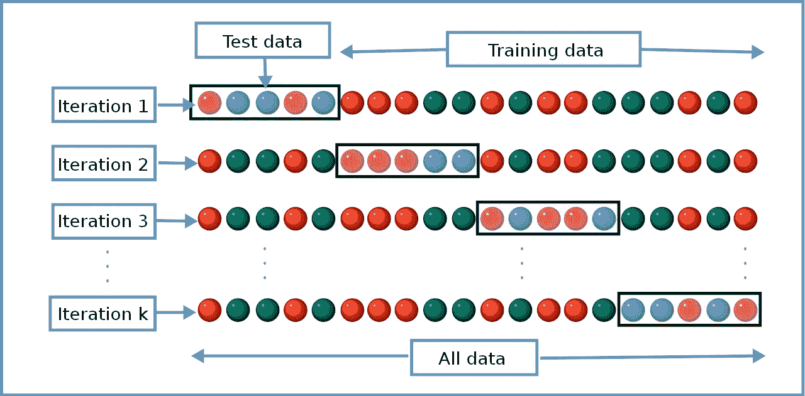

# 什么是 K-fold 交叉验证？

> 原文：<https://towardsdatascience.com/what-is-k-fold-cross-validation-5a7bb241d82f>

假设你训练了一个机器学习模型。现在，你需要找出这个模型的表现如何。是否足够精确到可以使用？它与其他型号相比如何？有几种评估方法可以确定这一点。一种这样的方法叫做 K-fold 交叉验证。

K-fold 交叉验证将数据样本分割成更小的样本，照片由[Jackson smelle](https://unsplash.com/es/@simmerdownjpg?utm_source=unsplash&utm_medium=referral&utm_content=creditCopyText)在 [Unsplash](https://unsplash.com/s/photos/split?utm_source=unsplash&utm_medium=referral&utm_content=creditCopyText) 上拍摄

交叉验证是机器学习中使用的一种评估方法，用于了解您的机器学习模型对未知数据的预测效果。这是一种易于理解的方法，适用于有限的数据样本，并且提供了一种更少偏见的评估，使其成为一种流行的选择。

数据样本被分割成“K”个更小的样本，因此得名:K 重交叉验证。您可能还会听到像四重交叉验证或十重交叉验证这样的术语，这实际上意味着样本数据被分别分割成四个或十个更小的样本。

# k 重交叉验证是如何进行的？

一般策略非常简单，可以采用以下步骤:

1.  首先，混洗数据集并分成 k 个子样本。(尽量使子样本大小相等，并确保 k 小于或等于数据集中的元素数，这一点很重要)。
2.  在第一次迭代中，第一个子集被用作测试数据，而所有其他子集被视为训练数据。
3.  使用训练数据训练模型，并使用测试子集对其进行评估。保留评价分数或错误率，去掉模型。
4.  现在，在下一次迭代中，选择一个不同的子集作为测试数据集，并使其他所有东西(包括我们在上一次迭代中使用的测试集)成为训练数据的一部分。
5.  使用训练数据重新训练模型，并使用新的测试数据集对其进行测试，保留评估分数并丢弃模型。
6.  继续迭代上述 k 次。每个数据子样本将在每次迭代中使用，直到所有数据都被考虑。你最终会得到 k 个评估分数。
7.  总错误率是所有这些单独评估分数的平均值。

Gufosowa-Own 工作的 k 倍交叉验证图，CC BY-SA 4.0，【https://commons.wikimedia.org/w/index.php?curid=82298768 

# 如何确定 K-Fold 交叉验证中‘K’的最佳值？

选择一个好的 k 值很重要。k 值过低会导致对模型能力的评估过低。换句话说，它可能会导致模型的测量能力被高估(高偏差)或根据所使用的训练数据发生很大变化(高方差)。

一般来说，有三种选择 k 的方法:

*   设 k = 5，或者 k =10。通过实验，已经发现选择 k 为 5 或 10 会产生足够好的结果。
*   设 k = n，其中 n 是数据集的大小。这确保了每个样本都用于测试数据集中。
*   另一种方法是选择 k，使每个分割数据样本足够大，确保它们在更大的数据集中得到统计表示。

# 交叉验证的类型

交叉验证可以分为两大类:

*   穷举，其中该方法学习和测试将数据集分成训练和测试子集的每一种可能性。
*   非穷举交叉验证方法，其中所有分割样本的**方式都是**而不是**计算的。**

## 详尽的交叉验证

遗漏交叉验证是一种彻底的交叉验证方法。这里，p 个观察值(或样本数据集中的元素)被排除在训练数据集之外，其他的都被认为是训练数据的一部分。为了更清楚，如果你看上面的图像，p 等于 5，如“测试数据”中的 5 个圆圈所示。

留一交叉验证留 p 交叉验证法的一种特殊形式，其中 p = 1。这也是 k 重交叉验证的一个特例，其中 k = N(样本数据集中的元素数量)。

## 非穷举交叉验证

K-fold 交叉验证其中 k 不等于 N，分层交叉验证和重复随机子采样验证是非穷举交叉验证方法。

*分层交叉验证*:选择分区，使得每个分区包含每个类标签的大致相同数量的元素。例如，在二进制分类中，每个分裂具有大约 50%属于类 0 和 50%属于类 1 的元素。

*重复随机子采样验证(蒙特卡罗交叉验证):*将数据分成多个随机子集，并为每次分割训练和评估模型。结果是分割的平均值。与 k-fold 交叉验证不同，训练集和测试集大小的比例不依赖于数据集的大小，这是一个优势。然而，缺点是一些数据元素永远不会被选择作为测试集的一部分，而一些可能被选择多次。当随机分裂的数量增加并接近无穷大时，结果倾向于类似于留 p-out 交叉验证的结果。

# 结论

交叉验证用于评估模型的性能，并客观地比较不同的模型。例如，我们可以确定在相同的数据集上，支持向量机(SVM)是否比 K 近邻(KNN)模型表现得更好。这是一个简单明了且较少偏见的方法，使得交叉验证成为一个流行的评估工具。然而，交叉验证有一些缺点，例如必须重新运行训练算法 k 次，这会占用大量的计算和时间。

如果你觉得这篇文章有用，可以考虑[订阅](https://medium.com/@praveennellihela/subscribe)给我，[加入媒体](https://medium.com/@praveennellihela/membership)。你的会员支持我和你直接阅读的其他作家。

感谢您的阅读！在以后的帖子中再见。