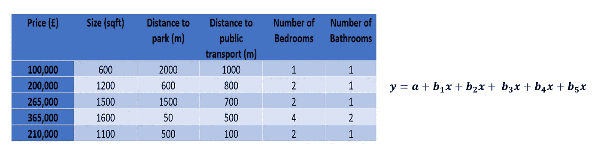
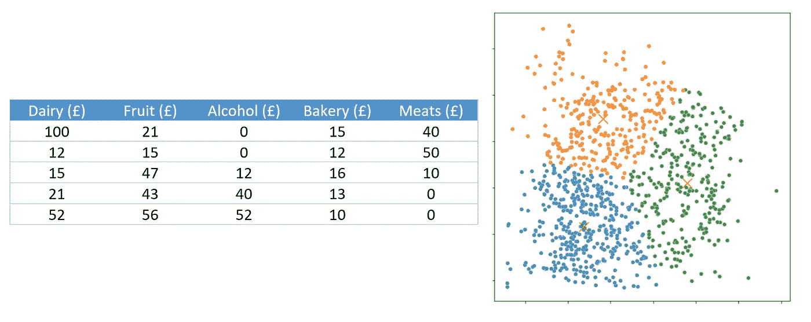

# 什么是机器学习？

> 原文：<https://towardsdatascience.com/what-is-machine-learning-716dfa72f2bc>

## 高层次概述

迈克尔·泽兹奇在 [Unsplash](https://unsplash.com?utm_source=medium&utm_medium=referral) 上的照片

机器学习来自于这样一种想法，即机器可以学习自己编程，而不是必须人工编程。这是因为，最初，为了通过逻辑路线找到答案，程序员不得不手动创建 if、elif 和 else 语句，以便计算机遵循这些语句来获得最佳答案(参见吉尔·莱珀的惊人之作 [if/then)。这对程序员来说是一个沉重的负担，尤其是当逻辑非常复杂的时候。这种负担导致了计算机能够根据现有数据自己学习这种逻辑的想法。在这样做的过程中，计算机实际上会为逻辑流程分配权重、值或语句，以获得与手动编程类似或更好的答案。这既能减轻程序员的负担，又能开发出比人类能开发的更复杂、更精确的程序。](https://www.amazon.co.uk/If-Then-Company-Invented-Future/dp/B08BSTWQV1/ref=sr_1_1?crid=2GEVCF0AKQ7LI&keywords=if%2Fthen&qid=1660552685&sprefix=if%2Fthen%2Caps%2C66&sr=8-1)

自从机器学习的最初想法以来，这个领域已经有了相当大的发展，包含了各种不同的技术和算法。这包括多种模型，如用于识别数据点组的 Kmeans 聚类、用于预测单个值的随机森林回归以及用于预测数据点所属组的支持向量机。虽然这些模型随着时间的推移而发展，但可以说关键的发展是通过开发大量开源包和开源数据集的广泛可用性实现机器学习的民主化。这意味着任何拥有计算机的人(可以说甚至不再需要计算机了)都可以在数据集上实现机器学习解决方案。然而，各种各样的技术和易用性有时会使机器学习的世界变得非常困难。这篇文章旨在提供一个高层次的帮助来导航这个广阔的、持续发展的社区。

首先，机器学习可以分为两条主线:监督学习和非监督学习。在前者中，向计算机传递已经定义的目标点或结果，模型可以用来学习，而在后者中，没有定义的目标，最终结果可以公开解释。这可以进一步划分，因为监督学习包括回归问题(其中目标变量是连续的)和分类问题(其中目标变量是分类的)。然后，在无监督学习下，我们有聚类，其目的是在没有预先定义的目标的情况下，从数据中找到模式和/或组。这些组可以定义如下:

## 回归

回归是最常见的机器学习任务。这组模型的目的是能够预测和/或模拟目标变量的精确值。这方面的例子包括根据卧室数量、位置、厕所数量和大小等因素预测房价，或根据经济、社会和环境因素对个人身高进行建模。关键是目标变量是连续的，我们的目标是用指定的输入来模拟精确的值。

在这种情况下遇到的第一种方法是线性或多元线性回归。虽然这种方法属于传统统计学的范畴，实际上它已经存在了一段时间，但它也属于机器学习模型的范畴，因为计算机可以“学习”权重。这里，模型将尝试学习分配给输入变量的最佳权重，以最大化或最小化与输出相关的指标。在线性回归的情况下，这是使用最小平方距离(所有值的平方和)来减小实际值和预测值之间的距离。由此，我们可以提取输入变量和目标变量之间关系的强度和方向，并使用它来尝试预测看不见的值。

这意味着我们通常会有一系列数字输入值(自变量)，用于对目标值(因变量)进行建模。这通常看起来像:

作者图片

其中左侧显示数据输入，右侧显示模型的预期外观。

除了线性回归，机器学习中还有许多不同类型的回归，包括:

*   里脊回归
*   套索回归
*   决策树回归
*   随机森林回归
*   神经网络

其中每一个都有不同的复杂性、实现和最佳用例。例如，如果您希望关系是线性的，您可能应该使用一系列线性回归模型，如线性回归、岭回归或 Lasso 回归。如果您预计这种关系是非线性的，那么决策树回归、随机森林回归或神经网络可能是首选。

你选择的模式也将取决于你的目标是什么和你有什么资源可用。在大多数情况下，最好尝试模型的组合，看看哪个最适合，并从最简单的模型开始，通常是线性回归。

## 分类

分类是机器学习工作流中常用的另一种受监督的机器学习任务。这种算法的目的是能够确定一个数据点可能属于哪个组或类，而不是一个确切的值。这意味着我们使用分类变量作为我们的目标变量，而不是连续变量。正在使用的这种技术的例子包括模拟患者是否患有糖尿病，图片是否包含狗或猫，或者用户将来是否会重新订阅该平台。

在这种情况下，一种常见的方法是支持向量机。这是因为，至少只有两个因变量，它可以很容易地形象化和理解。其工作方式是找到数据点之间的边界，作为不同组之间的分界线。然后，通过找出数据点位于边界的哪一侧，该边界可用于预测新数据属于哪个组。该边界可以采取多种形式，例如线性、非线性或由用户定义，但是可以容易看到、实现和理解。模型创建的边界示例如下所示。

这意味着，对于分类，我们通常会有一组输入，无论它们是数字还是类别，用于预测最终类别。这意味着这些模型的数据输入通常采用以下形式:

作者图片

其中左侧显示数据输入，右侧显示模型可能的样子。

属于这一范畴的标准算法包括:

*   逻辑回归
*   支持向量机
*   决策树分类器
*   随机森林分类器
*   神经网络

这些方法的复杂性和实现方式各不相同，这意味着一些算法将适用于不同的问题。例如，线性决策边界可能是最好的，那么具有线性边界的支持向量机可能是可取的。然而，当关系可能更复杂且线性度更低时，随机森林分类器可能是该实现的首选。

您选择的模式还取决于您的目标和可用的资源。与回归一样，在大多数情况下，如果可以的话，最好尝试多种方法的组合，以获得最佳结果，并理解为什么不同的算法可能表现得更好或更差。

## 使聚集

与上述两组机器学习相反，聚类算法是无监督的机器学习算法。这意味着他们没有一个预定的目标。相反，这些算法组的目的是能够根据相似的特征从数据中识别组。当我们想要识别一组具有不同行为的组时，通常使用这种方法。这方面的例子包括识别购物者群体，例如单身个人、年轻家庭或夫妇，识别用户通常一起观看的不同表演群体，或者对音乐品味进行分组。一旦这些群体被识别出来，这就能告诉我们更多关于行为的信息，并能导致有针对性的发明。这可以包括向团体发放优惠券，以推动他们采取新的行为或加强现有的行为，或者能够向观众提供电影或电视节目方面的建议。

这个领域中的一种常见算法是 K 均值聚类算法。该算法能够通过根据数据点彼此之间的距离对数据点进行分组来定义不同的组/聚类。为此，数据科学家必须首先定义要识别的目标组数量。然后，该算法在数据中设置随机点，并通过寻找该组的质心，根据点相对于其他组的相互距离来寻找每组内点的最佳分组。由于数据科学家通常事先不知道组的最佳数量，并且通常没有预定义的目标，因此结果通常可以有多种解释。有一些方法可以确定最佳的聚类数，但是这些方法的结果会有所不同。

这意味着一系列数字输入被输入到聚类算法中，而没有预定义的目标变量。这通常看起来像是:

作者图片

其中左侧显示数据输入，右侧显示模型可能的样子。

该领域中的常见算法包括:

*   k 均值聚类
*   DB 扫描
*   分层聚类
*   光学
*   均值漂移

与回归和分类算法一样，这些方法的复杂性和实现方式各不相同，这意味着有些算法比其他算法更适合不同的问题。由于聚类结果本身可能是高度主观的，并且容易解释，因此通常最好尝试多种不同的聚类方法，以查看哪些结果最有意义。这应该意味着这些组是平衡的，通过它们的平均值或中间值清楚地定义，并且对于非专家来说容易标记或解释。

## 结论

机器学习是一个过程，在这个过程中，不是数据科学家定义数据的规则，而是机器自己学习这些规则。这可以分为监督学习和非监督学习，前者有算法努力的明确目标，而后者没有。回归和分类都属于监督机器学习算法的范畴，而聚类属于非监督机器学习的范畴。当实现这些算法中的任何一个时，如果您有时间和资源，通常最好尝试实现多个算法，同时尽量保持简单。这将确保你会仔细检查你的结果，并尽可能使用最少的资源来进行有效的学习。

虽然机器学习的想法已经存在了很长时间，甚至一些机器学习算法的实现也已经存在了一段时间，但机器学习的广泛使用才刚刚开始。近年来，跨多种语言的深度和广度开源数据科学生态系统的发展促进了这一点，使任何拥有笔记本电脑的开发人员(在某些情况下，你甚至不再需要它)都可以开始实施自己的机器学习算法。在 Python 中，这包括开发和集成各种库，如 pandas、matplotlib、sklearn、statsmodels、tensorflow、keras 等，以及开放数据源，如 Kaggle、谷歌云公共数据集、Data.gov 等。

这意味着数据科学实践仍在发展，尽管已经建立了坚实的基础。有很多机会以各种不同的方式为这个不断增长的生态系统做出贡献，我们每天都会看到这种情况。抱着这样的想法，我非常期待未来会发生什么！

如果您想查看上述任何主题的实际示例，请随意查看我的文章《面向初学者的完整数据科学课程》。

  

如果你喜欢你所读的，并且还不是 medium 会员，请使用下面我的推荐链接注册 Medium，来支持我和这个平台上其他了不起的作家！提前感谢。

  

或者随意查看我在 Medium 上的其他文章:

   