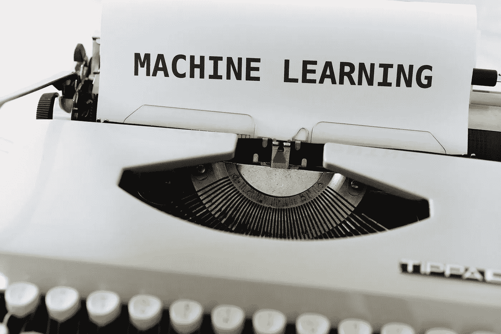
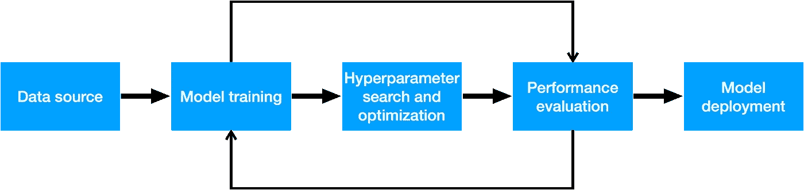
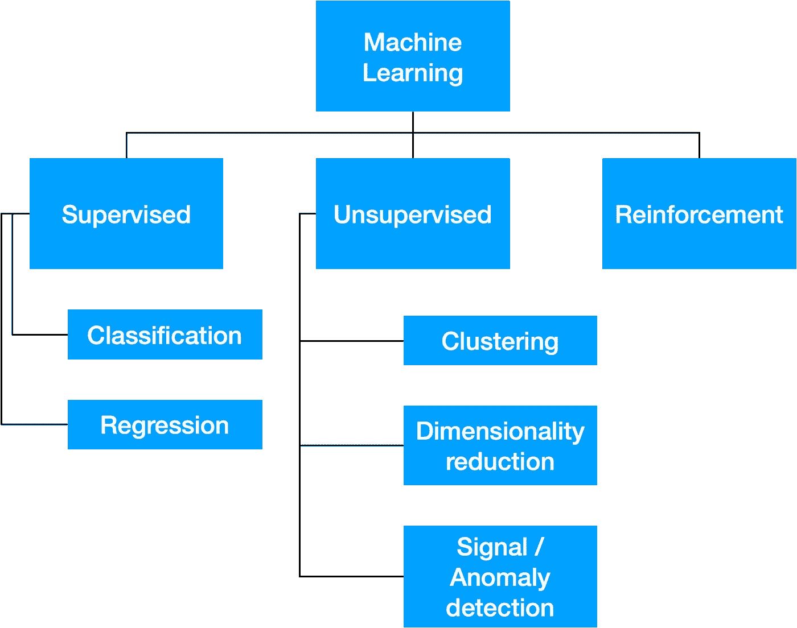

# 什么是机器学习:我如何向新人解释这个概念

> 原文：<https://towardsdatascience.com/what-is-machine-learning-how-i-explain-the-concept-to-a-newcomer-d96f35a5c4f3>

## 什么是机器学习，它的应用的例子和在这个领域做什么

马库斯·温克勒在 [Unsplash](https://unsplash.com/s/visual/ab35f047-053c-4376-9af5-4ee66730b5ea?utm_source=unsplash&utm_medium=referral&utm_content=creditCopyText) 上的照片

解释什么是机器学习相对简单，但讨论必须根据对话者进行校准。一些术语可以根据上下文有不同的解释，所以寻找尽可能通用的词汇表是正确的。

这篇文章将针对该领域的新人:**对定量分析知之甚少，但出于各种原因希望开始接近这个主题的人**。特别希望这篇文章能帮助青年学生在大学和工作空间中定位。

# 什么是机器学习？

机器学习是人工智能的一个分支，人工智能又是计算机科学的一个分支。

在机器学习中，**数值数据用于训练计算机完成特定任务**。其结果是一种算法，该算法反过来使用现象的模型来找到问题的解决方案。术语*训练*是最基本的，也是最能体现该领域特点的活动。稍后我们将详细了解这意味着什么。

一个应用特定规则来解决任务的软件(例如，如果一个句子包含单词“home”，在 Excel 电子表格中创建一个“housing”类别)和一个机器学习算法的区别在于**后者不需要显式编程来解决问题**。

机器学习算法使用 ***模型*从数学上推断数据中的规则，从而能够找到问题的通用解决方案。**

所以我们来给什么是机器学习下一个大概的定义:

> 机器学习是人工智能的一个分支，它允许软件使用数字数据来找到特定任务的解决方案，而无需显式编程。

这些解决方案可能或多或少是精确的，并且很难达到与人类相当的性能。

然而，这不应该引起关注:机器学习面临的大多数问题都提供了满足一般用例的性能。只要想想亚马逊或 Gmail 的垃圾邮件检测上的产品推荐就知道了。我们很快就会看到例子。

# 让我们定义什么是算法、模型和性能

在继续之前，我们先澄清一些概念。

一个**算法**只不过是计算机遵循的一系列指令。这当然是一个目前被过度使用的词(脸书算法、Twitter 算法等等)，但它实际上是一个非常简单的概念。

一个**模型**是嵌入算法的软件——我们需要它来找到问题的解决方案。由于我们经常不知道真正的解决方案，这些被称为*预测*。

在用于解决重要问题之前，一个模型要经过一系列的测试来评估它的性能。只有当我们有一个允许我们将真实观察值与模型预测值进行比较的数据集时，才能计算出这个值。

如果性能令我们满意，那么我们将在所谓的“生产”环境中使用该模型(也就是说，在真实世界的应用程序或类似的环境中)，否则我们可以决定再次训练该模型或丢弃它并寻求另一个解决方案。

机器学习管道的例子

# “培养”一个模特意味着什么？

正如我们所提到的，数字数据被提供给一个模型来寻找可推广的解决方案。向模型展示数据并让它从中学习的行为称为*训练*。

在训练期间，模型会根据某些假设尝试学习数据中的模式。例如，概率算法的运算基础是在某些数据存在的情况下推断事件发生的概率。

训练是通过*超参数*控制的，超参数允许我们调整和校准模型解释数据的方式等等。每个模型都有自己的超参数。

**数据科学家工作中最重要的一个方面是为给定模型找到正确的超参数集**。这通常是一项非常耗时的任务。

一旦模型得到调整和训练，我们就可以计算它的性能，以评估它的预测是否与真实的观察值有很大差异。如果我们对结果满意，培训阶段就完成了，我们继续下面的发展阶段。

**一个经过训练的模型的行为就像任何其他软件一样:它接收输入并返回输出**。输入将是现象的数据，而输出将是预测。

# 机器学习的类型

机器学习可以分为三个领域:**有监督、无监督和强化学习**。我们来看看这些算法的训练是如何根据所属的子类别而有所不同的。

机器学习的类型

## 监督学习

基于监督学习的算法需要在数据上进行训练，这些数据包含问题的准确答案，以便它们理解后者和现象之间的关系。

例如，监督任务的数据集可能包含房地产数据和每项财产的价格。如果我们想预测一处房产的价格，就必须对算法进行训练，以理解房屋特征(如房间数量、大小等)与价格之间的关联。

用技术术语来说，我们说一个现象的特征是特征集的一部分(用 *X* 表示，一个独立的随机变量)。被预测的变量是因变量(因为它取决于特性)，通常用 *y* 表示。

我们用一句话总结一下什么是监督学习。

> 监督学习是机器学习的一个子类，包括需要 X 和 y 形式的数据的算法。X 是现象的特征集，y 是我们想要预测的观察结果。
> 
> 监督算法学习 X 和 y 之间的关系，并且能够在给定不属于训练集的 X 的情况下预测新的 y。

定义的最后一部分可能有点难以理解，所以我将尝试更好地解释 *X 不属于训练集*是什么意思。

监督机器学习算法的目标是在给定一个现象的特征集的情况下预测某事。在训练期间，预测模型学习这些数据之间的关系，并评估其性能。

打个比方，

预测模型就像一个在学校为考试而学习的孩子。在练习(训练)过程中，孩子可以获得正确的答案，因此能够改进他的学习。在最后的测试中，孩子会被问到一些他无法找到正确答案的问题。

*X(最终测试问题)不是训练集(练习问题)的一部分，因此，孩子(预测模型)将不得不根据他之前接受的学习找到最精确的解决方案(y)。*

**回归**(数值的预测)和**分类**(类别的预测)是监督学习的例子。

## 无监督学习

在这种情况下，我们的算法不需要访问数据集中的正确答案，因此只需要一个特征集 x。

怎么可能呢？因为这些算法的逻辑与监督算法完全不同。并非所有的机器学习模型都必须表现得像隐喻中的孩子一样。事实上，无监督学习算法试图发现数据中的隐藏模式，以某种方式对数据进行分组、分离或操纵。

这些算法的美妙之处在于，它们不需要人为干预来完成工作。我们只需以正确的格式向他们提供我们的数据，就大功告成了。

无监督的任务是**聚类**、**信号**和**异常**、**检测**和**降维**。

还有一些算法部分以监督方式工作，部分以非监督方式工作(它们被称为半监督算法)，但这些算法通常是由大公司或非常大的团队创建的特定算法。

## 强化学习

强化学习通常被视为机器学习的一个困难领域，并与上述两种方法相分离。潜在的概念实际上非常简单:我们编写一个名为*代理*的软件，来学习如何在特定的*环境*中完成某个*任务*，我们根据它的表现提供*奖励*或*惩罚*。

这个想法是当代理取得好的结果时奖励它，或者当它做了阻碍他实现它的事情时惩罚它。以迭代的方式，模型学习最大化**适应度函数**的规则，这是定义奖励的数学函数，并最小化错误，这是惩罚。这允许类似人类的学习:基于**试验和错误。**

Sentdex 是 YouTube 上机器学习方面的领先内容创建者。我强烈推荐关注他的频道和观看这个播放列表，在那里他编写了一个 RF 算法来玩星际争霸 2 的游戏。

另一个特别有效地传达强化学习力量的视频是这个，展示了很酷的机器人:)

# 机器学习应用示例

为了巩固我们对什么是机器学习的理解，让我们看看它在日常生活中如何使用的一些实际例子。这些用例中的每一个都由数据科学团队实现，如果您选择在该领域工作，您也可以从事这样酷的项目！

## 异常检测

当你的银行应用程序通知你一个异常交易，并多次询问你的许可以确保你确实授权了它，你熟悉吗？我知道你是。

异常检测算法是一种程序，它使用数据来捕获与通常行为有很大不同的行为。在银行环境中，它们对于阻止未经授权的交易极其有用，在监控自然现象(如地震和飓风)时也同样有用。

## 图像和文本分类

你有没有想过 iPhone 如何使用自拍来实现 FaceID 这样的功能？虽然这不是唯一的机制，但苹果使用机器学习来分类来自我们相机的图像。在这种情况下，分类是二进制的:**图像中存在或不存在已识别的面部。**

Gmail 拥有最著名的反垃圾邮件算法之一。只需打开您的电子邮件帐户，查看充满恶意邮件的垃圾邮件收件箱。谷歌如何知道一封邮件是潜在有害的，并在没有我们干预的情况下将其放入垃圾邮件文件夹？

**它利用经过训练和校准的机器学习算法来分类我们电子邮件的文本内容。**如上所述，模型性能不一定要完美，才能给用户带来真正的价值。事实上，有时我们可能会发现自己不得不手动将垃圾邮件放入适当的框中。

## 价格预测

机器学习允许我们预测数值，比如物体的价格。

这看起来像是魔术，但在房地产行业，c **公司使用机器学习算法来预测房屋价格，从而完善他们的买卖策略**并获得竞争优势。

## **自定义内容和 UX**

亚马逊等网站跟踪我们的购买和互动行为。这使得他们可以训练机器学习模型，这些模型可以理解我们喜欢购买的东西，以便系统可以推荐那些可能的选择，从而消除搜索的需要。

事实上，亚马逊经常根据推荐和聚类算法向我们推荐“我们可能会喜欢”的产品。实施这样的解决方案并不容易，但为我们的客户提供这样的体验确实会有所不同。

如果你感兴趣，我在这里分享一个视频，列出了其他机器学习应用程序

# 怎么能从事机器学习领域的工作？

要在机器学习领域工作，你需要具备计算机科学、数学和统计学方面的知识。这些知识越具体，你找到一份高薪且令人满意的工作的机会就越大。事实上，**数据科学家**，也就是参与这个领域的主要人物，**恰恰工作在这三个学科的交叉点**。

数据科学家主要通过编写代码来完成工作，通常是用 Python 或 r。因此，您必须对软件开发逻辑、数据结构和算法有很好的了解。

数学最重要的领域当然是线性代数，它允许数据科学家利用矩阵的性质和运算，微积分，研究函数及其优化和概率 T21。

成为一名数据科学家似乎非常困难，但是**对你想要工作的行业有具体的了解甚至更重要**。

事实上，不需要记住上述领域的所有概念，但知道基本知识并帮助公司或客户抓住其所在行业中最有利可图的机会就足够了。

如今，一些大学为年轻学生从事数据科学行业做准备。他们的课程各不相同，但都涵盖了上述学科。

然而，对于自学者来说，有一些非常好的在线课程，可以帮助他们开始并巩固在该行业工作所需的知识。忍不住分享一下 [**吴恩达的机器学习入门教程 Coursera**](https://imp.i384100.net/c/3492458/1320984/14726?subId1=medium-whatisml) 。这当然是在开始深入数据世界的旅程之前要完成的第一步。

**如果你想支持我的内容创作活动，欢迎点击我下面的推荐链接，加入 Medium 的会员计划**。我将收到你投资的一部分，你将能够以无缝的方式访问 Medium 的大量数据科学文章。

  

# 推荐阅读

对于感兴趣的人来说，这里有一个我为每个与 ML 相关的主题推荐的书籍列表。在我看来，有一些必不可少的书籍对我的职业生涯产生了巨大影响。
*免责声明:这些是亚马逊会员链接。我会收到亚马逊为你推荐这些项目的一小笔佣金。你的体验不会改变，你也不会被收取更多费用，但它将帮助我扩大业务规模，围绕人工智能制作更多内容。*

*   **ML 简介** : [*自信的数据技能:掌握处理数据的基本原理，为你的职业生涯增压*](https://amzn.to/3WZ51cE) 作者:基里尔·叶列缅科
*   **sk Learn/tensor flow**:[*使用 Scikit-Learn、Keras 和 TensorFlow*](https://amzn.to/3jseVGb) 进行动手机器学习
*   **NLP** : [*文本即数据:机器学习和社会科学的新框架*](https://amzn.to/3l9FO22) 作者 Justin Grimmer
*   **Sklearn / PyTorch** : [*用 PyTorch 和 Scikit 进行机器学习——Learn:用 Python 开发机器学习和深度学习模型*](https://amzn.to/3wYZf0e)Sebastian Raschka
*   Cole Knaflic 著**数据即** : [*用数据讲故事:商务人士数据可视化指南*](https://amzn.to/3HUtGtB)

# 有用的链接(我写的)

*   **了解如何在 Python 中执行顶层探索性数据分析**:[*Python 中的探索性数据分析——一步一步的过程*](/exploratory-data-analysis-in-python-a-step-by-step-process-d0dfa6bf94ee)
*   **学习 TensorFlow 的基础知识**:[*tensor flow 2.0 入门—深度学习入门*](https://medium.com/towards-data-science/a-comprehensive-introduction-to-tensorflows-sequential-api-and-model-for-deep-learning-c5e31aee49fa)
*   **用 Python 中的 TF-IDF 进行文本聚类** : [*用 Python 中的 TF-IDF 进行文本聚类*](https://medium.com/mlearning-ai/text-clustering-with-tf-idf-in-python-c94cd26a31e7)