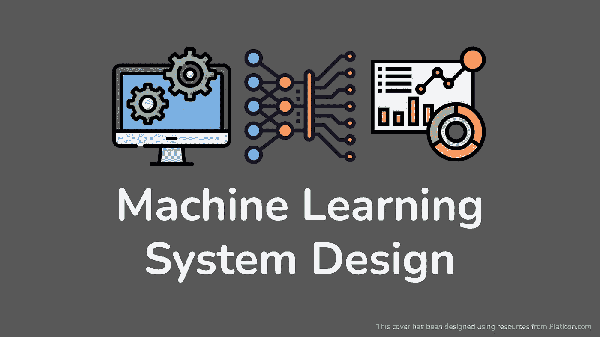
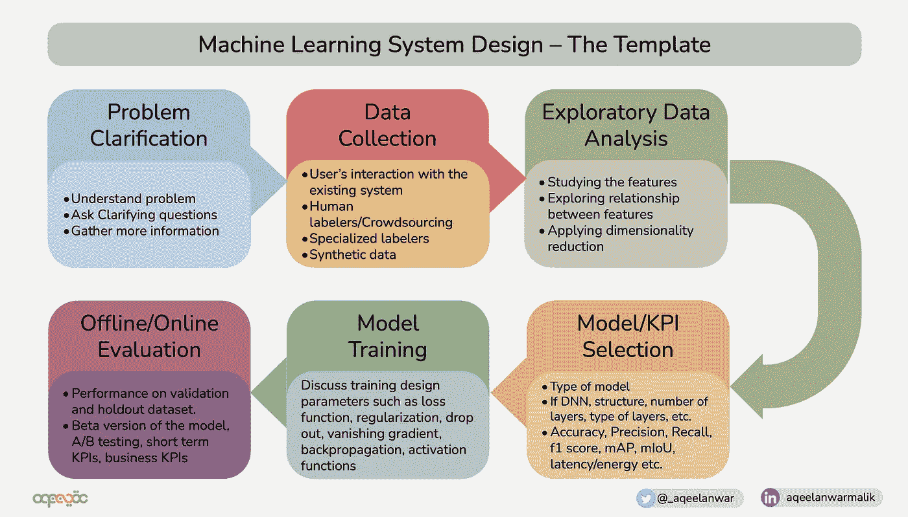

# 什么是机器学习系统设计面试，如何准备

> 原文：<https://towardsdatascience.com/what-is-machine-learning-system-design-interview-and-how-to-prepare-for-it-537d1271d754>

作者图片

## 使用模板准备 ML 系统设计面试的详细指南

# 什么是 ML 系统设计？

机器学习面试涵盖编码、机器学习、概率/统计、研究、案例研究、演示等多种技能。其中一个重要的机器学习面试就是系统设计面试。

> ML 系统设计面试分析候选人针对给定用例设计端到端机器学习系统的技能。

这样做是为了衡量候选人理解开发一个完整的 ML 系统的能力，考虑大多数必要的细节。大多数 ML 候选人擅长理解 ML 主题的技术细节。但当涉及到将它们联系在一起时，他们无法辨别设计一个完整的 ML 系统的复杂性和相互依赖性，从数据收集一直到模型评估和部署，因此在这种面试中表现不佳。

在这样的面试中最重要的是有组织的思考过程。这样的组织思维过程需要准备。在有限的面试时间里，这类问题的通用模板可以派上用场。这保证了你把注意力集中在重要的方面，而不是长时间谈论一件事或者完全错过重要的话题。

# 📓模板:

大多数 ML 系统设计面试问题可以按照下面的模板来回答

机器学习系统设计——模板(图片由作者提供)

在本文中，我们将按照上面提到的每个模块关键资源的**六步模板**来浏览 ML 设计面试的组织流程。

## 1.理解问题并提出澄清性问题

在你着手解决这个问题之前，你必须确保你有足够的信息。ML 设计问题大部分时间是开放式的。设计高效模型的关键是收集尽可能多的信息。面试官会用最少的信息提出问题。当遇到问题时，您必须确保自己正确理解了问题，并询问一些澄清性问题，如极限情况、数据大小、数据/内存/能源限制、延迟要求等。

## 2.数据收集/生成

ML 模型直接从数据中学习，因此数据的来源和收集策略非常重要。有多种方法可以为您的 ML 系统收集数据。有几种方法

*   用户与现有系统的交互(如果有)
*   人工贴标/众包
*   专业贴标机
*   综合数据

如果你和面试官一起讨论这些问题，会有所帮助。另一件重要的事情是分析什么样的数据可供你使用，并论证是否有足够的通用性。您应该意识到 ML 中不平衡数据集的含义，并在必要时解决它。确保正样本和负样本是平衡的，以避免过度适合一个类别。此外，在数据收集过程中不应该有任何偏见。问问你自己，这些数据是否是从足够大的人群中抽取的，以便更好地概括。

 [## 通过可视化备忘单浏览机器学习中的不平衡类

### 什么是不平衡的训练数据，如何通过精确度、召回率和 f1 分数来解决这个问题

towardsdatascience.com](/a-walk-through-imbalanced-classes-in-machine-learning-through-a-visual-cheat-sheet-974740b19094) 

## 3.探索性数据分析

一旦你有了原始数据，你就不能直接使用这些数据来输入 ML 系统。你总是要分析和修剪它。这种预处理包括数据清理、过滤和去除冗余参数。有几种方法可以做到这一点

*   研究特征(均值、中值、直方图、矩等。)
*   探索特征之间的关系(协方差、相关性等)
*   应用降维(如 PCA)去除冗余参数

最终目标是探索哪些特性是重要的，并去掉多余的特性。不必要的特征往往会在模型训练中产生问题，通常被称为**维数灾难。**

## 4.模型和 KPI 选择

不要选择复杂的模型，总是从简单的开始。针对给定的问题和数据分析模型，然后不断改进。面试官感兴趣的是你的思维过程，以及你是否能意识到自己的错误并加以改进。在讨论模型时，请确保您讨论了

*   模型类型(回归、树、人工神经网络、随机森林等。)
*   如果你选择了 DNN，讨论它的结构、层数、层数等
*   您是否喜欢一种类型的网络/块，而不是另一种类型，如 AlexNet、VGGNet、ResNet 和 inception。
*   确保谈论你的网络的内存和计算使用情况

模型的选择取决于可用数据和性能指标。确保谈论不同的 KPI 以及它们之间的比较。此类 KPI 包括但不限于

*   **分类问题:**准确度、精确度、召回率、F1 评分、ROC 下面积(AUROC)
*   **回归:** MSE，MAE，R 平方/调整后 R 平方
*   **目标检测/定位:**交集超过并集(IoU)，平均精度(AP)
*   **强化学习:**累积奖励，回报，Q 值，成功率。
*   **系统/硬件:**延迟、能量、功率
*   **业务相关 KPI:**用户留存、日/月活跃用户(DAU、MAU)、新用户

下面的文章将帮助你理解 ML 模型的不同部分

 [## 卷积神经网络基本元素的可视化

### 不同 CNN 元素的动画可视化

towardsdatascience.com](/a-visualization-of-the-basic-elements-of-a-convolutional-neural-network-75fea30cd78d)  [## 机器学习中回归分析的初学者指南

### 回归分析用例子、插图、动画和备忘单解释。

towardsdatascience.com](/a-beginners-guide-to-regression-analysis-in-machine-learning-8a828b491bbf)  [## AlexNet、VGGNet、ResNet 和 Inception 之间的区别

### AlexNet，VGGNet，ResNet 和 Inception 解释

towardsdatascience.com](/the-w3h-of-alexnet-vggnet-resnet-and-inception-7baaaecccc96) 

## 5.模特培训

这是评估技术知识的地方。确保你熟悉 ML 培训的不同方面，并能自如地深入讨论它们。面试官甚至可能会问你如何应对过度拟合，或者你为什么不用正则化，如果你用了哪一种，为什么等等。主题包括但不限于

*   **损失函数选择:**交叉熵、MSE、MAE、Huber 损失、铰链损失
*   **正则化:** L1，L2，熵正则化，K 倍 CV，辍学
*   **反向传播:** SGD，ADAGrad，Momentum，RMSProp
*   **消失渐变**以及如何解决它
*   **激活函数:**线性、ELU、RELU、双曲正切、乙状结肠
*   **其他问题:**不平衡数据、过拟合、归一化等

以下文章将有助于您深入理解上面提到的一些主题

 [## 机器学习中的正则化类型

### 机器学习正则化初学者指南。

towardsdatascience.com](/types-of-regularization-in-machine-learning-eb5ce5f9bf50)  [## 局部响应标准化和批量标准化的区别

### 深度神经网络中使用的不同规范化技术的简短教程。

towardsdatascience.com](/difference-between-local-response-normalization-and-batch-normalization-272308c034ac) 

## 6.估价

训练模型的最终目标是在手头问题的真实场景中表现良好。它如何处理看不见的数据？角落里的箱子被盖住了吗？为了分析这一点，我们需要进行离线和在线评估。

*   **离线评估:**模型对数据集保留样本的性能。在数据集收集期间，数据被划分为训练、测试和验证子集。这个想法是为了分析模型对未知数据集的概括程度。还可以进行 K 重交叉验证，找出不同数据子集下的性能。选择对所选 KPI 表现良好的模型来实现和部署。
*   **在线评估:**在真实场景中部署训练好的模型的第一步(在它已经被离线评估之后)是进行 A/B 测试。经过训练的模型不会很快面对现实世界的数据。这太冒险了。相反，该模型被部署在一小部分场景中。例如，假设设计的模型是为了匹配优步司机和骑手。在 A/B 测试中，该模型将只部署在较小的地理区域，而不是全球。该模型的测试版将在更长的时间内与现有模型进行比较，如果它能够提高业务相关 KPI 的性能(例如优步应用程序的更多 DAU/MAU，更好的用户保留，最终提高优步的收入)，那么它将在更大的规模上实施。

## 总结:

如果在任何一步你走错了方向，面试官会跳出来，试图把你引向理想的方向。确保你领会了面试官提供的暗示。ML 系统设计应该是一个讨论，所以每当你陈述某事时，问面试官他们对此有什么想法，或者他们是否认为这是一个可以接受的设计步骤。一旦你完成了这 6 个步骤的讨论(过程中有所改进)，确保用几句话概括最终的系统设计参数，并提到过程中的关键要点。

## 总结:

在本文中，我们看到了一种回答 ML 系统设计问题的有组织的方法。没有一个正确的答案，这次面试的目的是分析候选人设计端到端系统的思维过程。话虽如此，深入了解各种 ML 话题是在这次面试中取得成功的必要条件。以下备忘单将有助于更新这些主题。

 [## 机器学习面试主题的备忘单

### ML 面试的视觉备忘单(www.cheatsheets.aqeel-anwar.com)

medium.com](https://medium.com/swlh/cheat-sheets-for-machine-learning-interview-topics-51c2bc2bab4f) 

**如果这篇文章对你有帮助，或者你想了解更多关于机器学习和数据科学的知识，请关注**[**【Aqeel an war】**](https://medium.com/u/a7cc4f201fb5?source=post_page-----51587a95f847-----------------------------------)**，或者在**[***LinkedIn***](https://www.linkedin.com/in/aqeelanwarmalik/)***或***[***Twitter***](https://twitter.com/_aqeelanwar)***上联系我。你也可以订阅我的邮件列表。***