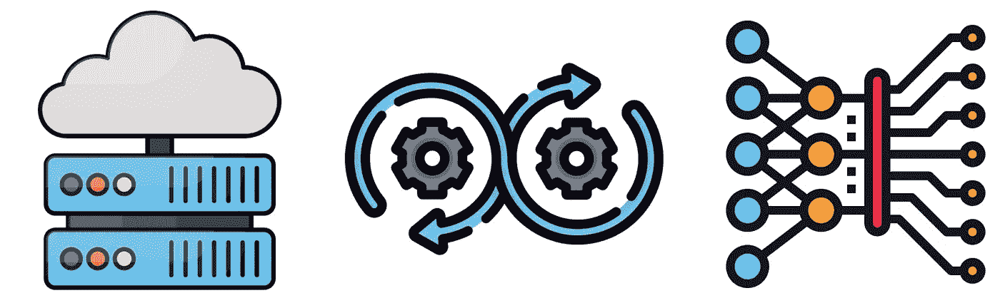
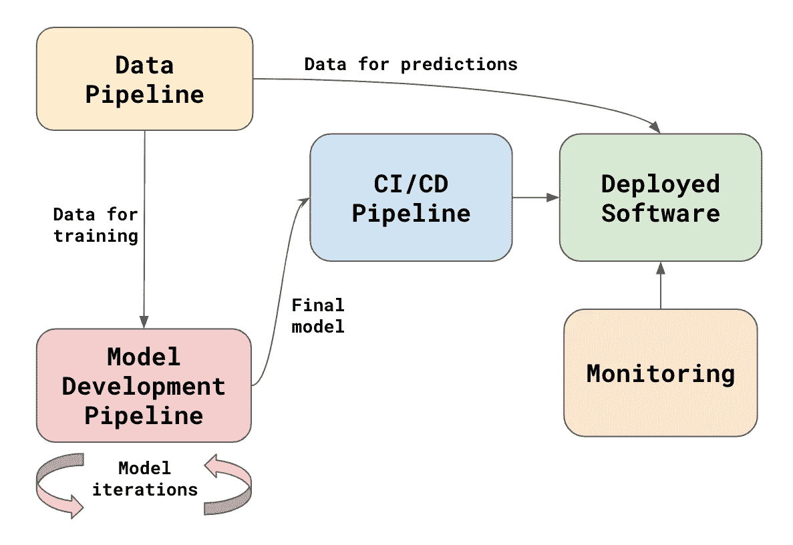
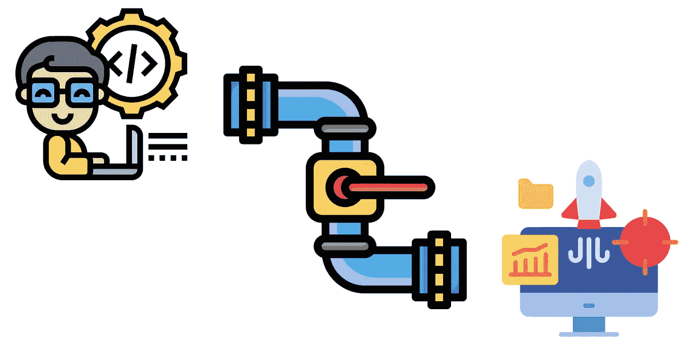

# 什么是 MLOps？

> 原文：<https://towardsdatascience.com/what-is-mlops-8dff3a6ec94c>

## DevOps 满足数据和机器学习

你有没有在 Instagram 上喜欢过某样东西，然后几乎立刻就在你的 feed 上有了相关内容？或者在谷歌上搜索某样东西，过一会儿就收到垃圾广告？这些都是日益自动化的世界的征兆。在幕后，它们是最先进的 MLOps 流水线的结果。我们来看看 MLOps 以及如何有效地部署机器学习模型。

来源: [flaticon](https://www.flaticon.com/premium-icon/devops_5108664)

我们首先讨论 DevOps 的一些关键方面。然后我们解释引入数据和模型是如何破坏标准实践的。这导致了 MLOps。现有做法，如 CI/CD 管道，需要调整。引进了新的做法，如持续培训。最后，我们讨论了管制环境中的 MLOps 以及它与模型可解释性的关系。

# DevOps

DevOps 是一套**最佳实践**、**工具**和公司**文化**，旨在提高软件开发、测试、部署和监控的效率。您可以拥有一个致力于实施最佳实践的开发运维团队。然而，它涉及许多团队之间的参与和有效沟通。每个公司都有不同的开发运维方法。目标总是一样的——快速部署好的软件。

## CI/CD 管道

所有软件在使用前都需要开发、彻底测试和部署。DevOps 试图通过构建和自动化 CI/CD 管道来提高这一过程的效率。持续集成(CI)包括围绕开发软件的过程。持续部署/交付(CD)涉及将软件投入生产的过程。最佳实践和文化嵌入到这些管道的管理中。

让我们考虑如何处理第一个方面，持续集成。通常，这需要开发人员定期将代码更改推送到远程存储库。然后，运行自动化的单元和集成测试，以立即识别代码中的任何问题。DevOps 将定义实施这些步骤的**最佳实践**。我们使用**工具**来实现它们，比如 git 来推送变更，或者 junit 来运行单元测试。要做到这一点，需要一种定期提交代码的**文化**。对大多数人来说，这不是天生的。

## 监视

一旦软件发布，我们需要确保它运行良好。这包括根据系统延迟数据创建指标。DevOps 寻求自动化这一过程，并使开发人员能够轻松地访问这些指标。它还可以包括使用预定义的度量临界值创建自动警告。最终目标是一个持续的监测系统。这将实时提供所有应用程序的指标。

## 沟通

传统上，开发人员和运营团队是孤立的。在这种情况下，开发人员将合作开发软件。一旦完成，他们将把它传递给一个要部署的操作团队。开发和生产环境是不同的。这可能会导致移交过程中出现大量问题。最坏的情况是，您可能会发现软件根本无法部署。DevOps 寻求打破这些团队之间的壁垒，建立一种沟通文化。

# MLOps = DevOps +数据+模型

MLOps 出生于 DevOps。上面讨论的许多方面将会延续下去。关键的区别在于，对于机器学习应用，我们需要数据和模型。这意味着我们不能再依赖现有的实践和工具。在图 1 中，您可以看到数据和模型如何适应现有 DevOps 管道的概述。我们将讨论这些新的方面，以及它们如何影响现有的 DevOps 实践。

图 1: MLOps 概述

## 数据和模型开发

没有数据，就没有机器学习。数据需要在正确的时间放在正确的位置。对于数据科学家来说，这意味着需要有足够的历史数据来训练模型。我们还需要更近的数据来做预测。在极端情况下，我们可能需要实时数据。由数据工程师来管理进入数据仓库的数据流。对于 MLOps，这是通过 CI/CD 数据管道完成的。数据工程师将需要新的工具来开发这些。

数据为生产工作流程添加了一个新元素。同样，开发模型不同于开发软件。在您决定最终模型之前，通常会有数千次迭代。我们在模型开发管道中进行这些迭代。这条管道应该使数据科学家评估模型变得容易。它还应该有助于跟踪所有不同的模型版本。应该很容易比较模型来决定最好的一个。

## CI/CD 管道

一个模型可能看起来像一个神秘的东西，但是一旦它被训练，它就和普通的代码没有什么不同。它是一组接受输入(即数据)并给出输出(即预测)的指令。一旦开发完成，我们就可以将最终的模型推送到主要的 CI/CD 管道。然后运行自动化单元测试和集成测试，以确保新模型没有问题。

CI/CD 管道的设计使得如果新代码出现问题，我们可以很容易地恢复到旧版本。同样，我们应该能够恢复到一个旧版本的模型。如果我们发现模型没有按预期运行，我们会这样做。也就是说，如果它在新数据上表现不佳或做出有偏见的预测。为了保护公司和客户，我们必须尽快恢复旧模式。

## 监视

对于计算资源，监控模型类似于监控软件。我们需要确保模型按照预期使用 CPU、RAM、带宽和磁盘空间。模型预测不应该产生任何延迟问题。现有的开发运维实践解决了这些挑战中的大部分。监控模型准确性方面的性能带来了新的挑战。

不像软件，模型会退化。模型捕获的基础关系会随着时间的推移而改变。这将导致模型做出不太准确的预测。我们需要引入新的指标来监控数据和模型准确性的变化。与典型的系统指标不同，最终用户将是数据科学家。他们将使用这些指标来帮助决定我们何时需要重新开发一个模型。

## 持续培训

一旦我们标记了一个重新开发的模型，数据科学家就会介入。通常，会有一个手动过程来收集训练数据、创建特征和重新训练模型。在某些情况下，这个过程可以完全自动化。这就把我们带回了文章开头的反问句。没有人参与更新你的 Instagram feed。当你喜欢新内容时，支持你的建议帖子的模型会自动更新。

这就是所谓的持续训练。这里，MLOps 不仅寻求模型部署的自动化，而且寻求模型训练的自动化。某些事件将启动模型重新开发。这可能是因为有新数据可用，或者模型性能可能已经下降。在这种情况下，CI/CD 管道可能看起来非常不同。我们不再只是部署代码。我们正在部署一个部署另一个服务(即模型)的系统(即 ML 管道)。

## 沟通

就像 DevOps 一样，我们不能只使用花哨的工具来实现有效的 MLOps。这也不仅仅是一个团队的责任。它需要许多团队之间的协作。这些人包括领域专家、数据科学家、数据工程师、软件开发人员和 DevOps 团队。有了 MLOps，现在有更多的团队参与进来。这使得有效的沟通更具挑战性。

# 监管和可解释性

有效的 MLOps 是一个目标。组织需要不断改进系统、工具和沟通来实现目标。不同的组织将面临不同的挑战。旧的组织将不得不改进或替换现有的流程。新组织的优势在于能够立即实施最佳实践。对于一些行业来说，不仅有技术上的挑战，还有法律和道德上的挑战。

例如，保险业和银行业都受到严格监管。在这种环境下开发的模型将被仔细检查。在我们部署模型之前，需要其他团队(如合规)和外部监管机构的签准。你需要向这些团队汇报，并向他们解释这个模型。这将在模型开发过程中增加手动步骤。最终，自动化模型训练和部署在技术上是可能的，但是这样做是非法的。

您可以使用的模型类型也是可以调整的。这可能会影响您自动化模型开发过程的能力。使用 XGBoost 和 random forests 这样的模型更容易做到这一点。在这里，您可以通过调整超参数来自动化模型选择过程。在保险业或银行业，你可能需要使用回归。为了建立一个好的回归模型，你需要选择 8 到 10 个不相关特征的最佳集合。这个过程更难自动化，我们将在下面的文章中详细讨论。

 [## 良好特性的特征

### 为什么在选择模型特征时，预测能力不是一切

towardsdatascience.com](/characteristics-of-a-good-feature-4f1ac7a90a42) 

对[可解释性](/interpretability-in-machine-learning-ab0cf2e66e1)的需求通常是模型以这种方式被管理的原因。如果你不彻底解释你的模型，它们可能会产生意想不到的结果。同样，如果你不进行彻底的[算法公平性](/what-is-algorithm-fairness-3182e161cf9f)分析，他们可能会产生有偏见的结果。解释模型和公平性总是需要一些人工干预。对于具有高影响的模型，自动化这些过程的好处被风险超过了。

我希望这篇文章对你有帮助！你可以成为我的 [**推荐会员**](https://conorosullyds.medium.com/membership) **来支持我。你可以访问 Medium 上的所有文章，我可以得到你的部分费用。**

 [## 通过我的推荐链接加入 Medium 康纳·奥沙利文

### 作为一个媒体会员，你的会员费的一部分会给你阅读的作家，你可以完全接触到每一个故事…

conorosullyds.medium.com](https://conorosullyds.medium.com/membership) 

[推特](https://twitter.com/conorosullyDS) | [YouTube](https://www.youtube.com/channel/UChsoWqJbEjBwrn00Zvghi4w) | [时事通讯](https://mailchi.mp/aa82a5ce1dc0/signup) —注册免费参加 [Python SHAP 课程](https://adataodyssey.com/courses/shap-with-python/)

**图像来源**

所有图片都是我自己的或从[www.flaticon.com](http://www.flaticon.com/)获得。在后者的情况下，我拥有他们的[保费计划](https://support.flaticon.com/hc/en-us/articles/202798201-What-are-Flaticon-Premium-licenses-)中定义的“完全许可”。

## 参考

米（meter 的缩写））特雷维尔等人。艾尔。、*MLOps 简介:机器学习如何在企业中规模化* (2020)、[https://www . oreilly . com/library/view/Introducing-MLOps/9781492083283/](https://www.oreilly.com/library/view/introducing-mlops/9781492083283/)

AWS，*什么是 DevOps？*(2022)[https://aws.amazon.com/devops/what-is-devops/](https://aws.amazon.com/devops/what-is-devops/)

AWS，*什么是持续集成？(* 2022)、[https://aws.amazon.com/devops/continuous-integration/](https://aws.amazon.com/devops/continuous-integration/)

AWS，*什么是连续发货？*(2022)[https://aws.amazon.com/devops/continuous-delivery/](https://aws.amazon.com/devops/continuous-delivery/)

IBM，*什么是 CI/CD 管道？*(2021)[https://www.ibm.com/cloud/blog/ci-cd-pipeline](https://www.ibm.com/cloud/blog/ci-cd-pipeline)

RevDeBug，*单元测试与集成测试*(2021)[https://revdebug.com/blog/unit-tests-vs-integration-tests/](https://revdebug.com/blog/unit-tests-vs-integration-tests/)

米（meter 的缩写））阿纳斯塔索夫， *CD 管道:温柔的介绍* (2022)，[https://semaphoreci.com/blog/cicd-pipeline](https://semaphoreci.com/blog/cicd-pipeline)

O.Itzary 和 L. Nahum，*机器学习的持续培训——成功战略的框架* (2021)，*[https://www . kdnugges . com/2021/04/Continuous-Training-Machine-Learning . html](https://www.kdnuggets.com/2021/04/continuous-training-machine-learning.html)*