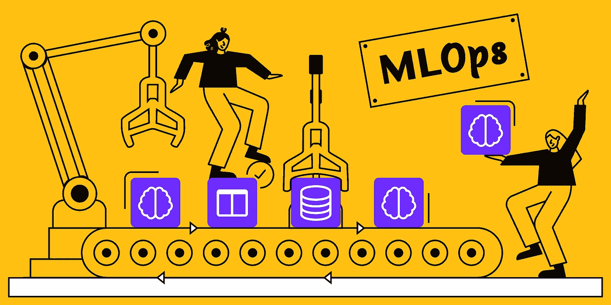
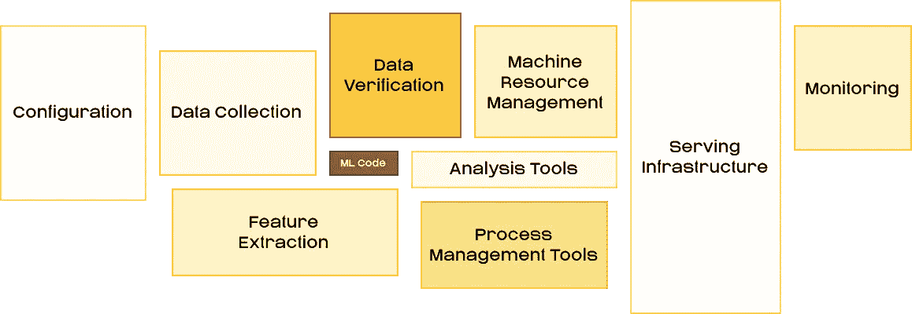
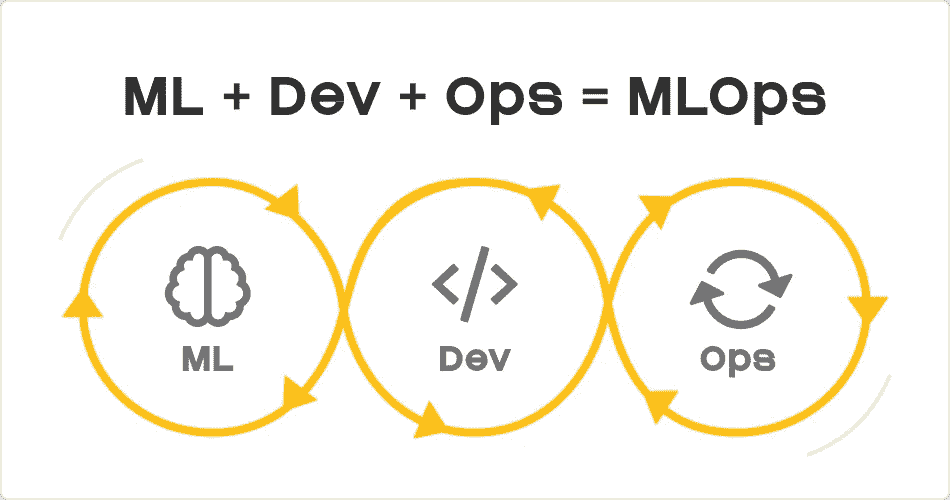
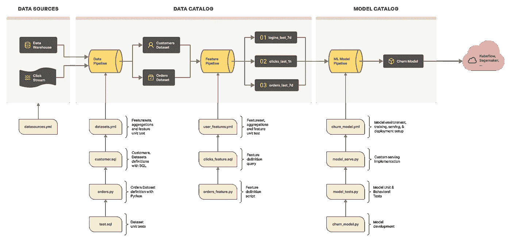

# 什么是 MLOps？

> 原文：<https://towardsdatascience.com/what-is-mlops-996f3d30aacf>

## MLOps 解决了哪些问题和最佳实践

图片由 [layer.ai](https://learn.layer.ai/wp-content/uploads/2021/06/what_is_mlops.png)

构建一个[机器学习](https://www.machinelearningnuggets.com/)模型包括创建模型、训练模型、调整模型和部署模型。这个过程应该是:

*   可攀登的
*   合作的
*   可再生的

例如，构建了一个优秀的模型，却不能在生产环境中重现结果，这将是令人遗憾的。确保构建机器学习模型可伸缩、协作和可复制的一套原则、工具和技术被称为 **MLOps** 。在软件工程的世界里，这些实践被称为 DevOps。

受[这篇论文的启发。](https://papers.nips.cc/paper/2015/file/86df7dcfd896fcaf2674f757a2463eba-Paper.pdf)图片由 [layer.ai](https://learn.layer.ai/wp-content/uploads/2021/06/word-image-9.png)

# 开发运维与微运维与数据运维的对比

DevOps 是一套确保持续交付高质量软件的原则。在机器学习领域，这些实践被称为 MLOps。DataOps 涉及一组规则，这些规则确保高质量的数据可用于分析和训练机器学习模型。可以认为 DataOps 与 MLOps 紧密集成。

图片由 [layer.ai](https://learn.layer.ai/wp-content/uploads/2021/06/word-image-10.png)

# MLOps 解决什么问题？

MLOps 中定义的工具和技术集旨在使数据科学家和机器学习实践者的生活更加轻松。让我们来看看 MLOps 解决的一些问题。

# 版本控制

版本控制是软件工程中的一种常见做法，其中使用了 Git 和 GitHub 等工具来对代码进行版本控制。除了对代码进行版本控制，机器学习中还需要对其他东西进行版本控制。这些项目包括:

*   模型训练中使用的数据
*   模型工件

对模型和数据进行版本控制可以确保机器学习实验的可重复性。

# 监控模型性能

投入生产的模型会随着时间的推移而退化。这是由训练数据和测试数据的差异造成的。这通常被称为数据漂移。通过监控模型的性能，可以快速识别和解决这些问题。

# 特征生成

创建要素可能是一项耗时且计算密集型的任务。应用适当的 MLOps 技术可确保生成一次的要素可根据需要多次重复使用。这使得数据科学家可以专注于设计和测试模型。

# MLOps 需要哪些技能？

MLOps 是一个相当广泛的领域，需要相当多的技能。幸运的是，你不需要具备所有这些技能。专攻几个领域更有意义。然而，以下是 MLOps 团队成功交付机器学习项目所需的技能:

*   阐明业务问题和目标的能力
*   收集解决已发现问题所需的数据
*   准备和处理数据，以便机器学习模型可以接受
*   创建对问题重要的特征
*   构建和训练机器学习模型
*   开发用于获取数据、生成要素、训练和评估模型的管道
*   部署模型，以便实际用户可以使用它。这也可以是上述管道的一部分
*   监控模型在现实世界中的表现

了解了这些基础知识之后，现在让我们来看看 MLOps 的主要组件。

# MLOps 的组成部分

尽管这个领域相当广泛，但几个部分组合在一起就成了一个整体。在本节中，我们将探索这些部分。

图片由 [layer.ai](https://learn.layer.ai/wp-content/uploads/2021/06/word-image-11.png)

# 功能存储

也被称为**特征工厂**，它存储用于训练机器学习模型的特征。这是 MLOps 的关键部分，因为它确保在创建特征时没有重复。如有必要，还可以提取特征并用于构建其他模型或进行一般分析。在要素存储中，要素也会被版本化，以确保用户可以恢复到特定的要素版本，从而获得更好的模型。

# 数据版本化

除了版本化功能，用于创建特定模型的整个数据集也可以进行版本化。版本化数据确保了在创建模型的过程中具有可再现性。这在审计期间也是必不可少的，因为它使得识别用于开发各种模型的数据集变得更加容易。

# ML 元数据存储

为了摆脱创建机器学习模型的魔力，人们必须记录一切。记录对于再现性至关重要。要记录的一些基本项目包括:

*   分割数据时使用的种子。这可以确保您在创建定型集和测试集时使用相同的拆分
*   用于初始化模型的随机状态。随机状态影响模型训练的再现性
*   模型度量
*   超参数
*   学习曲线
*   培训代码和配置文件
*   用于生成特征的代码
*   硬件日志

# 出于各种原因，存储模型元数据至关重要:

*   用不同的模型构建仪表板
*   启用基于超参数的模型的可搜索性

# 模型版本控制

版本化模型很重要，因为它支持模型之间的实时切换。除此之外，可以同时向用户提供多个模型来监控性能。例如，一旦一个新模型可用，它可以提供给几个用户，以确保在向每个人推广之前它能按预期执行。从法规遵从性、治理和历史的角度来看，版本控制也很重要。

# 模型注册表

一旦模型被训练，它就被存储在模型注册表中。由于上述原因，注册表中的每个模型都将有一个版本。每个模型还应配有:

*   超参数
*   韵律学
*   用于创建模型的特征版本
*   用于定型模型的数据集版本

..举几个例子

上面提到的模型元数据对于以下方面非常重要:

*   符合法规
*   模型的管理
*   确定生产中模型的端点

模型工件通常会根据您使用的 MLOps 工具自动保存。您还可以指示该工具保存最佳模型检查点，并将它们上传到注册表。

# 模型服务

一旦模型在注册中心，它就可以被部署并提供给用户。服务模型意味着创建可用于在模型上运行推理的端点。模型工件也可以下载并与应用程序打包在一起。然而，部署 API 端点使得在各种应用程序中使用该模型变得更加容易。也就是说，在移动应用程序等应用程序中打包模型可以减少推理延迟。

# 模型监控

一旦部署了机器学习模型，就必须监控它们的模型漂移和生产偏差。当训练数据和推断数据之间的统计差异以意想不到的方式发生变化时，就会发生模型漂移。模型的性能因此降低。通过监视训练和预测数据的统计属性，可以及早发现这些问题。

当服务模型与离线模型相比表现不佳时，就会出现生产偏差。这可能是由训练过程中的错误、服务错误以及训练和推理数据中的差异引起的。

应监控模型漂移和生产偏差，以确保模型按预期运行。

# 模型再训练

机器学习模型可以被重新训练有两个主要原因:

*   为了提高模型的性能
*   当新的训练数据变得可用时

你的机器学习管道应该检测新数据的可用性或模型的惨淡表现，并触发模型的重新训练。该系统还应该检测和废弃不会从再训练中受益的模型。

# CI/CD

机器学习中的持续集成和持续部署确保了经常创建和部署高质量的模型。连续交付确保了代码被频繁地合并到一个实现自动化构建和测试的中央存储库中。在机器学习中，这不仅包括测试代码，还包括最终的模型。它还需要将模型打包以备实际用户使用。

连续交付包括自动将代码变更部署到一个阶段化或生产环境中。在机器学习管道中，这将涉及到将模型部署到测试和/或生产服务器。频繁的部署是非常重要的，因为它们确保代码和模型在进入生产环境之前经常得到严格的测试。

# 如何实现 MLOps

您可以创建一个系统来实现我们上面提到的项目。或者，您可以使用机器学习管道编排平台，这将使您的工作流程更加简单。让我们来发现一些可以用于 ML 管道编排的最佳工具。

# MLOps 解决方案

机器学习编排工具的选择将取决于几个因素，包括:

*   你的团队的技能
*   你的预算
*   无论您想要自动化部分管道还是整个管道
*   集成新工具的容易程度

仅举几个例子。

现在，让我们来介绍一些可以用来协调机器学习管道的最佳工具。

*   [MLflow](https://mlflow.org/) 是一个管理机器学习生命周期的开源平台。该平台可用于 ML 实验跟踪、部署以及中央模型注册。
*   [神圣](https://github.com/IDSIA/sacred)是一个开源库，可以用来组织、记录和复制机器学习实验。它不附带网络用户界面。 [Omniboard](https://github.com/vivekratnavel/omniboard) 是一个受欢迎的神圣的前端库。
*   ModelDB 是一个开源工具，用于版本化模型、存储模型元数据和管理机器学习实验。它可用于使 ML 管道可再现，以及显示模型性能仪表板。

# MLOps 最佳实践

MLOps 是一个相对较新的领域；然而，当坚持时，一些最佳实践将导致您的机器学习编排过程的成功。让我们举几个例子:

*   **使用协作工具**。这使得团队中的每个人更容易访问代码、数据和关于项目的信息，例如，生成的特性。这也使得提出和跟踪问题变得更加容易。
*   **从一个简单的模型**开始。从简单的模型开始可以给你足够的时间来确保基础设施是正确的。一个复杂的模型意味着你必须调试一个复杂的模型并优化它运行的基础设施。
*   **刚刚发射**。不要花几个月的时间来构建和部署机器学习模型。最好尽快推出该模型，开始在实际用户身上进行测试。您可以将模型提供给少量用户，以开始获得初步反馈。该反馈可用于在必要时迭代模型和基础设施。
*   **执行自动化回归测试**。这对于确保新代码不会在现有代码中引入错误至关重要。没有通过测试的代码不会合并到主源代码中。回归测试确保新代码不会破坏现有的功能。
*   自动化模型部署。这确保了通过某些测试的新模型可以自动提供给用户。它还将工程师从为生产包装模型的手工过程中解放出来。该过程包括将模型及其依赖项自动打包，并将它们交付到生产或试运行环境中。应该持续监控模型，并在它们表现不佳时自动回滚。
*   **将预测附加到模型版本和数据上**。这使得跟踪特定模型和数据的每个预测变得更加容易。这对于可追溯性、可再现性和合规性非常重要。记录带有数据和模型版本的预测还可以在出现意外行为时轻松调试模型。
*   **测量训练和发球偏斜**。当用于看不见的数据时，机器学习模型可能不总是如预期的那样执行。因此，衡量训练表现和看不见的数据之间的差异是至关重要的。如果您的标准不能接受这种差异，那么您将不得不实现一种方法来减轻这种差异，例如，返工特性。
*   **实现阴影制作**。这包括使用生产数据对模型进行预测。然而，这些预测并不用于现实世界的决策。它们与由现有决策系统做出的决策进行比较，即使该系统是人工的。当模型做出的决策可以接受时，就可以提升为做出真正的决策。
*   [**超参数调优**](https://docs.beta.layer.co/docs/examples/hyperparametertuning) 。手动选择和搜索最佳模型参数可能是一件令人头疼的事情。自动化过程将加速你的机器学习实验过程。然后可以比较超参数优化的结果，并为生产选择最佳算法和参数。

# 最后的想法

这篇文章是机器学习操作世界的入门，通常被称为 MLOps。我们已经介绍了 MLOps 的各个方面以及一些最佳实践。我们还了解了一些可以用来自动化 MLOps 流程的工具。更具体地说，你已经学会了:

*   什么是 MLOps
*   MLOps 和 DevOps 的区别
*   MLOps 解决的问题
*   在 MLOps 领域运营所需的技能
*   MLOps 的各种组件
*   端到端 MLOps 解决方案

仅举几个例子。

[在 LinkedIn 上关注我](https://www.linkedin.com/in/mwitiderrick/)获取更多技术资源。

*原发布于*[*https://learn . layer . ai .*](https://learn.layer.ai/what-is-mlops/)

*图片由 Layer 提供，获得许可。*