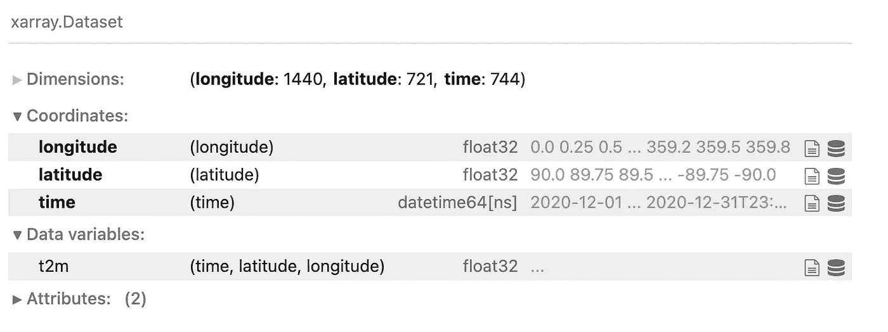
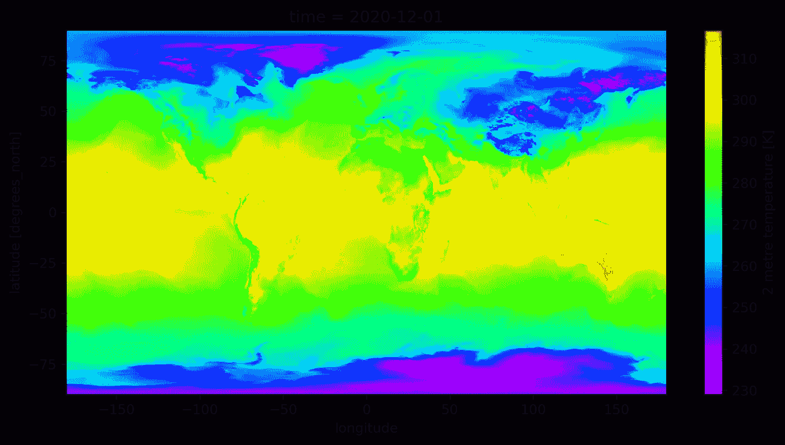
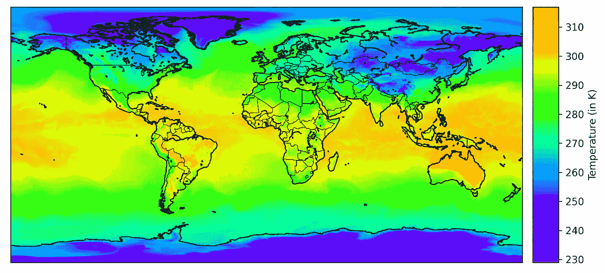
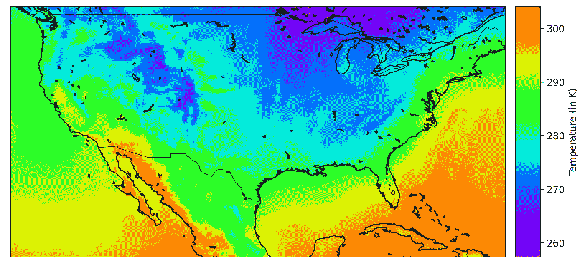
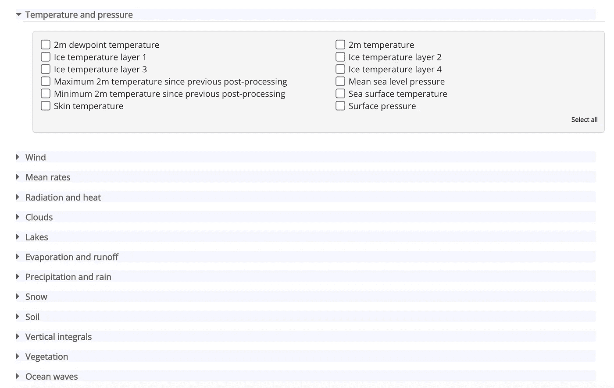

# 什么是 NetCDF 数据，为什么有趣？

> 原文：<https://towardsdatascience.com/what-is-netcdf-data-and-why-is-it-interesting-ec26bcece19d>

## NetCDF 数据格式的简单介绍——如何使用 Python 库(如 Xarray 和 netCDF4)读取和操作它。


照片由[格雷格·罗森克](https://unsplash.com/@greg_rosenke?utm_source=unsplash&utm_medium=referral&utm_content=creditCopyText)在 [Unsplash](https://unsplash.com/s/photos/globe?utm_source=unsplash&utm_medium=referral&utm_content=creditCopyText) 拍摄

我想你是一名科学家(或者只是一名气候爱好者)，你想研究全球变暖的影响。很自然，你会想收集温度、降雨量等数据。你正在研究的地方。这可能是一个城市，一个国家，或者整个地球。为了进行准确的分析，您需要收集几十年的数据。

现在，我们有了一些要求，综合所有这些要求，我们可以得出结论，数据集应该包含:

1.  空间信息—地球表面的位置。
2.  时间信息-在一天或一年中的什么时间进行测量。
3.  科学价值——如温度、降雨量等。我们之前讨论过。

上述特性导致了数据集的巨大规模，我们希望它具有可伸缩性和可追加性(因为每天都有新数据生成)。

简单地说，这就是 NetCDF 数据格式的作用。它以易于阅读的方式保存纬度和经度、时间以及科学测量等形式的空间信息。

网络通用数据格式(简称 NetCDF)是一种数据格式，也是一套软件库，旨在帮助科学界，尤其是地球科学。

首先，让我们下载一些 NetCDF 文件，我们可以开始探索它们。我更喜欢从哥白尼那里免费下载。[哥白尼](https://en.wikipedia.org/wiki/Copernicus_Programme)是一个由欧盟及其机构管理的地球监测项目。他们提供了一个名为[气候数据存储](https://cds.climate.copernicus.eu/#!/home)的 API 来下载与任何气候变量相关的任何数据。

我从这个[链接](https://cds.climate.copernicus.eu/cdsapp#!/dataset/reanalysis-era5-single-levels?tab=form)下载了一个示例`.nc`文件。我选择了 2020 年 12 月的“2 米温度”(地球表面以上 2 米的空气温度)。我获得的文件大小是 1.4 GB，这是巨大的。所以当你下载 NetCDF 文件时要小心。

下载完成后，可以使用两个库——Xarray 和 netcdf 4——在 Python 中轻松访问数据集。我更喜欢使用 Xarray，因为它简单并且提供了更多操作数据集的功能。

> NetCDF 文件使用格式`.nc`存储

## 使用 Xarray

```
import xarray as xr
ds = xr.open_dataset('test.nc')ds = xr.open_mfdataset(['test1.nc','test2.nc']) #for multiple files
```

您可以使用`open_dataset`方法和`open_mfdataset`读取单个`.nc`文件，如果您正在处理多个`.nc`文件的话(这是通常的情况)。



Xarray 中的 NetCDF 数据(作者提供照片)

数据集有 3 个坐标，即经度、纬度和时间。经度的范围从 0 到 360，步长为 0.25，纬度的范围从 90 到-90，步长相同。我们只有一个名为“t2m”的数据变量，它被映射到 3 个坐标。

**注意**:你应该小心坐标惯例。例如，经度可以从 0°到 360 °(就像我们数据集的情况)或从-180°到 180°来表示。

您可以使用以下方法检索数据集的属性:

```
ds.dims
ds.attrs
ds.coords
ds.data_vars
```

## 使用 netCDF4

这个库的语法与 Xarray 的语法相似。

```
import netCDF4 as nc
ds = nc.Dataset('test.nc')ds = nc.MFDataset(['test1.nc','test2.nc']) #for multiple files
```

要访问数据集的属性，您可以使用:

```
ds.dimensions
ds.variables
```

它的工作原理与 Xarray 略有不同。

# 数据操作

## 改变经度惯例

要将经度的约定从 0-360 更改为-180–180，我们可以使用以下代码:

```
ds.coords['longitude'] = (ds.coords['longitude'] + 180) % 360 - 180
ds = ds.sortby(ds.longitude)
```

现在，让我们检查 Xarray 中的一些切片方法。

## 分时

为了选择特定时间的网格数据，我们可以利用 Xarray 的`.sel`和`.isel`方法。

时间以`datetime64`格式编码，所以我们可以利用`datetime`库来检索它。

检索 2020 年 12 月 15 日 13:00 的值的代码如下:

```
import datetimemytime = datetime.datetime(2020, 12, 15, 13, 0, 0)ds.sel(time = mytime)
```

要选择日期范围，请执行以下操作:

```
time_start = datetime.datetime(2020, 12, 15, 13, 0, 0)
time_end = datetime.datetime(2020, 12, 16, 13, 0, 0)ds.sel(time=slice(time_start, time_end))
```

您可以使用`ds.isel(time=0)`选择使用时间索引而非实际值的数据集。

## 切片纬度和经度

目前，我们在数据集中有整个地球的坐标。但是如果你想玩属于某个国家或者某个地方的数据呢？为此，我们可以对横向、纵向网格进行切片，这是一个简单的过程。

第一步:获取你想要切片的区域的边界。作为一个例子，我将使用美国的边界(不包括阿拉斯加和夏威夷)。

步骤 2:使用以下代码进行切片:

```
# US coordinate bounds
min_lon = -128 
min_lat = 19
max_lon = -67
max_lat = 50# mask the coordinates
mask_lon = (ds.longitude >= min_lon) & (ds.longitude <= max_lon)
mask_lat = (ds.latitude >= min_lat) & (ds.latitude <= max_lat)# clip the dataset for only lat,lon inside US
ds.where(mask_lon & mask_lat, drop=True)
```

还有一些其他的数据操作技术，比如重采样、插值等(我将单独写一篇关于这些方法的文章)。

# 绘制 NetCDF

我们发现了什么是 NetCDF 以及如何操作它的一些特性。数据可视化是您可以做的有趣的事情之一，在这里，您可以使用 Xarray 的`.plot()`方法简单地绘制数据。

由于这是一个静态图像，我们将随机选择一个日期(2020 年 12 月 1 日)，然后进行可视化。

## 使用 Xarray 的图

```
mytime = datetime.datetime(2020, 12, 1, 0, 0, 0)
ds.sel(time = mytime).t2m.plot(cmap='gist_rainbow_r',figsize=(10,5))
```



Xarray 情节(作者照片)

我们绘制了 2020 年 12 月 1 日午夜的全球气温图。不出所料，两极的温度很低，而赤道附近(热带)的温度较高。

这个就不多赘述了。我们可以使用名为 Basemap 的不同库来生成类似的图，并控制可视化中显示的内容。

## 使用底图

```
from mpl_toolkits.basemap import Basemapmytime = datetime.datetime(2020, 12, 1, 0, 0, 0)
ds_sel = ds.sel(time=mytime)
lat = ds_sel.latitude.values
lon = ds_sel.longitude.values
t2m = ds_sel.t2m.valuesmp = Basemap(projection='cyl',resolution='l')
lon,lat = np.meshgrid(lon,lat)
x,y = mp(lon,lat)plt.figure(figsize=(10, 5),dpi=300)
mp.pcolor(x,y,t2m,cmap='gist_rainbow_r')
mp.drawcoastlines()
mp.drawcountries()
mp.colorbar(label="Temperature (in K)")
plt.show()
```



底图绘图(作者提供的照片)

我们刚刚在之前的可视化中添加了国家轮廓和海岸线，现在看起来更好了。使用底图，我们可以很好地控制输出可视化，并且调整设置更简单。

我们观察到在喜马拉雅山脉、西伯利亚以及中国和中亚的部分地区附近有冷点。澳大利亚通常在一年中的这个时候比较暖和。

# 绘制区域图

看到整个地球的可视化(等高线图)是很有趣的。现在，我们将看到如何为某个区域制作可视化效果。

首先，使用边界对纬度、经度网格进行切片(在感兴趣的地方形成一个假想的矩形)。然后我们使用这些边界来裁剪数据集。

```
# US coordinate bounds
min_lon = -128
min_lat = 19
max_lon = -67
max_lat = 50# mask the coordinates
mask_lon = (ds.longitude >= min_lon) & (ds.longitude <= max_lon)
mask_lat = (ds.latitude >= min_lat) & (ds.latitude <= max_lat)# clip the dataset for only lat lon inside US
da = ds.where(mask_lon & mask_lat, drop=True)# select the time
mytime = datetime.datetime(2020, 12, 1, 0, 0, 0)
ds_sel = da.sel(time=mytime)lat = ds_sel.latitude.values
lon = ds_sel.longitude.values
t2m = ds_sel.t2m.valuesmp = Basemap(projection='cyl',
llcrnrlon=min_lon,llcrnrlat=min_lat,
urcrnrlon=max_lon,urcrnrlat=max_lat,resolution='i')
lon,lat = np.meshgrid(lon,lat)
x,y = mp(lon,lat)plt.figure(figsize=(10, 5),dpi=300)
mp.pcolor(x,y,t2m,cmap='gist_rainbow_r')
mp.drawcoastlines()
mp.drawcountries()
mp.colorbar(label="Temperature (in K)")
plt.show()
```



美国及其邻国的区域图(作者照片)

现在我们有一个显示美国及其邻国的区域图。请注意，颜色条与之前的可视化效果相比，具有不同的最小值和最大值。这是因为我们现在使用的是属于我们裁剪区域的局部最小值和局部最大值。

如果要使用全局值，则应避免裁剪过程，而只使用底图参数中的边界。

# 选择其他变量

我选择了`2m Temperature`作为例子，但是你有各种各样的气候变量可以选择。下面显示的是各种气候变量的选择，你可以从[哥白尼网站](https://cds.climate.copernicus.eu/cdsapp#!/dataset/reanalysis-era5-single-levels?tab=form)免费下载。



气候变量(哥白尼计划)

# 结论

几个月前，我开始探索 NetCDF 等与气候相关的数据集，并发现它们非常有趣。通常，数据科学家没有机会探索如此多样的数据格式，除非他们在不同的领域工作，如气候。所以我想把它分享给社区是个好主意。

如果您喜欢这篇文章，您可能会对阅读我如何使用 NetCDF 数据集制作 NFT 感兴趣。这里可以看[。](https://betterprogramming.pub/the-data-scientists-guide-to-creating-an-nft-collection-in-python-de1b98163875)

感谢阅读，干杯！

```
**Want to Connect?** You can reach me on [LinkedIn](https://www.linkedin.com/in/rohithteja/), [Twitter](https://twitter.com/rohithtejam), or [GitHub](https://github.com/rohithteja).
```