# 如何使用量子神经网络模型对加密数据进行分类

> 原文：<https://towardsdatascience.com/what-is-quantum-machine-learning-and-how-to-create-a-quantum-neural-network-model-a59bd571021d>

## 量子机器学习初学者指南

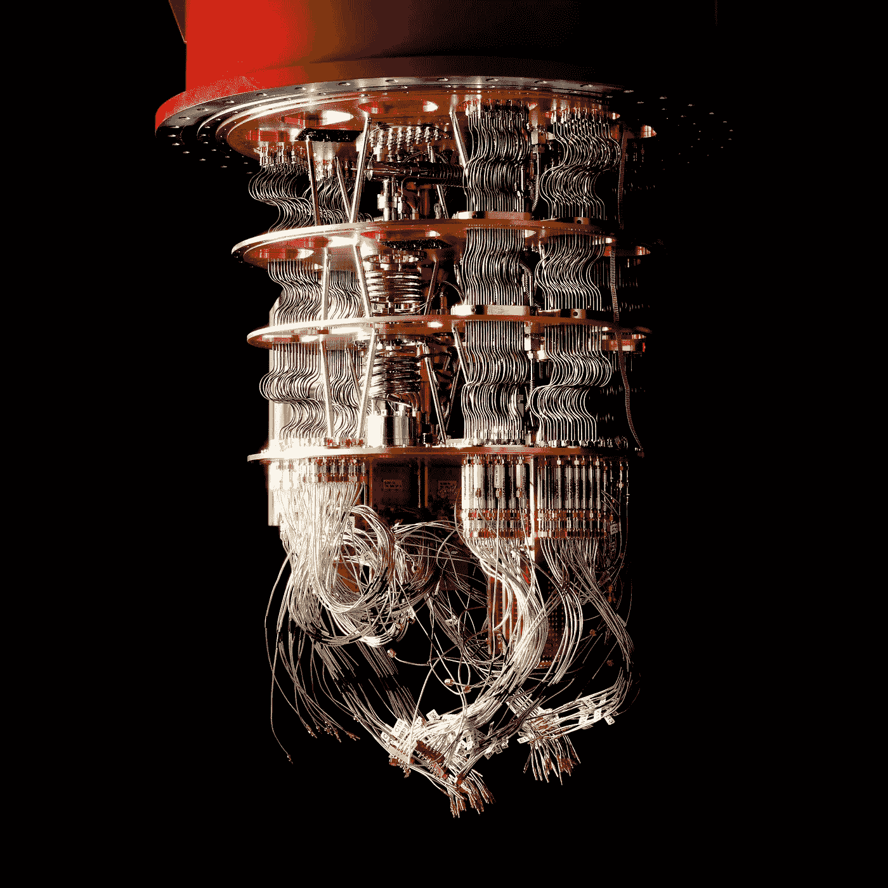

经许可使用，[来源](https://www.caferacks.com/quantum_computing/)

> **自然不是经典的，该死的，如果你想模拟自然，你最好做量子力学的！**
> 
> **——理查德·费曼**

量子计算机是一种新型的高级计算机，它依靠量子力学定律来解决经典计算机无法解决的问题。我们现在正在进入一个激动人心的时代，量子计算机正在变得强大和高性能，足以在几分之一秒内完成传统计算机需要几年才能完成的任务！

**例如:**谷歌的 Sycamore 量子处理器拥有大约 50 个量子位，能够在几百秒内完成一次超级计算机需要 9000 多年才能完成的计算！这是[嘈杂的中等规模量子](https://quantum-journal.org/papers/q-2018-08-06-79/) (NISQ)计算时代的开始，在未来的几年里，具有数百个量子位的量子硬件有望出现，从而使各种量子算法，如[肖尔的因式分解算法](https://arxiv.org/abs/quant-ph/9508027)或[格罗弗的搜索算法](https://arxiv.org/abs/quant-ph/9605043)得以大规模实施。

量子计算机具有巨大的潜力来解决优化、量子模拟、机器学习和密码学等学科中一些最具挑战性的问题，因为它们以量子形式存储和处理数据。在本文中，我们将讨论**量子机器学习**，并将构建一个量子神经网络模型，该模型可以以超过 90 %的准确率对**加密的**手写数字图像进行分类！

# 什么是量子机器学习(QML)？

量子机器学习通过利用量子计算的潜力，加速和改进在我们每天使用的“经典”计算机上进行的机器学习。他们使用在量子设备(如量子计算机)上执行的算法来补充、加速或支持传统机器学习程序执行的工作。下面是量子机器学习的几个应用:

*   新型机器学习算法的设计。
*   量子神经网络的发展，它可以用很少的步骤和灵活的处理能力发挥作用。
*   使用量子放大强化学习，其中机器学习的算法通过与量子环境交互来获取知识
*   可以提高识别和分类模式的能力。

在深入构建量子神经网络模型之前，我们必须了解量子力学和量子计算的一些基本原理。

# 量子位和叠加

与经典计算机不同，量子计算机使用量子位，或**量子位**来存储数据，这是利用量子物理定律来操纵的。一个量子位可以同时有几种状态，取值范围从 0 到 1，不像一个比特只能有两种状态(0 或 1)。让我们借助一个例子来理解这一点:

想象一下，扔一枚有两面的硬币——正面(1)和反面(0)。在扔硬币的过程中，我们无法决定硬币的方向，除非我们阻止它，或者它掉在地上。通过参考下面的抛硬币，我们可以说，根据我们的观点，它有两种状态。

经许可使用

一个量子系统在被测量之前处于多个状态的这种能力，被称为两个状态的 ***叠加*** 。叠加时测到 0 或 1 的概率既不是 0.0 也不是 1.0。简单地说，一个量子位同时处于多种状态，当叠加态崩溃时，它只能处于单一状态(掷硬币实验中的正面或反面)。

# 布雷克记号

在量子力学中， **Bra-ket** 记号(也称为 **Dirac** 记号)用于描述由尖括号(**〉和竖线(|)组成的量子态，并用于构造 **bras** 和 **kets。****

例如:

**〈x|**

这叫做 ***胸罩*** ，它在数学上表示一个线性函数

***x: V → C***

这是一个线性映射，将 ***V*** 中的每一个向量映射到复平面 ***C*** 中的一个数。

***|y* 〉**

这被称为 ***ket*** ，数学上它表示复向量空间 ***V.*** 中的一个向量 ***y***

这是当一个线性函数(**‎x |**)应用于一个向量( ***|y* 〉** )时的样子。

**】*x | y*〉*⍷c***

使用 Bra-ket 符号，我们可以表示量子位的叠加态:

*   测量前:***|ψ*〉*=α| 0*〉*+β| 1*〉**
*   测量后:***| 0*〉或 *|1* 〉**

# 布洛赫球

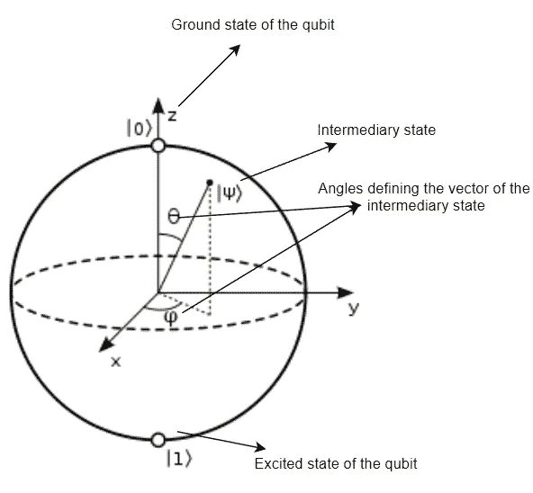

作者创建的图像

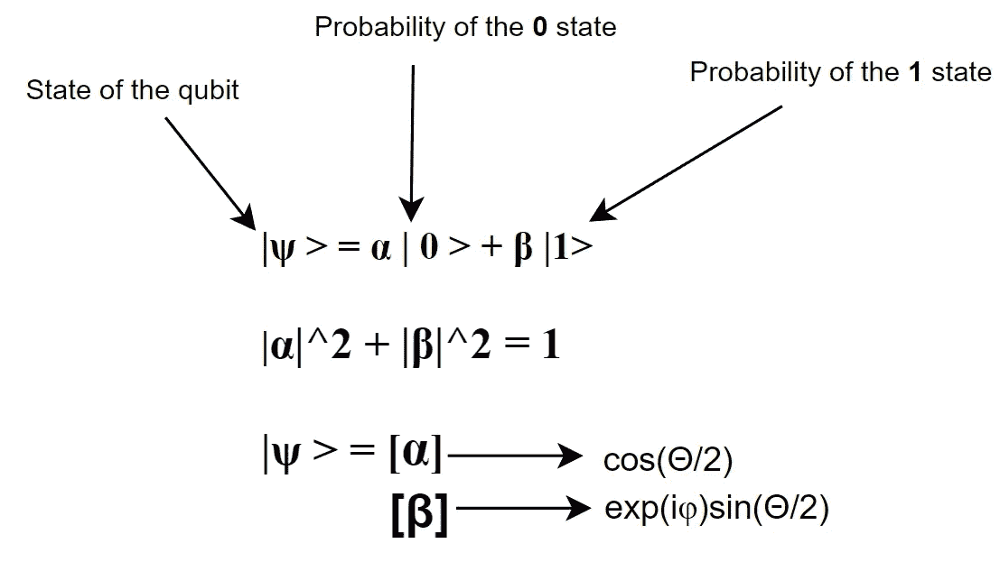

受[启发来源](https://en.wikipedia.org/wiki/Bloch_sphere)

使用 [**布洛赫球**](https://en.wikipedia.org/wiki/Bloch_sphere) 对量子位进行数学符号化。典型长度为 1 的二维向量用于表示量子位的状态。这个向量由两个元素组成——一个实数 ***α*** 和一个复数 ***β*** 。

# *量子纠缠*

> **在距离的鬼魅动作！**
> 
> **—阿尔伯特·爱因斯坦**

当物体变得极小或达到量子领域时，会出现一种奇异的现象，这就是量子纠缠。让我们用一个例子来为量子位理解这一点:想象有一个盒子，里面有一双鞋。我们从箱子里取出一只鞋，然后把剩下的箱子运到另一个国家。后来发现，选择的鞋子是正确的；因此，无论我们把盒子里的鞋子放在哪里，它永远都是左边的那只。

与此类似，如果我们取两个量子比特，其中一个处于自旋向上的位置，我们可能确定另一个处于自旋向下的位置。不存在两个量子位处于相同位置的情况。这就是所谓的 ***量子纠缠*** 。

# 量子退相干

[量子退相干](https://en.wikipedia.org/wiki/Quantum_decoherence)是量子系统的信息因系统与其环境的相互作用而改变的过程。量子比特叠加会导致量子退相干之类的问题。这些不必要的坍塌不规则地、有机地发生，作为最终导致计算误差的系统扰动的结果。当我们对一个我们认为处于叠加态但实际上不是的量子比特进行操作时，结果不会是我们所预期的那样。这就是为什么我们重复运行相同的程序。

量子编程的目的是控制你的量子位的量子状态，以达到对感兴趣的特定问题的解决方案。制作量子电路是量子计算机编程的初始阶段。一旦我们选择了一个特定的问题，并确定了量子计算机将如何解决它，我们就需要构建一个电路，概述一组将在量子计算机中的量子位上执行的操作。

一般来说，[量子电路](https://en.wikipedia.org/wiki/Quantum_circuit)是展示如何在量子计算机上进行量子计算来解决给定问题的图。这是一个量子电路的例子:

N. David Mermin 的《[量子计算机科学——简介](https://library.uoh.edu.iq/admin/ebooks/40814-quantum_computer_science_2.pdf)》第 53 页，经许可方许可转载

这个图表就像一张乐谱一样，从左到右阅读。图中的盒子代表应用于一个或多个量子位的量子门，这取决于一个盒子连接了多少根导线。[量子门](https://en.wikipedia.org/wiki/Quantum_logic_gate)是告诉量子计算机发送控制信号的指令，以便对量子比特执行特定的量子动作。如果我们有一个量子电路图，我们可以用它向我们的量子计算硬件发送微波脉冲和指令，然后它将执行量子门并读出结果。

量子电路图可能看起来很吸引人，但是如果我们必须为在量子计算机上执行的每个量子计算创建图表，并且如果我们的量子程序特别长，那么它将变得非常难以完成。为了解决这个问题，研究人员已经创建了框架来创建描述量子电路的更传统风格的程序。我们可以使用各种框架来构建量子电路，包括 [Qibo](https://qibo.readthedocs.io/en/stable/) 、 [Pennylane](https://docs.pennylane.ai/en/stable/introduction/pennylane.html) 、 [Qiskit](https://qiskit.org/) 、 [Cirq](https://quantumai.google/cirq) 和[草莓地](https://strawberryfields.readthedocs.io/en/stable/introduction/introduction.html)。今天我们将学习如何使用 Cirq 创建一个量子电路！

让我们构建我们之前看到的相同的量子电路！

> **注:**
> 
> 上面的量子电路图描述了[Bernstein–vazi rani](https://en.wikipedia.org/wiki/Bernstein%E2%80%93Vazirani_algorithm)算法的一个实例。

在开始之前，请确保使用以下命令安装 cirq:

此外，导入它将允许您确定它是否安装正确:

先说电路的结构。正如我们看到的，总共有 6 个量子位，让我们逐个创建它们:

> **注意**:
> 
> 由于在 python 中索引是从 0 开始的，所以我将我的量子位命名为 qubit_0、qubit_1 等等。

您可以通过简单地打印来检查您的初始化量子位:

这种制造量子位的方法并不总是可行的。如果我们想要创造数百个量子位而不是几个呢？

嗯，我们可以通过使用`range`函数来做到这一点，它创建了一个提到的量子位数量的列表。

有时，我们可能更关心量子电路在一个量子位网格上的功能，而不是一行量子位。此外，当使用量子硬件时，这变得尤其重要。这是谷歌 Sycamore 量子处理器的图像和处理器上物理量子位网格的图像:

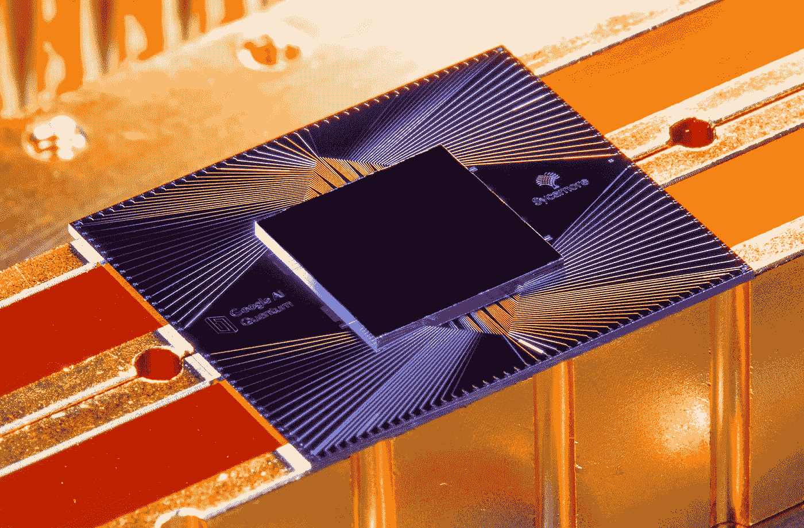

经许可使用，[来源](https://ai.googleblog.com/2019/10/quantum-supremacy-using-programmable.html)

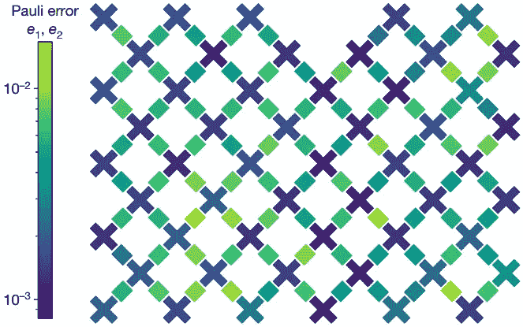

经许可使用，[来源](https://ai.googleblog.com/2019/10/quantum-supremacy-using-programmable.html)

当定义量子硬件的操作时，我们将使用类似于上图所示的量子位网格。

在 Cirq 中，我们可以使用以下命令创建一个量子位网格:

与线量子位相比，对于网格量子位，我们需要提到两个参数而不是一个——X 坐标和 Y 坐标，以指定 X-Y 平面中量子位的位置。

我们也可以创造不同形状的量子位，像长方形和正方形。

同样，我们以正方形的方式创建网格量子位:

在这里，我们可以看到量子位是以矩形和正方形网格形状生成的，其中“cirq”中的`x`和`y`。GridQubit(x，y)"表示 x 坐标和 y 坐标。

让我们回到构建我们的量子电路。在我们的量子电路中，我们可以看到有两种类型的方盒子，标记为 **H —** 代表 ***阿达玛*** 门， **X —** 代表 ***CNOT(受控非)*** 门。如果你希望了解更多关于量子门的知识，请参考[这篇](https://en.wikipedia.org/wiki/Quantum_logic_gate)。

如果我们仔细看看我们的量子电路图，我们可以看到所有的量子位都已经初始化为状态 0，除了最后一个，它已经初始化为状态 1。在 Cirq 中，默认情况下，状态被初始化为状态 0，因此我们不需要对前五个量子位进行任何更改，除了最后一个需要从 0 翻转到 1。在量子计算中，这可以通过应用 ***X*** 门来实现。

在上面的代码中，我们首先创建了一个电路，在最后一个量子位上应用了一个 ***X*** 门，然后我们将 ***H*** 门应用于它们中的每一个。我们可以做一个循环来加速这个过程，而不是一次应用一个门。

接下来，我们可以看到有一系列的 CNOT 门，从量子位 4 到量子位 5，量子位 1 到量子位 5，量子位 0 到量子位 5。

最后，我们应用六个 ***哈达玛*** 门。

嗯，这个电路图看起来不像预期的，对吧？我们可以看到所有的哈达玛门都尽可能地放在左边。这是因为每当我们向量子位添加新操作时，Cirq 默认使用这种插入策略。但是如果我们不想使用这个默认的插入策略呢？

我们可以通过明确定义所需的[力矩](https://quantumai.google/cirq/build/circuits)的数量来做到这一点。让我们从头开始:

现在我们可以看到，我们的量子电路与图表中的电路完全匹配！

既然我们的量子电路现在已经准备好了，那就让我们在一台完美的量子计算机上模拟一下吧！该模拟基本上给出了在应用相应的门之后关于量子位的状态的信息，因此我们需要的结果应该是 1、1、0、0、1 和 1。

现在我们已经完全具备了所有需要的知识和技能，让我们开始构建一个量子神经网络模型，使用 TensorFlow Quantum 对手写数字的加密图像进行分类！

经许可方许可，通过 PLSclearLet 进行复制。从安装和配置必要的软件包开始！！

> **注意:** TensorFlow Quantum 需要 TensorFlow 版本 2.7.0，因此在虚拟环境或 Google Colab 中工作是可行的。

导入必要的包:

更新包资源以管理版本更改:

考虑到 MNIST 数据集包含 60，000 幅图像，为了节省时间，我们将处理二进制分类，这将对数字 3 和 6 进行分类，而不是多分类(数字 0-9)。

> **注:**
> 
> 下面的量子神经网络模型是基于这篇由谷歌和麻省理工学院(MIT)联合发表的[研究论文](https://arxiv.org/pdf/1802.06002.pdf)。

# 数据预处理 **:**

现在让我们创建一个只保留数字 3 和 6 的函数。此外，由于这种分类是二进制的，我们将把它转换为 True (3)和 False (6)。将其转换为 0 和 1 是实现这一点的另一种方法。

让我们看看第一个例子:

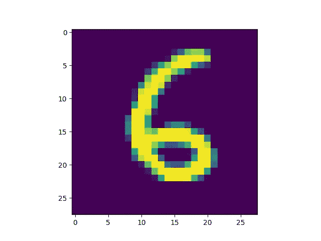

经许可使用，(邓梨，“用于机器学习研究的手写数字图像 mnist 数据库”)[来源](https://www.tensorflow.org/quantum/tutorials/mnist)

目前，我们的图像大小为 28 x 28 像素，当前的量子计算机不足以处理它。因此，我们必须将它缩小到 4 x 4 像素的大小。

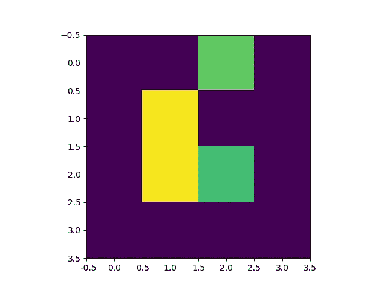

经许可使用，(邓梨，“用于机器学习研究的手写数字图像 mnist 数据库”)，[来源](https://www.tensorflow.org/quantum/tutorials/mnist)

根据这篇[研究论文](https://arxiv.org/pdf/1802.06002.pdf)的第 3.3 节，数字 3 由 797 个不同的 16 位字符串组成，数字 6 由 617 个不同的 16 位字符串组成，197 个不同的图像被标记为 3 和 6。因此，我们需要通过消除矛盾的例子或属于两类的图像来过滤数据集。

> **注:**
> 
> 结果可能不一定与研究论文中提到的报告结果相符。

如前所述，在量子计算机上处理任何事情都需要通过量子电路，图像也不例外。根据[论文](https://arxiv.org/pdf/1802.06002.pdf)，已经用一个量子位来表示每个像素，状态根据像素的值而变化。将信息转换成二进制编码是实现这一目标的第一步。

现在，我们将把我们的训练集和测试集转换成量子电路。此外，像素索引值超过阈值的量子位通过 ***X*** 门旋转。

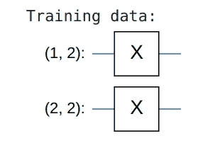

图片由作者提供，灵感来自[来源](https://www.tensorflow.org/quantum)

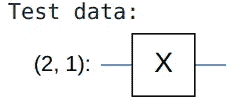

图片由作者提供，灵感来自[来源](https://www.tensorflow.org/quantum)

> 注意:
> 
> 通过使用`SVGCircuit`,我们可以用一种更吸引人的方式来描绘我们的量子电路

由于普通大众无法使用量子计算机，我们将使用模拟全连接、无噪声量子系统的模拟器。尽管事实上我们正在模拟一台量子计算机，但模拟所需的所有计算都将在经典计算机上进行。由于计算变得太复杂，经典计算机无法处理，我们将把量子电路转换成张量。

# 量子神经网络模型:

现在，数据预处理部分已经完成，让我们开始构建我们自己的量子神经网络模型！

由于分类是基于读出量子位的假设，我们将使用两个量子位，读出量子位总是起作用，正如在[论文](https://arxiv.org/pdf/1802.06002.pdf)中提出的。

让我们创建一个示例电路层:

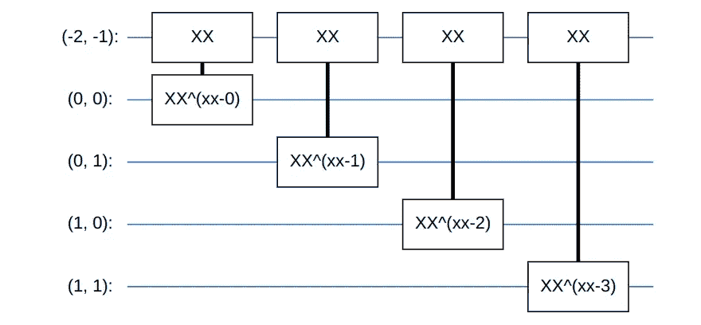

示例电路(图片来自作者，灵感来自[来源](https://www.tensorflow.org/quantum))

现在，让我们创建一个与电路大小相同的模型，其中包括必要的操作。

将电路封装在 tfq-keras 模型中，该模型将从`x_train_circuit`获得 ***量子数据*** ，该数据将对经典数据进行编码。它使用*参数化量子电路*层在量子数据上训练模型电路。我们不会显式地模拟模型，因为每次使用模型(用于训练或测试)时都会进行模拟。模拟由*参数化量子电路*层(`tfq.layers.PQC`)负责。

在编译我们的模型之前，我们需要注意两件事:

1.  由于我们将使用铰链损失，我们需要将标签从布尔(真/假)转换为铰链损失所期望的`[-1,1]`。

2.我们将需要一个定制的`hinge_accuracy`指标，因为我们使用的是铰链损耗的修改版本。

> 注意:
> 
> 将输出范围更改为`[0, 1]`，并将其视为模型分配给类别 3 的概率，这是另一种可能的策略。对于这种方法，可以使用`tf.losses.BinaryCrossentropy` loss。

# 训练模型:

> **注:**
> 
> 如果您没有足够的时间或计算能力，可以随意使用数据的子集进行训练。

让我们评估一下我们模型的准确性:

太棒了。🥳

我们现在有了一个量子神经网络模型，可以以大约 91 %的准确率对手写数字图像进行分类！

# *推论:*

让我们在一个 ***加密的*** 图像上试验我们的模型，现在模型已经被创建、训练和评估了！

在执行推理之前，让我们编写一些必要的函数:

进口:

用于加密、解密、图像呈现和推断的功能:

> 注意:
> 
> 出于本文的考虑，我将对图像进行加密和解密，但实际上数据可能已经加密了。

我们将使用 **Fernet** ，一个对称加密的实现，来加密图像。Fernet 可以通过 [**密码术**](https://github.com/pyca/cryptography) **—** 一个 Python 模块，让 Python 程序员可以访问密码原语。这是我的样本图像:

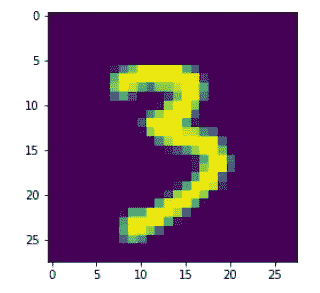

经许可使用，(邓梨，“用于机器学习研究的手写数字图像 mnist 数据库”)，[来源](https://www.tensorflow.org/quantum/tutorials/mnist)

加密图像:

> 注意:
> 
> 这个秘密密钥只是为了本文而显示的；实际上，这应该是保密的。

加密后，我们将得到一个加密的图像和一个私钥:

现在我们有了一个加密的图像，让我们解密它并执行推理:

让我们检查一下我们是否得到了我们的解密图像:

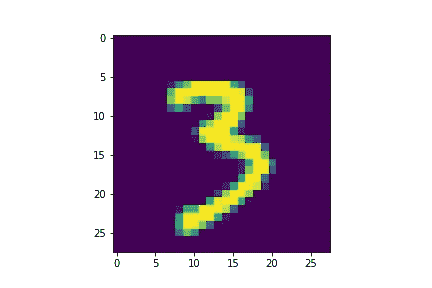

经许可使用，(邓梨，“用于机器学习研究的手写数字图像 mnist 数据库”)，[来源](https://www.tensorflow.org/quantum/tutorials/mnist)

调整图像大小:

> 注意:
> 
> 由于图像的大小不同于我们用来训练模型的图像，因此调整大小是必不可少的。

预处理和推断(预测):

**好极了！ 🥳**

最后，我们有一个量子神经网络模型，可以以大约 91 %的准确率对手写数字的加密图像进行分类！

本文中使用的所有代码都可以在我的 GitHub 上找到。

GitHub 资源库链接:[https://github.com/saurav935/Quantum-Machine-Learning](https://github.com/saurav935/Quantum-Machine-Learning)

**如果您希望了解更多关于此主题的信息，请随意浏览以下资源:**

[张量流量子](https://www.tensorflow.org/quantum)

[在近期处理器上使用量子神经网络进行分类](https://arxiv.org/abs/1802.06002)

[量子卷积神经网络](https://arxiv.org/abs/1810.03787)

[量子进化神经网络:用量子电路驱动图像识别](https://arxiv.org/abs/1904.04767)

[量子光学卷积神经网络](https://ieeexplore.ieee.org/abstract/document/9492087)

[量子图像处理:机遇与挑战](https://www.hindawi.com/journals/mpe/2021/6671613/)

[Fernet(对称加密)](https://cryptography.io/en/latest/fernet/)

***享受量子计算！*** ✌️