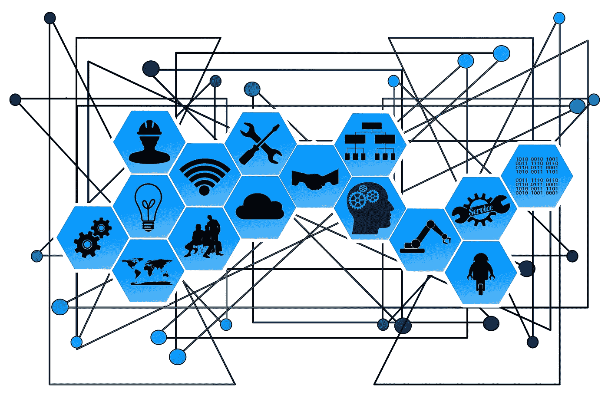
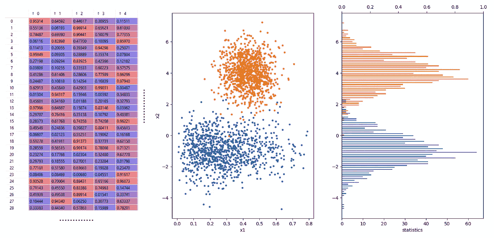
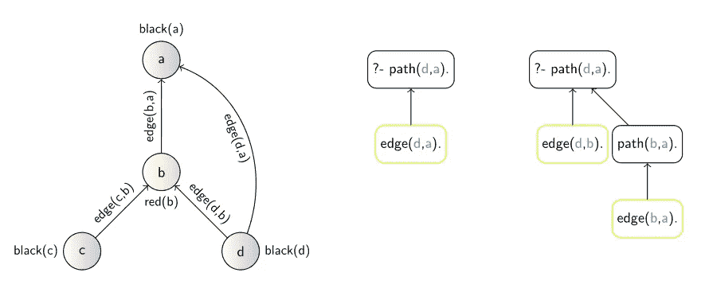
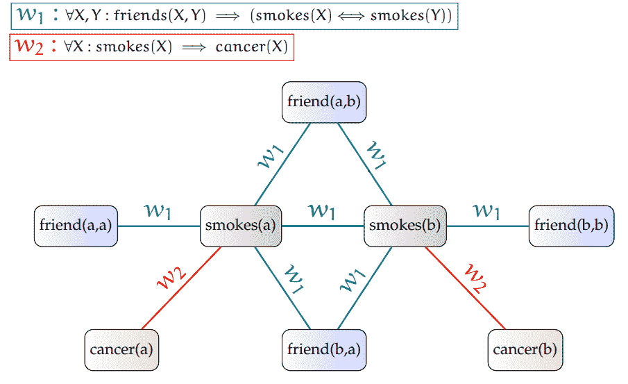

# 什么是关系机器学习？

> 原文：<https://towardsdatascience.com/what-is-relational-machine-learning-afbe4a9c4231>

## *走向* [*深度关系学习*](https://medium.com/tag/deep-relational-learning)

## *深入研究特征向量之外的学习表示基础*



关系学习旨在从具有 ***复杂*** 内部和/或外部**关系**的**结构化**数据中学习。(图片来自 [pixabay](https://pixabay.com/photos/web-network-points-lines-2496193/) )

## 从 AI 到 ML

所有智能生命形式都本能地模仿它们周围的环境，以便用它们的行动积极地在其中导航。在人工智能(AI)研究中，我们试图理解并自动化生命系统的这一有趣能力，以*机器学习* (ML)为核心。

*   一般来说，推导复杂系统的数学模型是任何科学学科的核心。研究人员总是试图提出控制他们感兴趣的系统行为的方程，范围从物理、生物到经济学。

机器学习然后实例化搜索最适合观察数据的数学假设(模型)的科学方法。然而，由于计算的进步，它允许进一步*自动化*这一过程，以大量*数据驱动*的方式搜索大型预制假设空间。这在复杂系统的建模中特别有用，对于复杂系统，潜在假设空间的结构太复杂，或者甚至是未知的，但是大量数据是可用的。

*   公平地说，一种被称为“模型识别”的类似方法也是*控制理论*的传统部分，其中描述底层系统动态的微分方程的参数是从通常也是复杂的系统范围内测量的输入-输出数据中估计的。有了一个精确的模型，就可以得出最优的控制行为，从而引导系统朝着理想的目标度量发展，这很大程度上符合现在所谓的人工智能的精神(少用数学，多用宣传)。

## 特征向量的来源

虽然复杂系统的数学建模问题的方法以各种各样的、很大程度上独立的方式发展，但有一个方面仍然几乎是通用的——数据表示。事实上，虽然假设和模型的数学形式传统上变化很大，从控制理论中使用的分析表达式和微分方程，一直到现在 ML 中使用的决策树和神经网络，但输入输出观察传统上被限制为*数字向量*的形式。

这似乎很自然。自从计算机出现以来，我们已经非常习惯于将任何感兴趣的属性转化为数字，从物理测量，如力或电压，一直到颜色、情绪或对番茄酱而非芥末的偏好。

给定可以在感兴趣的系统上测量的多个这样的输入( *X* )和输出( *Y* )变量，从发电厂到人，然后每个这样的测量减少到特定的数字向量，通常称为 ***特征向量*** 。

但是还有另一个很好的理由来解释为什么特征向量非常吸引人。将每个数据样本(测量)视为 n 维空间中的一个独立点允许直接采用线性代数的标准机制，这是由来自其他领域的数百年的先前工程所证明的。



具有独立身份特征向量(n 维点)的经典机器学习“只是”多元统计...图片由作者提供。

由于这种假设从一些联合 *Pxy* 分布中独立相同地抽取(i.i.d .)样本的表示，机器学习研究也可以直接建立在来自概率浓度界限(例如 Hoeffding)的已知统计结果上，以提出“可能近似正确”(PAC)学习的标准 ML 理论。因此，许多经典的机器学习，至少在适当研究时，属于 [*多元统计*](https://stats.stackexchange.com/questions/6/the-two-cultures-statistics-vs-machine-learning) 。

作为结果，任何经典的 ML 方法现在都期望以 ***表格*** 的形式输入数据，其中每一列对应于一个特征 *X* 或目标变量 *Y* ，每一行对应于单个示例测量。然后，最一般的任务是估计生成观察数据的联合概率分布 *Pxy* ，或者更常见地，在监督 ML 中，仅估计条件 *Py|x* 。这些也是统计学长期以来普遍研究的课题。

## 对关系表示的需求

我们现在已经习惯于将我们的数据预处理成这样一个数字表(或张量),这是几乎任何 ML 库中的输入格式，甚至很难想象这不是无所不包的数据表示。然而，只要环顾四周，看看真实世界的数据是什么样子的。它不是存储在数字向量/张量中，而是存储在互联网页面、社交网络、知识图表、生物、化学和工程数据库等的互连结构中。这些是固有的 ***关系*** 数据，它们自然地以图形、超图和关系数据库的结构化形式存储。


现实世界中的大部分数据都存储在关系数据库中。(图片来自 [pixabay](https://pixabay.com/vectors/database-schema-data-tables-schema-1895779/) )。)

> 但是等等，难道我们不能把这些结构变成特征向量，然后一切恢复正常吗？

嗯，人们这样做肯定是出于前面提到的(方便)原因，直到最近，这还是用这些数据结构做 ML 的主要方式，通常被称为 [***命题化***](https://link.springer.com/referenceworkentry/10.1007%2F978-0-387-30164-8_680) 。例如，可以在结构上计算各种统计数据，例如从一个图中计算出节点、边或子图(也可以利用各种内核方法对这些进行操作)。

从实践的角度来看，从关系结构中加工特性并没有错，但是意识到这种方法背后有一个普遍的认知偏差是有好处的:

> "如果你只有一把锤子，所有的东西看起来都像钉子."

S o，我们能不能跳过这个从关系数据构建特征向量的阶段？如果你现在考虑“深度学习来拯救”，重要的是要认识到，直到最近，所有经典的深度学习方法还局限于固定大小的数字向量(或张量)形式的表示。深度学习背后的思想是“仅仅”跳过从“低级”(输入)表示向量手动构建“高级”表示向量，但你仍然需要后者来开始！

而且，从理论的角度来看，将关系数据转换成向量表示有一个很深的问题，因为在这个预处理(命题化)步骤中，没有办法将一个非绑定的关系结构映射成任何固定大小的表示而不丢失(不希望的)信息。

此外，即使我们将自己限制在固定大小的结构中，以数字向量或张量的形式设计一个合适的表示仍然是一个很大的问题。以图表数据为例，它是关系数据的一种特殊形式。如果有一种明确的方法将一个图映射成一个(固定大小的)数字向量(或张量)的标准学习形式，这将轻松解决*图同构问题*。

*   因为要测试两个图是否同构，将它们转换成这样的向量并比较它们的*等式*就足够了。当然，我们进一步假设创建这样的载体将是有效的(即，不是 NP 完全的)。

因此，在固定大小的数字向量(或张量)的经典空间之外，对于具有这种不规则拓扑的数据，存在根本不同的学习表示形式的内在需求。那么，我们真的可以通过各种网络、(知识)图表和关系数据库的形式来学习关系数据表示吗？

> ***GNNs 上的间奏曲。*** *当然，到现在为止，你可能已经听说过* [*图神经网络*](https://distill.pub/2021/gnn-intro/) *(GNNs)，最近提出要处理图结构数据——不要担心，我们将在* [*后续文章*](/from-graph-ml-to-deep-relational-learning-f07a0dddda89) *中讨论这些！现在，只需注意 gnn 是处理一种形式的关系表示(一个图)的一种特定方式，它植根于一种针对图同构问题的特定(非常好的)启发式方法(*[*Weisfeiler-Lehman*](https://arxiv.org/abs/1810.00826)*)。现在让我们继续从更广阔的角度来看。*

# 关系机器学习

最近的许多深度学习研究都是关于发现模型和学习表示，以各种形式的[集和图](/deep-learning-on-graphs-successes-challenges-and-next-steps-7d9ec220ba8)捕捉数据。然而，很少有人承认，这些[结构化学习表示](https://link.springer.com/referenceworkentry/10.1007%2F978-0-387-30164-8_458)在 [**关系机器学习**](https://link.springer.com/referenceworkentry/10.1007%2F978-0-387-30164-8_719) 中已经被研究了很久(作为特例)。

您可能还记得，*关系*是定义在一些对象集合上的笛卡尔乘积的子集。因此，每个*集合*仅仅是某个(一元)关系的退化情况。然后，每个*图*可以被视为同一组对象(节点)上的*二元* *关系*的实例化。高于二进制的关系则对应于经典的*关系表*，也称为*超图*。在对象上添加多个这样的关系(表)，你就有了一个关系数据库。

许多真实世界的数据都存储在这样的关系数据库中，您以前肯定遇到过这种情况。现在想象一下，您的学习样本并没有很好地准备为单个表中的行，而是分布在数据库的多个相互链接的表中，其中不同的样本由不同类型和数量的对象组成，每个对象由不同的属性集表征。这种情况实际上在实践中并不少见，但是您究竟如何将这样的东西放到您最喜欢的 SVM/xGBoost/NN 模型中呢？

虽然这些数据表示本质上不属于标准向量(张量)形式，但实际上有另一种表示形式非常自然地涵盖了所有这些格式。就是 ***关系逻辑*** 。

事实上，[关系逻辑](https://link.springer.com/referenceworkentry/10.1007/978-0-387-30164-8_311)是所有结构化(关系)表示的通用语言。在实践中，许多为结构化数据设计的标准格式(如 ERM & SQL ),从集合到数据库，都直接遵循关系逻辑(和*关系*代数)。

虽然你可能已经从 CS 101 中熟悉了关系逻辑/代数形式，但很可能你从未在*机器学习*的上下文中听说过它。然而，除了是一个伟大的数据操作和表示形式，关系逻辑也可以用来直接处理复杂的*关系*机器学习场景，就像上面概述的那样。

## 用逻辑学习

除了[机器学习主流](https://medium.com/tag/machine-learning)之外，还有一个[归纳逻辑编程](https://link.springer.com/referenceworkentry/10.1007%2F978-0-387-30164-8_396) (ILP)社区，关注从具有复杂关系结构的数据中学习可解释的模型。

如上所述，ILP 利用关系逻辑形式的表达能力来捕获这些数据结构(包括关系数据库等等)。然而，有趣的是，这里的关系逻辑也被用来表示*模型本身*。在 ILP 中，这些采用逻辑 theories⁴的形式，即由所使用的逻辑关系形成的逻辑规则集。

此外，ILP 引入了 ***背景知识*** 的基本概念，得益于基于逻辑的表示，该概念可以优雅地作为关系归纳偏差直接合并到模型中。

几十年后或[几十年后](https://link.springer.com/article/10.1007/s10994-021-06089-1)【3】这种相当非正统的关系型 ML 方法当时是利用数据样本进行学习的首要场所，这些数据样本不会屈服于标准形式的独立身份特征向量。这使得 ILP 能够探索一些操作结构化数据表示的非常普遍的学习问题，包括参与关系、动作和事件的不同属性的对象，超出了标准统计 ML 的范围。

**举例。**举例来说，让我们看看最近探索的图结构学习问题可以如何用关系逻辑来处理。为了表示一个图，我们简单地定义一个二元的'*边'*关系，对于图中所有相邻的节点 *x，y* 有一组实例化的*边(x，y)* 。此外，我们还可以使用其他(一元)关系来为节点集分配各种属性，例如' *red(x)'* 等。



以关系逻辑编码的标记图结构的示例(左)，以及通过路径的(学习的)递归模型的查询“ *path(d，a)”*的两种可能的推断(右)。*图片由作者(* [*来源*](https://gustiks.github.io/files/dissertation.pdf) *)。*

模型，即逻辑规则，通常表达要在数据中搜索的关系*模式*。这涵盖了从寻找分子中特有的亚结构到网络中的路径的所有事情。由于关系逻辑中的高表达性、声明性和递归的固有使用，学习到的模型通常非常紧凑和优雅。例如，一个完美地捕捉图中路径的(学习的)模型，比如你从 X 到 Y 的地铁连接，通常看起来像

```
path(X,Y) <= edge(X,Y).
path(X,Y) <= edge(X,Z), path(Z,Y).
```

这可以用基本的 ILP 系统从几个例子中很容易地学会。

我有趣的是，这与例如用[可微分神经计算机](https://www.nature.com/articles/nature.2016.20784)处理相同的问题形成了直接的对比——这是最近 Deepmind 的亮点之一，它需要大量的例子和额外的黑客技术(例如，删除无效的路径预测)来处理带有“不适当的”张量(命题)表示(模拟可微分的记忆)的任务。

# 统计关系学习

虽然在表现上更具表达性，但仅用逻辑学习并不适合处理噪音和不确定性。⁵为了解决这个问题，出现了许多方法来合并从 ILP 采用的关系逻辑的表达能力和从经典统计学习采用的概率建模，在 [***统计关系学习***](https://link.springer.com/referenceworkentry/10.1007%2F978-0-387-30164-8_786)【srl)⁶，它涵盖了从展示不确定性和丰富的关系结构的复杂数据中学习模型。特别是，SRL 通过在非逻辑学习世界中受到启发的技术，如基于内核的方法和图形模型，扩展了 ILP。

总的来说，SRL 有两大主流方法——概率逻辑编程和*提升建模*，这将作为我们进一步探索 [*深度关系学习*](/from-graph-ml-to-deep-relational-learning-f07a0dddda89) 概念*的基础。*

## 举起的模型

与标准(也称为“地面”)机器学习模型相反，***提升模型*** 不指定特定的计算结构，而是指定一个*模板*，在给定关系输入数据(也可能是背景知识)的变化上下文的情况下，标准模型从该模板展开作为推理(评估)过程的一部分。

例如,(可以说)最流行的提升模型——一个*马尔可夫逻辑网络*(MLN)【7】可以被看作是经典马尔可夫网络的一个模板。对于预测和学习，MLN 与描述输入数据(例如，数据库)的一组特定的相关事实相结合，并展开经典的马尔可夫网络。让我们仔细看看。

**举例。**例如，这样的 MLN 模板可以表达“吸烟者的朋友往往是吸烟者”和“吸烟可能导致癌症”的一般先验。学习数据然后可以描述具有被如此标记的吸烟者子集的人的社交网络。MLNs 的提升建模范例然后允许基于他们的社会关系归纳所有其他人的吸烟概率，就像通过常规马尔可夫网络建模一样，但是系统地概括不同结构和大小的社会网络！



给定两个人{a，b}，编码关于吸烟习惯的直觉的马尔可夫逻辑网络模板展开成具有共享权重的标准马尔可夫网络。图片由作者([来源](https://gustiks.github.io/files/dissertation.pdf)，受【7】启发)。

重要的是，这也允许被提升的模型在学习 problems⁸时捕捉固有的*，例如通过*绑定它们的参数*，跨越网络中所有不同人的友谊关系的规律性。*

*然后，这种参数共享可以显著减少必须学习的权重的数量，并且允许提升的模型传达问题的高度压缩的表示，因为所有的常规关系模式(对称性)都由单个模板联合参数化。这反过来允许更好的一般化。*

*   *此外，利用这种提升建模方法的对称性也可以显著加快评估本身，这在 SRL 通常被称为“*提升推理*”。*

*SRL 社区提出了许多有趣的概念，然而，随着表达能力的提高，它们也继承了 ILP 的计算复杂性问题。此外，由于主要集中在概率(图形)模型上，开发的系统通常缺乏效率、健壮性和深度表示学习能力，就像我们习惯享受的*神经网络*一样。*

*因此，它们在现实生活应用中的使用与我们目前看到的深度学习相去甚远。另一方面，神经模型仍然极大地局限于固定大小的张量(命题)表示，正如本文所解释的那样，它不能正确地捕捉结构化学习表示的自由、动态和不规则的性质，对于这种性质，关系逻辑形式主义是自然的选择。*

*在[的下一篇文章](/what-is-neural-symbolic-integration-d5c6267dfdb0)中，我们将浏览“*神经-符号整合*的历史，旨在将符号逻辑与神经网络相结合。这将为我们实现现代结构化深度学习模型(如图形神经网络)的期望[统一](/from-graph-ml-to-deep-relational-learning-f07a0dddda89)的路径提供一些进一步的背景，其中关系逻辑成为表达性的[深度关系学习](https://medium.com/tag/deep-relational-learning)。*

*1.通常也称为谓词或一阶逻辑(另外还引入了这里不需要的逻辑功能符号)。*

*2.关系逻辑甚至不限于关系数据库，而是进一步允许覆盖所有丰富的知识库和花哨的演绎本体。*

*[3] Cropper，a .，duman ci，s .，Evans，r .等*30 岁时的归纳逻辑编程*。马赫学习(2021)。[https://doi.org/10.1007/s10994-021-06089-1](https://doi.org/10.1007/s10994-021-06089-1)*

*4.这些形成了 Datalog 和 Prolog 等语言中逻辑编程的基础，对于这些语言，这种 ML 方法在概念上接近于程序综合领域(由于所学习模型的高表达能力)。*

*5.关系学习中的不确定性自然产生于许多层面上的数据，从关于对象的属性值的传统不确定性到关于其类型、关系中的成员关系以及范围内的对象和关系的总数的不确定性。*

*6.这个研究领域的一些其他术语包括多关系学习/数据挖掘或概率逻辑学习。结构化预测模型也可以被视为 SRL 的一个实例。*

*[7]理查森、马修和佩德罗·多明戈斯。*马尔可夫逻辑网络。*《机器学习》62.1–2(2006):107–136。*

*8.后来也外推(由[佩德罗多明戈斯](https://medium.com/u/a4b28d28e02?source=post_page-----afbe4a9c4231--------------------------------)，再次)到神经网络中:
一族，罗伯特，和佩德罗多明戈斯。*深度对称网络*。神经信息处理系统进展 27(2014):2537–2545。*