# 什么是供应链分析？

> 原文：<https://towardsdatascience.com/what-is-supply-chain-analytics-42f1b2df4a2>

## 使用 python 进行数据分析，在战略和运营层面实现数据驱动的诊断和决策，从而提高运营效率

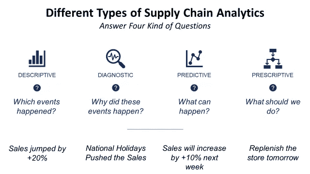

(图片由作者提供)

供应链可以被定义为以满足客户需求为最终目标的多方物流、信息流或资金流的交换。

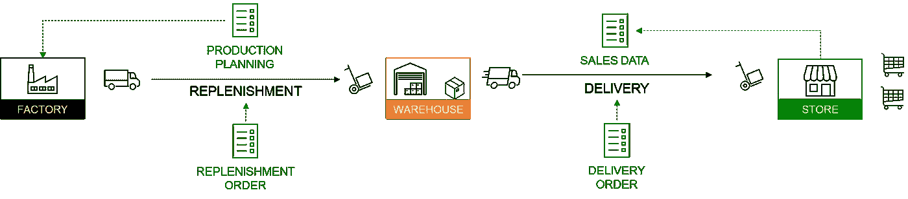

信息和货物的流动—(图片由作者提供)

由于信息扮演着重要的角色，供应链分析已经成为组织用来从与价值链中包括的所有流程相关的数据中获得洞察力的方法和工具。

在本文中，我们将介绍 Python 中不同类型的供应链分析，并了解它们对端到端运营的**效率**的影响。

💌新文章免费直入你的收件箱:[时事通讯](https://www.samirsaci.com/#/portal/signup)

```
**SUMMARY**
**I. Scenario** *Example of a Supply Chain for a Fashion Retailer*
**II. What are the different types of Supply Chain Analytics?** *1\. Descriptive analytics
2\. Diagnostic analytics
3\. Predictive analytics
4\. Prescriptive analytics* **III. Why is it so important?
IV. What skills do you need?**
```

如果你喜欢看，看看 Youtube 教程

# 方案

## 网络

让我们以一个在世界各地都有商店的国际服装集团为例。

该公司在亚洲的工厂生产服装、包包和配饰。


售出的 SKU 示例—(图片由作者提供)

**门店**从**本地仓库**发货，由**工厂**直接补货。

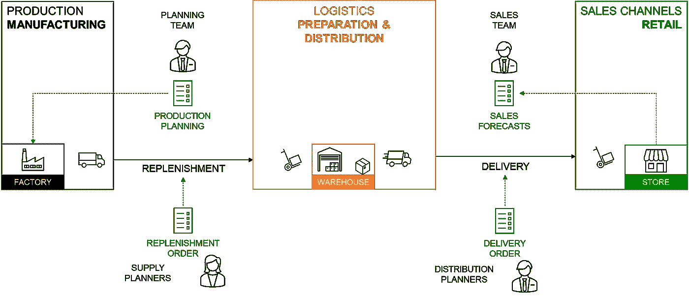

供应链网络—(图片由作者提供)

## **货物流动**

*   仓库补充了来自工厂的散装货物
*   商店订单从当地仓库[挑选、包装和运输](https://www.youtube.com/watch?v=XejgbF2m_8g)

## 信息的流动

*   销售和营销团队从商店收集销售数据
*   规划团队提供需求预测并支持[生产计划](https://www.youtube.com/watch?v=130AKb2DejM)
*   供应计划员使用 ERP 向工厂发送订单，进行仓库补货
*   配送计划员向[仓库管理系统(WMS)](https://www.youtube.com/shorts/MW1QRJs3iuE) 创建商店补货订单

现在，让我们利用现有的信息，探索什么样的工具可以用来优化货物的流动。

*作为介绍，大家可以看看这个简短的讲解视频*

# 不同类型的供应链分析？

供应链分析可以表示为一组工具，这些工具将使用信息流来回答问题和支持决策过程。

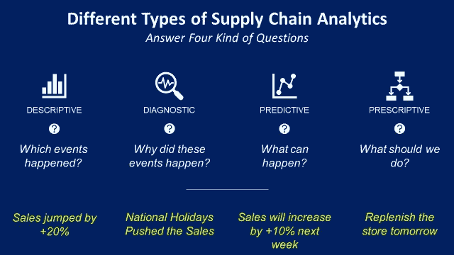

四种类型的供应链分析—(图片由作者提供)

对于每一种类型，你都需要具体的方法、数学概念和分析工具来回答这个问题。

## 描述性分析

一套工具，提供可见性和整个供应链的单一事实来源，以跟踪您的货件、检测事故并衡量您的运营绩效。

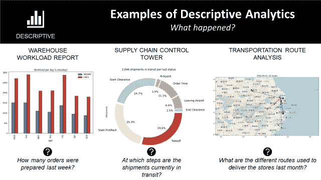

示例—(图片由作者提供)

最终的可交付成果通常是一组仪表板，可以使用 PowerBI/Tableau 放在云上，比如

*   仓库工作量报告，报告衡量仓库活动的关键指标(准备订单、生产率、物流比率)
*   [供应链控制塔](https://youtu.be/V6qnuZ-QcKE)沿着您的分销网络跟踪您的货物
*   [运输路线分析](https://youtu.be/lhDBTlsGDVc)可视化您过去递送的路线

```
👨‍💼 POSITIONS INVOLVED
Supply Chain Engineers, Data Analysts, Data Architects, Data Engineers, Product Managers and Business Intelligence Experts**🧰 TOOLS** Cloud computing, Python processing libraries (Pandas, Spark), BI Visualisation tools (Tableau, PowerBI, Google Studio)
```

## 诊断分析

这可以概括为事件根本原因分析。让我们以供应链控制塔为例。

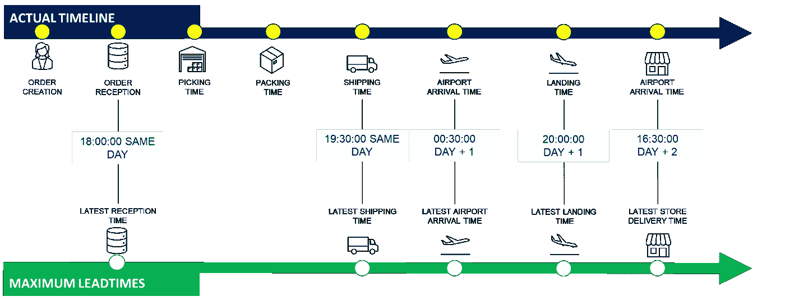

时间戳—(图片由作者提供)

由于您的数据架构，您可以在物流链的每一步跟踪您的货件。

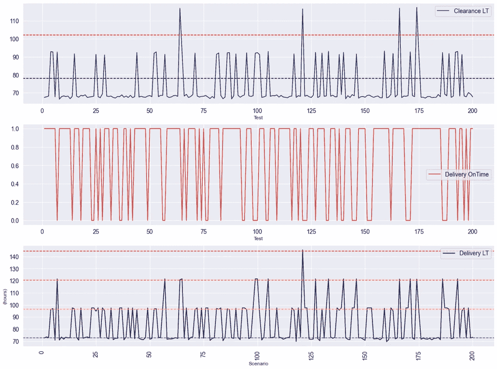

截止时间分析—(图片由作者提供)

例如，在上面的图表中，您可以看到较长的清关时间直接导致了延迟交货。

```
👨‍💼 POSITIONS INVOLVED
Supply Chain Engineers, Data Analysts, Data Engineers, Product Managers**🧰 TOOLS** Cloud computing, Python processing libraries (Pandas, Spark), BI Visualisation tools (Tableau, PowerBI, Google Studio)
```

如果货物交付延迟，根本原因分析包括检查每个时间戳，以查看您的货物在哪里错过了截止时间。

分析流程由运营团队设计，由数据工程师实施，以实现完全自动化。

## 预测分析

支持运营，以了解最有可能的结果或未来情景及其业务影响。

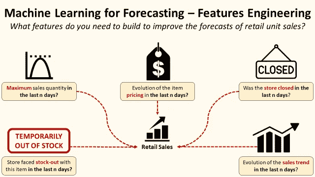

预测分析示例—(图片由作者提供)

例如，通过使用预测分析，您可以估计未来促销对商店销量的影响，以支持库存管理。

```
👨‍💼 POSITIONS INVOLVED
Supply Chain Engineers, Data Scientists, Business Experts **🧰 TOOLS** Cloud computing, Python processing libraries (Pandas, Spark), BI 
Machine Learning, Statistics
```

在上面的示例中，数据科学家将与业务专家合作，了解哪些功能有助于提高销售预测的准确性。

## 规定性分析

协助运营解决问题，优化资源以达到最佳效率。

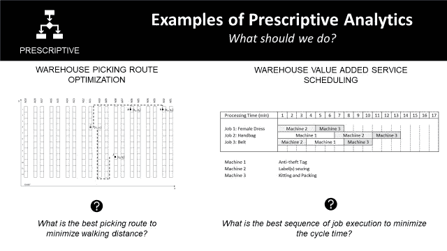

说明性分析示例—(图片由作者提供)

大多数时候，说明性分析与优化问题有关，在优化问题中，您需要考虑几个约束条件来最大化(或最小化)目标函数。

```
👨‍💼 POSITIONS INVOLVED
Supply Chain Engineers, Data Scientists**🧰 TOOLS** Cloud computing, Python processing libraries (Pandas, Spark), BI 
Machine Learning, Statistics, Linear Programming, Operations Research tools
```

通常，操作问题与一个众所周知的问题相关联，该问题的解决方案可在文献中找到。

例如，旅行推销员或车间作业问题就用在上面的例子中。

# 为什么重要？

作为供应链经理，您的职责范围包括

1.  了解并最小化风险
2.  优化运营以降低成本
3.  提供资源规划的可见性
4.  为未来场景做准备

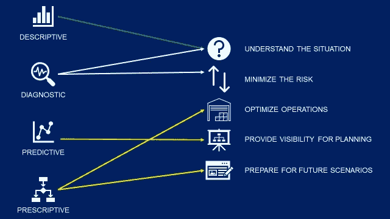

供应链优化分析—(图片由作者提供)

因此，您需要描述性和诊断性分析来了解当前的情况。

预测分析将让您了解未来，而规范分析将支持您的决策。

# 需要什么技能？

*欢迎关注我的 medium，获取更多与数据分析和供应链管理相关的文章*

## 描述性分析

这将取决于你的职位所涉及的分析类型。

在任何情况下，你都需要基本的编程技能来使用 **Python 或 VBA** 处理非结构化数据。

大多数时候，数据是非结构化的(在 excel 文件、pdf 报告中)或者来自异构系统。

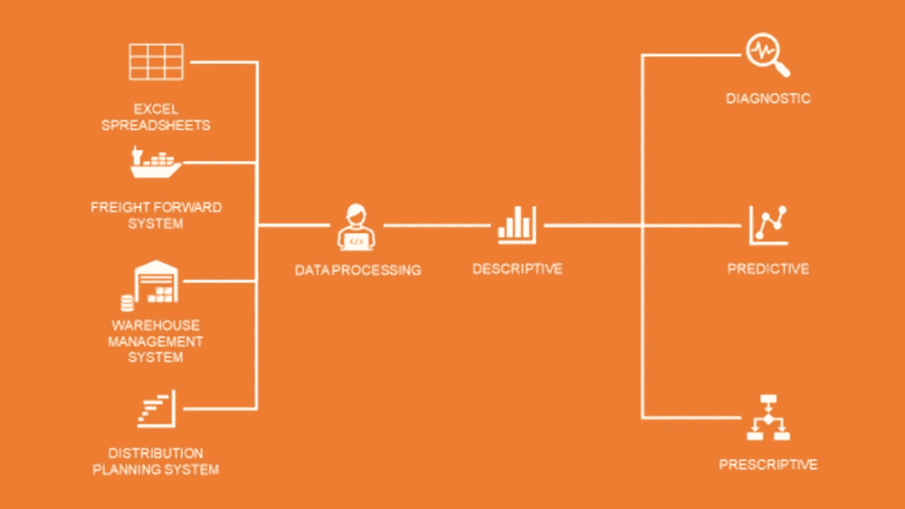

供应链分析工作流程—(图片由作者提供)

第一个强制性步骤是处理和协调这些不同来源的信息，并建立描述能力。

因此，即使从数学的角度来看这是最容易的部分，描述性分析也会占用你很大一部分精力(和预算)。

## 超出

创建干净可靠的数据源后，您可以开始为诊断、预测或处方构建模型。

如果你想了解更多细节，你可以看看我的 Youtube 频道上的**播放列表供应链分析**

您可以在下面列出的文章中找到案例研究的例子

**描述性分析**

*   [道路交通网络可视化](https://www.samirsaci.com/road-transportation-network-visualization/)，萨米尔萨奇
*   [使用数据面板](https://www.samirsaci.com/deploy-logistics-operational-dashboards-using-datapane/)部署物流运营仪表板，Samir Saci

**诊断分析**

*   [使用数据分析的物流绩效管理](https://www.samirsaci.com/logistic-performance-management-using-data-analytics/)，Samir Saci
*   [交付周期可变性和供应链弹性](https://www.samirsaci.com/lead-times-variability-and-supply-chain-resilience/)，Samir Saci

**预测分析**

*   [零售销售预测的机器学习—特征工程](https://www.samirsaci.com/machine-learning-for-retail-sales-forecasting-features-engineering/)，Samir Saci
*   [如何:机器学习驱动的需求预测](https://medium.com/towards-data-science/how-to-machine-learning-driven-demand-forecasting-5d2fba237c19)，[尼古拉斯·范德普特](https://medium.com/u/3f853e2def3c?source=post_page-----42f1b2df4a2--------------------------------)

**规定性分析**

*   [使用 Python](https://www.samirsaci.com/production-fixed-horizon-planning-with-python/) 、Samir Saci 进行生产固定水平规划
*   [利用 Python](https://www.samirsaci.com/optimize-warehouse-value-added-services-with-python/) 、Samir Saci 优化仓库增值服务
*   [使用 Python 的寻路算法提高仓库生产率](https://www.samirsaci.com/improve-warehouse-productivity-using-pathfinding-algorithm-with-python/)，Samir Saci
*   [商店送货计划的机器学习](https://www.samirsaci.com/machine-learning-for-store-delivery-scheduling/)，Samir Saci

# 关于我

让我们在 [Linkedin](https://www.linkedin.com/in/samir-saci/) 和 [Twitter](https://twitter.com/Samir_Saci_) 上连线，我是一名[供应链工程师](https://www.samirsaci.com/blog/)，正在使用数据分析来改善物流运营并降低成本。

如果你对数据分析和供应链感兴趣，可以看看我的网站

[](https://samirsaci.com) 