# 什么是生存分析？手工示例和 R

> 原文：<https://towardsdatascience.com/what-is-survival-analysis-examples-by-hand-and-in-r-3f0870c3203f>

## 了解更多关于生存分析(也称为事件时间分析)及其使用方法，以及如何手动和在 R


伊恩·基夫的照片

# 介绍

F 还是今年的最后一个帖子，我想介绍一个比较不为人知(却很重要)的统计方法:**生存分析**。

虽然生存分析是统计学的一个分支，但它通常不包含在统计学的介绍性课程中，而且对普通大众来说相当陌生。它主要是在生物统计学课程或高级统计研究项目中讲授。

在这篇文章中，我将解释什么是生存分析，以及如何和在什么环境中使用它。我将解释生物统计学家用来分析生存数据的主要工具和方法，以及如何估计和解释生存曲线。

我将通过具体的例子详细展示如何在 R 中应用这些技术。在实践中，生存分析几乎总是通过统计程序完成，而不是手工完成。然而，对于任何统计概念，我相信手工操作可以真正理解这些概念以及这些程序实际上是做什么的。出于这个原因，我还将展示一个简单的例子，说明如何手工执行基本的生存分析。

*注意，这篇文章的灵感来自:*

*   *Van keile gom 教授的课堂笔记和我作为教学助理对她在 UCLouvain 讲授的题为“存活率和持续时间数据分析”的课程的个人笔记*
*   *勒格朗教授在加州大学鲁汶分校讲授的“临床试验统计学”课程的课堂笔记*

# 什么是生存分析？

**生存分析**(也称为事件时间分析或持续时间分析)是统计学的一个分支，旨在**分析一个或多个事件发生之前的预期持续时间**，称为生存时间或持续时间。

在生存分析中，我们对某个事件感兴趣，想**分析事件发生前的时间**。

虽然感兴趣的事件通常是死亡(在这种情况下，我们研究患有特定疾病的患者的死亡时间)或复发(在这种情况下，我们研究某种疾病的复发时间)，但它不限于医学和流行病学领域。

事实上，它可以用于许多领域。例如，我们也可以分析时间，直到…

*   从某种疾病中痊愈
*   失业一段时间后找到新工作
*   出狱后再次被捕
*   第一次怀孕
*   机械系统或机器的故障
*   银行或公司破产
*   客户购买新产品或停止当前订购
*   一封信送来了
*   打电话给出租车公司后，出租车会来接你
*   一名员工离开公司
*   等等。

如你所见，感兴趣的事件不一定是死亡或疾病，但在所有情况下**我们感兴趣的是特定事件发生的时间**。

# 为什么我们需要特殊的生存分析方法？

生存数据，也称为事件发生时间数据，需要一套特殊的统计方法，原因有三:

1.  **持续时间**为**始终为正**:直到感兴趣的事件发生的时间不能小于 0。

**2。不同的测量**取决于研究问题、背景等。例如，我们可能对以下内容感兴趣:

*   癌症患者存活超过 5 年的概率？
*   打电话给出租车公司后，出租车到达的典型等待时间？
*   100 名失业者中，有多少人有望在两个月后重新找到工作？

**3。审查几乎总是一个问题:**

*   大多数情况下，事件发生在研究结束之前，存活时间是已知的。
*   然而，有时，在研究结束时还没有观察到该事件。假设我们研究乳腺癌患者的死亡时间。幸运的是，一些患者不会在研究结束前死亡。
*   其他时候，另一个事件发生在感兴趣的事件之前。例如，癌症患者可能死于车祸。
*   甚至有时患者退出研究或搬到另一个国家，因此我们无法观察她的存活时间(这被称为失访或退出)。
*   在某种意义上，删失可以被看作是一种缺失数据。
*   由于这些原因，很多“标准”[描述性统计](https://statsandr.com/blog/descriptive-statistics-in-r/)、[假设检验](https://statsandr.com/blog/hypothesis-test-by-hand/)和[回归模型](https://statsandr.com/blog/multiple-linear-regression-made-simple/)都不适合这类数据。需要特定的统计方法来考虑这样一个事实，即我们遗漏了一些患者的确切存活时间。我们知道他们存活了一定的时间(直到研究结束或直到停药)，但我们不知道他们确切的存活时间。

供您参考，当在研究结束时尚未观察到该事件时(即存活持续时间大于观察到的持续时间)，这被称为右删截。另一方面，如果参与者在研究开始前发生感兴趣的事件时进入研究，但我们不知道确切的时间，则会发生左删截。当然，我们希望分析所有可用的数据，包括关于被审查患者的信息。

因此，生存分析的目标是以适当的方式对事件时间数据进行建模和描述，同时考虑这类数据的特殊性。

# 生存分析中的常用函数

我们不打算深入细节，但重要的是用生存分析中最常见的函数打下基础。

设 *T* 为非负连续随机变量，代表感兴趣事件发生前的时间。我们考虑以下功能:

1.  生存函数
2.  累积风险函数
3.  冒险函数

# 生存函数

最常见的是生存功能。对于每个 tt:

s(T)= P(T > T)= 1 F(T)

对于每个时间 tt，S(t)表示事件发生前的时间大于该时间 tt 的概率。换句话说，它模拟了感兴趣的事件在 tt 之后**发生的概率。**

在上面提到的例子中，它给出了这样的概率:

*   随机选择的患者将存活超过 tt 时间，
*   出租车到达时间超过 tt 分钟，或
*   一个失业的人要花超过 tt 个月的时间才能找到一份新工作。

生存函数 S(t)是:

*   递减函数，
*   取[0，1]中的值(因为它是一个概率)，并且
*   t=0 时等于 1，t=∞时等于 0。

视觉上我们有:

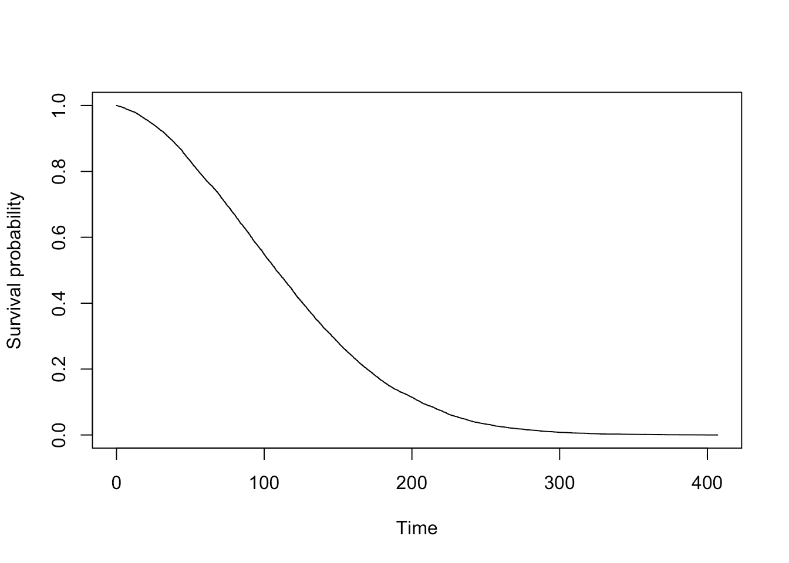

作者的情节

曲线显示了随着时间的推移，没有经历过某一事件的个体(或实验单位)的比例。随着时间的推移，事件会发生，因此没有经历过事件的比例会降低。

# 累积风险函数

累积危险函数定义为:

h(t)=-对数(t)

并且具有以下属性:

*   增加功能，
*   在[0，+∞]中取值，并且
*   s(t)= exp(H(t))

累积风险是到 tt 时间为止经历的总风险。

# 冒险函数

危险函数或危险率定义为:

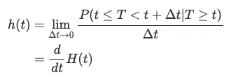

并且具有以下属性:

*   正函数(不一定增加或减少)
*   风险函数 h(t)可以有许多不同的形状，因此是总结生存数据的有用工具

在癌症患者的例子中，h(t)测量在 tt 时间之后立即死亡的瞬时风险，假设个体在 tt 时间还活着。

将风险率与生存函数联系起来；生存曲线代表风险率。斜率越陡，表明风险率越高，因为事件发生得越频繁，未经历过事件的人的比例越低。相反，平缓的坡度表示较低的风险率，因为事件发生的频率较低，降低了未经历该事件的人的比例。

请注意，与侧重于不发生事件的生存函数相反，风险函数侧重于事件的发生。

# 估计

为了估计生存函数，我们需要使用一个能够处理截尾的估计量。最常见的是非参数**卡普兰和迈耶(** [**1958**](https://statsandr.com/blog/what-is-survival-analysis/#ref-kaplan1958nonparametric) **)估计量**(有时也称为乘积限估计量，或更简单地说，K-M 估计量)。

卡普兰-迈耶估计量的优点是:

*   使用和解释起来简单明了
*   它是一个非参数估计量，所以它从数据中构造一条生存曲线，并且对基本分布的形状不做任何假设
*   它给出了生存函数的图形表示，用于说明目的

请注意，估计成立的一个重要假设是，删失独立于事件的发生。我们说删截是非信息性的，即删截的受试者与未删截并继续被跟踪的受试者具有相同的生存前景。

# 用手

为了理解它是如何工作的，让我们首先在下面的数据集上手动估计一下: [1](https://statsandr.com/blog/what-is-survival-analysis/#fn1)

```
##    subject time event
## 1        1    3     0
## 2        2    5     1
## 3        3    7     1
## 4        4    2     1
## 5        5   18     0
## 6        6   16     1
## 7        7    2     1
## 8        8    9     1
## 9        9   16     1
## 10      10    5     0
```

其中:

*   `subject`是个人的标识符
*   `time`是事件发生的时间(以年为单位) [2](https://statsandr.com/blog/what-is-survival-analysis/#fn2)
*   `event`是事件状态(0 =审查，1 =事件发生)

请记住，对于每个主题，我们至少需要了解两条信息:

1.  直到感兴趣事件的时间或直到审查的时间，以及
2.  我们是否观察到了感兴趣的事件或者我们是否观察到了审查。

我们首先需要计算不同事件时间的数量。忽略删截观察，我们有 5 个不同的事件时间:

*2* 、 *5* 、 *7* 、 *9* 和 *16*

手工计算的最简单方法是填写下表(一个有 5 行的表，因为有 5 个不同的事件时间):

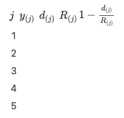

我们逐个填充列:

*   y(j) =有序的不同事件时间:

*2* 、 *5* 、 *7* 、 *9* 和 *16*

所以表格变成了:

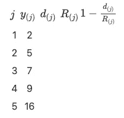

*   d(j) =每个不同事件时间的观察次数。为此，每个不同事件时间的频率非常有用:

```
## time
##  2  5  7  9 16 
##  2  1  1  1  2
```

表格变成:

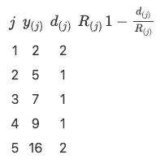

*   R(j) =处于危险中的剩余个体数量。对于这一点，时间的分布(审查和不审查)是有用的:

```
## time
##  2  3  5  7  9 16 18 
##  2  1  2  1  1  2  1
```

我们看到:

*   一开始有 10 个科目
*   就在时间 t=5 之前，剩下 7 名受试者(10 名受试者——2 名发生了事件——1 名被审查)
*   就在时间 t=7 之前，还有 5 名受试者(= 10–2–1–2)
*   就在时间 t=9 之前，还有 4 名受试者(= 10–2–1–2–1)
*   就在时间 t=16 之前，还有 3 名受试者(= 10–2–1–2–1–1)

表格变成:

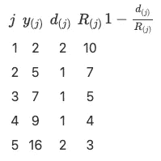

*   1(d(j)/R(j))很简单，因此该表变为:

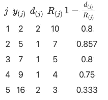

卡普兰-迈耶估计量为:

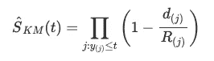

因此，对于每个 j，我们取累积积:

*   j1=0.8
*   j2=0.8⋅0.857=0.6856
*   j3=0.6856⋅0.8=0.54848
*   j4=0.54848⋅0.75=0.41136
*   j5=0.41136⋅0.333=0.1369829

最后，我们得到了生存概率(四舍五入到 3 位数):

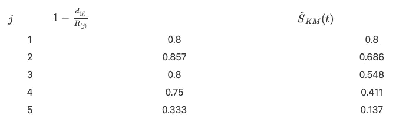

我们现在可以用图形表示卡普兰-迈耶估计量:


作者的情节

要绘制这条生存曲线，请记住:

*   x 轴对应于初始数据集中的`time`变量，并且
*   y 轴对应于上面找到的生存概率。

# 在 R 中

现在我们将我们的结果与 r。

我们首先用时间和事件变量创建数据集:

```
# create dataset
dat <- data.frame(
  time = c(3, 5, 7, 2, 18, 16, 2, 9, 16, 5),
  event = c(0, 1, 1, 1, 0, 1, 1, 1, 1, 0)
)
```

然后我们用`survfit()`和`Surv()`函数运行卡普兰-迈耶估计器:

```
# KM
library(survival)
```

```
km <- survfit(Surv(time, event) ~ 1,
  data = dat
)
```

注意，`Surv()`函数接受两个参数:

1.  `time`变量，以及
2.  `event`变量。

`survfit()`函数中的`~ 1`表示我们在没有任何分组的情况下估计 Kaplan-Meier。稍后在文章中可以看到更多。

最后，我们显示结果并绘制卡普兰-迈耶图:

```
# results
summary(km)
```

```
## Call: survfit(formula = Surv(time, event) ~ 1, data = dat)
## 
##  time n.risk n.event survival std.err lower 95% CI upper 95% CI
##     2     10       2    0.800   0.126       0.5868        1.000
##     5      7       1    0.686   0.151       0.4447        1.000
##     7      5       1    0.549   0.172       0.2963        1.000
##     9      4       1    0.411   0.176       0.1782        0.950
##    16      3       2    0.137   0.126       0.0225        0.834
```

```
# plot
plot(km,
  xlab = "Time",
  ylab = "Survival probability",
  conf.int = FALSE
)
```

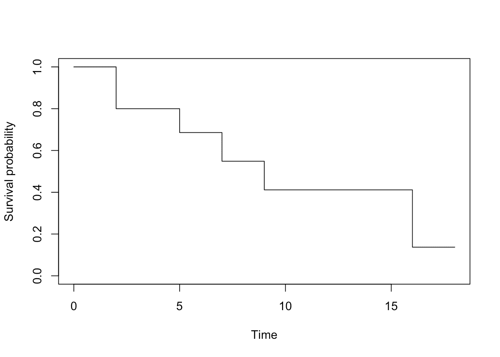

作者的情节

生存概率可以在`survival`栏中找到。请注意，手动结果和 R 中的结果是相似的(手动结果的任何差异都是由于四舍五入)。

或者，我们可以使用`{survminer}`包中的`ggsurvplot()`函数:

```
library(survminer)
```

```
# plot
ggsurvplot(km,
  conf.int = FALSE,
  legend = "none"
)
```

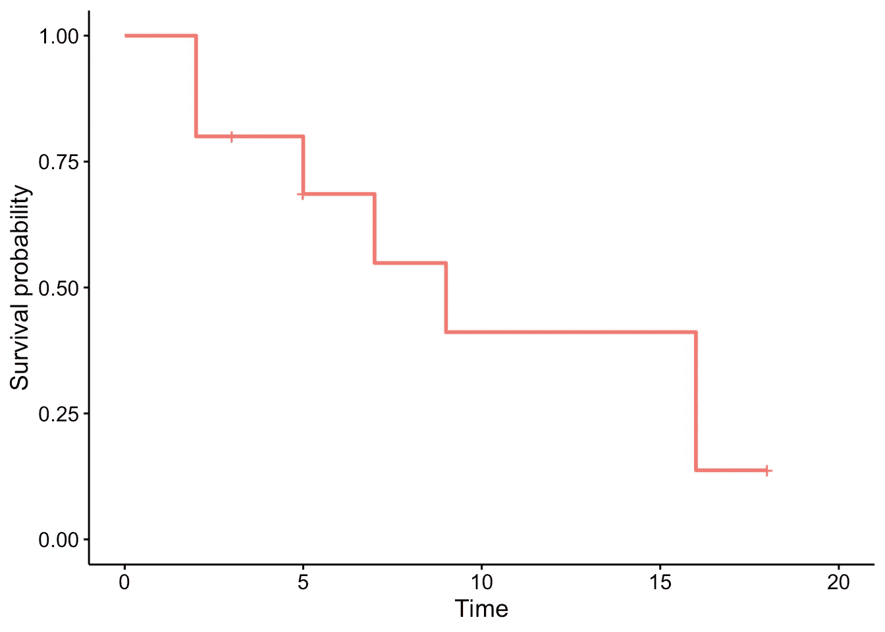

作者的情节

*注意存活曲线上的十字表示删失观察。*

使用`ggsurvplot()`函数的优点是很容易直接在图上画出[中位数](https://statsandr.com/blog/descriptive-statistics-in-r/#median)存活率: [3](https://statsandr.com/blog/what-is-survival-analysis/#fn3)

```
ggsurvplot(km,
  conf.int = FALSE,
  surv.median.line = "hv",
  legend = "none"
)
```

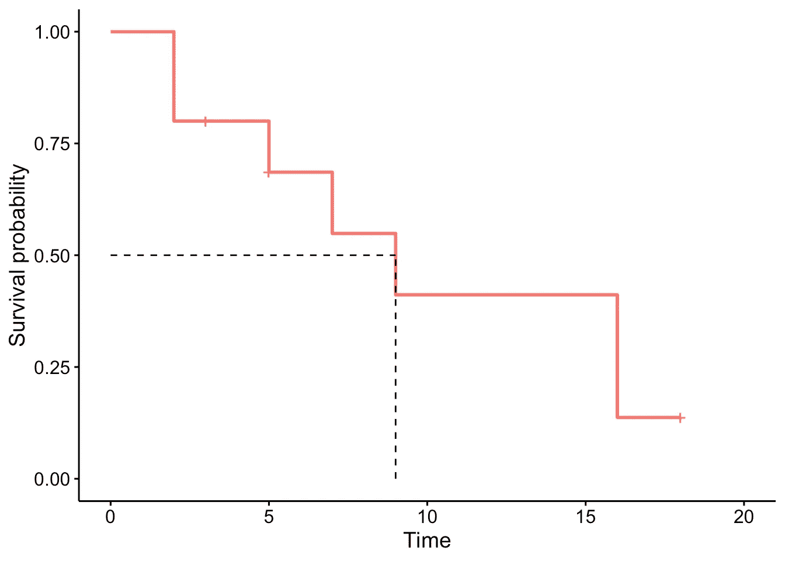

作者的情节

求生存中值: [4](https://statsandr.com/blog/what-is-survival-analysis/#fn4)

```
summary(km)$table["median"]
```

```
## median 
##      9
```

```
# or more simply
km
```

```
## Call: survfit(formula = Surv(time, event) ~ 1, data = dat)
## 
##       n events median 0.95LCL 0.95UCL
## [1,] 10      7      9       5      NA
```

假设感兴趣的事件是死亡:

*   在时间零点，生存概率为 1(受试者 100%存活)。
*   中位数表示中位生存时间为 9 年。 [5](https://statsandr.com/blog/what-is-survival-analysis/#fn5) 这是存活率 S(t)为 50%的时间。换句话说，就是一半受试者预期死亡的时间。
*   从图中我们还看到，S(5)=P(T>5 年)=这些受试者生存 5 年以上的概率= 75%。这意味着 75%的受试者存活超过 5 年，25%的受试者在前 5 年内死亡。

为了完整起见，让我们用一个大得多的数据集做另一个例子；`{KMsurv}`包中的`tongue`数据集。 [6](https://statsandr.com/blog/what-is-survival-analysis/#fn6)

```
# load data
library(KMsurv)
data(tongue)
```

```
# preview data
head(tongue)
```

```
##   type time delta
## 1    1    1     1
## 2    1    3     1
## 3    1    3     1
## 4    1    4     1
## 5    1   10     1
## 6    1   13     1
```

*   `type`是肿瘤 DNA 图谱(1 =非整倍体肿瘤，2 =二倍体肿瘤)
*   `time`是死亡时间还是在职时间(以周为单位)
*   `delta`是死亡指示器(0 =活着，1 =死了)

在这个例子中，我们关注非整倍体类型:

```
anaploid <- subset(tongue, type == 1)
```

我们现在可以画出估计的生存函数，并估计中位死亡时间。由于它是一个估计量，我们也可以为每个时间 tt 的估计生存时间和估计中位生存时间构造一个置信区间。 [7](https://statsandr.com/blog/what-is-survival-analysis/#fn7)

```
# results
fit <- survfit(Surv(time, delta) ~ 1,
  data = anaploid,
  conf.type = "log-log"
)
```

```
fit
```

```
## Call: survfit(formula = Surv(time, delta) ~ 1, data = anaploid, conf.type = "log-log")
## 
##       n events median 0.95LCL 0.95UCL
## [1,] 52     31     93      65     157
```

```
# plot
ggsurvplot(fit,
  surv.median.line = "hv",
  legend = "none"
)
```

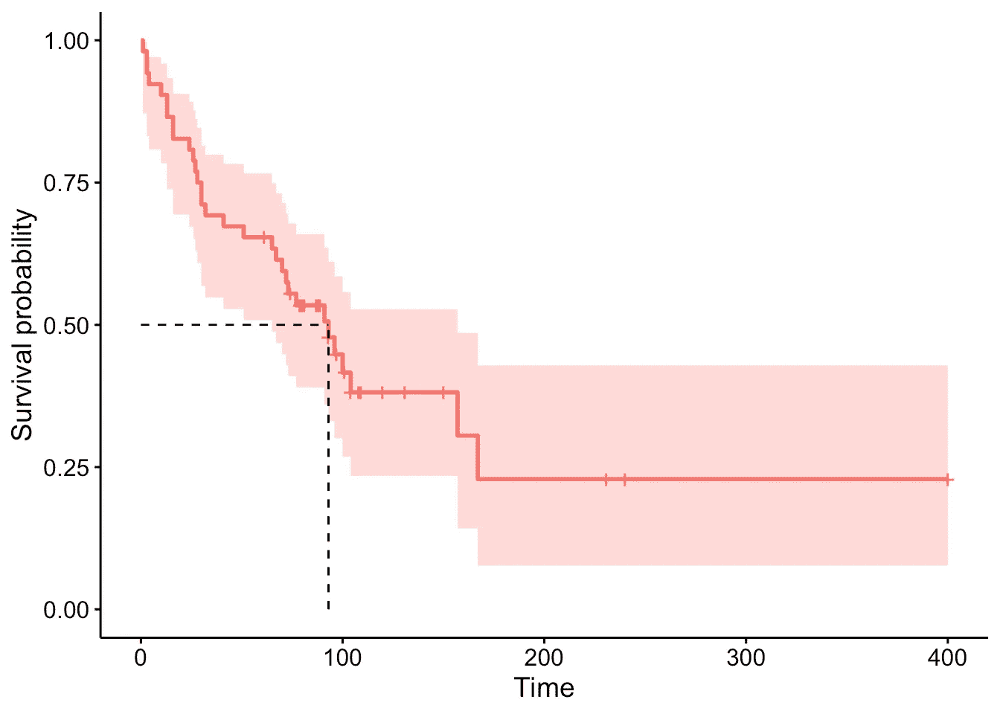

作者的情节

中位生存时间估计为 93 周，95%的置信区间为 65-157 周。

卡普兰-迈耶曲线可以被视为生存数据的[描述性统计](https://statsandr.com/blog/descriptive-statistics-in-r/)。我们现在关注统计学的第二个分支，[假设检验](https://statsandr.com/blog/hypothesis-test-by-hand/)，它允许根据一个样本得出关于总体的结论(如果你需要，参见关于总体和样本之间的[差异的快速提醒)。](https://statsandr.com/blog/what-is-the-difference-between-population-and-sample/)

# 假设检验

生存分析领域的假设检验主要关注:

*   **一个总体的风险函数**:在这种情况下，我们测试一个删失样本是否来自一个具有已知风险函数 h0(t)的总体。例如，我们可能有兴趣比较样本患者的存活率和总体存活率(来自生命表)。
*   **两个或更多人群的风险函数比较**:在这种情况下，我们有兴趣评估不同受试者组之间的存活率是否存在差异。例如:
*   两组:我们感兴趣的是比较女性和男性结肠癌患者的存活率
*   3 组或更多组:我们感兴趣的是根据黑色素瘤患者的治疗(例如治疗 A、B 和 C)来比较他们的存活率 [8](https://statsandr.com/blog/what-is-survival-analysis/#fn8)

# 对数秩检验

在本文中，我们使用**对数秩检验**(也称为 Mantel-Cox 检验)重点比较两组之间的生存率。

测试背后的直觉是，如果两组有不同的风险率，两条生存曲线(因此它们的斜率)将会不同。更准确地说，对数秩检验将每组中观察到的事件数与如果存活曲线相同(即，如果零假设为真)时预期的事件数进行比较。

注意，对于 Kaplan-Meier 估计量，对数秩检验是非参数检验，它对生存分布不做任何假设。

对于此示例，考虑以下数据集:

```
##    patient group time event
## 1        1     1  4.1     1
## 2        2     1  7.8     0
## 3        3     1 10.0     1
## 4        4     1 10.0     1
## 5        5     1 12.3     0
## 6        6     1 17.2     1
## 7        7     2  9.7     1
## 8        8     2 10.0     1
## 9        9     2 11.1     0
## 10      10     2 13.1     0
## 11      11     2 19.7     1
## 12      12     2 24.1     0
```

其中:

*   `patient`是患者的标识符
*   `group`是组(组 1 或组 2)
*   `time`是死亡时间(年) [9](https://statsandr.com/blog/what-is-survival-analysis/#fn9)
*   `event`是事件状态(0 =审查，1 =死亡)

假设我们对比较组 1 和组 2 的存活率感兴趣，也就是说，我们比较两组之间的存活率曲线:

*   H0: S1(t)=S2(t)代表所有的 t
*   H1: S1(t)≠S2(t)

这是一个统计测试，因此如果 p 值< α (usually 0.05), we reject the null hypothesis and we conclude that survival (or the time to event) is significantly different between the two groups considered.

To perform the log-rank test, the following test statistic will be useful:

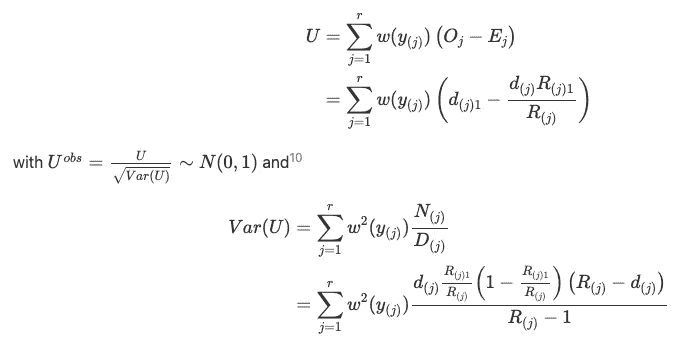

# By hand

As for the Kaplan-Meier estimator by hand, it is best to also fill in a table for the log-rank test by hand.

Let’s present the final table and comment below on how to fill it, column by column:

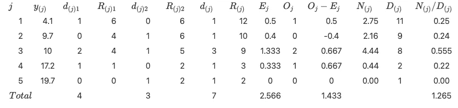

**列** j 是不同事件次数的数量。我们看到有 5 个(忽略删截观察)，所以我们在表中写 1 到 5。

**列** y(j)是有序的相异事件次数:

*4.1* 、 *9.7* 、 *10* 、 *17.2* 和 *19.7*

**列** d(j)1 是第 1 组每个不同事件时间的观察次数:

```
## time
##  4.1   10 17.2 
##    1    2    1
```

当没有事件时，我们简单地在表中写 0。

**列** R(j)1 是第 1 组处于危险中的患者的剩余数量。为此，时间的分布(对于第 1 组，删失和未删失)是有用的:

```
## time
##  4.1  7.8   10 12.3 17.2 
##    1    1    2    1    1
```

我们看到:

*   开始时，有 6 个病人
*   在时间 9.7 之前，剩下 4 名患者(6-1 名在时间 4.1 出现事件，1 名在时间 7.8 被审查)
*   在时间 10 之前，还剩下 4 名患者(6–2)
*   在时间 17.2 之前，还剩 1 名患者(6–5 名)
*   在时间 19.7 之前，剩下 0 个病人(6-6)

**列** d(j)2 **和** R(j)2 遵循相同的原则，但这次针对组 2。所以我们有，分别对于 d(j)2 和 R(j)2:

```
## time
##  9.7   10 19.7 
##    1    1    1
```

```
## time
##  9.7   10 11.1 13.1 19.7 24.1 
##    1    1    1    1    1    1
```

**列** d(j) **和** R(j)也遵循相同的原则，但这次考虑的是两组。所以我们有，分别为 d(j)d(j)和 R(j)R(j):

```
## time
##  4.1  9.7   10 17.2 19.7 
##    1    1    3    1    1
```

```
## time
##  4.1  7.8  9.7   10 11.1 12.3 13.1 17.2 19.7 24.1 
##    1    1    1    3    1    1    1    1    1    1
```

**列** Ej 是假设 h1≡h2 时第一组中事件的预期数量。它是按如下方式获得的

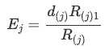

**列** Oj 是第一组的观测事件数，所以等于 d(j)1 列。

**列**Oj Ej 很简单。

**列** N(j)定义如下

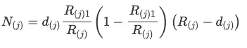

**列** D(j)是 R(j)1。

**列** N(j)/D(j)很直接。


我们有|Uobs|=1.275

如果您对计算 p 值感兴趣:

P 值= 2×P(Z > 1.275)= 2×0.101 = 0.202 > 0.05。

# 在 R 中

我们现在将 R 中的结果与`survdiff()`函数进行比较:

```
dat <- data.frame(
  group = c(rep(1, 6), rep(2, 6)),
  time = c(4.1, 7.8, 10, 10, 12.3, 17.2, 9.7, 10, 11.1, 13.1, 19.7, 24.1),
  event = c(1, 0, 1, 1, 0, 1, 1, 1, 0, 0, 1, 0)
)
```

```
dat
```

```
##    group time event
## 1      1  4.1     1
## 2      1  7.8     0
## 3      1 10.0     1
## 4      1 10.0     1
## 5      1 12.3     0
## 6      1 17.2     1
## 7      2  9.7     1
## 8      2 10.0     1
## 9      2 11.1     0
## 10     2 13.1     0
## 11     2 19.7     1
## 12     2 24.1     0
```

```
survdiff(Surv(time, event) ~ group,
  data = dat
)
```

```
## Call:
## survdiff(formula = Surv(time, event) ~ group, data = dat)
## 
##         N Observed Expected (O-E)^2/E (O-E)^2/V
## group=1 6        4     2.57     0.800      1.62
## group=2 6        3     4.43     0.463      1.62
## 
##  Chisq= 1.6  on 1 degrees of freedom, p= 0.2
```

或者，我们可以使用`ggsurvplot()`函数来绘制生存曲线，同时执行对数秩检验:

```
fit <- survfit(Surv(time, event) ~ group, data = dat)
```

```
ggsurvplot(fit,
  pval = TRUE,
  pval.method = TRUE
)
```

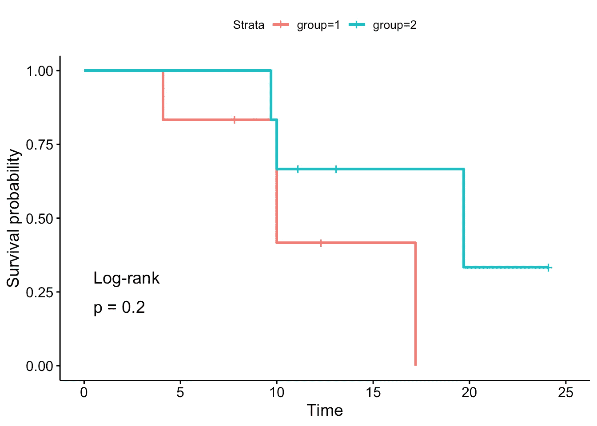

作者的情节

正如我们所看到的，p 值和结论是相同的(与手工结果的任何差异都是由于四舍五入)。

至于卡普兰-迈耶估计，我们在一个更大的数据集上做另一个例子。考虑到烧伤患者葡萄球菌感染前的时间数据，也可在`{KMsurv}` : [12](https://statsandr.com/blog/what-is-survival-analysis/#fn12) 中获得

```
# load data
data(burn)
```

```
# preview data
head(burn)
```

```
##   Obs Z1 Z2 Z3 Z4 Z5 Z6 Z7 Z8 Z9 Z10 Z11 T1 D1 T2 D2 T3 D3
## 1   1  0  0  0 15  0  0  1  1  0   0   2 12  0 12  0 12  0
## 2   2  0  0  1 20  0  0  1  0  0   0   4  9  0  9  0  9  0
## 3   3  0  0  1 15  0  0  0  1  1   0   2 13  0 13  0  7  1
## 4   4  0  0  0 20  1  0  1  0  0   0   2 11  1 29  0 29  0
## 5   5  0  0  1 70  1  1  1  1  0   0   2 28  1 31  0  4  1
## 6   6  0  0  1 20  1  0  1  0  0   0   4 11  0 11  0  8  1
```

使用对数秩检验，我们想要检验使用常规沐浴护理方法(`Z1 = 0`)护理烧伤患者与最初使用 4%葡萄糖酸氯己定(`Z1 = 1`)进行身体清洁的患者之间葡萄球菌感染时间差异(`T3`变量)的假设。事件指示器在变量`D3`中。

对于这个测试，我们使用一个双边选择和一个 5%的显著性水平。

```
# fit
fit <- survfit(Surv(T3, D3) ~ Z1, data = burn)
```

```
# plot with log-rank test
ggsurvplot(fit,
  pval = TRUE,
  pval.method = TRUE
)
```

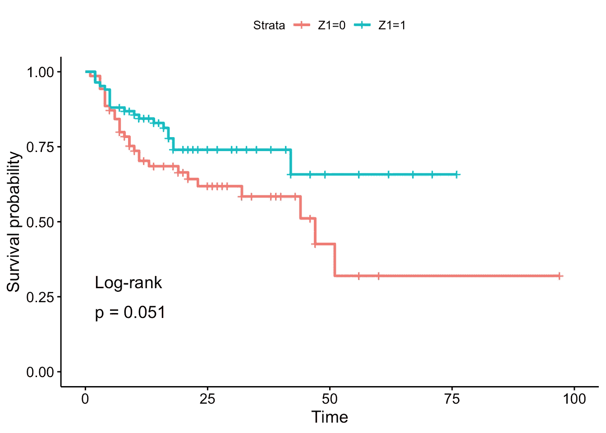

作者的情节

*在样本*中，常规洗澡(`Z1 = 0`)的患者感染时间似乎比身体清洗(`Z1 = 1`)的患者短。这是因为没有经历过感染的患者的百分比下降得更快，所以风险率更高。

然而，如果不进行合理的统计测试，这一结论不能推广到*人群*。基于对数秩检验的结果，我们不拒绝两组患者感染时间相同的假设(p 值= 0.051)。

# 走得更远

在这篇文章中，我们介绍了什么是生存分析，什么时候，为什么以及如何使用它。我们讨论了删失和生存曲线。我们展示了如何通过 Kaplan-Meier 估计器来估计生存函数，以及如何通过对数秩检验来检验两组之间的生存。我们用手工和 r .来说明这些方法。

正如你注意到的，我们没有展示如何*建模*生存数据。有几种回归模型可用于生存数据，最常见的是半参数 Cox 比例风险模型( [1972](https://statsandr.com/blog/what-is-survival-analysis/#ref-cox1972regression) )。它起源于医学领域，用于调查和评估患者的生存时间与其相应的预测变量之间的关系。

我们已经看到 Kaplan-Meier 估计值对于可视化组间存活率和检验组间存活率是否显著不同的对数秩检验是有用的(因此两种方法都使用[分类变量](https://statsandr.com/blog/variable-types-and-examples/#qualitative)作为预测值)。然而，它对于评估[定量预测器](https://statsandr.com/blog/variable-types-and-examples/#quantitative)的效果并不理想。Cox 模型的优势在于，它既适用于定量预测因子，也适用于分类预测因子，同时适用于几个风险因素(因此它可以同时对多个变量的影响进行建模)。

利用 Cox 模型，我们通过不同因素 X1，X2，…，Xq 对风险函数的影响来模拟它们对存活率的影响:

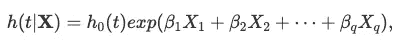

其中:

*   h(t|X)是以存活到 tt 时间为条件的瞬时死亡率。
*   h0(t)是总体水平基线风险——潜在风险函数。它描述了一般人的风险如何随着时间的推移而演变。
*   exp(β1X1+β2X2+⋯+βqXq)描述了协变量如何影响风险。特别是，xixi 的单位增加导致危险增加 exp(βi)倍。

这篇文章旨在介绍生存分析中的介绍性概念，所以这个模型将在另一篇文章中开发。与此同时，如果你想了解更多关于生存数据建模的知识(感谢 Cox 模型和其他模型)，请看来自 Joseph Rickert 的[帖子](https://rviews.rstudio.com/2022/09/06/deep-survival/)。

感谢阅读。

和往常一样，如果您有与本文主题相关的问题或建议，请将其添加为评论，以便其他读者可以从讨论中受益。

# 参考

戴维·考克斯，1972 年。"回归模型和生命表."皇家统计学会杂志:B 辑(方法论)34(2):187–202。

卡普兰，爱德华 L，保罗梅尔。1958."不完全观测值的非参数估计."*美国统计协会杂志*53(282):457–81。

1.  请注意，在生存分析中，估计值的精度(和检验的功效)不取决于患者的数量，而是取决于事件的数量。因此，为了使分析有效，最好对事件发生的地方进行多次观察。为了便于说明，我们在这里研究一个小样本。 [↩︎](https://statsandr.com/blog/what-is-survival-analysis/#fnref1)
2.  注意`time`变量可以用其他单位表示，比如秒、天、周、月等。 [↩︎](https://statsandr.com/blog/what-is-survival-analysis/#fnref2)
3.  在生存分析中，中位数优于平均数，因为生存函数经常向右倾斜。平均值通常会受到异常值的影响，而中位数则不会。参见本[部分](https://statsandr.com/blog/descriptive-statistics-by-hand/#mean-vs.-median)中对两者进行比较的讨论。 [↩︎](https://statsandr.com/blog/what-is-survival-analysis/#fnref3)
4.  请注意，如果存活曲线没有超过 50%(因为在最后一个时间点，存活率大于 50%)，那么中位存活率就无法计算，只是没有定义。 [↩︎](https://statsandr.com/blog/what-is-survival-analysis/#fnref4)
5.  请注意，中值存活率是以与初始数据集中的`time`变量相同的单位表示的。因此，如果时间单位是月，中位生存时间将是 9 个月。 [↩︎](https://statsandr.com/blog/what-is-survival-analysis/#fnref5)
6.  关于数据集的更多信息可以在[曲柄](https://cran.r-project.org/web/packages/KMsurv/)或`?tongue`上找到。 [↩︎](https://statsandr.com/blog/what-is-survival-analysis/#fnref6)
7.  看看我们在这个[线程](https://stats.stackexchange.com/questions/361354/choosing-conf-type-for-survfit-in-r)中使用`log-log`作为置信区间的原因。 [↩︎](https://statsandr.com/blog/what-is-survival-analysis/#fnref7)
8.  注意，如果要比较的群体具有自然排序(例如教育水平；无、低、中、高)，将它考虑在内的测试具有更强的检测显著影响的能力。这些测试被称为趋势测试。 [↩︎](https://statsandr.com/blog/what-is-survival-analysis/#fnref8)
9.  请记住，时间单位可以不同于年。 [↩︎](https://statsandr.com/blog/what-is-survival-analysis/#fnref9)
10.  大样本就是这种情况。这里描述的例子不满足这个条件，但是我们仍然把它作为一个例子来展示。 [↩︎](https://statsandr.com/blog/what-is-survival-analysis/#fnref10)
11.  注意，可以考虑其他权重，但这超出了本文的范围。 [↩︎](https://statsandr.com/blog/what-is-survival-analysis/#fnref11)
12.  关于数据集的更多信息可在[曲柄](https://cran.r-project.org/web/packages/KMsurv/)或`?burn`上找到。 [↩︎](https://statsandr.com/blog/what-is-survival-analysis/#fnref12)

# 相关文章

*   [R 中的相关系数和相关检验](https://statsandr.com/blog/correlation-coefficient-and-correlation-test-in-r/)
*   [R 中的单样本 Wilcoxon 检验](https://statsandr.com/blog/one-sample-wilcoxon-test-in-r/)
*   [克鲁斯卡尔-沃利斯检验，或者方差分析的非参数版本](https://statsandr.com/blog/kruskal-wallis-test-nonparametric-version-anova/)
*   [手工假设检验](https://statsandr.com/blog/hypothesis-test-by-hand/)
*   [R 中的方差分析](https://statsandr.com/blog/anova-in-r/)

*原载于 2022 年 12 月 22 日 https://statsandr.com**的* [。](https://statsandr.com/blog/what-is-survival-analysis/)