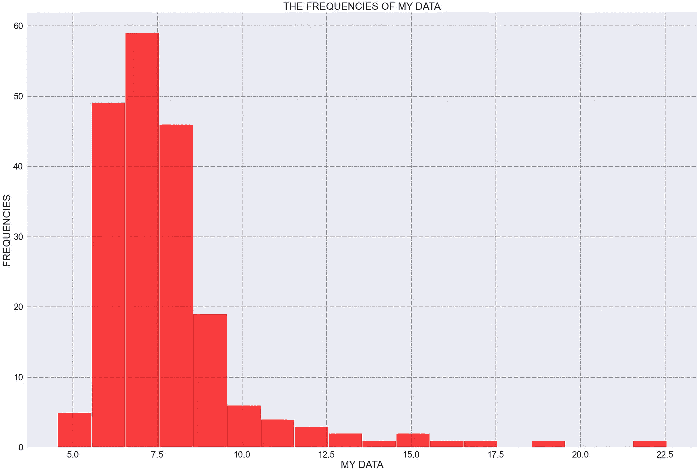
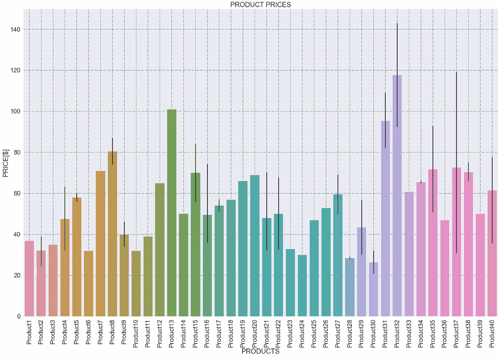
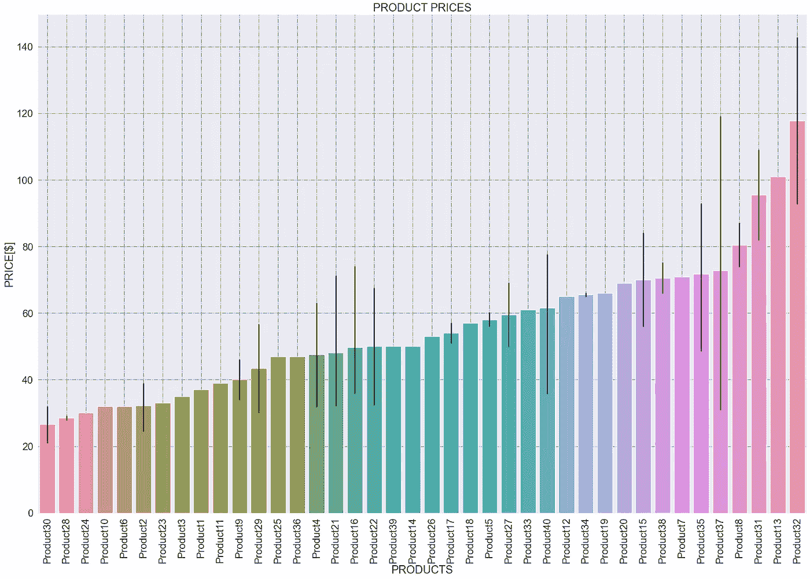

# 柱状图和柱状图的区别是什么？

> 原文：<https://towardsdatascience.com/what-is-the-difference-between-a-barplot-and-a-histogram-e62d0e532e7d>

## 它们看起来是一样的，但是它们之间的区别是相关的


卢克·切瑟在 [Unsplash](https://unsplash.com/s/photos/chart?utm_source=unsplash&utm_medium=referral&utm_content=creditCopyText) 上的照片

D 数据可视化并不像听起来那么简单:你不必展示你的数据；你必须讲一个故事，你必须恰当地选择你的英雄。

在这种情况下，你的英雄是你选择用来讲述你的故事的图表，你必须知道一件重要的事情:**不是每个人都是技术人员**。事实上，从事数据工作的人必须掌握的一件事是讲故事和数据展示技术，因为在大多数情况下，我们必须向不懂数学和统计学的人讲述故事。

如果你有一些年幼的孩子，你会给他们读一本有很多图片和几个单词(而不是相反)的书，不是吗？这是因为孩子们想要理解，但直到他们学会如何阅读，他们才能理解你的故事，而你读它，看图片。他们真的看到狼在森林里寻找小红小红帽，但他们得到了书中图片的帮助:这有助于他们开发想象力。

在本文中，我们将看到两位主宰您的数据故事的英雄，他们是:

*   条形图
*   柱状图

由于这两个英雄非常相似，我将给出一些实际的例子，告诉你如何以及何时更好地使用他们，以及当你使用他们时你传达了什么。

# 1.直方图

引用[维基百科](https://en.wikipedia.org/wiki/Histogram):

> 直方图**是数字数据分布的近似表示**

实际上来说，**直方图有助于我们看到我们想要展示给人们的数据的频率**。由于直方图在视觉上用条形表示，条形越高，频率越高。

我们来看一个例子；如果我们有一个数据框“df ”,其中我们想要表示称为“我的数据”的数据的频率，我们可以用 seaborn 绘制一个直方图，如下所示:

```
import seaborn as sns
import matplotlib.pyplot as plt#plotting the histogram
sns.histplot(data=df, x='MY DATA', color='red', binwidth=1)#labeling
plt.title(f"THE FREQUENCIES OF MY DATA", fontsize=25) #plot TITLE
plt.xlabel("MY DATA", fontsize=25) #x-axis label
plt.ylabel("FREQUENCIES", fontsize=25) #y-axis label#showing grid
plt.grid(True, color="grey", linewidth="1.4", linestyle="-.") 
```



直方图。图片作者。

在直方图中，我们将“binwidth”定义为每个矩形的宽度。在这个例子中，我将 binwith 设置为 1。

假设这个直方图表示测量的时间，并且每个仓具有 1 分钟的宽度。这张图表告诉我们这个故事:

> 最频繁测量的时间在 6.5 到 7.5 分钟之间，因为这个数值范围已经测量了大约 60 次(最高柱的高度非常接近 60)

还有，关于分布我们能说什么？嗯，我们可以清楚地说，数据不是正态分布(高斯)，因为它们明显(右)偏斜。

# 2.条形图

一个**条形图**(或条形图)是一个图形，其中**用矩形条**、**表示数据，矩形条的高度与它们所表示的值**成比例。

换句话说，一个**条形图显示了一个数字变量和一个分类变量**之间的关系，每个分类变量被表示为一个条形:条形的大小(它的高度)表示它的数值。

让我们看一个例子:



柱状图。图片作者。

在这种情况下，我们有 40 种产品，我们可以看到每种产品的价格，帮助我们比较产品本身。在这种情况下——当我们有“很多”产品时——为了更好地可视化，我们最好按升序或降序排列条形。

如果我们使用 seaborn，我们的数据框架是“df”，我们要绘制的数据是“产品”和“价格”，我们可以这样做:

```
import seaborn as sns
import matplotlib.pyplot as plt#setting the ascendent order
order = df.groupby(['PRODUCT']).mean().sort_values('PRICE').index#plotting the barplot
sns.barplot(data=df, x='PRODUCT' , y='PRICE', order=order)#rotating x-axes values for better viz
plt.xticks(rotation = 'vertical')#labeling
plt.title('PRODUCT PRICES')
plt.xlabel(f'PRODUCTS')
plt.ylabel(f'PRICE[$]')#showing grid
plt.grid(True, color="grey", linewidth="1.4", linestyle="-.") 
```



以升序排列的柱状图。图片作者。

所以，这样我们很容易看出，最贵的产品是“product32”，最便宜的是“product30”。

# 结论

在本文中，我们已经看到了直方图和条形图之间的区别；两者都使用矩形作为解释数据的视觉方式，但它们传达的结果是不同的。总结:

*   **直方图:**

1.  **近似于数据的分布**
2.  **显示数值数据之间的关系**
3.  **帮助我们理解一个数值出现的频率**

*   **柱状图**:

1.  **用矩形条表示数据，矩形条的高度与其表示的值成比例**
2.  **显示了数值变量和分类变量之间的关系**
3.  **帮助我们比较不同分类变量的值**

**剧透提醒**:如果你是一个新手或者你想学习数据科学，并且你喜欢这篇文章，那么在接下来的几个月里**我将开始辅导像你这样有抱负的数据科学家**。我会在接下来的几周告诉你我什么时候开始辅导，如果你想预订你的座位… [*订阅我的邮件列表*](https://federicotrotta.medium.com/subscribe) *:我会通过它和在接下来的文章中传达我辅导旅程的开始。*

*我们一起连线吧！*

[*中等*](https://federicotrotta.medium.com/)

[*LINKEDIN*](https://www.linkedin.com/in/federico-trotta/) *(给我发送连接请求)*

[推特](https://twitter.com/F_Trotta90)

考虑成为会员:你可以免费支持我和其他像我一样的作家。点击 [*这里*](https://federicotrotta.medium.com/membership) *成为会员。*