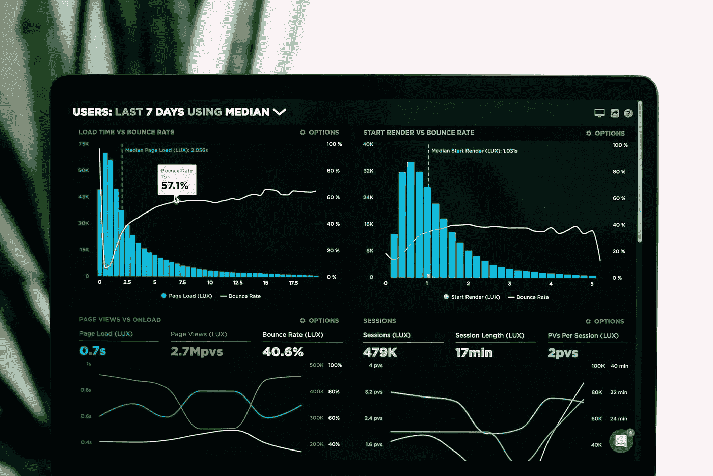

# 数据工程师、数据科学家和数据分析师的区别是什么？

> 原文：<https://towardsdatascience.com/what-is-the-difference-between-a-data-engineer-a-data-scientist-and-a-data-analyst-8d3431ce505e>

## “大数据”是一个广泛的领域，至少涵盖五个学科和三个职位。虽然数据科学、数据工程和数据分析无疑是重叠的职业道路，但它们之间有着重要的差异。这是细目分类。

卢克·切瑟在 [Unsplash](https://unsplash.com/s/photos/big-data?utm_source=unsplash&utm_medium=referral&utm_content=creditCopyText) 上的照片

当想到被亲切地称为“大数据”的现代数据产业时，很容易将所有“数据人”归入“数据科学家”这一笼统的术语但现实是，在企业层面处理大数据问题需要很多相关的规则。

暂且将数据库管理员(通常称为 DBA)放在一边，我们仍然会遇到数据分析师、数据工程师和数据科学家。虽然人力资源可能并不总是知道公司中这些相关角色之间的实际区别，但就日常职责和专业知识而言，它们是非常不同的。

# 数据分析师和数据工程师有什么区别？

数据分析师通常使用像[雪花](https://www.propeldata.com/blog-category/snowflake-concepts)、[亚马逊红移](https://aws.amazon.com/redshift/)和[谷歌 BigQuery](https://cloud.google.com/bigquery) 这样的工具在“数据仓库”方面工作。通常，他们负责将记录系统中组织有序的结构化数据移动到高性能数据仓库和特定于团队的“数据集市”中，以生成分析和商业智能(BI)报告。

相比之下，数据工程师往往被分配到“数据工程”和“事件流”项目。数据工程师的角色在概念上类似于数据分析师，但主要区别在于，与“纯”数据分析师相比，数据工程师更可能专注于处理半结构化、非结构化和流式数据(如来自实时事件的数据)。

为了处理可能有重复或不完整记录的数据，数据工程师必须依靠诸如 [Airflow](https://airflow.apache.org/) 、 [dbt](https://www.getdbt.com/) 、 [Fivetran](https://www.fivetran.com/) 或 [Airbyte](https://airbyte.com/) 等工具来提取、转换和加载(ETL)数据。(事实上，许多数据工程师现在更喜欢在转换数据之前加载数据，这导致了 ELT 过程。)这些复杂的过程通常部分是手动的，可能涉及数据湖和流数据引擎——如 [Apache Spark](https://spark.apache.org/) 、 [Kafka](https://kafka.apache.org/) 和 [Amazon Kinesis](https://aws.amazon.com/kinesis/) 等软件。

# 数据科学家和数据工程师有什么区别？

“数据科学”和“机器学习”(ML)是我们将涉及的最后两个数据相关学科，这些项目往往由拥有“数据科学家”头衔的个人完成像数据工程师一样，数据科学家通常习惯于处理所有类型的数据，因此数据科学家可能会像数据工程师一样使用相同的数据湖和各种数据准备工具。然而，数据科学家通常以解决数据科学或 ML 问题为最终目标来转换他们的数据，而数据工程师通常更感兴趣的是创建可重复的工程流程来支持他们组织的其他部分。

与数据分析师相比，数据分析师可能会处理大量用于商业智能和竞争分析的一次性报告生成，数据科学家倾向于得出统计结论(证明或否定假设)或帮助创建 ML 应用程序(如 ML 支持的图像识别)。这意味着数据科学家喜欢使用 [Scikit-learn](https://scikit-learn.org/) 、 [TensorFlow](https://www.tensorflow.org/) 或 [PyTorch](https://pytorch.org/) 等软件进行数据科学和 ML 工作。与数据工程中的相关工具相比，这些框架往往更专门用于数据科学或 ML 工作流，例如，这些工具可能无法支持 ML 数据模型的选择、训练和评估。

同时，数据工程师通常从数据仓库、数据集市和分析报告中获取数据；将数据转换成不同格式；然后交给数据科学家或数据分析师。作为复杂数据工程项目的一部分，他们可能会弄脏自己的手，进行编程设置和配置，这可能需要几个月的时间才能完成。[为软件即服务(SaaS)公司构建产品内分析](https://www.propeldata.com/blog/how-to-build-in-product-analytics-with-snowflake-and-graphql)是一个典型的需要数据工程师团队的项目示例。这种类型的项目不太可能涉及数据科学家，除非需要统计分析或 ML 支持的功能。

# 数据分析师、数据工程师和数据科学家之间的区别

我们已经看到，这三条“大数据”职业道路是相关的，并且有许多重叠，但数据工程师、科学家和分析师之间的主要差异归结为两点:1)他们试图解决的典型问题，以及 2)他们选择的工具。

数据分析师最有可能与“商业智能”(BI)问题相关联，这意味着他们的任务是为公司生成可操作的 BI。虽然他们经常使用数据工程工具，并且可能乐于建立数据仓库，但是组织的数据分析师可能是通过数据集市建立特定于团队的分析报告的人。他们可能隶属于业务分析师团队或某个组织的某个职能部门(如市场营销)，也可能定期向高级管理层汇报。

同时，数据工程师通常不太关注 BI 报告，而是负责清理和处理复杂的数据。他们可能会使用更“程序化”的方法(像软件工程师一样)，并且可能会习惯于采取手动步骤来提取、加载和转换(ELT)数据。数据工程师可能熟悉数据仓库和数据湖之间的区别，他们经常参与围绕实时流分析的事件驱动架构的平台级计划。

最后，但绝对不是最不重要的，数据科学家可能有更多的研究背景，至少通过正式的培训和教育课程。机器学习(ML)和统计分析方面的专家更可能使用术语数据科学家，尽管有许多人的职称是统计员(统计分析师)、信息学家(信息科学家)或 ML 工程师。鉴于 ML 理论上可以应用于几乎任何可以想象的问题，当组织试图优化他们的业务并向客户提供价值时，数据科学家非常受欢迎。但是，他们通常不是向首席执行官提供商业情报的人。

# 结论:数据分析、数据科学和数据工程

虽然每个数据学科的工作描述都不是一成不变的，但了解数据科学、数据工程和数据分析之间的相似性和差异是很有用的。

总的来说，在统计机器学习(一方面是“纯”数据科学和 ML)和支持执行决策的一次性人工报告(另一方面是“纯”数据分析和 BI)之间有一个连续体。数据工程师介于两者之间，他们通常会深入参与软件工程和产品架构。

大数据中没有硬性规定，随着数据规模的持续增长，数据相关学科的变化速度比技术领域的任何其他部分都要快。如果你不太确定某人在数据科学、分析或工程方面的经验，就问问他们喜欢从事的项目类型以及他们喜欢使用的工具。

您还可以询问他们是否更喜欢细节(如工程事件流软件架构)，或者他们是否对处理各种各样的数据相关项目感到满意。最后，请记住，大数据中的职称既意味着很多，同时又毫无意义；它们有助于加深你的理解，但不应该被用来限制别人。

**编码快乐！** 🧑‍💻🎧👩‍💻🎶👨‍💻

[Derek Austin](https://www.linkedin.com/in/derek-austin/)博士是《职业编程:如何在 6 个月内成为一名成功的 6 位数程序员 》一书的作者，该书现已在亚马逊上架。