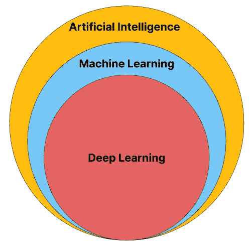

# 机器学习和深度学习有什么区别？

> 原文：<https://towardsdatascience.com/what-is-the-difference-between-machine-learning-and-deep-learning-d0fb539e07a1>

## *向新学员介绍数据科学中这两个经常误导的概念*

图片作者。

在数据科学的背景下，遇到术语*机器学习*和*深度学习*并不罕见。它们的用法往往是一样的，有时甚至可以表示同样的意思。

这经常导致没有经验的读者混淆这两个术语的真正解释。

本文旨在澄清这两个术语，以便读者能够分别准确理解什么是机器学习和深度学习。

# 导言:一些定义

为了更好地理解机器和深度学习之间的差异，我们必须首先理解这两个学科实际上是什么，以及它们所处的环境。**这对于那些希望在该领域找到自己的定位，并且刚刚开始进入数据分析世界的人来说尤其重要。**

本文提到的每一个学科都是**人工智能**领域的一部分。正如许多人所知，这也是计算机科学的一部分。因此，无论是机器学习还是深度学习，都是先 AI 后 CS 的一部分。

计算机科学是一个非常广泛的科学学科，所以我们将只关注人工智能，因为这是我们作为分析师的工作领域。

人工智能是一个非常广阔的领域。机器学习和深度学习只是目前最知名的两个学科。

其他人是

*   **搜索和优化 algorithms‍的创建**
*   创建**逻辑、感知、学习和规划结构**
*   **机器人技术**

还有许多其他的，根据我们想要考虑的详细程度，这些可以扩展到集成其他组。

因此，作为人工智能的一部分，机器学习和深度学习触及并影响了上述学科，后者也是如此。

为了形象化这种层次结构，让我们来看看这张图片

图片作者。

当然，机器人专家会使用机器学习或深度学习来教机器实现目标。在这种情况下，他将很可能使用*强化学习、*机器的另一个分支或深度学习。

现在让我们把重点放在差异上，形成一套可读的要点。

# 机器学习的定义

正如我们提到的，机器学习是人工智能的一个分支，而人工智能又是计算机科学的一个分支。

*机器学习允许一台机器在没有被特别编程的情况下执行任务*。因此，机器学习成为自动化任务的最有趣和最强大的解决方案之一。

事实上，这也是数据科学家成为工作场所杰出人物的原因之一——他们事实上是自动化的推动者。

> 数据科学家是自动化的推动者

由于机器学习，分析师可以考虑任何任务，并在其中集成一定程度的自动化，这样他们就可以

*   **帮助加快执行速度**
*   **减少人为失误**
*   允许**在多个方面扩展业务**

这些要点中的每一个都是商业环境中的基础，因为它们对经济方面有直接影响。

你可以在下面的[链接](https://medium.com/towards-data-science/what-is-machine-learning-how-i-explain-the-concept-to-a-newcomer-d96f35a5c4f3)中详细阅读什么是机器学习，以及例子和应用，在那里我为那些想接近该领域的人详细写了这个主题。

# 深度学习的定义

正如我们所见，深度学习是机器学习的一部分。这个术语不仅仅是一门独立的学科，它还表示一套解决特定问题的特定工具。

机器学习这个术语指的是学科，而深度学习指的是机器学习的方式。**神经网络**是这个领域的主角。事实上，神经网络通过它的层进行学习，这些层可以非常深。

神经网络被认为是深度学习的本质，而且确实有很多这样的网络……每一个都是为了解决特定类型的问题而设计的。

例如，有些神经网络“记住”很长的序列，因此输出不仅受最新数据的影响，还受之前很久的数据的影响。这些被称为 [**LSTM**](https://medium.com/towards-data-science/time-series-prediction-with-lstm-in-tensorflow-42104db39340) (长短期记忆)神经网络。另一些被称为 [**卷积**](https://medium.com/towards-artificial-intelligence/binary-image-classification-with-tensorflow-2cc6555e55e8) 神经网络，将过滤器应用于图像，以便只学习所代表的主题的最相关特征。

如果你想了解神经网络，在这个[链接](https://medium.com/mlearning-ai/introduction-to-neural-networks-weights-biases-and-activation-270ebf2545aa)你会找到一篇介绍性文章，解释它们是如何工作和学习的。

# 传统机器学习和深度学习的区别

传统机器学习和深度学习的关键区别**可以在这些算法试图解决的问题**中找到。其中许多是为解决特定问题而设计的，例如时间序列或文本回归和分类。

无论如何，两家都有各种问题的算法。

这里列出了传统机器学习和深度学习算法的主要区别。

## 专门化

深度学习是一套技术和算法，肯定更适合特定的问题，通常非常复杂。由于神经网络可以模拟任何功能，如果它们有无限的资源和时间，它们被用于解决涉及**非结构化数据**的复杂问题，如文本、视频和音频。

对于表格形式的结构化数据，不太复杂的机器学习技术也可以超过深度学习算法的性能。

此外，在从更大的数据集(大数据)中学习时，神经网络比传统算法更有效。

## 复杂性

虽然有非常复杂的传统机器学习算法，如 [XGBoost](https://en.wikipedia.org/wiki/XGBoost) ，但深度学习算法从定义上来说更复杂。

设计深度学习模型是数据科学中最重要的挑战之一。机器学习工程师每天都在努力进行领域创新。该领域最相关的一些公司是[抱脸](https://huggingface.co/)、[谷歌](https://ai.google/)、 [Meta](https://ai.facebook.com/) 、[百度](http://research.baidu.com/)、 [OpenAI](https://openai.com/) 以及许多其他公司。

## 计算请求

通常，传统的机器学习算法比深度学习算法需要更少的计算能力。这是因为**神经网络可以利用 GPU**(图形处理单元——基本上是显卡)来提高训练速度。除了 GPU，他们还可以利用 **TPUs** (张量处理单元)，这是针对深度学习优化的芯片。

一些传统的机器学习算法也可以利用 GPU——其中包括 XGBoost、LightGBM 和 Catboost。

## 可解释性

在谈论机器学习和深度学习之间的差异时，经常没有考虑的一个方面是模型和算法的可解释性有多大。

神经网络通常被认为是*黑盒*——也就是说，我们知道它们如何工作，但我们不知道它们如何实现预期的结果，也无法预测它。只有尝试不同的架构，才能逐渐接近最佳配置。

另一方面，传统的算法，如决策树，很容易解释，并且交流这些算法如何工作以及它们如何获得结果也相对容易。

# 结论

机器学习和深度学习本质上是一样的东西——允许机器做出足够精确的推论以用于商业或非商业背景的方法和技术。这些方法取决于我们面临的环境。

在小型表数据集上使用深度学习技术可能会矫枉过正，因为“平凡的”*随机森林*可以表现得更好，更快地收敛到解决方案。

我的建议是一如既往地仔细评估背景，问自己一些有助于理解我们面临的问题的明确问题。

如果您想了解更多关于技巧和方法的信息，我建议您浏览我的 Medium profile，其中包含一些关于心智模型和模板的文章，以优化数据科学领域的工作。

**如果你想支持我的内容创作活动，欢迎点击我下面的推荐链接，加入 Medium 的会员计划**。我将收到你投资的一部分，你将能够以无缝的方式访问 Medium 的大量数据科学文章。

  

感谢您的关注，很快再见！👋