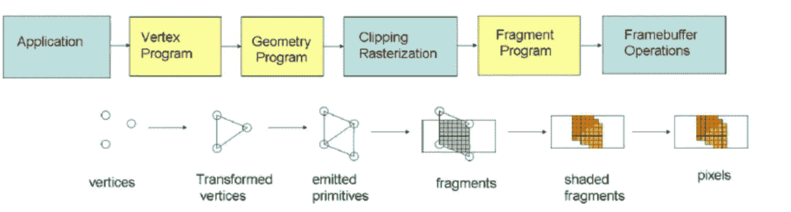
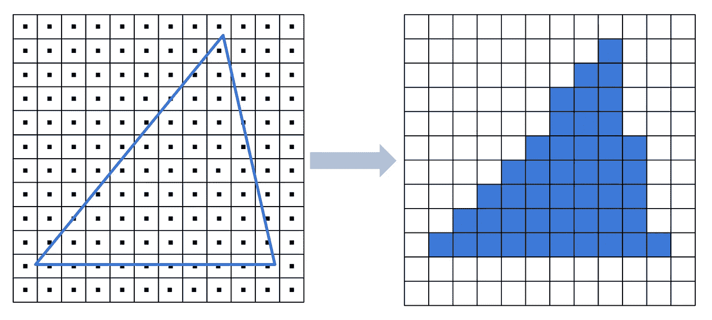
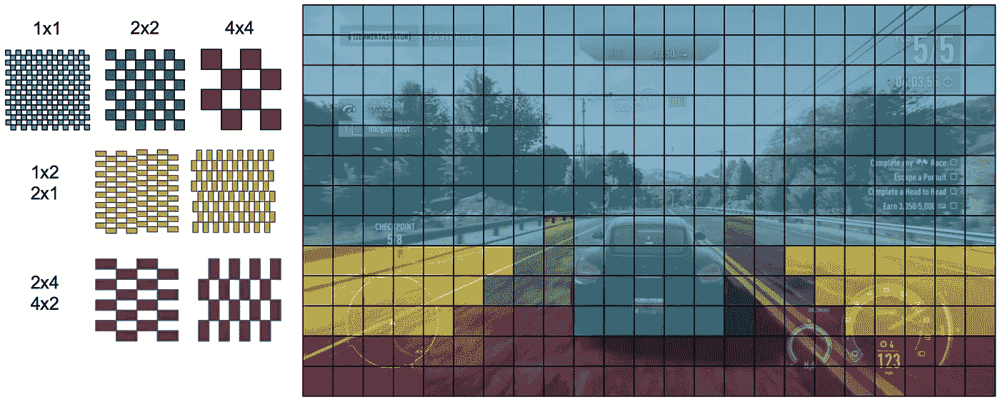
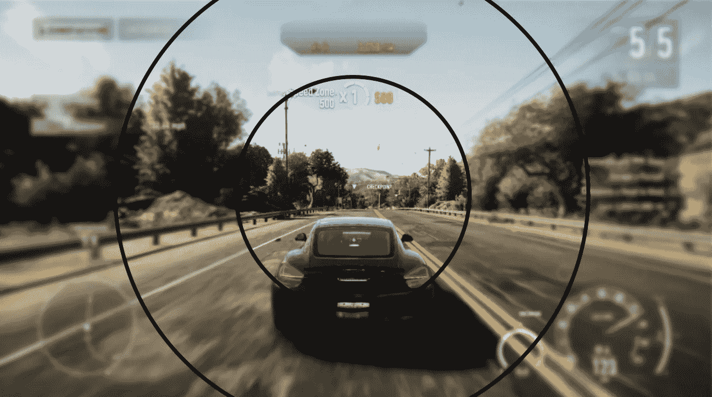
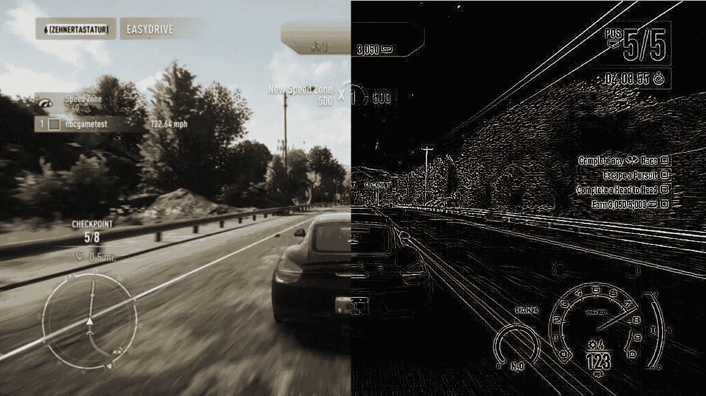
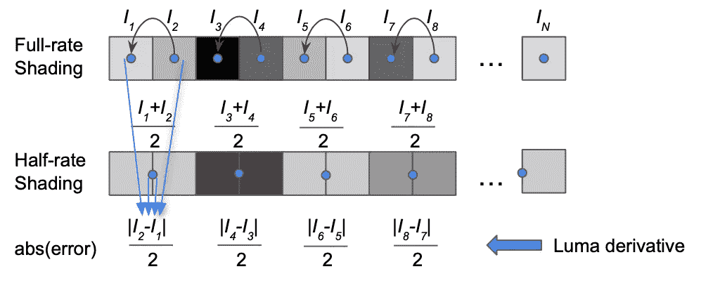
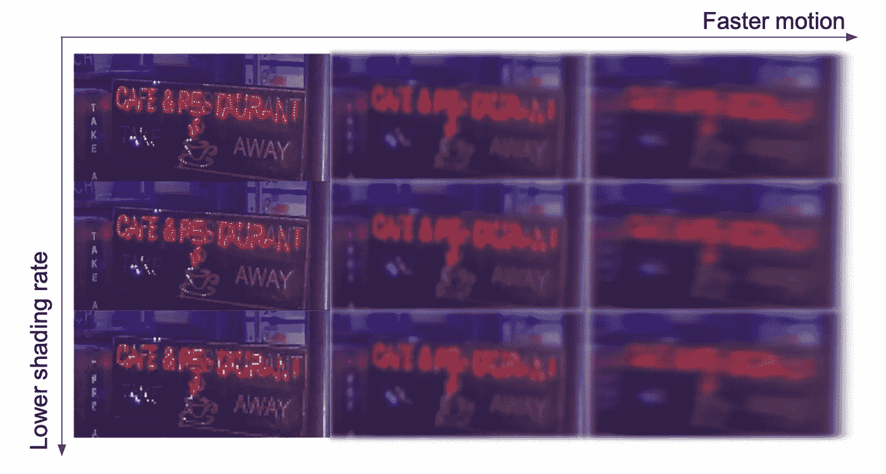
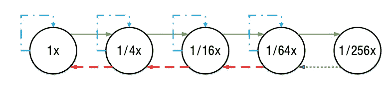
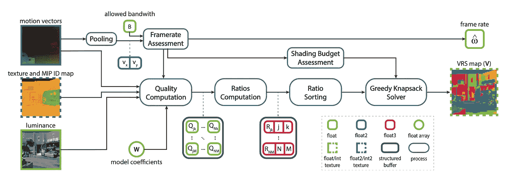
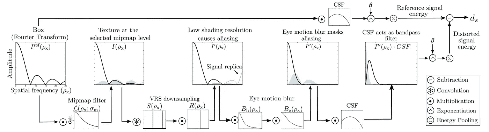

# 什么是可变比率阴影，为什么大玩家争相获取它

> 原文：<https://towardsdatascience.com/what-is-variable-rate-shading-and-why-big-players-are-rushing-to-get-it-ea90a71a5d98>

## 最先进的优化实现了 40%以上的渲染成本降低

作者图片

小时候经常玩——魔兽世界:冰封状态，极品飞车:地下，波斯王子:时之沙，GTA:副城和使命召唤 4:现代战争。当时，这些游戏看起来很疯狂——“贴近生活”的图形、逼真的动作和过热的电脑。

新游戏中场景和视觉效果的日益复杂，加上新技术，如增强和虚拟现实，更高的帧速率，达到每秒 120 帧，分辨率和动态范围推高了渲染成本。

GPU 设计的最新进展开辟了一种新的方法来降低计算成本，同时对视觉质量的影响最小——可变速率着色(VRS)。

VRS 允许动态选择像素块的阴影率—更低的阴影率—更高的效率和更低的质量。更高的着色率-更高的质量，但也有更高的计算要求。因此，目标是在质量和计算之间取得平衡。

最先进的技术声称在不损失质量的情况下，渲染时间减少了 40%。很好，不是吗？

下面，我将简要介绍渲染管道、可变速率着色的一般方法，并讨论最新的解决方案，如来自 NVIDIA、微软和 AMD 的解决方案，以及尚未上市的学术进展。

# 渲染管道

渲染管道的目标是获取世界的 3D 模型，并转换成可以在屏幕上显示的 2D 表示。

图形管道。图片由 C. Vetter 提供。

场景的原始 3D 模型(顶点)在转换为像素之前要经过几个阶段。顶点首先通过顶点着色器跨图元(三角形或直线)进行插值。然后用几何着色器对这些进行细化。裁剪用于裁剪延伸到单位立方体之外的对象或对象的一部分(用于容纳显示的空间)。光栅化将形状的 3D 空间转换为光栅化图像(像素)。然后，片段着色器识别每个像素的颜色，并在帧缓冲操作后生成最终图像。

本文的重点是片段着色器。对于每个像素，我们需要从我们要显示的纹理中查找它的颜色。

抽样示例。图片由作者提供。

对每个像素的颜色进行采样是非常昂贵的。例如，对于 1920 × 1080 分辨率，需要 2，073，600 次查找。正如我们将在下面看到的，这个数字可以通过 VRS 大大减少。

如果你有兴趣了解更多关于图形管道的知识，请查看 YouTube 频道。

# 可变比率阴影—一般原则

为每个像素查找颜色非常耗时，虽然我们可以依靠高度[并行的 GPU](/scientific-computing-lessons-learned-the-hard-way-db651f8f643a)来进行这些独立的计算，但实现高帧率仍然具有挑战性。VRS 允许我们通过识别像素块来减少处理工作，我们可以通过查找一次来分配相同的颜色，而不会明显降低质量。

考虑下图。对于某些区域，我们可以在没有明显变化的情况下降低颜色估计的准确性。这些可能是图像中快速移动的区域——例如，车轮后面的区域、眼睛焦点周围的区域、游戏中由于雾而能见度降低的区域，或者颜色均匀的区域。

第二层可变比率阴影。作者图片

## 两种类型的虚拟现实

根据 VRS 的实现方式，我们可以通过两种方式为像素块分配颜色:

*   **第 1 层**是基于每次绘制着色率的。例如，我们可以指定半透明背后的资产具有较低的着色率，或者指定策略游戏中的水应该以较低的着色率着色，而森林应该以较高的着色率着色。
*   **Tier 2** 类型允许在绘图中以更高的粒度指定阴影率。例如，我们可以选择指定了相同阴影率的像素块。描述如何应用 VRS 的数据结构称为 VRS-map(也称为 VRS-texture)。每个位置保存要应用于图块的着色率(具有相同着色率的像素区域)。拼贴大小和阴影率取决于硬件实现。然而，最常见的瓷砖尺寸是 16x16 和 8x8 以及 1x1、1x2、2x1、2x2、2x4、4x2、4x4 的阴影率。

在本文中，我将重点介绍第 2 层 VRS，因为它提供了更多的灵活性和潜在的节省。

## 总则

像许多计算机图形技术一样，VRS 利用人眼的低效率来减少计算，同时保持渲染图像的质量与参考图像一致。

根据可用的数据和硬件，我们可以基于以下因素降低阴影率:

*   **有凹渲染**。我们可以依靠眼睛跟踪，并使用有凹渲染来降低头戴式设备的眼睛焦点外围的图像的阴影率。然而，由于它需要额外的硬件能力，所以我不会在本文中涉及太多的细节。

有凹渲染。图片由作者提供。

*   **空间频率**。也许降低阴影率最直接的方法是寻找颜色一致的区域。有许多方法可以做到这一点，但大多数方法依赖于梯度信息估计(例如边缘检测)来识别低频区域。
*   **议案。**快速移动的物体将被我们的视觉系统平滑处理——使这些区域呈现出快速、平滑的变化，这与降低阴影率是完美的匹配。这些方法依赖于运动矢量，而运动矢量在实践中通常是不可用的。

## 估计 VRS 地图

为了估计当前帧的 VRS 贴图，我们需要找到该帧中可以应用降低的阴影率的区域。然而，由于该帧还没有被渲染，我们将依赖于来自过去的、已经被渲染的帧的信息来估计当前帧的着色率。根据现有信息，我们可以:

*   使用可从先前渲染阶段获得的运动矢量，然后重新投影先前帧以获得当前帧的估计；
*   例如，使用基于流、块匹配、基于神经网络和基于摄像机运动的方法，即时计算运动矢量。
*   使用没有重新投影的前一帧，假设场景中的变化很小，这在实践中经常成立。

# 最先进的 VRS

VRS 是一项非常强大的技术，如果应用得当，可以显著提升游戏性能。因此，大多数主要的游戏引擎和 GPU 供应商都在寻找将 VR 集成到他们的生态系统中的方法。

## **微软 VRS (MSFT-VRS)**

来自微软的各种版本的 VRS 解决方案已经在 2021 年的游戏开发者大会上展示过，并在 2022 年的延期闪电和 2022 年的 XboX 中的应用中讨论过。Jacques van Rhyn 也发表了一系列博客文章，强调技术细节和性能基准测试:[博客文章#1](https://devblogs.microsoft.com/directx/variable-rate-shading-a-scalpel-in-a-world-of-sledgehammers/) 、[博客文章#2](https://devblogs.microsoft.com/directx/gears-tactics-vrs/) 、[博客文章#3](https://devblogs.microsoft.com/directx/gears-vrs-tier2/) 。

微软的 Tier 2 VRS 通过对来自前一帧的 sRGB 彩色缓冲器的亮度运行 Sobel 边缘检测器来为当前帧生成 VRS 图。对最终颜色值运行边缘检测器具有优势；例如，它捕捉由于后期处理效果而模糊的区域。我们可以使用一个可配置的阈值，这取决于边缘检测器需要多强。

边缘检测的示例-边缘被识别的区域会看到较高的阴影率。图片由作者提供。

## NVIDIA 自适应着色(NAS)

NVIDIA 在一篇名为[游戏中视觉无损内容和运动自适应阴影的论文中正式描述了其 VRS 解决方案](https://dl.acm.org/doi/abs/10.1145/3320287)。正如这篇文章的名字所示，两个方面影响了 VRS 贴图的计算:*错误*，这将由应用较低的阴影率和*运动* *模糊*产生。

**误差计算:**下图给出了阴影率减半的 1D 信号的误差计算示例。该误差被定义为相邻像素的亮度导数。使用算术平均值、“均方误差”或“最大值”对每个图块的最终误差求和。

图片由作者提供。

对于 2D 图像块，在水平和垂直方向上计算误差。因此，垂直和水平阴影率是独立评估的。

**运动模糊:**由降低的阴影率引起的误差可能被运动模糊隐藏。NVIDIA 区分了两种可能影响最终着色率的模糊类型:

*   由引擎作为特殊效果引入的模糊。
*   液晶显示器的持续模糊。在渲染下一个屏幕之前，在屏幕上显示图像；这在物体运动中引入了不连续性。当眼睛以线性、连续的运动跟踪物体时，物体在视网膜上模糊，产生模糊的外观。

图片由作者提供。

游戏开发者大会上也展示了 NAS，这里有[张幻灯片](https://www.leiy.cc/publications/nas/nas-gdc19.pdf)。对于那些想要尝试的人来说，NVIDIA 已经发布了[可以为](https://github.com/NVIDIAGameWorks/nas-sample) [Vulkan](https://www.vulkan.org) 编译的代码。你可能也有兴趣看看这个 [SIGGRAPH 演示](https://www.youtube.com/watch?list=TLGG6WmhwX92xDEyNTA5MjAyMg&time_continue=1&v=Hgl9eTJio8Q&feature=emb_title)，NVIDIA 在这里展示了其早期版本的 VRS。

## AMD 保真 FX

与微软和英伟达的解决方案类似，在他们的设计中， [AMD FidelityFX VRS](https://www.youtube.com/watch?v=LqpqYx3AiAQ) 依赖于估计相邻像素之间的梯度。

AMD VRS 使用 8×8 的拼贴大小，并分析 2×2 区域内的像素对。基于区块内 2×2 块中的像素对之间的最大亮度增量来设置阴影率。类似于上面的方法，该方法具有控制质量和节省之间的折衷的可调阈值。

如果包括运动矢量，该方法可以基于运动的强度减少增量。

即使网上没有很多关于 AMD 解决方案的资源，你也可以在[代码中查看具体的实现](https://github.com/GPUOpen-Effects/FidelityFX-VariableShading)！

# 动态采样率(DSR)

与之前在空间域操作的方法不同，[动态采样率](https://arxiv.org/abs/2202.10533)分析离散余弦变换(DCT)空间中图块的频率信息。

该方法分析系数的 2D DCT 矩阵，以确定该图块的当前采样率是否是最佳的。DCT 系数被聚合成一个值，该值概括了图块中的高频信息量。当前帧的着色率基于预设的阈值和着色贴图的先前状态。

通过使用来自先前 VRS 图的信息来决定当前的着色率，该方法解决了时间不稳定性的问题。考虑一个静态场景的例子，在步骤[t-1]，我们决定降低阴影率。我们的决定基于这样的观察，即估计误差略低于保持较高遮光率的阈值。在步骤[t],具有降低的阴影率的区块看到误差稍微增长并超过阈值。因此，我们增加了阴影率。在帧[t+1]处，重复这种情况。同一拼贴的阴影率的这种变化导致闪烁。

为了缓解阈值附近误差的微小变化导致闪烁的问题，该方法被实现为有限状态机。控制状态之间转换的阈值对于转换到增大和减小的遮光率是不同的。选择这些值是为了使值的微小变化不会导致图块的阴影率变化。

采样率最终状态机。Marti Anglada 提供的图片。

# 自适应采样和刷新率(ALSaRR)

本文中讨论的最复杂和感知最准确的可变速率着色工作称为[自适应局部着色和刷新率感知模型](https://www.cl.cam.ac.uk/research/rainbow/projects/alsarr/)。与其他旨在找到在质量和节约之间取得平衡的着色率的方法不同，该模型确定了固定预算下的最佳帧速率和 VRS 贴图。

该模型将运动矢量、亮度和 MIP ID 图作为输入。基于质量评估模型，该方法估计每个 VRS-map 配置的所有可能的质量水平。然后，该模型使用贪婪背包解算器，从粗略着色率图开始，并基于质量与带宽的排序比率逐渐增加着色率。

ALSaRR 管道。[图片由阿克谢·金达尔拍摄。](https://www.cl.cam.ac.uk/research/rainbow/projects/alsarr/)

流水线中最重要的部分是质量模块，它估计由较低的阴影率引入的误差。质量估计器完全基于感知模型。

图像质量模块。[图片由阿克谢·金达尔拍摄。](https://www.cl.cam.ac.uk/research/rainbow/projects/alsarr/)

当对图像应用降低的阴影率时，该模型假设傅立叶空间中的质量退化管道。在此管道中，纹理首先由小中见大贴图选择进行转换；然后，通过应用的 VRS 对图像的所选小中见大贴图进行下采样。然后，该模型假设显示对象的运动引入了模糊，这是保持类型和眼睛运动模糊的组合。在模糊滤波器之后，剩余的频谱通过[对比灵敏度函数(CSF)](/deep-image-quality-assessment-30ad71641fac) ，滤除人眼不可见的频率。将结果与通过 CSF 的原始参考信号进行比较，并获得质量分数。

# 警告和总结

估计 VRS 图所花费的时间不应大于所带来的计算节省。因此，VRS 方法通常依赖于不需要太多计算工作的非常直接的计算机视觉技术。总体而言，由于问题的性质，第 2 层 VRS 在以更高的分辨率运行时会获得更高的性能增益。

上述每个 VRS 解决方案都降低到 2x2 着色率，因为较粗糙的着色会引入明显的伪像。

## 资源

[YouTube 频道](https://www.youtube.com/c/cmyuksel)有很酷的计算机图形学讲座；

**微软 VRS:** [在 2021 游戏开发者大会上的演示](https://www.youtube.com/watch?v=pPyN9r5QNbs)，[2022 年 VRS 应用于 differed lightning](https://www.youtube.com/watch?v=Sswuj7BFjGo)，[2022 年 XboX 中的 VRS](https://www.youtube.com/watch?v=pPyN9r5QNbs)，[博文#1](https://devblogs.microsoft.com/directx/variable-rate-shading-a-scalpel-in-a-world-of-sledgehammers/) ，[博文#2](https://devblogs.microsoft.com/directx/gears-tactics-vrs/) ，[博文#3](https://devblogs.microsoft.com/directx/gears-vrs-tier2/) 。

**NVIDIA VRS:** [论文](https://dl.acm.org/doi/abs/10.1145/3320287)， [SIGGRAPH 演示文稿](https://www.youtube.com/watch?list=TLGG6WmhwX92xDEyNTA5MjAyMg&time_continue=1&v=Hgl9eTJio8Q&feature=emb_title)，[游戏开发者大会幻灯片](https://www.leiy.cc/publications/nas/nas-gdc19.pdf)，[代码](https://github.com/NVIDIAGameWorks/nas-sample)。

**AMD VRS:**[AMD fidelity FX VRS 演示](https://www.youtube.com/watch?v=LqpqYx3AiAQ)，[代码](https://github.com/GPUOpen-Effects/FidelityFX-VariableShading)

**DSR VRS:** [动态采样率论文](https://arxiv.org/abs/2202.10533)

**ALSaRR VRS:** [ALSaRR 项目页面](https://www.cl.cam.ac.uk/research/rainbow/projects/alsarr/)

在准备这篇文章的时候，我还发现了[这篇关于可变速率阴影的博客文章](http://filmicworlds.com/blog/software-vrs-with-visibility-buffer-rendering/)，你可能会觉得有用。

上述方法假设 VRS 的硬件实现。也有基于软件的实现，允许在技巧上有更多的灵活性，如 [CoD-VRS](https://research.activision.com/publications/2020-09/software-based-variable-rate-shading-in-call-of-duty--modern-war) 。用于减少闪烁的一个非常酷的技巧是从依赖于多个先前帧的重投影帧中累积梯度，以试图平滑时间伪影，例如 VRS-map 闪烁。

## 喜欢作者？保持联系！

我错过了什么吗？不要犹豫，直接在 [LinkedIn](https://www.linkedin.com/in/aliakseimikhailiuk/) 或 [Twitter](https://twitter.com/mikhailiuka) 上给我留言、评论或发消息吧！

</scientific-computing-lessons-learned-the-hard-way-db651f8f643a>  </on-the-edge-deploying-deep-applications-on-constrained-devices-f2dac997dd4d>  </deep-image-quality-assessment-30ad71641fac> 