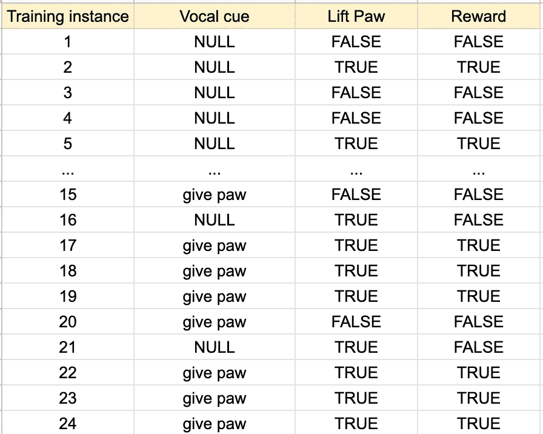
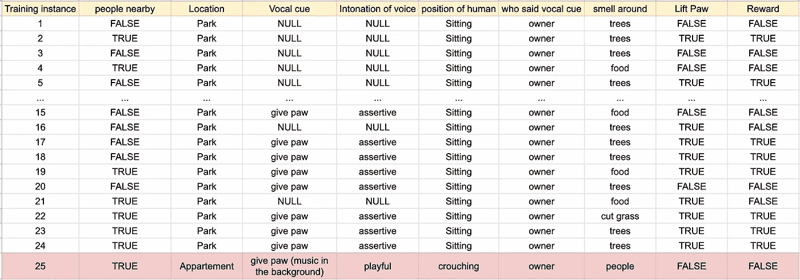

# 机器学习从业者能从训狗师那里学到什么

> 原文：<https://towardsdatascience.com/what-machine-learning-practitioners-can-learn-from-dog-trainers-b8eaa6a63656>

## 训狗不是火箭科学，但它接近于数据科学

见见普拉达。普拉达是有史以来最好的狗——一只美丽、可爱、有爱心、真正伟大的动物。10/10 的好狗狗。

普拉达:一只非常好的狗狗

我的朋友一年前救了普拉达，并对训狗产生了热情。他向我解释说，训狗分两步走。第一步，你教好狗狗你想要的行为。第二步是将这种行为与某个触发器联系起来。

实现第一步就是一遍又一遍地重复这一行为，无论何时只要它们这样做了，就用赞美和款待来奖励它们。

实现第二步有点复杂。你想让狗明白**什么信号**应该触发你训练的行为。

在某种程度上，第二步的过程与训练模型的方式非常相似。

## 利用训犬来建立对模型训练的直观理解

让我们想象一下，你刚刚救了一只 10/10 的好狗狗，你想教它伸出爪子。你决定，从现在开始，在你每天晚上去公园散步之后，你将开始训练它。你开始你的第一次训练，并在每次它抬起爪子时奖励它(教它行为)。

最初的几个训练实例

经过几次训练后，你的狗狗开始自己抬起爪子了！这是一个令人兴奋的发展——你的动物现在知道这种行为，并把抬起爪子的事实与表扬联系起来。是时候教它把抬起小爪子和口头暗示联系起来了。回教室去！

我们快到了。

经过几次训练之后——现在你每次使用语言提示时，你的狗都会给你它的爪子！你非常兴奋，你想把这个展示给你所有的朋友。

你决定在你家组织一个小聚会，有一些好吃的小吃，一些好听的音乐，还有一些好朋友。每个人都到了之后，你决定表演时间到了。你蹲在狗狗旁边，开玩笑地说:“给我爪子！”但是你的狗不动。你再重复一遍命令。什么都没发生。

你开始大量出汗。您用不同的声音再试一次，但没有任何变化。你意识到此时什么都不会发生。

你现在成了小组的笑柄——这正是迈克所期待的。自从你前几天在餐厅公开不同意它对电影《所有地方的一切立刻》的评论后，他就一直在寻找一种方法来奚落你，显然他现在有了。

该死——发生了什么事？

## 从噪音中解析信号

在你这边看起来“清楚”的东西，在你的狗那边可能就没那么清楚了。因为在它这边——这是它收到的输入:

导致“麦克事件”的输入

从这些输入中，很难理解你的口头暗示，以及他所学的行为，是所期望的。

这里的教训是:如果你想让你的狗在任何地方(在家里，在公园，在街上)回应你的暗示，无论环境如何(周围是否有人)，无论你说它的方式如何(无论你大声喊，轻声说，还是在与你的伙伴讨论时说)，无论你的身体语言如何(无论你是否伸出手)，无论你是说暗示的人还是其他人，你都需要相应地训练它。

这就是机器学习和我们所说的**泛化的相似之处。**您希望您的模型在大多数情况下都能正常工作，包括存在以前无法预见的数据的情况。您希望您的模型能够理解“真实”信号，并且不考虑来自每个观察值的个体可变性或随机特征的噪声，这些噪声在模型的决策过程中实际上不应该有任何重要性。

在上面的例子中，通过在始终相同的受控环境中训练你的狗，它最终使用了信号(声音提示和行为)和噪音(在公园里，你蹲着，你使用自信的声音，等等。)来做决定。

你的狗**对训练数据过度拟合**，结果，它在训练阶段有很好的表现(因为它对训练集拟合得很好，甚至拟合了噪音)，但它没有很好地概括学习——即，口头提示在不同的设置中工作得不好。

关于这种平行的有趣之处在于，它还允许对过度拟合如何发生(当你有许多不同的特征可能最终混淆你的模型时)以及修复它的一些策略(在这种情况下，在不同的设置中训练你的 doggo 朋友，以便它能够更好地区分噪声和信号)建立直观的理解。

## 但是我们知道真正的信号是什么吗？

你的狗狗现在每次都伸出爪子——有时你一张嘴就伸出爪子。这让你感到奇怪——怎么会这么快？它是否对你将要说的话产生了某种直觉？

也许答案是你认为是信号的东西(你使用声音提示的事件)并不是。真正的信号是你希望你的狗伸出爪子。也许在某些情况下，你通常希望这样，或者有一些迹象表明，你可能在某个特定的时刻希望这样——你的狗处理、学习的信息，现在能够用来使它的预测更加准确。从你的角度来看，这是奇妙而神奇的——从你的狗的角度来看，这只是重复的观察。

机器学习有趣的一点是(不幸的是，你在训练狗时没有),你有工具从你的模型的角度看问题。您可以访问训练数据、评估指标、特性重要性，并且您可以(在大多数情况下/非黑盒模型中)了解决策是如何做出的。

这肯定没那么神奇——但至少当你的利益相关者问你它是如何工作的，为什么它会以这种方式工作时，你可以很容易地给出答案，并确保他们最终会使用你的工作。

希望你喜欢阅读这篇文章！我总是很兴奋地发现数据科学和其他领域之间的相似之处。如果你知道任何其他有趣的，请在下面的评论中分享！如果你想更多地了解我，这里有几篇你可能会喜欢的文章:

</7-tips-to-avoid-public-embarrassment-as-a-data-analyst-caec8f701e42>  </how-to-build-a-successful-dashboard-359c8cb0f610>  <https://medium.com/@jolecoco/how-to-choose-which-data-projects-to-work-on-c6b8310ac04e> 