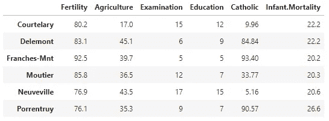
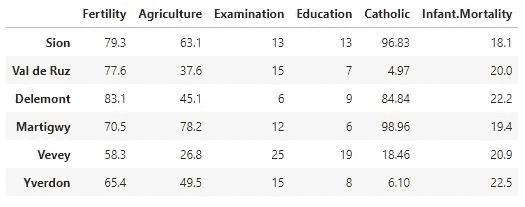
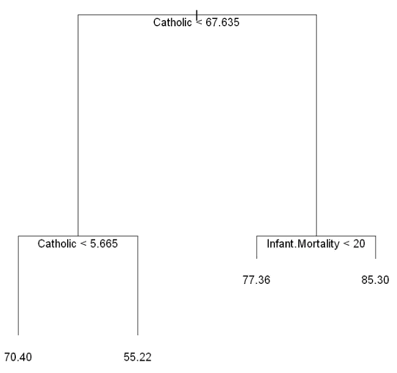
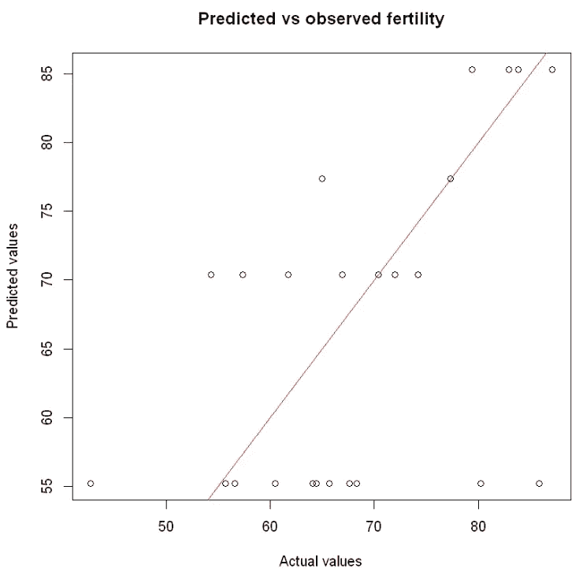
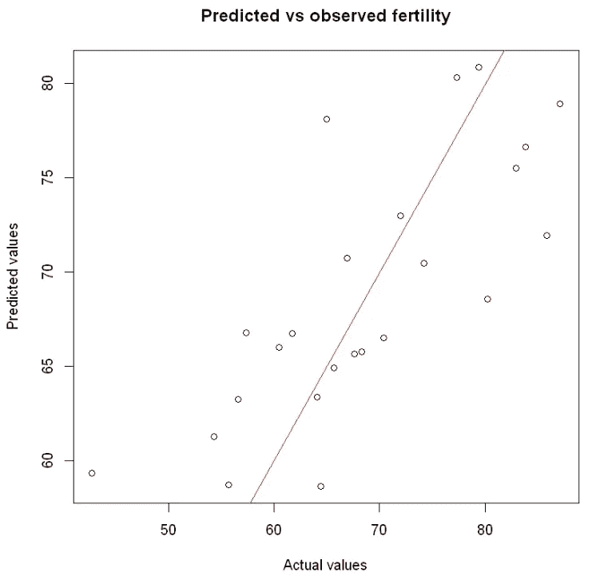

# 是什么让 Bagging 算法优越？

> 原文：<https://towardsdatascience.com/what-makes-bagging-algorithms-superior-4a3882dab59f>

## 证明随机森林等装袋算法性能优于决策树的证据


维多利亚·帕拉西奥斯在 [Unsplash](https://unsplash.com?utm_source=medium&utm_medium=referral) 上拍摄的照片

在我之前的[文章](/battle-of-the-ensemble-random-forest-vs-gradient-boosting-6fbfed14cb7)中，我比较了随机森林和梯度推进，我简要介绍了集成方法的概念，并解释了为什么它们比单独的机器学习模型表现得更好。然而，在那篇文章中，我们仅仅认为这是事实，而没有真正讨论为什么会这样。

今天，我们将深入研究集成方法的概念，特别是 bagging 算法，并提供证据说明它们为什么优于单个决策树模型。

相关代码的链接可以在我的 GitHub [这里](https://github.com/chongjason914/bagging-vs-boosting/blob/main/bagging-algorithm.ipynb)找到。

# 定义

在我们开始之前，让我们快速回顾一下决策树、集成方法和 bagging 的定义。

> 决策树是一种监督学习算法，可用于分类和回归问题。树的每个节点代表一个变量和分裂点，分裂点将数据分成单独的预测。
> 
> 集成方法涉及聚合多个机器学习模型，目的是减少偏差和方差。
> 
> Bagging 也称为 bootstrap aggregating，是指使用称为 bootstrapped 数据集的训练数据子集创建和合并独立、并行决策树集合的过程。

# 单一决策树

为了理解集成方法产生的改进，我们将首先检查一个决策树模型是如何建立的，并在基础模型上进一步重申。

```
head(swiss)
```



Swiss 是一个包含 6 个变量的 47 个观察值的数据框架(每个变量都以百分比表示),它显示了大约在 1888 年瑞士 47 个法语省份的标准化生育率和社会经济指标。

在这里，我们将生育率设置为我们的目标变量，即我们的模型试图预测的变量和作为预测变量的其他变量。

```
# Seed for reproducibility 
set.seed(20)# Assign half of the data set as training data 
training.rows = sample(1:nrow(swiss), 0.5*nrow(swiss))
train = swiss[training.rows, ]
head(train)
```



```
# Tree package 
install.packages(tree)
library(tree)# Fit single decision tree model to training data 
s_tree = tree(Fertility ~ ., data = train)# Plot model
plot(s_tree)
text(s_tree, pos = 1, offset = 1)
```



假设我们想预测这个地区的生育率。


我们可以从树的顶部到底部手动跟踪数据，或者使用 r。

```
predict(s_tree, swiss["Courtelary", ])
```

两种方法得出的值都是 55.22。

此外，我们可能还想看看我们的模型在维持集(有时称为测试集)上的表现，这是我们的模型最初没有训练的数据。

```
# Get test set 
test = swiss[-training.rows, ]
y_tree = predict(s_tree, test)# Plot predicted vs observed values 
plot(test$Fertility, y_tree, main = "Predicted vs observed fertility", ylab = "Predicted values", xlab = "Actual values")
abline(0, 1, col = "red")
```



# 自举样本

在我们讨论单决策树模型的结果之前，让我们使用一个引导示例重复这个过程。这可以通过将示例函数中的 replace 参数设置为 true 来实现。

```
# Use bootstrapped sample 
set.seed(8499)
bag.rows = sample(1:nrow(train), replace = TRUE)
bag = train[bag.rows, ]# Fit decision tree model 
s_bag = tree(Fertility ~ ., data = bag)# Predict 
predict(s_bag, test["Courtelary", ])
```

使用自举数据集，我们得到的预测值为 75.68。

如你所见，55.22 和 75.68 的预测值相差甚远。这反映了决策树是一个典型的高方差模型。换句话说，即使使用稍微不同的数据集来训练模型，也会导致非常不同的决策树，从而导致不同的预测。

解决这个问题的一种方法是采用袋装决策树的思想，其中构建了许多树，并对预测进行平均以获得整体的单个预测。这就是所谓的随机森林。

库特拉里生育率的真实值是 80.2，所以第二棵树预测的 75.68 更接近。然而，我们只是直接比较了一个特定省份的预测。尽管第二个树的预测更接近于 Courtelary，但我们并不确定它是否真的整体表现更好。

# 随机森林

为了解决决策树模型中的高方差问题，我们可以部署随机森林，它依赖于一组决策树来生成预测。本质上，随机森林模型将对大量决策树返回的值进行平均。

```
# Set the number of decision trees 
trees = 1000# Construct matrix to store predictions 
preds = matrix(NA, nrow = nrow(test), ncol = trees)# Fit decision tree model and generate predictions 
set.seed(8499)
for (i in 1:trees) {
    bag.rows = sample(1:nrow(train), replace = TRUE)
    bag = train[bag.rows, ]
    s_bag = tree(Fertility ~ ., data = bag)
    preds[, i] = predict(s_bag, test)
}# Take the average from predictions 
y_bag = rowMeans(preds)# Plot predicted vs observed values 
plot(test**$**Fertility, y_bag, main **=** "Predicted vs observed fertility", ylab **=** "Predicted values", xlab **=** "Actual values")
abline(0, 1, col **=** "red")
```



上图表明，使用训练数据构建的单一决策树在预测测试数据时表现不佳。这些点离参考线相当远，并且对于许多外部节点来说，这些点看起来并没有广泛地分散在参考线上。

另一方面，袋装决策树方法似乎表现得更好。这些点更加紧密地分布在参考线周围。然而，一些点似乎仍然在实际和预测之间有很大的差异。

```
round(mean((test**$**Fertility **-** y_tree)**^**2), 2)
round(mean((test**$**Fertility **-** y_bag)**^**2), 2)
```

决策树的 MSE 是 128.03，袋装方法的 MSE 是 53.85。

正如所料，通过取 1000 个预测的平均值，袋装预测的 MSE 要低得多。这告诉我们，平均而言，袋装预测更接近真实值。这与我们对图表的评论一致，袋装预测显示出与真实值更好的一致性。

在本文中，我们回顾了集成方法的概念，特别是 bagging 算法。我们不仅展示了 bagging 算法是如何工作的，更重要的是，为什么它优于单个决策树模型。

通过对多个决策树取平均值，随机森林模型能够解决单个决策树模型中存在的高方差问题，从而生成更准确的整体预测。

如果你从这篇文章中发现了任何价值，并且还不是一个媒体会员，如果你使用下面的链接注册会员，这对我和这个平台上的其他作者来说意义重大。它鼓励我们继续推出像这样的高质量和信息丰富的内容——提前感谢您！

[](https://chongjason.medium.com/membership)  

不知道接下来要读什么？这里有一些建议。

[](/battle-of-the-ensemble-random-forest-vs-gradient-boosting-6fbfed14cb7)  [](/what-does-the-career-progression-look-like-for-a-data-scientist-70bdd27f3fab)  [](/feature-selection-dimensionality-reduction-techniques-to-improve-model-accuracy-d9cb3e008624) 