# 鲁棒视觉模型的卷积有什么特别之处？

> 原文：<https://towardsdatascience.com/what-makes-the-convolutions-of-robust-vision-models-special-5f9c1a0c5bb5>

## 透过卷积滤波器的镜头理解对抗鲁棒性

基于与 Janis Keuper 的合作。

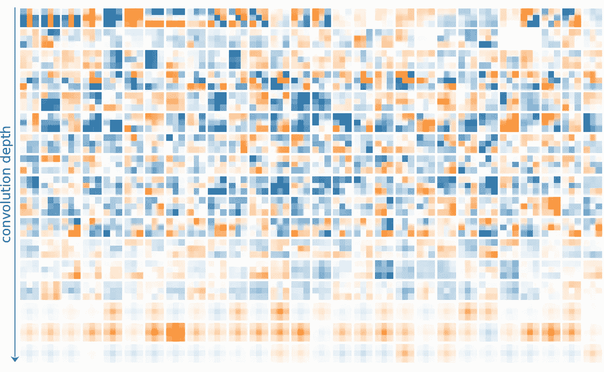

在 CIFAR-10 上训练的 ResNet-18 中每一层的第一卷积滤波器的符号可视化。图片由作者提供。

深度学习对计算机视觉产生了重大影响。它使计算机能够从数据中自动学习高级特征，并被用于开发在各种任务(如对象识别、图像分类和语义分割)上优于传统方法的模型。应用包括自动驾驶、医疗诊断和人脸识别等。然而，深度学习模型已被证明对输入数据的分布变化本质上是敏感的。

例如，给定足够大和足够好的数据，人们可以很容易地训练模型识别街道标志(因为这对于自动驾驶任务来说是必要的)。如果执行正确，该模型将识别训练期间显示的街道标志和以前未显示的标志(它将展示*泛化*)。人们可以很容易地得出结论，高验证准确性将对应于将安全地识别所有新数据的模型。但是，如果新数据的分布发生变化，情况往往就不是这样了。对于自动驾驶，这可能是由于天气条件的变化、车载摄像头的低分辨率、照明条件差等。这在以前没有反映在训练数据中。我认为获取代表所有可能环境的训练数据是不可能的。

不幸的是，甚至更糟糕的是，深度学习模型已经被证明更加敏感:对人类来说，对输入数据几乎无法察觉的扰动(敌对攻击)可以迫使模型以很高的可信度做出错误的预测。在我们之前的例子中，这可能意味着一辆汽车将一个停止标志误认为一个简单的限速标志，这可能会产生灾难性的后果。这些扰动通常通过应用于整个输入的噪声来建模，但是一般来说，也可以修改输入的小部分，例如通过在街道标志的特定位置放置胶带来愚弄模型。

把这些胶带放在停车标志上会愚弄你的普通神经网络。照片由[艾克霍尔特等人拍摄。al (2017)](https://arxiv.org/pdf/1707.08945.pdf) 。

一种常见的防御机制是通过*对抗训练*进行调整，将最坏情况下的扰动注入训练中，以加强决策边界并减少过度拟合。然而，这种技术大大增加了培训成本。因此，自然地，对对抗性鲁棒性的更深入理解对于找到更好的解决方案是至关重要的。

虽然大多数正在进行的研究工作正在从各种角度研究这些问题，但在大多数情况下，这些方法可以概括为研究图像数据中分布偏移的影响以及由此产生的激活、显著性和特征图的差异。相反，我们建议研究训练 CNN 模型的学习权重(卷积滤波器)的变化，并提出:*是什么使得鲁棒视觉模型的卷积特别？*

## 评估数据和实验设置

为了了解对抗性训练产生的差异，我们从在 CIFAR-10、CIFAR-100 和 ImageNet-1k 上训练的 [*健壮工作台*-排行榜](https://robustbench.github.io/)(*健壮模型*)收集了 71 个模型检查点(基于 13 种不同的架构)。所有这些模型都被训练以抵抗基于不同方法的 L-infinity 有界对抗性攻击，然而，所有模型都被训练有对抗性训练。此外，我们使用标准训练程序(*正常模型*)为每个出现的架构训练了一个单独的模型，没有任何特定的健壮性规则化，也没有任何外部数据(即使健壮性对应方依赖于它)。由于使用我们选择的参数在 ImageNet1k 上进行训练导致了相当差的性能，我们用来自优秀的[*timm*-库](https://github.com/rwightman/pytorch-image-models)的等效预训练模型替换了这些模型。我们总共收集了 615，863，744 对形状为 3×3 的鲁棒/正常卷积滤波器。

## 过滤器模式分布

首先，我们想了解模式的差异。由于所学习的滤波器在幅度上是不同的，并且在较深的层中幅度通常较低(为了改善梯度流)，我们首先将所有滤波器归一化为单位长度。这使我们能够专注于滤波器模式，而不受幅度的干扰。接下来，我们对所有滤波器进行奇异值分解(SVD)。这给出了基于最大方差的表示:由 3×3 = 9 个系数加权的 3×3 = 9 个主分量(也称为基向量或本征图像)的总和允许重构每个滤波器。

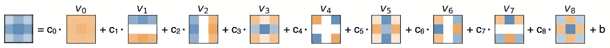

将滤波器分解成加权基向量的和。通过奇异值分解获得基向量。图片由作者提供。

这为我们提供了优势，即基于 SVD 获得的表示不限于单个像素，而是捕捉滤波器的相关子模式(参见 v0 … v9)。要分析多个滤波器，我们可以简单地将系数视为分布。

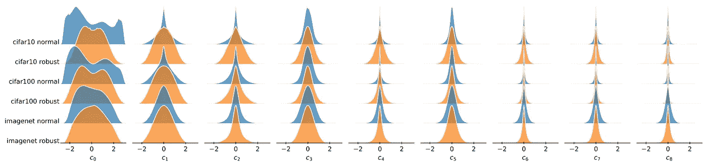

通过正常和稳健模型的 KDEs 对 CIFAR-10、CIFAR-100 和 ImageNet-1k 的 SVD 系数分布进行可视化。图片由作者提供。

为了测量两个分布 *Pi，Qi* 有多不同，我们可以使用任何散度度量。在这项工作中，我们使用了众所周知的 Kullback-Leibler 散度(KL ),并稍微调整了一下以增强对称性。

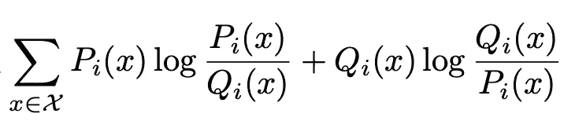

KL 散度的对称变体。图片由作者提供。

对于每组滤波器，我们获得 9 个分布。为了比较两个滤波器组，我们计算每个基向量上的 KL，并计算加权平均值。每个基向量的权重由其方差比给出。在下面的章节中，我们称之为**分配转移**。

注意:在我们以前的工作中[2]看到了稀疏滤波器对分布的巨大影响。稀疏滤波器将主要由近零系数描述，这将导致 kde 中的大尖峰。KL 散度将大大增加并偏向 KDEs 的这个区域。因此，在此分析中，我们从层权重中移除稀疏。

## 最大的配送班次位于哪里？

我们研究了过滤模式中最显著的变化，并测量了不同深度阶段的分布变化。为了比较具有不同深度的模型，我们将滤波器系数按照它们在模型中的相对深度的十分之一进行分组。对于所有数据集，获得的位移似乎随着卷积深度而增加。但是，这种差异随着数据集复杂性的增加而减小(imagenet 1k > CIFS ar 100 > CIFS ar 10)。此外，可以在第一个卷积层(但不是随后的早期层)中看到显著的偏移。请注意，ImageNet1k 模型中的主要卷积阶段使用更大的内核大小，因此不包括在本研究中，但我们希望在那里有类似的观察结果。图片由作者提供。

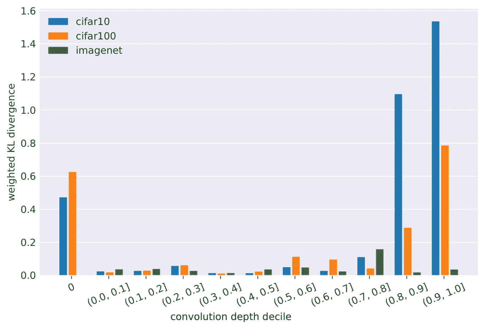

正常模型和稳健模型之间的最大差异出现在第一层和最深层。然而，随着数据集复杂性的增加，这种差异会缩小。图片由作者提供。

为了更好地理解观察到的分布变化的原因，我们将第一个和最后一个(最终)卷积层可视化:

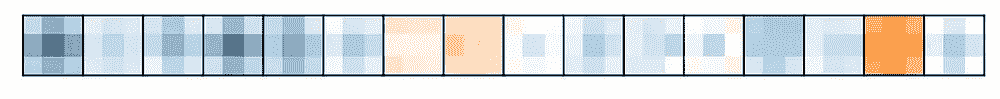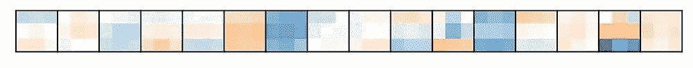

从最终卷积层中为特定法线模型(左)及其健壮对应物(右)选择的过滤器。作者提供的图片。

对于最深的卷积层，我们观察到正常的滤波器明显缺乏多样性，并且大多使我们想起高斯模糊滤波器，而敌对训练的滤波器似乎在结构上更丰富，并且更可能执行不那么琐碎的变换。我们在许多深层观察到这种现象。

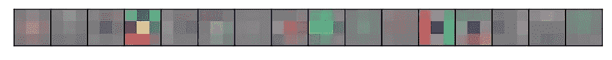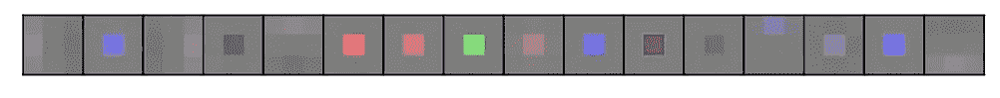

从主卷积层中为特定的法线模型(左)和它的健壮对应物(右)选择的过滤器。作者提供的图片。

另一方面，主要卷积阶段显示了我们在其他层中很少发现的惊人相反:正常模型显示了预期的各种滤波器的不同集合，然而，所有鲁棒模型都开发了大量高度相似的滤波器。因为只有它们的中心权重是非零的，所以这些滤波器执行输入通道的加权求和，相当于 1×1 卷积。

我们假设，结合通常使用的重新激活(及其导数)，初级滤波器执行输入数据的阈值处理，这可以消除小的扰动。实际上，绘制自然样本和扰动样本的激活差异，允许我们获得视觉确认，即这些滤波器成功地从各种感兴趣区域(ROI)移除扰动，例如从猫、背景和前景。看起来对抗稳健模型本质上并不稳健，而是学会了对数据进行预处理。

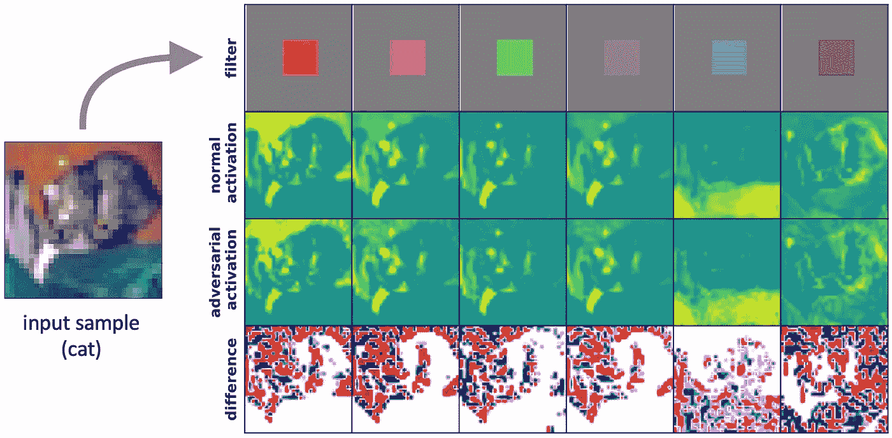

对抗训练学习第一层中的卷积滤波器，其可以成功地去除输入图像的特定区域中的扰动。图片由作者提供。

## 我们观察到过滤器质量有哪些差异？

我们还可以考虑“好的”卷积滤波器将具有什么属性:为了尽可能多地利用学习到的网络，卷积层中的所有滤波器都应该有助于预测，并且层中的模式通常不应该太重复，并且产生不同的特征图。

我们通过三种不同的静态指标来衡量质量(即仅使用学习到的参数):

**稀疏度——无贡献过滤器的比率**
给定层中所有权重都接近零稀疏度的过滤器的比率。由于它们的低幅度，这些滤波器对特征图没有贡献。为了最大限度地利用可用的网络容量，该值应该尽可能低。

**方差熵——滤波器模式的多样性**
我们再次利用 SVD 来理解给定层中模式的多样性。当 SVD 找到最大方差基时，它自然会识别出最重要的“子模式”。通过捕获解释方差的分布，我们可以识别单个子模式是否占优势(缺乏多样性；偏斜方差分布)或所有子模式同等重要(随机/最大多样性；均匀方差分布)。我们用非负对数熵来量化解释方差的分布。熵方差值为 0 表示当前滤波器的同质性，而最大值表示在所有基本向量上均匀分布的方差，如在随机的、未初始化的层中发现的。接近两个区间边界的值表示退化，并且很难提供好的阈值。

**正交性——滤波器组/结果特征图的冗余** 正交性有助于梯度传播，并与生成的特征图的多样性直接耦合。由于计算限制，我们测量滤波器组之间的正交性，而不是单个滤波器。滤波器组被视为向量，并被归一化为单位长度。正交性就是层权重和它的转置之间的点积。正交性值 1 规定了层中所有滤波器组的正交性，而 0 表示并行滤波器组可能产生不同比例但相同的特征图。

最后，所有这三个指标都量化了与网络规模相关的已用容量。

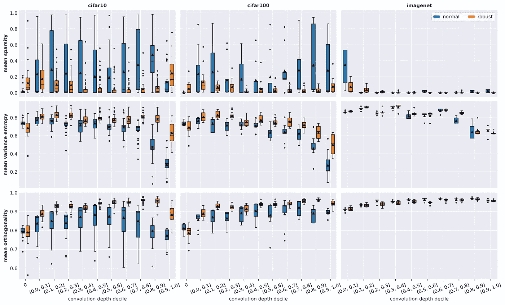

通过在 CIFAR-10(左)、CIFAR-100(中)、ImageNet1k(右)数据集的正常和对抗训练之间的稀疏性(上)、方差熵(中)和正交性(下)测量的深度，比较过滤器质量的分布。图片由作者提供。

与结构中的发现类似，我们观察到数据集复杂性的质量差异较小，但稳健模型和正常模型的质量也普遍提高。ImageNet1k 上的结果不太确定，因为样本量小，质量基线接近最优

**稀疏度:**我们观察到正常模型的所有层都有很高的稀疏度，随着数据集的复杂性而降低。稳健训练显著地进一步最小化了稀疏性及其在所有深度上的跨度。值得注意的异常值包括 CIFAR-10 的初级阶段以及最深的卷积层。一般来说，稀疏度在中间阶段似乎较低。

**方差熵:**平均方差熵在整个模型中相对恒定，但随着层的加深而减小。稳健模型的熵随后开始降低，并且不太显著，但是这种差异随着数据集的复杂性而减小。与 CIFAR-10 相比，稳健的 CIFAR-100 模型在更深的层中显示更低的熵，而正常模型之间没有明显的差异。ImageNet1k 模型显示所有深度的熵都更高。

**正交性:**稳健模型显示正交性随着深度几乎单调增加，除了最后十分位数，而正常模型最终开始降低正交性。同样，差异随着数据集的复杂性而减小，并且非稳健模型的所获得的测量值的跨度显著增加。

## 结论

对抗训练的模型似乎比它们的非正则化变体学习更多样、更少冗余和更少稀疏的卷积滤波器集合。我们假设质量的提高是对额外训练压力的反应，因为更具挑战性的对抗性问题占用了更多的可用模型容量，否则这些容量将会退化。随着数据集复杂度的增加，我们在正常训练中观察到类似的效果。然而，尽管正常训练的 ImageNet1k 模型的滤波器质量相对较高，但是它们的鲁棒性却不是这样。因此，单凭滤波器质量不足以建立鲁棒性。

## **下一步**

不幸的是，我们无法完全揭开对抗性训练对卷积滤波器的影响。特别是，尚不清楚数据集复杂性是否是质量下降的原因，或者我们衡量的质量差异是否只是严重过度参数化架构的副作用，在这种架构中，对抗性训练可以缩小与更复杂数据集的差距。看起来似乎有必要进行更多的分析，以充分掌握对抗性训练的影响，而且，很可能还有其他机制在发挥作用，导致稳健的模型。另一方面，滤波器质量似乎至少是实现鲁棒性的必要条件。因此，似乎值得探索我们是否可以通过正则化在训练期间实施更高的滤波器质量来增加鲁棒性。或许，这甚至可以成为对抗性训练的更廉价的替代品。

你怎么想呢?我们很好奇你的想法！请在评论中分享。

参考资料:

[1] P. Gavrikov 和 J. Keuper，[透过卷积滤波器的透镜观察对抗性鲁棒性](https://openaccess.thecvf.com/content/CVPR2022W/ArtOfRobust/html/Gavrikov_Adversarial_Robustness_Through_the_Lens_of_Convolutional_Filters_CVPRW_2022_paper.html) (2022)，CVPR 2022 研讨会

[2] P. Gavrikov 和 J. Keuper， [CNN 滤波器 DB:训练卷积滤波器的实证研究](https://openaccess.thecvf.com/content/CVPR2022/html/Gavrikov_CNN_Filter_DB_An_Empirical_Investigation_of_Trained_Convolutional_Filters_CVPR_2022_paper.html) (2022)，CVPR 2022 Orals

*这项工作由德国巴登-符腾堡州科学、研究和艺术部资助，基金号为 32–7545.20/45/1(Q-AMeLiA)。*