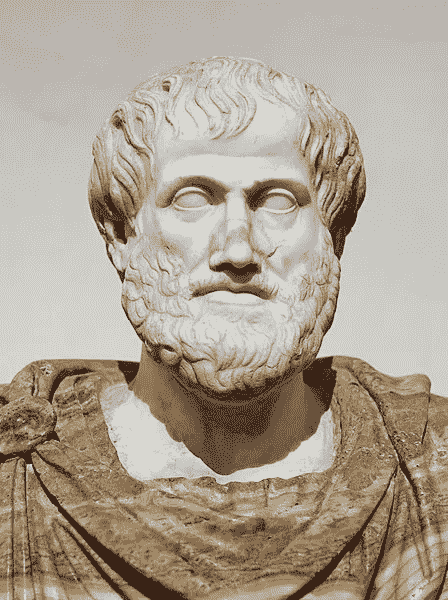
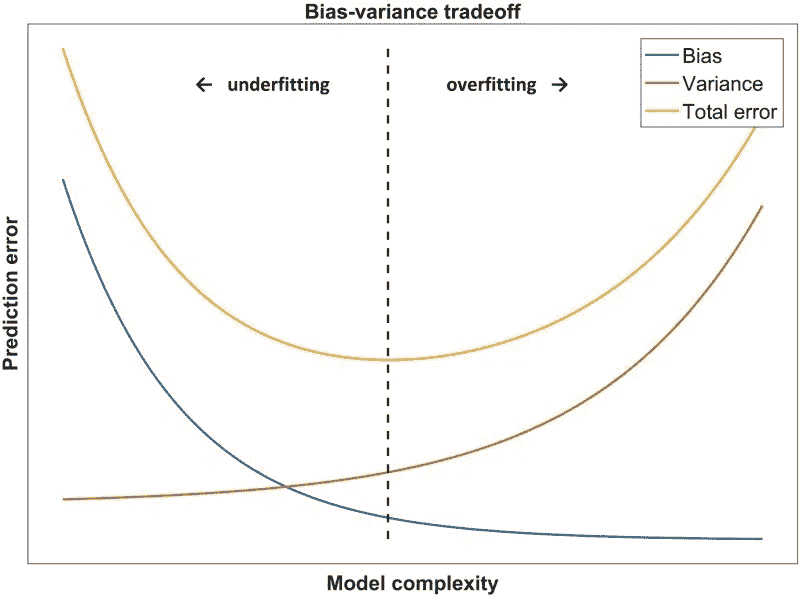

# 奥卡姆剃刀在机器学习中的意义

> 原文：<https://towardsdatascience.com/what-occams-razor-means-in-machine-learning-53f07effc97c>

## 对这一简单定律的实际解释

照片由[максирыжкин](https://unsplash.com/@qr_filing?utm_source=unsplash&utm_medium=referral&utm_content=creditCopyText)在 [Unsplash](https://unsplash.com/s/photos/razor?utm_source=unsplash&utm_medium=referral&utm_content=creditCopyText)

> "一切都应该尽可能简单，但不能更简单。"
> 
> ——阿尔伯特·爱因斯坦

不久前，我写了一篇关于“没有免费的午餐定理”的文章，这是一个受哲学启发的定理，它暗示没有一个单一的机器学习算法是所有问题的普遍最佳算法。

  

像没有免费的午餐定理一样，机器学习中另一个起源于哲学的概念是奥卡姆剃刀。奥卡姆剃刀基本上是说，给定相互竞争的理论和解释，最简单的应该是首选。用奥卡姆的话来说，“实体的增加不能超出需要。”

# 哲学起源和表述

奥卡姆剃刀是一个可能起源于早期哲学家的观点。事实上，亚里士多德(公元前 384-322 年)说“在其他条件相同的情况下，我们可以假设从更少的假设或假说中得出的论证更优越。”托勒密(约公元 90 —约 168 年)做了一个更简单但等价的陈述——“我们认为用最简单的假设来解释现象是一个好原则。”

亚里士多德第一个阐述了奥卡姆剃刀背后的思想。图片来源:Lysippos 之后，公共领域，通过维基共享

直到一千多年后，一位名叫奥卡姆的威廉的英国方济各会修士和神学家提出了一个说法**“实体的繁殖不能超过必要性”**，这后来被称为奥卡姆剃刀。换句话说，在其他条件相同的情况下，简单的解决方案比复杂的更受青睐。

# 用概率论证明

奥卡姆剃刀是基础概率论的直接结果。根据定义，更复杂的理论包含更多的假设。我们在理论中加入的假设越多，其中一个假设不正确的可能性就越大。如果一个假设不能使我们的理论更加准确，它只会增加整个理论是错误的概率。

例如，如果我们想解释为什么天空是蓝色的，一个基于光的属性的简单解释比一个涉及太空中的外星人将蓝色尘埃散射到地球大气层中以赋予天空颜色的解释更有可能是正确的。更复杂的解释涉及更多的假设，其中许多还没有得到科学验证，因此更复杂的理论，尽管它预测了相同的结果，但更有可能是不正确的。

# 机器学习的实际应用

奥卡姆剃刀听起来很简单，但它在实际的机器学习中真正意味着什么？1996 年，佩德罗·多明戈斯(Pedro Domingos)正式将奥卡姆剃刀应用于机器学习，引入了以下含义，他称之为“奥卡姆两剃刀”:

*   **第一把剃刀**:给定两个具有相同泛化误差的模型，应该优先选择较简单的一个，因为简单本身就是可取的。
*   **第二把剃刀**:给定两个训练集误差相同的模型，简单的一个应该优先，因为它可能具有更低的泛化误差。

多明戈斯指出，第一个剃刀是正确的，但第二个剃刀，虽然奥卡姆剃刀暗示，不一定是正确的。事实上，根据模型在已经看到的训练数据上的表现来做出决策是一种糟糕的做法。

因此，如果你想在实践中使用奥卡姆剃刀，这里是如何做的:**如果两个模型在验证/测试数据集上有相同的性能，选择更简单的模型，因为它更有可能概括得更好。**奥卡姆剃刀实际上只是机器学习中偏差-方差权衡的一个例子。

偏差-方差权衡。来源:[临床数据科学基础](https://www.ncbi.nlm.nih.gov/books/NBK543534/figure/ch8.Fig3/)，4.0 授权 [CC 下。](https://creativecommons.org/licenses/by/4.0/)

如上图所示，奥卡姆剃刀是机器学习中普遍优化问题的陈述。**在选择用于任何问题的模型时，我们希望模型既足够复杂以避免欠拟合，又足够简单以避免过拟合。**

有时候奥卡姆剃刀可能被误解为简单的模型总是比复杂的模型更好。然而，这种想法既违反了奥卡姆第一剃刀的谓词(“给定两个具有相同泛化误差的模型”)，也违反了没有免费的午餐定理，该定理基本上表明，在所有机器学习问题上，没有一个单一的机器学习算法普遍优于所有其他算法。**在两个模型之间进行选择时，我们只能说，如果简单模型的泛化误差等于或小于更复杂模型的泛化误差，则简单模型更好。**

# 超越理论——实际考虑

虽然奥卡姆剃刀只在较简单的模型比较复杂的模型获得相同或更好的泛化误差时适用，但在实际情况下，我们可能会选择较简单的模型，即使它的泛化误差低于较复杂的模型。事实上，更简单的模型可以提供以下优势:

*   **更少的内存使用。**
*   **更快的推断时间。**
*   **好交代。**

例如，考虑一个欺诈检测问题，其中决策树达到 98%的准确率，而神经网络达到 99%的准确率。我们还假设这个问题需要快速的推理时间，并且我们的部署服务器有内存限制。最后，让我们添加一个需求，即模型的预测需要解释给公司内部正在处理这个用例的监管机构。

在这种情况下，考虑到这个问题的额外要求，决策树是比神经网络好得多的模型。决策树可能是一个更小的模型，具有更快的推理时间，并且比神经网络更容易解释。除非在这个问题的上下文中，百分之一的准确度下降是显著的，否则选择决策树而不是神经网络将是一个实际的决定。

# 摘要

奥卡姆剃刀是一种哲学思想，也可以应用在机器学习中。在机器学习的背景下，剃刀理论认为，在其他条件相同的情况下，简单的模型比复杂的模型更受青睐。这种说法并不意味着简单的模型普遍比复杂的模型更好，而是说模型必须足够复杂以学习数据集中的模式，但又足够简单以避免过度拟合。

因此，如果你想使用奥卡姆剃刀而不被割伤，请确保在决定选择更简单的模型而不是更复杂的模型之前，比较不同模型的泛化误差，并考虑你正在解决的问题的实际要求。

# 来源

1.  B.杜伊南，[奥卡姆剃刀](https://www.britannica.com/topic/Occams-razor)，(2021)，布列塔尼卡。
2.  页（page 的缩写）多明戈斯，[奥卡姆的两把剃刀:锋利和钝](https://dl.acm.org/doi/10.5555/3000292.3000299)，(1998)，KDD'98:第四届知识发现和数据挖掘国际会议论文集

# 加入我的邮件列表

加入我的[邮件列表](https://mailchi.mp/e8dd82679724/amols-data-science-blog)，获取我的数据科学内容的更新。当你[注册](https://mailchi.mp/e8dd82679724/amols-data-science-blog)的时候，你还会得到我免费的**解决机器学习问题的逐步指南**！也可以在 [Twitter](https://twitter.com/amolmavuduru1) 关注我，了解内容更新。

当你这么做的时候，考虑加入媒体社区，阅读成千上万其他作家的文章。