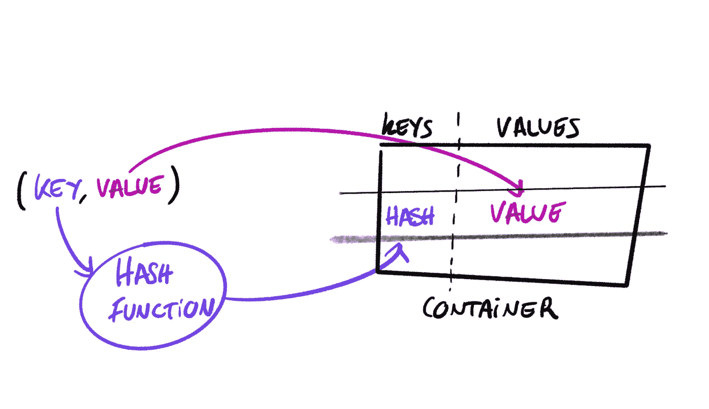
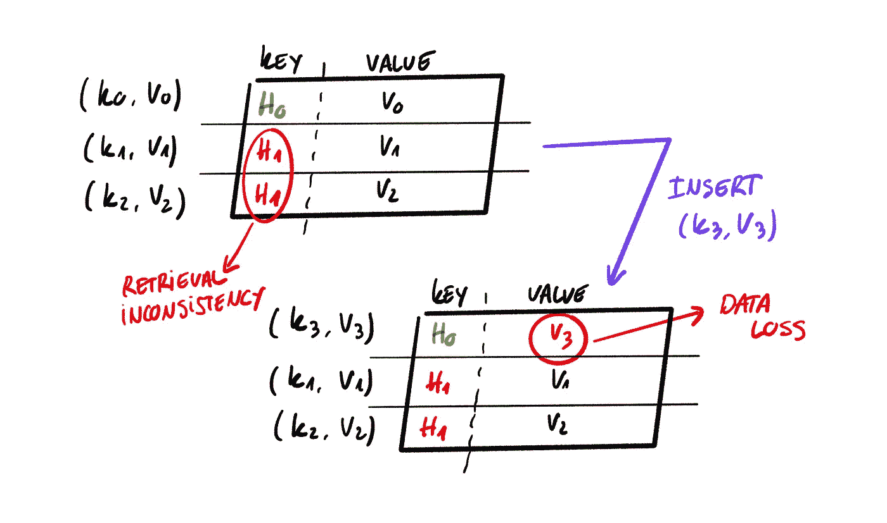

# 这是什么

> 原文：<https://towardsdatascience.com/what-the-hash-d678538b313>

## 陷入不可避免的类型错误

所有 Python 开发人员在某个时候(或者实际上，很多时候)都面临的一个共同问题是带有神奇单词**的`TypeError`不可销毁类型**。我们都同意，如果没有适当的背景，这听起来并不好，而且可能接近可怕。

Python 是一种大量建立在字典之上的语言。例如，*名称空间*或*类*就是这样存储它们的功能和属性的。理解字典如何在 Python 的 API 之外工作可以帮助我们理解这种数据结构并避免常见错误。

这篇文章将深入探讨**映射**类型，它们在内部做什么，以及这些知识如何帮助我们更多地了解*不可修复的*异常。

# 映射

数据访问有两种方式:

*   **全扫描**，该过程需要遍历数据结构的所有元素。在 Python 中，一个例子就是`List`。虽然我们可以通过*索引*来访问一个条目，但是没有办法直接识别容器中的特定元素，而且索引可能会随着时间而改变。
*   **键查找**，其中流程知道如何直接识别和检索特定的项目。**映射**是支持这种数据访问策略的数据结构。一个`dict`将是 Python 的一个映射类型的实现。

这两种方法的主要区别在于，对于映射，存储在容器中的数据需要提供一个**键**，它将用于标识一个项目，以及一个**值**，它是包含我们想要检索的数据的元素。

为了使键查找一致，需要满足几个属性(如果我们不修改容器):

1.  一个值应该只能通过**一个键**访问。唯一值可以避免冲突，并有助于确保没有数据被不同的元素覆盖。
2.  在键-值对的整个生命周期中，键应该总是返回相同的值。

# 哈希函数

将 [*hashable*](https://en.wikipedia.org/wiki/Hash_function) 键映射到存储在容器中的值确保上述属性成立。当我们向字典中添加一个新的对时，键本身不会用来存储值，而是存储对它应用散列函数的结果。

散列一个键来存储值。图片由作者提供。

根据图表，散列函数帮助我们在密钥的整个生命周期内基于密钥唯一地获得所需的值。让我们想象一下，如果哈希函数不具备这些属性，会发生什么情况:

哈希未保存属性混乱。图片由作者提供。

1.  我们从产生相同散列的两个密钥`k1`和`k2`开始`H1`
2.  使用`k1`我们可以检索`v1`或`v2`，最终导致数据不一致。
3.  插入一个新的对`(k3, v3)`，其中`k3`被散列为`H0`，这意味着我们丢失了`v0`的内容，因为我们用`v3`覆盖了它。

> 如果没有适当的保证，我们会得到意想不到的结果，甚至会丢失数据。

# 易变性

然而，散列函数并不是键查找中唯一涉及的函数。实际的关键对象也是等式的一部分。因此，为了确保满足两个主要的查找属性，我们需要引入一个重要的主题:**可变性**。

我们说一个对象是[不可变的](https://en.wikipedia.org/wiki/Immutable_object)，如果它的状态在创建后不能被改变，否则就是可变的。

即使散列函数是定义良好的，如果我们将散列函数应用于那些在其生命周期中拥有多种状态的可变对象，也会产生不同的结果。然后，我们在上面展示的混乱的映射中结束。

为了讨论方便，我们假设`length`是一个合适的哈希函数。如果我们想使用一个`list`作为键，我们将应用`len(list)`来访问容器。通过添加或删除元素(改变列表)来更新列表的状态意味着我们不能正确地从映射中存储和获取数据。

# 不耐洗型

上面的例子展示了为什么 Python 只允许**不可变的**对象成为映射键。字符串或整数是不可变的，所以开发人员可以安全地用它们创建`dict`:

但是尝试使用诸如`list`或`set`这样的类型，会引发`TypeError: unhashable type`。为什么？因为这两个是可变的。我们可以随意添加和删除元素，因此哈希函数的结果会有所不同。

不可哈希类型错误告诉我们，我们正在尝试创建一个字典，其值不适合成为正确的键，因为我们无法确保哈希函数将总是为同一对象返回相同的输出。

# 不可变类型

而`str`和`int`是典型的字典键；在某些时候，我们可能需要其他数据类型。幸运的是，Python 为表带来了一些不可变的集合:

*   `list` vs. `tuple`:虽然列表是一个通用的有序集合，但是元组通常为它们的元素带来意义和结构。此外，元组是不可变的，由于它们不能被更新，每个位置保存一条特定的信息(推荐[来源](https://stackoverflow.com/questions/626759/whats-the-difference-between-lists-and-tuples))。
*   `set` vs. `frozenset`:这两个结构共享了 C [实现](https://stackoverflow.com/questions/36555214/set-vs-frozenset-performance)的大部分，但是`frozenset`是不可变的。
*   `frozenmap`:这个还没有实现，但是有一个 [PEP-603](https://peps.python.org/pep-0603/) 正在考虑为映射添加一个持久数据结构。

# 结论

有时候，跳到一个主题的根本来理解 Python 为什么以这种方式工作是既有价值又令人兴奋的。

在本帖中，我们回顾了:

*   映射数据类型的工作原理。
*   散列函数和不变性如何在存储和访问数据时确保一致性和安全性。
*   不同的可变和不可变 Python 类型。