# 如果时间序列在增长(但长度不变)，该怎么办

> 原文：<https://towardsdatascience.com/what-to-do-if-a-time-series-is-growing-but-not-in-length-421fc84c6893>

## 只需使用 AutoML 进行多元时间序列预测

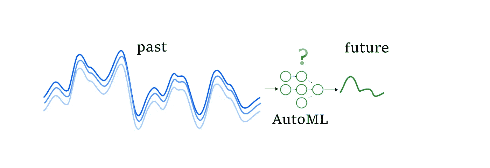

用于多元时间序列预测的 AutoML(图片由作者提供)

有一种观点认为时间序列预测是一项复杂的任务。但是大家也不要心烦，因为也有好处——一下子有好几个时间序列的时候任务很多，这样的任务就更难了！当我们开始比较时，我们明白预测一个单变量时间序列并不困难(为幸福而休息)。但是当时间序列与其他参数的并发序列(多维序列)一起扩展时，该怎么办呢？如果你有预测这样一个系列的任务，但没有太多的经验，该使用什么方法和算法，以及该做什么(剧透——使用 AutoML，当它工作时，通过阅读关于这个主题的几篇文章来填补空白)。

## **什么是时间序列**

如果我们从头开始，它是一个按时间排序的值序列。时间序列有一种模式:一个序列的当前值与之前的值相关。如果序列没有这样的性质，那么恭喜你(或者不是)，你正在处理一个不能用经典(也不是很)模型预测的过程，在这种情况下你应该看看马尔可夫过程。

下面的简单图片说明了所描述的属性—这个背景足以继续阅读帖子(图 1)。

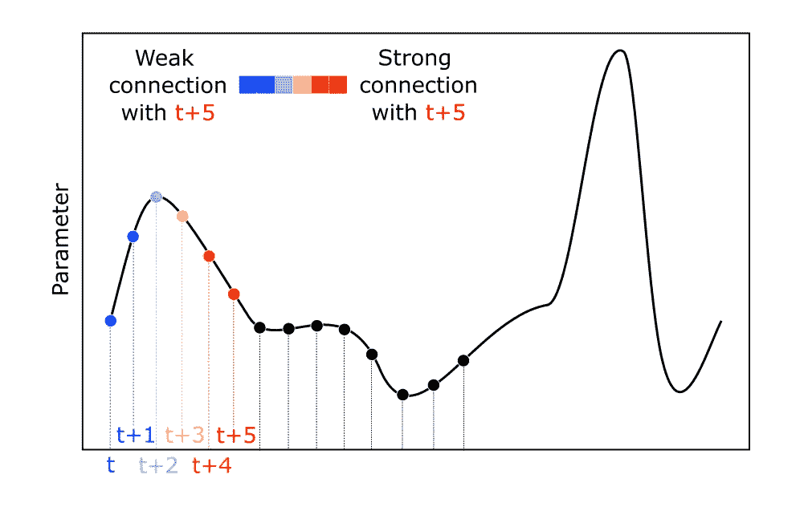

图一。时间序列示例(图片由作者提供)

如果你想了解更多关于如何预测时间序列的知识(尤其是用 AutoML)，我已经贴了几篇关于这个话题的文章: [AutoML for time series:绝对是个好主意](/automl-for-time-series-definitely-a-good-idea-c51d39b2b3f)；[时间序列的 AutoML:使用 FEDOT 框架的高级方法](/automl-for-time-series-advanced-approaches-with-fedot-framework-4f9d8ea3382c)。

## **什么是多元时间序列**

越来越接近主题。多维(多变量)时间序列是由几个一维(单变量)序列组成的系统，其中一个(目标)的值不仅取决于其先前的值，还取决于另一个或几个额外序列的先前值。

多元时间序列的一个例子如图 2 所示。

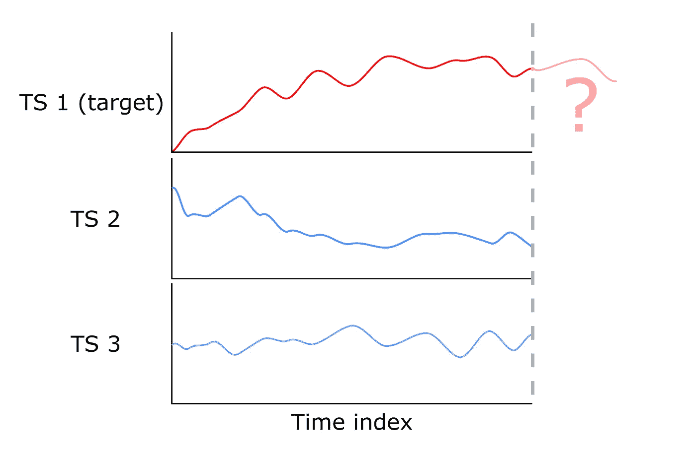

图二。多元时间序列示意图。目标参数显示为红色，外部时间序列显示为蓝色(图片由作者提供)

从图中可以看出，为了预测时间序列 1 的未来状态，我们可以使用时间序列 2 和 3 的值。如果你对这样一个系列的例子感兴趣——这里，在不同点测量的海平面如图 3 所示。

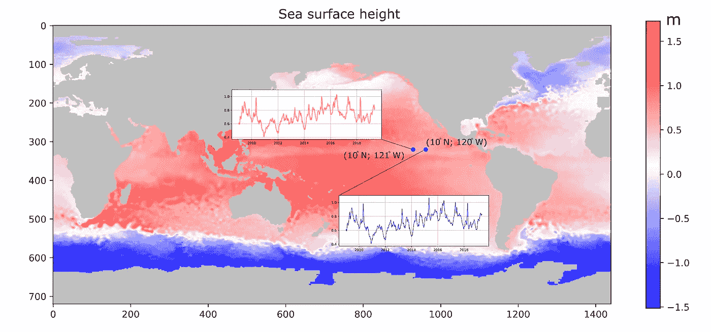

图 3。太平洋不同点水位的多元时间序列。基于卫星测高数据([哥白尼《来自卫星观测的海平面每日网格数据》](https://cds.climate.copernicus.eu/cdsapp#!/dataset/satellite-sea-level-global?tab=overview) [1])(图片由作者提供)

“多元时间序列预测”的两个不同案例现在值得强调。在第一种情况下，我们将只有当前时间指数和历史值的外生时间序列的可用数据，即 t，t-1，t-2，t-n，而预测指数 t+1，t+2，t+f(其中 f 是预测范围)的数据是未知的。或者，在第二种情况下，目标时间序列的预测指数值是未知的，但有关于这些时间点的外生指数的信息。这可以在图表中最清楚地显示出来(见图 4)。

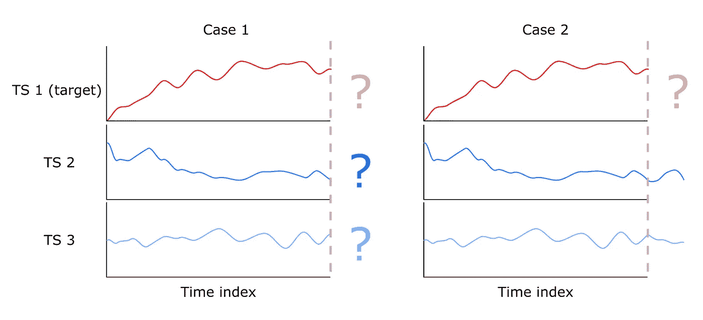

图 4。使用辅助时间序列预测目标变量(图片由作者提供)

在第一种情况下，我们处理传统的时间序列预测任务，因为未来的状态是可以预测的。在第二种情况下，我们解决了回归问题，但因为数据是按时间顺序排列的，我们也可以将这种情况称为“动态回归”，它考虑了数据的滞后依赖性。在本文中，我们将只讨论第一种情况，因为第二种情况是回归问题的特殊情况。

P.S .如果你想了解更多关于使用时间模式的动态回归，请点击这篇文章:)这样，我会知道这个主题对你来说是有趣的，我会准备一个与该领域相关的新帖子。

## **我们如何预测这样的系列**

越来越接近主题。使用向量自回归(VAR)来预测时间序列系统的行为。VAR 是对多个时间序列自回归思想的推广，因此被认为是多元序列预测的经典工具。一些时间序列可以包含在经典的预测模型中，如 ARMA。在这种情况下，这种模型将被称为向量自回归移动平均模型(VARMA)。[递归神经网络](https://ieeexplore.ieee.org/abstract/document/8830667)也用于解决这个任务，它们是这个领域非常流行的工具。“更高级”方法的使用，例如基于 VAR 优化的[，通常出现在科学文章中，关键词为“多元时间序列预测”。](https://www.sciencedirect.com/science/article/abs/pii/0169207086900919)

让我们尝试考虑将已知的预测单变量时间序列的方法推广到多变量情况的方法。正如在文章[AutoML for time series:advanced approach with FEDOT framework](/automl-for-time-series-advanced-approaches-with-fedot-framework-4f9d8ea3382c)中所描述的，可以使用经典模型(AR，ARIMA)和回归机器学习模型来预测时间序列。为了使用回归模型，有必要对序列进行特殊的矩阵变换。对于单变量的情况，转换方案如下图所示(图 5)。

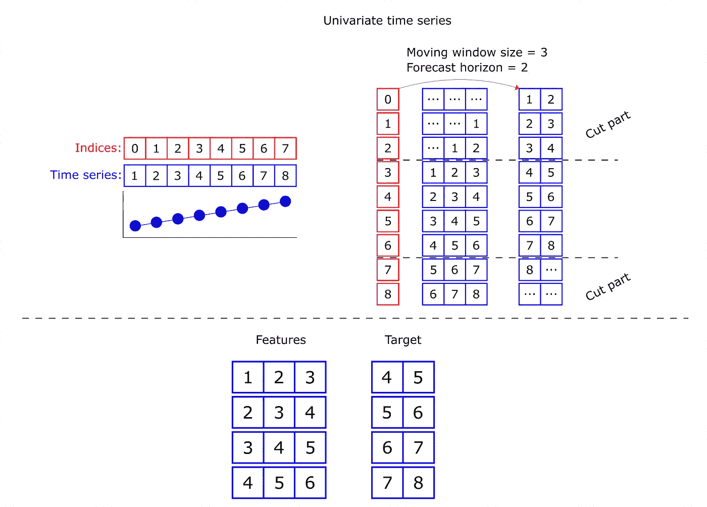

图 5。转换成单变量时间序列的滞后矩阵(图片由作者提供)

对于多元时间序列，将获得下表(图 6)。移动窗口大小和预测范围与上图相同。

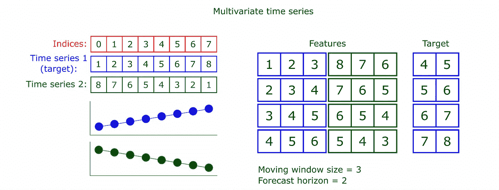

图 6。转换成多元时间序列的滞后矩阵(图片由作者提供)

具有特征的结果表可以用作机器学习模型的训练样本，例如岭回归或随机森林，或者用于任何其他合适的算法。这样，模型将基于目标变量和外生时间序列的先前值生成预测。这个概念有两个缺点:

*   同时用于所有时间序列的移动窗口的大小可能不是最佳的。对于其中一个系列来说，只通过 5-10 个元素“回顾过去”就足以成功地预测未来状态，而对于另一个系列来说，则需要数百个元素的滞后转换；
*   不能保证外生时间序列与目标时间序列相关。

解决这些问题是可能的。然后我们再考虑怎么做。现在，让我们专注于如何运行 AutoML 工具来解决多变量时间序列预测的问题。

## **数据描述**

演示将使用来自模型 [NEMO](https://www.nemo-ocean.eu/) (欧洲海洋建模核心)的海平面数据。这个模型允许我们准备一个包含 SSH(海面高度)测量值的数据集。我们收集了 25 个时间序列。它们在地图上的位置可以在下图中看到(图 7)。

*数据集是合成的，由我们团队生成，即由* [*朱丽娅·鲍里索娃*](https://github.com/ChrisLisbon) *。在*[*BSD 3-Clause“New”或“Revised”License*](https://github.com/ITMO-NSS-team/pytsbe/blob/main/LICENSE.md)*:SSH 数据集可以通过* [*链接*](https://github.com/ITMO-NSS-team/pytsbe/blob/main/data/multivariate_ssh.csv)*【2】获得。*

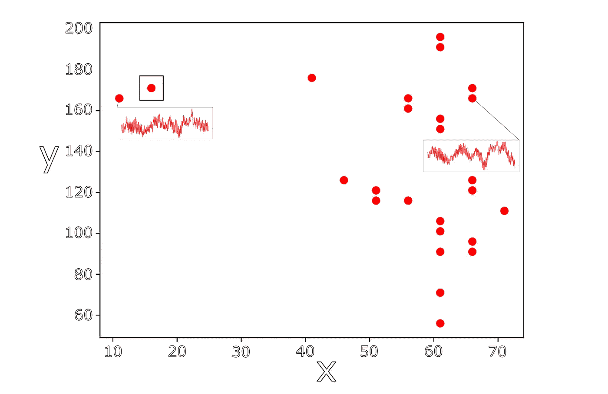

图 7。海平面数据集的可视化(图片由作者提供)

我们感兴趣的时间序列在图中用一个正方形突出显示。这是我们将要预测的一个，使用这个点的参数的历史值和相邻点的历史值。预测展望期为 50 个要素。

整个数据集(名为 SSH)以及运行它的代码可以在库 [pytsbe](https://github.com/ITMO-NSS-team/pytsbe) 中找到。

## **如何在 FEDOT 中预测这些行**

让我们继续看代码示例。所以，任务是用 25 个时间序列来预测其中一个(目标)在未来的值。

要运行这个例子，使用下面的代码(我们的时间序列是 numpy 数组，这里有一个启动[的例子](https://github.com/ITMO-NSS-team/pytsbe/tree/main/cases)，FEDOT 版本为 experiments — 0.6.0):

我们用时间序列形成一个字典，它将被用作模型中的特征。

## **简单介绍一下配置选项**

如果出于某种原因，我们不想在模型中包含所有的时间序列，我们可以只包含那些需要的键-值对来形成一个字典。因此，如果有大量的时间序列，导致模型过于复杂，不适合长时间，那么一个可接受的解决方案可能是修剪特征空间。

如果不需要运行 AutoML 算法，但是需要在有限的时间内建立至少简单的模型，我们可以使用 fit 方法中的参数 predefined_model='auto '。正如[你可能知道的](/how-automl-helps-to-create-composite-ai-f09e05287563)，FEDOT 的 AutoML 内核是基于一种进化算法。并且进化算法在优化开始之前生成一个或多个流水线(初始假设)。这些初始假设被反复修改，从而得到越来越精确的解。

所以，回到预定义的 _model='auto '参数。AutoML 算法将生成一个初始假设。但是，优化过程不会开始。该算法将只训练这一个自动生成的初始假设，并返回拟合的管道。这样做将允许我们在不运行 AutoML 算法的情况下快速准备模型。也就是说，我们使用预定义的管道配置(在这种情况下，由算法自动生成)，并且只训练它，不训练其他任何东西。自然，这个过程需要的时间比运行 AutoML 内核少得多。下面是代码中的一个示例:

让我们回到进化(在这个实验中我们不使用 predefined_model):经过一定数量的代后，得到了如下结果(图 8)。

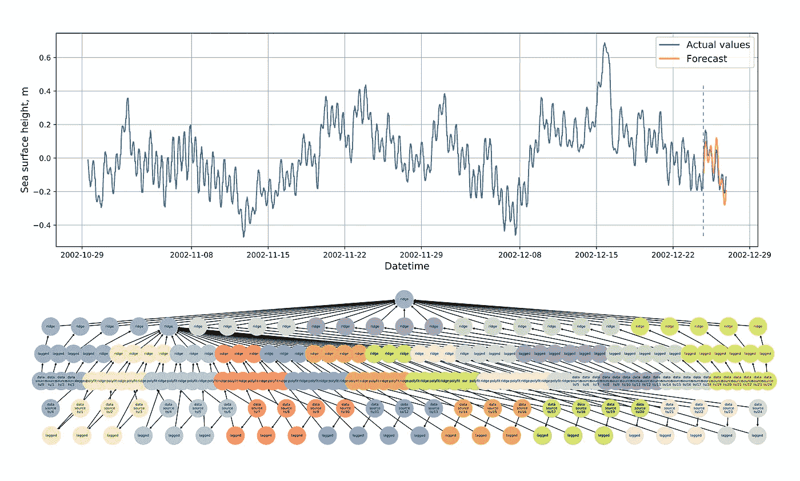

图 8。获得的模型和发现的管道结构对多元时间序列预测的验证结果(图片由作者提供)

看起来不错。让我们试着弄清楚内部发生了什么。

## **关于可视化的免责声明**

我们最近更新了可视化工具，因此当使用 FEDOT framework 0 . 6 . 0 版或更高版本时，图形(管道)的显示可能与本文中的图片不同。

## **FEDOT 如何预测这些行**

让我们考虑寻找解决方案的过程。首先，算法需要一些东西来启动进化过程——一些有效的初始假设。这种初始假设是自动生成的，并且获得了以下管道—查看图 9。

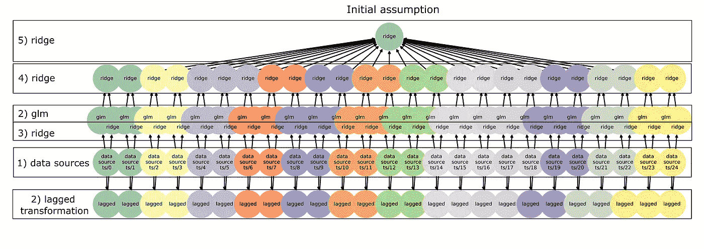

图 9。多元时间序列预测任务的初始假设(图片由作者提供)

这里发生了什么？—首先，时间序列被传递到每个“数据源”节点(1)。这些节点不会对它们的时间序列做任何事情，而是进一步传递它。

这样做是为了能够将新的数据源连接到管道。这也有助于理解哪些时间序列在管道中被转换(注意斜杠后面的名称，它们显示了时间序列的标签，因此我们可以识别它们)。因此，可以清楚地看出，滞后变换被应用于名为 0 的时间序列，并且它的副本被转移到 GLM 模型(2)。GLM 是一种广义线性模型，可以直接处理时间序列，不需要滞后变换。然后将滞后变换的输出传递给岭回归模型(3)。

然后，来自两个模型(GLM 和岭)的每个时间序列的预测被转移到岭回归模型(4)，在这种情况下，最终模型也是岭回归。不要担心大量的岭回归模型——这只是一个初始假设，进一步的进化会在节点中选择更多的最优模型。

然后，基于该初始假设，通过使用变异来生成用于进化算法的初始流水线群体。在优化 AutoML 流水线结构的过程中，该算法可以改变节点中的操作(模型)，删除节点和边，添加新的节点和边，以及调整操作的超参数。这意味着可以获得以下结构(图 10)。

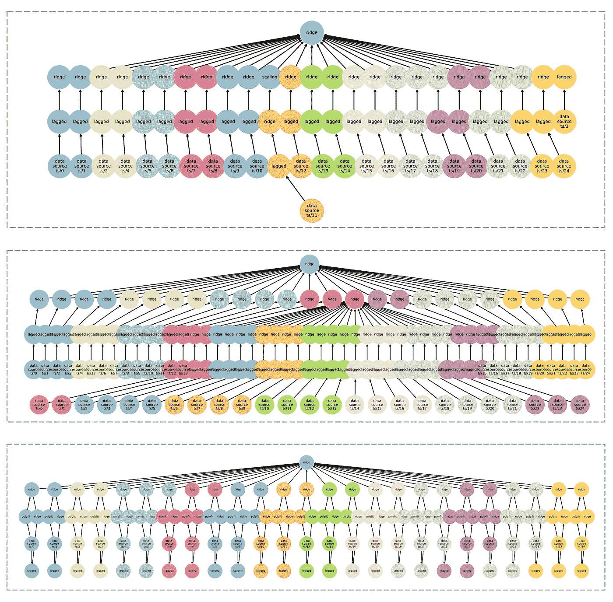

图 10。优化过程中获得的可能管道结构(图片由作者提供)

从图 10 中可以看出，如果有必要，我们可以删除节点和整个分支。因此，我们可以剔除与目标无关的时间序列。

在图形优化过程中，我们可以单独调整每个序列的移动窗口大小(由滞后变换中的超参数窗口大小调节)。它解决了模型中不具有代表性的外生预测序列的问题。

## 这些“痛苦”是为了什么？

显然，为了减少预测误差:)但是，严肃地说，这个问题真的很好——是时候检查实现的方法是否至少给出了一些优势。为了确定外生时间序列的使用确实会影响最终预测的误差，我们来进行一个实验。

我们将使用算法自动生成的初始假设来预测时间序列。在这种情况下，我们将使用目标时间序列的历史值作为预测值，然后我们将迭代扩展附加时间序列的数量。对于目标时间序列的最后 50 个元素，我们将比较预测值和实际值。度量:平均绝对误差(MAE)。该测试的结果显示在下面的动画中:

动画。实验外生时间序列数量的迭代扩展(图片由作者提供)

图 11 显示了误差对来自系列数量的验证样本的依赖性。

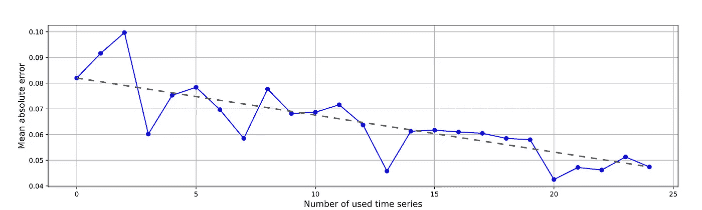

图 11。在模型中使用不同数量的时间序列获得的 MAE 值(图片由作者提供)

从图中可以看出，模型中包含的时间序列数量影响误差值。注意:在这个实验中，我们没有调整管道的超参数，也没有使用进化算法修改初始结构。与简单模型相比，当模型使用大量时间序列时，有更多的机会来改进模型。因此，在超参数调整和其他优化程序之后，更复杂模型的优势可能会增加。

## **结论**

在这篇文章中，我们考虑了预测多元时间序列的方法。我们讨论了如何用 AutoML 预测这样一个序列。然后，我们详细查看了 AutoML 工具 FEDOT 中用于多变量 TS 预测的所有内容是如何设计的。

> 预测时间序列，用 FEDOT！

*有用链接:*

*   [使用开源 AutoML 框架 FEDOT 的存储库](https://github.com/nccr-itmo/FEDOT)
*   用于启动时间序列预测算法和基准测试的开源工具— [pytsbe](https://github.com/ITMO-NSS-team/pytsbe) (该模块相当新，因此如果您想参与其开源开发—请参与进来！)
*   我们关于时间序列预测的 AutoML 方法的新论文(在进化计算大会上发表)——[用于传感器时间序列多尺度分解和预测的进化自动机器学习](https://www.researchgate.net/publication/363326600_Evolutionary_Automated_Machine_Learning_for_Multi-Scale_Decomposition_and_Forecasting_of_Sensor_Time_Series)

*本帖中使用的数据集(&许可证):*

1.  哥白尼“从卫星观测得到的海平面每日网格数据”。参考文献。致 Taburet，g .，Sanchez-Roman，a .，Ballarotta，m .，Pujol，M.I .，Legeais，J.F .，Fournier，f .，Faugere，y .，Dibarboure，G.: Duacs dt2018: 25 年的再加工海平面测高产品— 2019。
    **链接到数据集** — [哥白尼数据集](https://cds.climate.copernicus.eu/cdsapp#!/dataset/satellite-sea-level-global?tab=overview)
    **许可** — [许可协议](https://cds.climate.copernicus.eu/api/v2/terms/static/licence-to-use-copernicus-products.pdf)
    链接更新到 2022 年 11 月 2 日
2.  海面高度(SSH)合成数据集。
    **链接到数据集** — [SSH 数据集](https://github.com/ITMO-NSS-team/pytsbe/blob/main/data/multivariate_ssh.csv)
    **许可证**—[BSD 3-条款“新的”或“修订的”许可证](https://github.com/ITMO-NSS-team/pytsbe/blob/main/LICENSE.md)
    链接到 2022 年 11 月 2 日是最新的

如何预测多元时间序列的解释由 [me(米哈伊尔·萨拉法诺夫)](https://github.com/Dreamlone)和 [NSS 实验室团队](https://itmo-nss-team.github.io/)准备