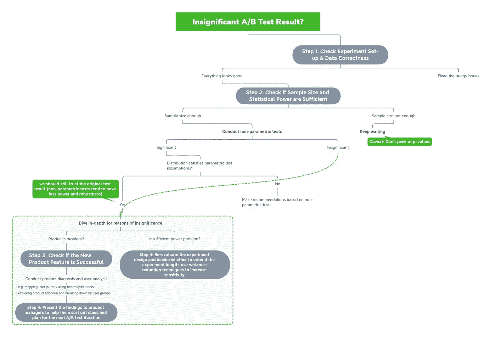

# 当 A/B 测试结果不显著时该怎么办

> 原文：<https://towardsdatascience.com/what-to-do-when-a-b-test-result-is-not-significant-21e905ff9eba>

## 落实具体行动的四步框架

来源:[马库斯·温克勒在 Unsplash 上的文章](https://unsplash.com/photos/IrRbSND5EUc)

# 太长；不要读

*   **第一步:检查实验设置&数据正确性**
*   **第二步:检查样本量和统计功效是否足够:**如果收集的样本满足所需的最小样本量，进行非参数检验，评估实验是否功效不足。如果流量不足，继续等待，因为通常不建议根据历史趋势制定推断假设(最后的选择)。
*   **第三步:检查新产品功能是否成功:**深入细致的用户分析&评估产品功能的有效性*例如，使用热图/漏斗绘制用户旅程，探索产品采用情况，按用户组细分等*。
*   **第四步:确定下一步行动:**如果第二步有暗示，建议延长试验期或减少差异，或者如果第三步有激励，向产品经理交付相关的可操作分析。

# 介绍

本文讨论了当实验被证明在统计学上无关紧要时，数据科学家应该如何反应。最好是对统计功效、最小样本量计算等 A/B 检验有一些基础知识，并且有兴趣深入研究细节的人。

## **我们多久观察到一次无关紧要的结果？**

可悲但真实的是，在这个行业中，意想不到的微不足道的结果经常发生。根据我个人的经验和对数据科学团队的观察，**几乎三分之一的**实验都以北极星度量的无关紧要的 p 值而告终。此外，除了这些关键指标之外，很可能还有其他指标无法证明统计意义。

因此，我们遵循科学方法来解释这些测试结果并得出可信的结论是至关重要的。受< [*值得信赖的在线受控实验:A/B 测试实用指南*](https://www.cambridge.org/core/books/trustworthy-online-controlled-experiments/D97B26382EB0EB2DC2019A7A7B518F59) >(见参考文献)的启发，我想介绍一种循序渐进的方法，将我们从这种看似毫无头绪的状态带入可操作的阶段。

## 有哪些常见的原因？

在我们很好地了解原因之前，最佳解决方案不会形成。如果假设没有新奇效应、变化厌恶和网络效应(*这些应该有一个完全不同的章节，因此不是本文的重点*)，**常见的原因包括:**

1.  测试功能实际上并不成功。
2.  评估指标的方差太大，无法反映治疗的变化。
3.  该实验仅影响随机人群的一小部分，稀释了评估指标，导致提升不明显
4.  实际处理效果小于最小可检测效果，因此在给定预定样本量的情况下，实验提升不能被解释为显著结果。

本质上，上述 4 个原因可以归为两个关键问题:

*   **产品问题:**新的特性或策略实际上在推动评估指标方面并不有效。
*   **统计功效不足问题:**换句话说，实验动力不足，对检测我们预期的微小效应不敏感，即使它确实存在。通常是由于**样本**不足和**方差**过大造成的。

第一类问题很容易理解，所以我将用本文的大部分时间讨论第二个问题，这通常更常见。

> 对 GoodUI.org 115 次 A/B 测试的评估表明，大多数测试动力不足([乔尔杰夫 2018](https://www.amazon.com/Field-Experiments-Design-Analysis-Interpretation/dp/0393979954) )。

统计能力不足的原因之一是，大多数现实世界的 A/B 测试针对的是用户的一个小众子集，而不是整个人群，这使得合格的实验用户群不再有大约 10 亿的数量级(大多数大型科技公司的 MAU)，而是比这个数量级小 100 倍左右。

例如，一个电子商务平台的结帐页面上的结帐按钮的 UI 实验样本只涉及登录结帐页面的用户。如果我们假设这个电商平台的 MAU 是 10 亿，一般的用户旅程是‘登陆页—商品详情页—购物车—结账页’，每个阶段的转化率是 5%，那么我们一个月能找回的最符合条件的实验流量只有:

*10 亿用户×5%×5%×5% = 12.5 万用户。*

虽然 10 亿的 MAU 并不是微不足道的，但对于像每用户 GMV 这样的不稳定指标来说，125，000 并不是一个很大的数字。此外，如果这种面向消费者的 A/B 实验已经面临流量短缺，那么当我们为其他商业方进行测试时，如抖音的**创作者、亚马逊的商家、脸书的**广告商等，可能会更加困难。这重申了理解数据科学家在遇到权力不足和无足轻重的结果时应该做什么的必要性。

来源:[Unsplash 上的活动创建者](https://unsplash.com/photos/OGOWDVLbMSc)

# 详细展开:数据科学家应该做什么？

## 步骤 1: **检查实验设置&数据正确性**

1.  **检查实验参数是否按预期分布:**再次检查以确保暴露于该实验的人口流量百分比与计划相符。此外，处理组中的用户确实可以看到所有新产品特性的变化，而控制组中的用户只能与当前版本进行交互。虽然它们似乎是非常**基本的**甚至是**不必要的**健全性检查，但在我过去的组织中，数据科学团队不止一次发生事故。
2.  **确保数据正确可信:**数据科学家需要具体检查以下 3 件事:
    - **构建关键指标的 SQL 是否正确？** - **交通分流是真的随机吗？** ( *考虑使用卡方检验对两组之间的合格人群差异进行检验* )
    - **两组中的流量是否相同？** ( *检查性别、年龄等关键特征的 p 值分布是否均匀*)

## **第二步:检查样本量和统计功效是否足够**

1.  **如果实际累计流量没有达到我们预先计算的最小样本量:** 显然，**保持等待**从统计学角度来看是最优解。然而，由于外部因素，如咄咄逼人的产品经理或即将召开的管理会议，我们有时需要给出建议。在这种情况下，尽管不推荐，我们可以基于历史模式进行经验推断**—如果我们观察到在过去的大多数日子里治疗和控制差异为正，那么证明统计显著性可能只是时间问题。当基于这些描述性模式制定推论时，我们需要警告自己**不要为了 p 值**而编造故事。**
2.  **如果实际累计流量已经达到我们预先计算的最小样本量:
    2–1。进行非参数测试** 建议从**非参数测试**开始，以收集更多信息供我们参考。尽管这些非参数测试不太稳健，统计能力也较弱，但当我们的基础数据可能是非正态的，并且被极端值扭曲甚至扭曲时，它们会更加准确。
    2–2。评估功率是否足够
    不幸的是**没有直接的后测试方法**来判断测试是否功率不足。我个人的方法是基于经验，考虑到历史实验和商业背景。然而，我相信问我们自己两个问题有助于评估 A/B 检验能力的充分性:
    (1)我们的指标**是否通过使用更一般的人群而不仅仅是暴露的实验组进行计算而被稀释了**？
    (2)我们的关键指标是否正在经历比预期更高的**方差**？

## 步骤 3: **检查新产品功能是否成功**

更深入研究的目标是发现并排除任何可能的**产品原因**导致的无关紧要的结果。下面列出了一些技巧:
- **用户转化分析:**在漏斗图中可视化用户旅程，了解用户的行为如何受到处理的影响。
- **页间分析:**分析 A 页的处理如何影响用户在其他页面的行为。
- **页面内分析:**使用热图分析页面 A 上的治疗功能如何影响用户与页面 A 上其他模块的交互。
- **用户群分析:**按地理区域、流量来源、新/老用户等关键业务维度细分实验队列。探索一组反映高统计学显著性而其他组对变化无动于衷并冲淡治疗效果的可能性。

来源:[印度尼西亚 UX 的 Unsplash](https://unsplash.com/photos/1V5zGGTYXVc)

## 第四步:确定下一步行动

1.  如果无关紧要的结果更可能是**电力不足问题**，我们有两类方法来提高测试灵敏度:
    **1–1。** **扩大样本量**
    (1)延长实验周期让测试运行更长的时间框架；
    (2)调高流量比，将实验暴露给更多用户。
    **1–2。减少方差**
    (1)设计波动性较小的度量指标(如‘搜索总数’通常比‘搜索者数量’有更大的方差)；
    (2)通过二值化或对数变换来变换度量；
    (3)实施分层或**使用预先存在的数据的控制实验(CUPED)** :分层通过组合来自各个层的结果来减少方差，CUPED 使用预先实验数据来控制固有方差。两者都是非常有用的技术，可以很容易地应用于几乎所有的 A/B 测试框架。([查看如何使用 CUPED 使 A/B 测试速度加倍以获得更多详细信息](/how-to-double-a-b-testing-speed-with-cuped-f80460825a90) )
    (4)设计成对实验:如果您有几个拆分流量的实验，并且每个实验都有自己的控制，请考虑将单独的控制集中起来以形成一个更大的共享控制组，并提前将两组中的每个人配对以减少特质差异。阿里巴巴淘宝的数据科学团队采用了这一想法，以对长期以来样本不足的商家进行更稳健的实验。
2.  如果无关紧要的结果更有可能是**产品问题**，我会建议制定一份结构化的报告，并以完整的方式传递这一信息。鼓励在步骤 3 中附上**的分析，关于**哪里的功能出了问题**和**哪些是潜在的改进方向**。**

作者提供的图片—上述框架的流程图

# 总结和警告:不要偷看 P 值

E 每个人都想要**冲击**。产品经理不希望自己从头设计的功能因为无关紧要的结果而被扼杀在摇篮里。数据科学家也不想放弃他们可以在绩效评估中撰写的潜在内容。

然而，人们应该永远记住，数据科学家被称为“科学家”，因为他们应该采用科学的方法来分析产品，而**偷看 p 值**和**操纵数据以伪造故事**肯定不在其中。

处理无关紧要的测试结果的一个推荐方法是彻底探究其原因，同时谨慎地防止我们自己无意中犯下**假发现错误**来操纵具有统计意义的结论。

# 参考

柯哈维，r .，唐，d .，，徐，Y. (2020)。可信的在线控制实验:A/B 测试实用指南。在*可信的在线控制实验:A/B 测试实用指南* (p. I)。剑桥:剑桥大学出版社。

格伯，艾伦 s 和唐纳德 p .格林。2012.现场实验:设计、
分析和解释。诺顿公司。
https://www . Amazon . com/Field-Experiments-Design-analysis diversion/DP/0393979954。

更多细节请参见 Michael Berk 撰写的《如何使用 CUPED 将 A/B 测试速度提高一倍:[https://towardsdatascience . com/How-to-Double-A-B-Testing-Speed-f 80460825 a90](/how-to-double-a-b-testing-speed-with-cuped-f80460825a90)

动力不足的 A/B 测试——困惑、神话和现实，作者格奥尔吉·格奥尔杰夫:[https://blog . analytics-toolkit . com/2020/under powered-A-B-Tests-困惑-神话-现实/](https://blog.analytics-toolkit.com/2020/underpowered-a-b-tests-confusions-myths-reality/)