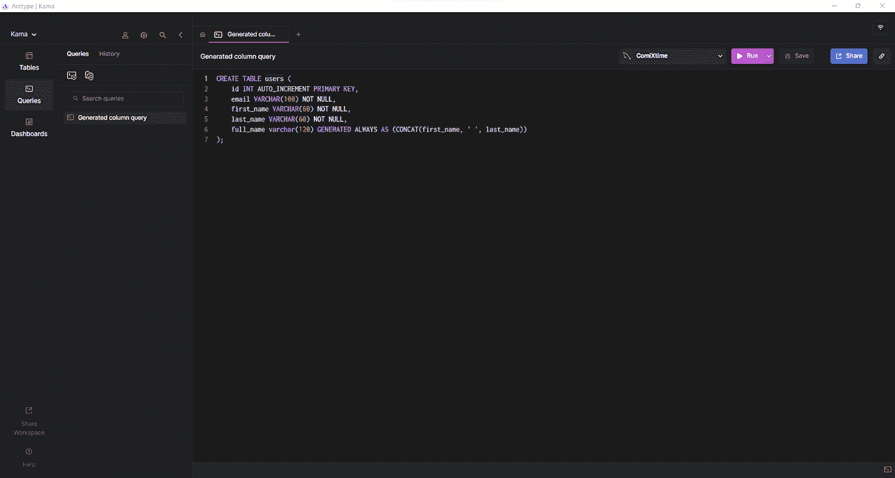

# 关于 MySQL 中生成的列，您需要了解什么

> 原文：<https://towardsdatascience.com/what-you-need-to-know-about-generated-columns-in-mysql-23871b376d66>

## 将自动生成的数据添加到表中


汉斯·雷尼尔斯在 Unsplash 的照片

MySQL 生成的列是一个强大的、易于使用的高级工具，可以帮助任何想要向表中添加自动生成的数据的人——在这篇博客中，我们将学习掌握它们所需的一切。

生成的列允许您在不使用`INSERT`和`UPDATE`子句的情况下在表中存储自动生成的数据。这个有用的特性从版本 5.7 开始就是 MySQL [的一部分，它代表了触发器生成数据的另一种方法。此外，生成的列可以帮助您使查询更容易、更有效。](https://dev.mysql.com/doc/refman/5.7/en/mysql-nutshell.html)

现在让我们学习掌握 MySQL 中生成的列所需要知道的一切。

# 什么是 MySQL 生成的列？

生成的列类似于普通列，但您不能手动更改其值。这是因为表达式定义了如何根据从同一行的其他列中读取的其他值来生成生成列的值。所以，生成的列在表的域内工作，它的定义不能包含`JOIN`语句。

换句话说，您可以将生成的列视为一种视图，但仅限于列。注意，生成的列不同于 SQL 触发器，只有在使用语法如下的`[CREATE TABLE](https://dev.mysql.com/doc/refman/8.0/en/create-table-generated-columns.html)`或 <https://dev.mysql.com/doc/refman/8.0/en/alter-table-generated-columns.html> `[ALTER TABLE](https://dev.mysql.com/doc/refman/8.0/en/alter-table-generated-columns.html)`语句时才能定义它们:

```
generate_column_name column_type [GENERATED ALWAYS] AS (generation_expression)
[VIRTUAL | STORED] [NOT NULL | NULL]
[UNIQUE [KEY]] [[PRIMARY] KEY][COMMENT 'string']
```

`AS (generated_column_expression)`子句指定您添加或更新到表中的列是一个生成的列。`generation_expression`定义了 MySQL 将用来计算列值的表达式，它不能引用另一个生成的列或除当前表的列之外的任何内容。

另外，请注意，生成表达式只能包含不可变的函数。例如，不能在生成的列表达式定义中使用返回当前日期的函数，因为它是可变函数。

您还可以在`AS`前面加上`GENERATED ALWAYS`关键字，以使生成的列更加明确，但这是可选的。然后，您可以指明生成的列的类型是`VIRTUAL`还是`STORED`。你将在下一章了解这两种类型的区别。默认情况下，如果查询中没有明确指定，MySQL 会将生成的列标记为`VIRTUAL`。

现在让我们看看在一个`CREATE TABLE`查询中生成的列语法:

```
CREATE TABLE users (
id INT AUTO_INCREMENT PRIMARY KEY,
email VARCHAR(100) NOT NULL,
first_name VARCHAR(60) NOT NULL,
last_name VARCHAR(60) NOT NULL,
full_name varchar(120) GENERATED ALWAYS AS (CONCAT(first_name, ' ', last_name))
);
```



[Arctype](https://arctype.com/) 中的`CREATE TABLE`查询

在这个例子中，`full_name`列将自动存储`first_name`和`last_name`列的连接。

# MySQL 中存在哪些类型的生成列？

如前所述，您可以将生成的列定义为`VIRTUAL`或`STORED`。现在让我们仔细看看这两种类型。

## 虚拟生成的列

MySQL 不存储标记为`VIRTUAL`的生成列。这意味着 MySQL 会在需要时动态评估其价值。这通常在任何`BEFORE`查询被触发后立即发生。换句话说，虚拟生成的列不占用存储空间。

## 存储生成的列

MySQL 存储任何生成的标记为`STORED`的列。这意味着每当您插入或更新一行时，MySQL 负责评估它的值并将其存储在磁盘上。换句话说，存储列需要存储空间，就像普通列一样。

# 虚拟生成的列与存储生成的列

现在让我们进一步了解虚拟列和存储生成列的优缺点。

## 虚拟生成的列

**优点**

*   它们的创建是即时的，因为 MySQL 只需改变[表元数据。](https://dev.mysql.com/doc/refman/8.0/en/information-schema.html)
*   它们不需要磁盘空间。
*   `INSERT`和`UPDATE`查询没有开销，因为 MySQL 不需要生成它们。

**缺点**

*   MySQL 在读取表时必须对它们进行评估，这使得涉及它们的 SELECT 查询变得更慢。

## 存储生成的列

## 赞成的意见

*   MySQL 可以读取它们，就像它们是普通的列一样，这保证了在没有开销的情况下快速检索。

## 骗局

*   当添加到一个新表中时，MySQL 必须重建整个表。
*   `INSERT`或`UPDATE`会带来开销，因为 MySQL 必须生成它们。
*   它们需要磁盘空间(注意，您可以在一个表中混合虚拟列和存储列，它们都支持 [MySQL 索引](https://arctype.com/blog/mysql-index-performance/)和二级索引。但是正如官方文档中的[所解释的，虚拟列上的二级索引比存储的生成列占用更少的空间和内存，这意味着虚拟生成列在涉及二级索引时效率更高。)](https://dev.mysql.com/doc/refman/8.0/en/create-table-secondary-indexes.html#create-table-secondary-indexes)

# 为什么采用生成的列？

采用生成列有几个原因，但下面三个是最重要的原因。

*   **它们为您提供了缓存功能，使您的查询速度更快**:生成的列使您有可能定义包含有用数据的列，这样您就可以在需要时高效地检索这些数据。
*   **它们允许您简化查询表达式**:您可以将复杂性分散到生成的列中，然后在简单的过滤操作中使用它们，而不是让查询变得复杂。
*   **它们使您能够定义函数索引** : MySQL 将[函数索引](https://dev.mysql.com/doc/refman/8.0/en/create-index.html#create-index-functional-key-parts)实现为隐藏的虚拟生成列。换句话说，生成的列使您有可能定义涉及 MySQL 函数的高效和高级索引。

# MySQL 生成的实际例子中的列

现在让我们在一些例子中看看生成的列，这些例子来自我作为一个与数据驱动的初创公司合作的[后端开发人员的经历](/working-for-a-data-driven-startup-whose-value-surged-700-in-less-than-one-year-168e8c43565a)。

## 1.出于一致性原因，使用生成的列来连接列

在开发应用程序的前端时，您可能会注意到数据表示中的某些模式。例如，在体育运动中，一个队中的运动员通常用以下格式来标识:

```
first_name [first_character_middle_name.] last_name [(jersey_number)]
```

如您所见，您可以通过将这四列与以下生成的列聚合来轻松生成该数据字段:

```
string_identifier VARCHAR(255) GENERATED ALWAYS AS
(CONCAT(first_name, ' ', IF(middle_name IS NULL, '', CONCAT(LEFT(middle_name, 1), '. ')), last_name, IF(jersey_number IS NULL, '', CONCAT(' (', jersey_number, ')'))))
STORED
```

这将产生:

```
Cristiano Ronaldo (7)
Lionel A. Messi (10)
```

在这种情况下，生成的列使您能够直接在数据库级别标准化数据字段格式。此外，存储生成的列避免了每次需要时构建该字段的不可避免的开销。

## 2.使用生成的列来自动生成哈希 id

通常，您使用网站 URL 中的资源 id 或[REST API](https://en.wikipedia.org/wiki/Representational_state_transfer)来检索您需要的数据。但是公开暴露你的身份会带来安全问题。当您发现自己使用自动递增的 id 时尤其如此，这很容易预测，并使抓取或 bot 攻击更容易。

```
public_id VARCHAR(40) GENERATED ALWAYS AS SHA1(CONCAT("PLAYER", id)) VIRTUAL
```

为了避免这种情况，您可以考虑通过使用自动生成的、随机的、更安全的公共 id 来隐藏您的原始 id。您可以通过散列您的 id，使用虚拟生成的列来实现这一点，如下所示:

注意，为了避免生成已知的哈希值，您可以用一个特殊的关键字连接您的 id。点击了解更多关于 MySQL 加密和压缩功能的信息[。](https://dev.mysql.com/doc/refman/8.0/en/encryption-functions.html)

## 3.定义生成的列以简化数据筛选

筛选数据时，有些列比其他列更有用。此外，您经常需要更改存储在列中的值的表示形式，以使筛选更简单或更直观。您可以定义一个有用的生成列，以所需的格式存储执行筛选所需的信息，而不是在每个筛选查询中都这样做。

例如，您可以定义一个生成的列，以便更容易地找到篮球队的队员，如下所示:

```
filter_string VARCHAR(255) GENERATED ALWAYS AS
(CONCAT(first_name, ' ', last_name, IF(birthdate IS NULL, '', CONCAT(' ', DATE_FORMAT(birthdate, "%m-%d-%Y"))))
STORED
```

这种列将产生:

```
LeBron James 12-30-1984
Stephen Curry 03-14-1988
```

这包含数据有用的过滤和球员的出生日期在美国的格式。

# 生成的列与触发器

如前所述，您只能在表中使用生成的列。此外，它们只能涉及不可变的函数，MySQL 生成它们的值以响应`INSERT`或`UPDATE`查询。另一方面，[触发器](https://dev.mysql.com/doc/refman/8.0/en/trigger-syntax.html)是一个存储程序，每当与特定表相关的`INSERT`、`UPDATE`或`DELETE`事件发生时，MySQL 就会自动执行该程序。

换句话说，触发器可以涉及几个表和所有 MySQL 函数。与生成的列相比，这使它们成为更完整的解决方案。同时，MySQL 触发器本质上使用和定义起来更复杂，并且比生成的列更慢。

# 结论

MySQL 生成的列无疑是一个很好的工具，可以服务于多种用途并带来多种好处。采用它们既简单又有效，尽管没有多少数据库开发人员使用它们。无论哪种方式，知道如何利用它们对于使你的后端应用程序更快、更干净、更简单来说都是必不可少的。我希望通过真实世界的例子解释生成列的用例，能够帮助您获得更多数据库领域的知识，直到下一次。

感谢阅读！我希望这篇文章对你有所帮助。请随意留下任何问题、评论或建议。

*原载于 2022 年 6 月 28 日*[*【https://arctype.com】*](https://arctype.com)*。*