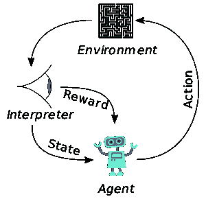

# 你需要知道的关于 DeepLearning 更新的机器学习专业化。人工智能

> 原文：<https://towardsdatascience.com/what-you-need-to-know-about-updated-machine-learning-specialization-by-deeplearing-ai-97118fa03297>

## 一切新的都是早已被遗忘的旧的，不是吗？

迪特玛·贝克尔在 [Unsplash](https://unsplash.com/?utm_source=unsplash&utm_medium=referral&utm_content=creditCopyText) 上的照片

2022 年 4 月 18 日，Coursera 十周年之际，吴恩达( [DeepLearning 创始人。AI](https://www.deeplearning.ai/)[Coursera](https://www.coursera.org/)联合创始人，机器学习和 AI 最著名的普及者之一)发布了新的[机器学习专精](https://www.coursera.org/specializations/machine-learning-introduction)。这是 2010 年创建的原始机器学习斯坦福课程的更新版本，自最初发布以来，约有 500 万人参加了该课程。

前一段时间我参加了最初的课程，7 月份课程一结束，我就参加了更新的课程。让我们仔细看看这些学习资料，找出，到底更新了什么，是否值得在 2022 年上这门课。

## TL；速度三角形定位法(dead reckoning)

是的，它是。在我看来，现在这是开始你的机器学习之旅的最佳方式，尤其是如果你是一个完全的初学者，而且以前从未听说过数据科学和机器学习。

# 前一篇文章

在我之前关于这个话题的[文章](/what-you-need-to-know-before-taking-the-machine-learning-course-by-stanford-84fd7bf94628)中，我分享了我对斯坦福最初的机器学习课程的想法。在那里，我列出了我个人对这门课的缺点的看法，以及对值得补充的内容的建议。

既然我已经采用了两个版本——原始版本和更新版本，在我的进一步推理中，我将依赖于本文中表达的论点(主要是在**与原始课程**部分的比较中)。所以，如果你想熟悉我最初的想法，我在下面分享我之前文章的链接。

  

# 与原始课程的比较

在这一部分，我将主要基于我之前所陈述的来比较这门课程的两个版本。我不知道深度学习的人。人工智能团队已经阅读了我的评论，但几乎我所有的要求都得到了适当的考虑和满足。:)

## **过时**

在我之前的文章中，我说过这门课程的主要缺点是它已经过时了。当然，我不是唯一理解这一点的人，我认为这是它更新的主要原因。

虽然**课程讲述的基础知识永远不会改变**，但更令人高兴的是知道你收到的所有信息，包括作业和实例，都是当前的热门话题和相关内容。

基于这门课程的诸多优点，**仅仅消除这一缺点就已经是这门课程成为** **非常好的** **学习材料**的充分条件。但它的创造者走得更远，改进和完善了教育计划和与学生互动的方式，不仅更新了课程，还使其更加完整、广泛和有趣。

## Python 而不是 Octave

在最初的课程中，实际作业必须在 Octave (MATLAB)上解决。尽管有很多方法可以绕过它，但官方的实现并没有使用 Python。对大家来说幸运的是，这个已经被修复了，**现在课程使用 Python** 。

这不仅意味着你不需要学习一门你这辈子几乎肯定不会再用到的编程语言(抱歉，MATLAB 程序员)。也意味着和 Python 一起，你将获得关于你开始从事数据科学或机器学习工作时几乎每天都会用到的库的基础知识: [*numpy*](https://numpy.org/) ，[*scikit-learn*](https://scikit-learn.org/stable/)*，*[*tensor flow*](https://www.tensorflow.org/)。简直太棒了！

需要注意的是，课程**不会教你 Python** ，你需要了解这种语言和编程的基本知识——变量、条件表达式、循环和函数就足够了(课程中不会用到最纯粹形式的类和*面向对象编程*)。所以如果你是一个完全的初学者，也许你应该先学习一些 Python 基础课程。

## 集成学习

原来的课程没有提到任何一个集成模型，现在会详细告诉你*决策树*(之前也没有发生过)，解释*集成学习*的动机，演示*随机森林*和*助推*模型。

虽然这里只在决策树而不是其他模型的上下文中解释了集成学习，但它是朝着正确方向迈出的第**步**，允许您获得机器学习模型动物园的更完整图片。

你还会看到 [XGBoost 库](https://xgboost.readthedocs.io/en/stable/)，这是*经典机器学习*最强大的工具之一(这里的*经典*我指的是没有深度神经网络的机器学习)，所以你马上把它放进你的工具箱！

## 分类变量

最初的课程也根本没有提到分类变量，这对我来说似乎很奇怪，因为这将使初学者在他决定自己解决的第一个任务中感到困惑(因为分类变量非常常见)。这个故障已经纠正到这里，课程会告诉你*一键编码*。

你必须自己熟悉剩下的方法，但是因为这个课程是为初学者设计的，我不认为这是一个缺点。

## 无监督学习算法:聚类、异常检测和降维

至于无监督学习算法，情况仍然大致相同。 *K-Means* 仅用于聚类，而*高斯混合模型(GMM)* 用于异常检测。

课程中提到降维是一种辅助技术，当我们有几次关于*主成分分析*的单独讲座时，对它的关注比以前少了。

*更新:不过 2022 年 12 月课程更新多了一点，几个关于 PCA 的视频像原来的课程一样被退回来了。*

虽然看起来我认为许多其他方法被忽略了(上次我也是这样认为的)，但我已经改变了我的想法，我稍后会谈到这一点。

## 抱歉，支持向量机

在进入更一般的考虑之前，老实说，我应该注意到**支持向量机** **资料被从更新的课程**中删除，尽管原始课程包含它们。

也许由于计时的原因，提到 *SVM* 并不适合本课程，但我认为它被删除是因为它的复杂性，因为这种算法及其核心技巧很难理解，可能是经典监督学习中最困难的方面。

所以，我认为删除它是为了不吓跑新来者；无论如何，把 *SVM* 改成*决策树*、*随机森林*和*助推*是个不错的交换。

*更新:在 2022 年 12 月增加了 PCA 和反向传播材料后，SVM 很可能会被包括在该计划中，并有一些即将到来的更新。*

# 还有什么？更一般的推理

## 结构化

更新的专业化变得**更加结构化**。原始源由 11 周组成，其中的材料没有相互分离。

现在，专业化的内容分为 3 门课程，每门课程都有一个特定的主题，并按周进行内部划分。因此**在球场内导航**，返回球场并搜索特定资料变得更加容易。顺便说一下，这三门课是:

1.  监督机器学习:机器学习介绍，回归(线性回归)，分类(逻辑回归)；
2.  高级学习算法:神经网络、决策树、随机森林、boosting 和应用机器学习的实用建议；
3.  无监督学习、推荐器、强化学习:聚类、异常检测、推荐系统和强化学习。

查看[专业化主页](https://www.coursera.org/specializations/machine-learning-introduction)获得更详细的描述。

## 更多的实验室、更多的可视化和更多的交互性

在我看来，另一个好的解决方案是包含更多的实践实验室，并允许人们看到更多的代码。由于代码现在可以在 Jupyter 笔记本上执行，这解放了作者的双手。实验室(几乎所有的实验室都是可选的，所以没有人会被吓跑)变得越来越多，越来越详细，越来越多样化。

同时，它们中的许多包含非常直观和交互式的可视化。老实说，其中一些的质量本来可以更好(老实说，我不明白他们为什么使用纯[*matplotlib*](https://matplotlib.org/)*)甚至用于互动情节，而不是例如 [*plotly*](https://plotly.com/) )但其中一些确实可以让你获得非常有用的见解。*

*为了了解什么是交互性，你可以在 YouTube 上看一下最近的专业化演示。*

## *第三道菜太棒了*

*尽管我说过有可能提到更多的算法和方法用于无监督学习任务，第三个专业化课程**涵盖的内容远不止**之前的类似部分。*

*仅在第一周审查聚类和异常检测。第二周致力于商业上最成功的机器学习应用——推荐系统的两个算法:*协同过滤*和*基于内容的过滤*，第三周致力于*深度 Q-Learning (DQL)* ，一个*强化学习*算法，真的很牛逼！*

*首先，关于强化学习的故事总是非常鼓舞人心，至少对我来说是这样，因为我认为这是机器学习中最基于“机器”的部分。第二，吴恩达的教学天赋和课程团队使这个最复杂的科学领域之一，或者至少是它的基础，为每个人所理解。*

*顺便说一下，强化学习是机器学习的一部分，其中一个*代理*在给定的*环境*中学习做一些事情，而不知道事情是如何工作的，并且在成功的情况下只接收*奖励*。机器学习的这一部分也是新闻中最受欢迎的:这是机器人学习下[国际象棋](https://spectrum.ieee.org/how-ibms-deep-blue-beat-world-champion-chess-player-garry-kasparov)、[围棋](https://www.bbc.com/news/technology-40042581)或[视频游戏](https://www.newscientist.com/article/2221840-deepminds-starcraft-playing-ai-beats-99-8-per-cent-of-human-gamers/)的地方。你还可以找到十几个 YouTube 视频，在这些视频中，人工智能代理学习不同的东西:从走路到拳击。*

**

*强化学习图。[公共领域](https://commons.wikimedia.org/wiki/File:Reinforcement_learning_diagram.svg)*

*将所有这些放在一起，第三门课程展示了现实世界机器学习应用的**极其广阔的图景**，并将专业化带到了下一个层次。*

## *毫无疑问，专业化是为初学者设计的*

*出于各种作者的原因，专门化被做得尽可能简单，*有时甚至太多*。对于大多数学习者来说，这不是一个缺点，而是一个优势，但无论如何，这是一个具有多种后果的特征。*

*最重要的是，这关系到熟悉高中数学的人(并且理解什么是导数，最优化任务，为什么梯度下降真的有效，等等。).对你来说，课程中会有很多轻描淡写的内容，就好像你缺少描述某些算法背后的数学知识的额外讲座。这是因为*课程试图完全不用数学*，但有时看起来很奇怪，例如**在谈到神经网络时没有提到反向传播**。*

**更新:在 2022 年 12 月的更新中增加了一些关于反向传播的讲座，所以这个评论已经失去了相关性。**

*当然，你可以通过阅读众多书籍中的一本或参加更高级的 ML 课程来填补这些轻描淡写的内容。但是，如果你是一名计算机科学学生，可能有更有效的方法让你深入人工智能、数据科学和机器学习的世界。毕竟你**开始探索 ML** 真的不需要很强的数学背景，但是*如果你决定认真做的话可能需要了解很多数学点*。*

# *摘要*

*我在课程完成时得到的假设，在我看 DeepLearning 的[加速你的 AI 职业生涯讨论时被完全证明了。AI 战队](https://www.youtube.com/watch?v=D1W0kS40otM)。*

*显然，吴恩达和他的团队已经尽一切可能**给任何人机会通过这个专业**并理解什么是机器学习。这有助于:*

*   *想找 ML 相关工作的同学，*
*   *想要改变他们活动领域的专业人士，*
*   *或者只是那些对人工智能是什么以及人工智能是否真的有危险感兴趣的人，至少目前是这样。*

*吴恩达提到，传播人工智能和 ML 知识的目标之一是**让非技术专业的人更容易获得人工智能**，因为它对他们仍然非常有用。人工智能相关的产品和商品正越来越积极地进入我们的生活，通过了解基本知识，无论你从事什么职业，你都可以极大地促进你的工作或看到这样做的机会。我们正在谈论的是*自动化*，如果编程已经使得*自动化常规动作*成为可能，那么 AI 使得*自动化常规动作成为可能，这需要某种程度的智能*就在我们眼前。*

*这种专业化是实现这一目标的步骤之一。它不会马上告诉你训练神经网络的所有方法或降维任务的所有陷阱。但是没有一个专业、课程或书籍能做到。相反，它让**对机器学习有了尽可能广泛的理解**，并且**足够深入去从事它**。缺乏数学可能会惹恼一些爱好者，但这大大降低了入门门槛，利大于弊。*

*如果您:*

*   *从未听说过机器学习，*
*   *害怕你的数学知识不够，或者*
*   *不在 IT 或技术行业工作，*

*这个专精是一个**极好的选择**。它会奖励你探索新事物的决定，而不会用复杂的术语和公式吓到你。而当你完成它的时候，你将能够**开始实施你自己的项目**或者不害怕借助更高级的材料继续熟悉 AI word。*

*在最坏的情况下，学习人工智能会很有趣，在最好的情况下，它可以让你的生活变得更好。*

# *参考*

* * 

# *感谢您的阅读！*

*   *我希望这些材料对你有用。[在 Medium](https://medium.com/@andimid) 上关注我，获取更多这样的文章。*
*   *如果您有任何问题或意见，我将很高兴得到任何反馈。在评论里问我，或者通过 [LinkedIn](https://www.linkedin.com/in/andimid/) 或者 [Twitter](https://twitter.com/dimid_ml) 联系。*
*   *为了支持我作为一个作家，并获得数以千计的其他媒体文章，使用[我的推荐链接](https://medium.com/@andimid/membership)获得媒体会员资格(不收取额外费用)。*