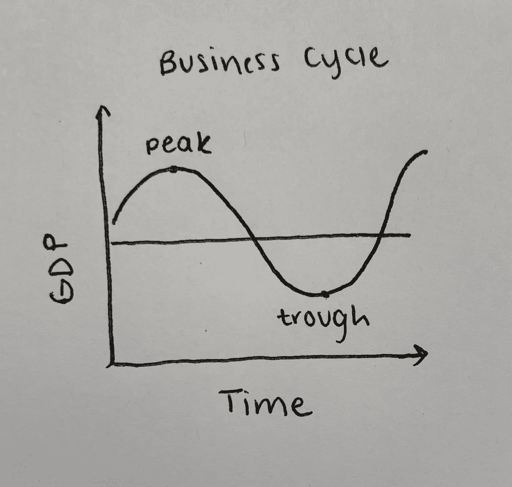
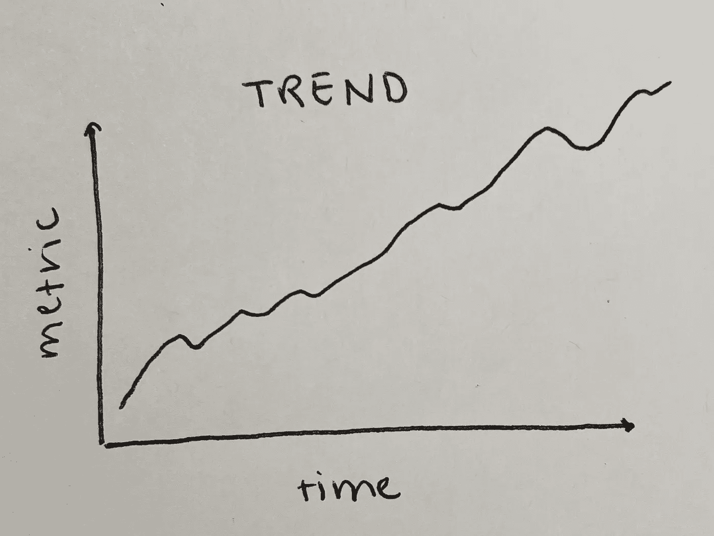
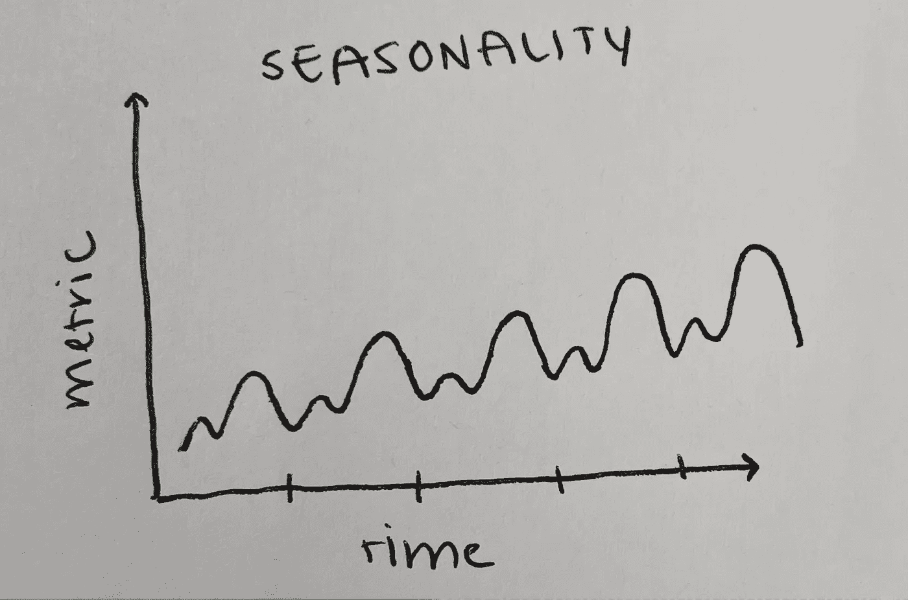
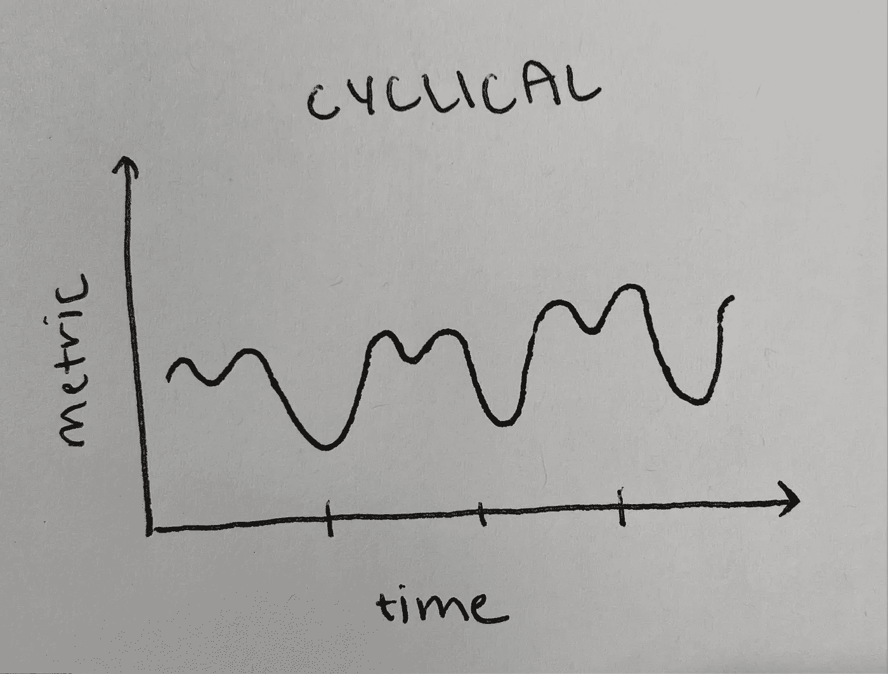
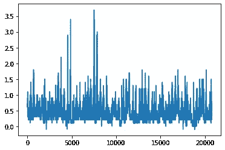
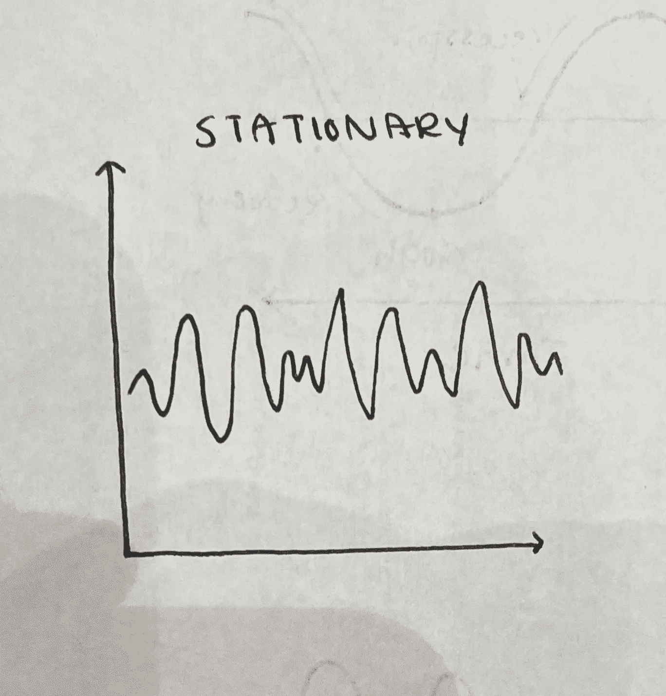
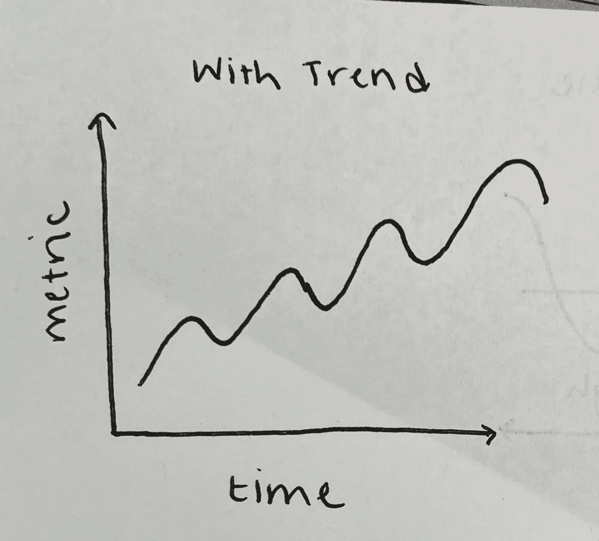
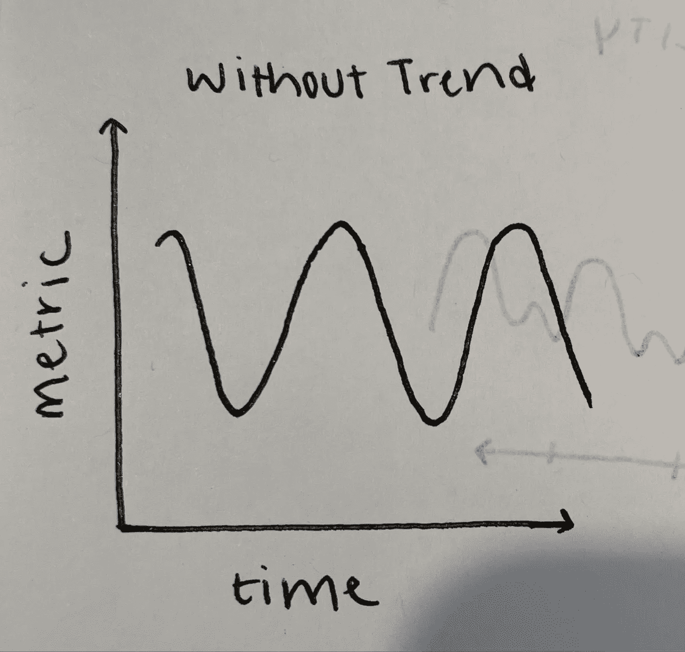
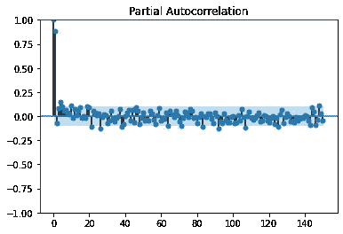

# 你需要知道的 ARIMA 时间序列项目

> 原文：<https://towardsdatascience.com/what-you-need-to-know-for-your-arima-time-series-project-804713b8f00d>

## 关于时间序列的基本概念，帮助您开始第一次时间序列预测项目

亚历山大·托多夫在 [Unsplash](https://unsplash.com?utm_source=medium&utm_medium=referral) 上拍摄的照片

如果你沉浸在数据科学和统计学领域，你可能听说过“时间序列”这个术语。凭直觉，您可能会想到一系列随时间绘制的数据。差不多就是这样，但是要执行一个时间序列项目，你需要理解和执行许多概念和组件。在本文中，我将介绍执行时间序列分析项目所需的主要术语和概念。

在本文的后面，我将引用 python 中的 [statsmodels](https://www.statsmodels.org/stable/index.html) 库。

**目录**

> [*什么是时间序列*](#b94f)
> 
> [*时间序列数据的组成*](#a24d)
> 
> [*时间序列分析的步骤*](#9e99)
> 
> [*ARIMA/阿玛*](#4802)
> 
> [*结论*](#e203)

# 什么是时间序列

时间序列数据是一段时间内定期定义的观察值的集合。时间序列数据的一些常见示例是每月销售指标、每日股票价格等。观察的频率可以从每小时、每天、每月、每年等等变化。取决于问题/目标的焦点是什么。对许多公司来说，分析时间序列数据是非常重要的，因为它可以产生关键的见解，帮助指导业务决策。了解其业务季节性的公司可以预测在一年的某个时间需要进行多少库存、人员或价格调整。在经济学中，你可以看到一段时间内与失业或通货膨胀相关的时间序列数据。商业周期(如下所示)也是经济学中常见的时间序列周期。

商业周期图。来源:作者

# 时间序列数据的组成部分

当观察时间序列数据时，有 4 个主要部分需要寻找:趋势、季节性、周期性事件和不规则性。

## **趋势**

在寻找趋势时，你是在寻找一个长期序列中清晰的上升或下降模式。通常，一个趋势是无法立即识别的。

如果我们能找到一个趋势的原因，它将被称为**决定性的**。而无法解释的趋势被认为是随机的**。例如，如果你在 Medium 上发表了一篇非常有趣和有用的文章，那么这篇文章的参与度很可能会有一个上升的趋势，使得这个趋势具有确定性。**

****

**趋势图示例。来源:作者**

## ****季节性****

**与趋势不同，季节性更容易预测。季节性由一年内以固定和已知的频率发生的变化组成。季节性可以指日历季节(如夏季和冬季)或商业季节(如节假日)的周期性波动。例如，冬季服装的销量会上升，因为天气变冷，人们需要保暖。**

****

**季节性图表示例。来源:作者**

## ****周期性****

**与季节性不同，周期性数据是一种上升和下降模式，在不同时期之间没有精确或可预测的变化。这方面的一个例子是由于经济条件引起的商业周期波动。**

*   **注意:很容易混淆周期性和季节性行为。如果数据的波动是在一个固定的频率，并与日历上的某个时间相关，这是季节性的。如果数据的波动不是在一个固定的频率，它是周期性的。**

****

**循环图示例。来源:作者**

## ****不规则性****

**当你从数据中剔除趋势和季节性时，就会出现不规则性。它是不可预测的、不一致的和随机的，因为我们去掉了数据的模式部分。不规则性通常被称为“噪音”。**

****

**带有噪声的图形示例。来源:作者**

# ****时间序列分析的步骤****

**当准备做时间序列分析时，首先需要做一些检查。**

## ****检查稳定性****

**平稳性是指时间序列中数据的统计特性不会随时间而改变。这也可以理解为数据具有恒定的均值、方差和协方差。这是一种衡量数据是否具有季节性/趋势等结构模式的方法。**

****为什么检查平稳性很重要？****

**首先，静态数据更容易分析。**

**当预测未来事件时，时间序列模型假设每个点彼此独立(不依赖于时间)。由于静态数据不包含趋势或季节性(随时间变化)，这些数据被认为是相互独立的。**

**平稳性很重要的另一个原因是方差。非平稳数据有利于理解数据的趋势和季节性，但是，它可能包含数据点之间的大量差异。模型中的差异太大会导致模型过度拟合，无法做出准确的预测和预报。**

**为了澄清，静态数据可以包含变化的值，但是它变化的方式不会随时间而改变。可能更容易想象:**

****

**静态图示例(无趋势/季节性)。来源:作者**

****如何识别平稳数据:****

**有两种统计测试可以用来检查时间序列数据是否平稳。**

****ADF 增强的迪基-富勒试验****

**ADF 检验是一种统计检验，称为“单位根检验”。单位根是时间序列数据的一个特征，使其具有非平稳性。时间序列数据中单位根的数量对应于使数据稳定所需的差分运算的数量。**

**ADF 测试方程包含多个差异项，这增加了测试的彻底性。**

**ADF 测试在以下假设和前提下进行:**

**零假设:时间序列不是平稳的或者有单位根。**

**替代假设:时间序列是平稳的或者没有单位根。**

**statsmodels 中的 ADF 方法将输出 p 值、测试统计值、测试中考虑的滞后次数以及临界值临界值。如果检验统计量小于临界值，p 值小于您设置的 alpha 值(常规 alpha = 0.05)，那么就有足够的证据拒绝零假设，并声明时间序列是平稳的或没有单位根。**

## ****去趋势/差分****

**去趋势应用于移除数据中的趋势。趋势被认为是平均值随时间的变化。例如，如果您有一个显示季节性上升趋势的图表，主要目标可能是通过删除潜在趋势(上升趋势)来查看图表中的子趋势(季节性)。**

****

**带趋势的图表。来源:作者**

**当我们去除上升趋势时，我们只剩下时间序列数据的子趋势，通常是波动性/季节性(如下所示)。**

****

**移除趋势的图表。来源:作者**

**如何去趋势化数据？**

**取消数据趋势的方法之一是使用差分。差异有助于消除时间序列数据的变化，消除趋势和季节性，从而稳定一段时间内的平均值。我们可以把差分看作是一个新的数据集，其中每个观察值都是它自己和前一个观察值之间的差。**

**差异将通过 ARIMA 方法中的一个参数来实现。关于这个参数的更多信息将在本文的 ARIMA/ARMA 部分。**

## ****ARIMA/阿玛- PACF/ACF 图的前期工作****

**ARIMA/ARMA 模型包含 3 个参数，用于模拟时间序列数据的主要方面。这些参数被标记为 **p、d 和 q****

****p** :该参数代表模型的 AR(自回归)阶。*自动*回归是指变量对自身的回归。在自回归模型中，预测值是变量以前值的线性组合。**

**为了确定 p 的值，需要绘制偏自相关函数(PACF)。p 的阶是图上非零部分自相关的数目，也被认为是分界点。**

****d** :该参数表示您希望数据求差分以使其稳定的次数(它执行积分的次数)。顺序为 0 表示原始数据是固定的。一阶差表示数据具有恒定的平均趋势/线性趋势，二阶差表示二次/时变趋势。**

****q**:q 值的阶数代表预测方程中使用的滞后预测误差的数量，从移动平均模型中得出。移动平均值也称为滚动平均值，它是通过在 n 个时间段内对时间序列中的数据进行平均计算得出的。q 的阶数是在自相关函数(ACF)图(ACF 的分界点)中找到的有效值的数量。**

****重新封顶:****

*   **参数:AR 的项数取决于 PACF 截止的滞后时间**
*   **q 参数:MA 的项数取决于 ACF 截止的滞后**

**下图是部分自相关图的一个示例。如果我们想找到 p 参数的顺序，我们需要计算非零(有效)值的数量。在这种情况下，p 的顺序可能是 2，因为只有 2 个有效值。**

****

**部分自相关图示例。来源:作者**

# **ARIMA/ARMA**

**ARIMA 和 ARMA 模型是时间序列数据上最常用的统计方法，用于更好地理解数据或预测未来事件。另一种流行的时间序列方法是 LSTM 模型，这是基于深度学习而不是纯粹的统计。在本文中，我将只讨论 ARIMA，并在下一篇文章中继续讨论《时间序列》中的 LSTM。**

**ARIMA 代表自回归综合移动平均线，ARMA 代表自回归移动平均线。两者的区别在于 ARIMA 包含一个差分项，而 ARMA 没有。当原始数据是平稳的时，使用 ARMA 模型。如果数据不需要差分，ARMA 将是使用的正确模型。ARIMA 的“综合”部分是对需要多少差异项(非季节性差异)来使数据稳定的度量。**

**所以 ARMA 的参数只包含 p 和 q，而 ARIMA 包含 p、d 和 q**

## **结论**

**有许多方法可以着手分析时间序列数据，包括像 LSTM 这样的深度学习方法。然而，我将在下一篇文章中深入研究 LSTM 的时间序列，并在另一篇文章中概述我为这个项目编写的代码。**

**虽然时间序列听起来很直观，但是如果您想要一个高效且正确的模型，那么需要了解许多组件才能有效地进行时间序列分析。我希望这篇文章能让你对时间序列分析中使用的主要概念有一个很好的理解，并关注即将到来的文章。**

**如果你想更多地了解我，请随时查看我的网站并联系我！**

## **额外资源**

**<https://online.stat.psu.edu/stat510/lesson/2/2.2>  <https://www.real-statistics.com/time-series-analysis/arima-processes/arima-differencing/>  <https://people.duke.edu/~rnau/411arim2.htm>  

🫶🏽**