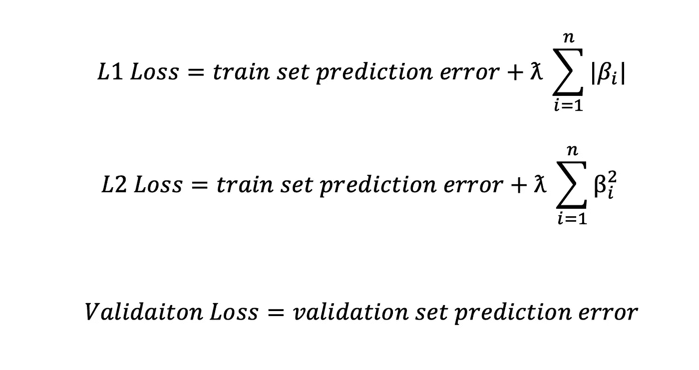
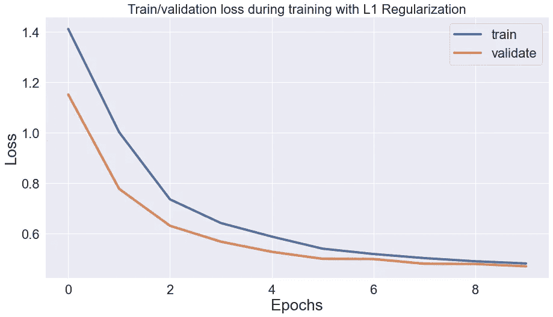
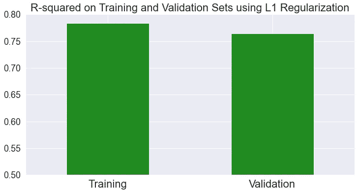
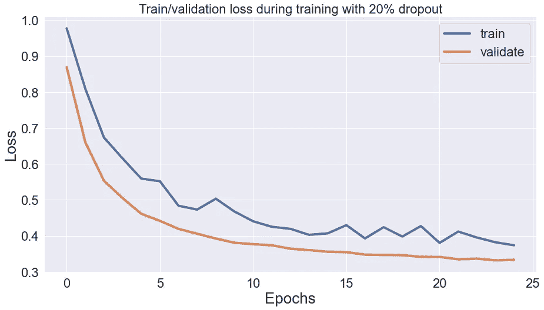
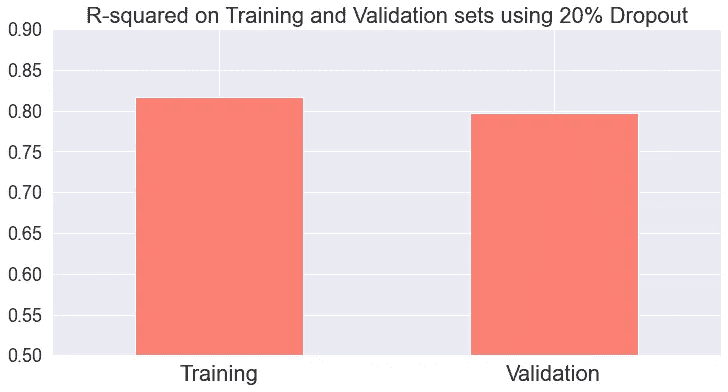
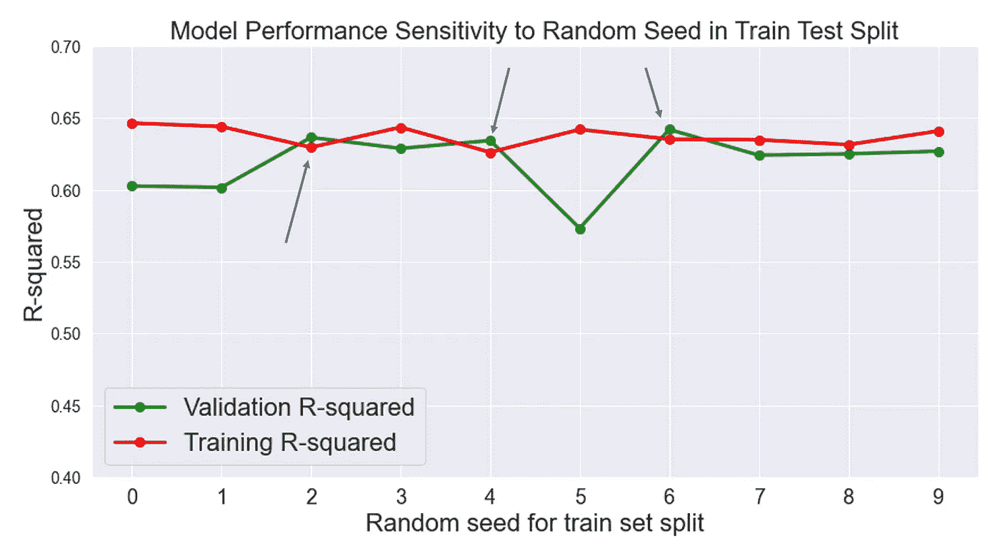

# 你的验证损失低于你的培训损失？这是为什么！

> 原文：<https://towardsdatascience.com/what-your-validation-loss-is-lower-than-your-training-loss-this-is-why-5e92e0b1747e>

## 仅仅因为你的模型从训练集中学习并不意味着它的性能会更好。

有时，数据科学家会遇到验证损失低于训练损失的情况。**这是一个奇怪的观察结果**因为模型正在从训练集中学习，所以它应该能够更好地预测训练集，然而我们观察到更高的训练损失。出现这种情况有几个原因，我将在本文中逐一介绍常见的原因。


Freepik.com 的 Wayhome 工作室

# 原因 1: L1 或 L2 正规化

**症状:验证损失始终低于培训损失，但两者之间的差距随着时间的推移而缩小**

无论是使用 L1 正则化还是 L2 正则化，都是通过向误差函数添加模型权重来有效地扩大误差函数:



作者图片

**正则化项仅在训练集上训练模型时应用，增加了训练损失**。在验证和测试期间，您的损失函数只包含预测误差，因此损失通常低于训练集。



作者图片

注意验证和列车丢失之间的差距是如何在每个时期后缩小的。这是因为随着网络学习数据，它也会缩小正则化损失(模型权重)，从而导致验证和训练损失之间的微小差异。

然而，该模型在训练集上仍然更准确。

让我们比较一下模型在训练集和验证集上的 R2 分数:



作者图片

请注意，我们不是在讨论损失，而是只关注模型对训练集和验证集的预测。正如预期的那样，模型对训练集的预测优于验证集。

# 原因二:辍学

**症状:验证损失始终低于培训损失，两者之间的差距大致相同，培训损失有波动。**

在模型训练期间，通过随机冻结层中的神经元，丢弃会惩罚模型变化。像 L1 和 L2 正则化一样，退出仅适用于培训过程，并影响培训损失，导致验证损失低于培训损失的情况。



作者图片

在这种情况下，模型在训练集上也更准确:



作者图片

这是意料之中的。当网络中存在正则化或丢失时，较低的损耗并不总是意味着较高的精度。

# 原因 3:训练损失是在每个时段期间计算的，但是验证损失是在每个时段结束时计算的

**症状:开始时验证损失低于培训损失，但后来有类似或更高的值**

请记住，当您的所有训练数据通过网络精确传递一次时，每个时期就完成了，如果您以小批量传递数据，每个时期可能会有多次反向传播。每个反向传播步骤都可以显著地改进模型，尤其是在最初的几个时期，此时权重仍然相对未经训练。

因此，当每次反向传播显著更新模型时，您可能会在最初的几个时期中获得较低的验证损失。


作者图片

# 理由 4:纯粹的运气！(适用于所有 ML 型号)

**症状:验证集比训练集有更低的损失和更高的准确率。你也没有那么多数据。**

请记住，噪音是独立变量无法解释的因变量的变化。当您进行训练/验证/测试分割时，在某些迭代中，训练集中的噪声可能比测试或验证集中的噪声多。如果模型没有过度拟合，这会使模型在训练集上不太准确。

如果您正在使用它，这可以通过更改 train_test_split 函数中的随机种子来解决(不适用于时间序列分析)。

请注意，由于大数定律，当数据集很重要时，不太可能出现这种结果。

让我们进行一个实验，观察验证精度对 train_test_split 函数中随机种子的敏感度。我将在 for 循环中运行模型训练和超参数调整，并且只更改 train_test_split 中的随机种子，并可视化结果:

```
for i in range(10):
    X_train, X_val, y_train, y_val = train_test_split(X, Y, test_size = 0.3, random_state = i)
    xg = XGBRegressor()
    grid_obj = GridSearchCV(xg, parameters, n_jobs=-1)
    grid_obj = grid_obj.fit(X_train, y_train)
    val_r2.append(r2_score(y_val, grid_obj.predict(X_val)))
    train_r2.append(r2_score(y_train, grid_obj.predict(X_train)))
```



作者图片

在 10 个实验中的 3 个实验中，模型在验证集上的 R2 分数略好于训练集。在这种情况下，将随机种子更改为在验证集和定型集之间均匀分布噪声的值将是合理的下一步。

关于剧情还有更多要说的。数据科学家通常专注于超参数调整和模型选择，而忽略了对我们的结果有重大影响的简单事物，如随机种子。不过，我会在以后的文章中写这方面的内容！

# 摘要

我们讨论了导致验证低于培训损失的四种情况，并解释了根本原因。我们经常看到，较低的验证损失不一定转化为较高的验证准确性，但当它转化为较高的验证准确性时，重新分配训练集和验证集可以解决这个问题。

我们进行这项研究的假设是，我们没有遭受其他问题，如数据泄漏或采样偏差，因为它们也可能导致类似的观察结果。

请务必关注更多内容！