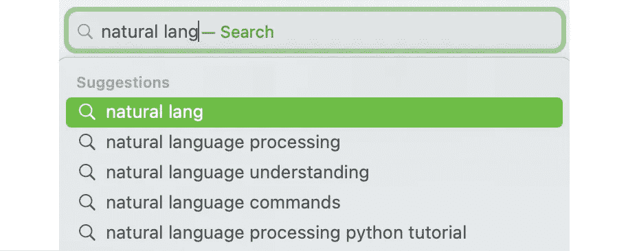
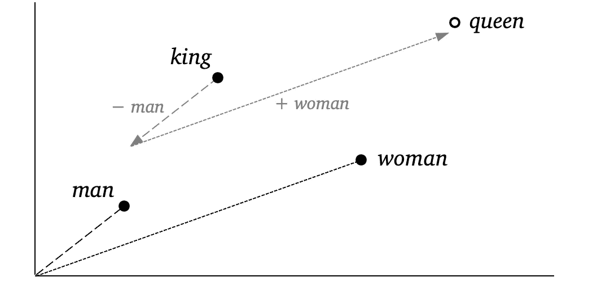

# Word2vec 背后是什么

> 原文：<https://towardsdatascience.com/whats-behind-word2vec-95e3326a833a>

## [](https://towardsdatascience.com/tagged/word-embeddings-primer)

## **单词嵌入的概念和方程概述**

****

**照片由[斯蒂芬·斯坦鲍尔](https://unsplash.com/@usinglight?utm_source=medium&utm_medium=referral)在 [Unsplash](https://unsplash.com?utm_source=medium&utm_medium=referral) 上拍摄**

**自然语言处理(NLP)领域需要语言学、统计学和计算机科学的知识。因此，在没有对你不太熟悉的学科进行大量背景研究的情况下，开始一项新的研究或项目可能会很有挑战性。无缝地跨越这些学科也是一个挑战，因为它们的术语和方程格式不同。**

**我从统计学来到 NLP，想了解文本集合(*语料库*)中的单词如何以向量(*单词嵌入*)的形式转换成可用数据，如下面两个例子所示:**

```
aardvark [  0.7660651 -0.9571466 -0.4889298  ...  -0.1600012 ]
zulu     [ -0.4566793  0.7392789  0.5158788  ...   0.0398366 ]
```

**我想了解什么是真正要测量的，什么是最重要的，以及在向 Word2vec、fastText 和现代语境化单词表示中的算法生成的矢量数据的转换中，什么会受到损害。**

**基本上，*单词嵌入值中的数字真正代表什么*？**

**此外，许多单词有多重含义( *senses* )，所以我特别想知道一个有多重含义但只有一个向量(比如 100 个维度)的单词如何在统计上仍然有效。然后，我希望能够基于 Word2vec 模型编写自己的单词嵌入训练算法，这样我就可以探索特定意义的表示。**

**本文是系列文章的第一篇。它介绍了单词如何通过它们在文本中的接近度相互关联的概念，以及创建单词关系数据背后的理论。在这个系列中，我还将把语言学和计算机科学中的 NLP 概念翻译成统计学的观点。**

**NLP 今天的大部分发展都集中在深度学习人工智能算法上，但任何进入该领域的人都应该对所有的构建模块有清晰的概念把握。**

**本系列的文章包括:**

1.  ****word 2 vec 背后有什么** ( *本文* )
    单词嵌入的思路和方程概要 *(7 分钟阅读)***
2.  **[**单词转化为向量**](https://medium.com/@jongim/words-into-vectors-a7ba23acaf3d)
    单词嵌入概念 *(13 分钟读完)***
3.  **[**统计学习理论**](https://medium.com/@jongim/statistical-learning-theory-26753bdee66e)
    神经网络基础 *(14 分钟读取)***
4.  **[**word 2 vec 分类器**](https://medium.com/@jongim/the-word2vec-classifier-5656b04143da)
    如何训练单词嵌入 *(15 分钟读取)***
5.  **[**word 2 vec 超参数**](https://medium.com/@jongim/the-word2vec-hyperparameters-e7b3be0d0c74)
    一套创意重新加权 *(6 min 读取)***
6.  **[**词语嵌入的特点**](https://medium.com/@jongim/characteristics-of-word-embeddings-59d8978b5c02)
    以及反义词的问题 *(11 分钟读完)***

**在我们深入研究 NLP 和单词嵌入之前，让我们简要地看一下导致 Word2vec 产生的背景。我们将关注 Word2vec，因为它普及了今天使用的单词嵌入类型。**

# ****作为单词定义基础的单词邻近度****

**计算语言模型的基本应用之一是预测句子中的单词，例如，在搜索引擎和消息应用程序的自动完成功能中:**

****

**(图片由作者提供)**

**这种模型可以是通过将大型文本语料库中的所有单词序列制成表格来概率性地预测每个单词的出现的语言模型，但是从实现的角度来看，由于数据量大，处理和存储所有这些信息是不切实际的。例如，即使是简单的数据集合的大小，例如单词对在一组文档中的每个文档中一起出现的频率的*同现矩阵*，也将是唯一单词总数的平方，可能是几十万个单词的平方。**

**单词嵌入是使用向量来表示单词，有助于减少这些计算挑战。单词嵌入不是存储所有文档中所有单词的所有信息，而是利用创造性的数据处理和统计降维技术来近似单词之间的关系。**

**这些现代的机器学习单词嵌入的一个有趣的特性是，当它们应用于语言模型时，它们不仅基于邻近频率预测单词序列，而且在某种程度上预测单词含义。**

**单词嵌入是哲学家路德维希·维特斯坦根的观点的一种体现，即“单词的意义是它在语言中的使用”(维特根斯坦，1953)。1957 年，语言学家约翰·鲁珀特·弗斯把这个概念更具体地表述为:**

> **"从一个人交的朋友，你就可以知道这个人说的话."**

****

**约翰·鲁伯特·弗斯(1890–1960)
(图片来自 n·斯科特的文章(1961)。*亚非学院公报，* [*24* (3)](https://www.cambridge.org/core/journals/bulletin-of-the-school-of-oriental-and-african-studies/issue/4E2968DB58D0225409242A3A37DCFAB7) ，412–418，经允许转载)**

**因此，一个词可以通过它通常出现的词来定义。例如，因为根据上下文,“摇滚”这个词可能会出现在“地球”和“音乐”等词旁边，所以地球和音乐都与摇滚的定义有关。今天，这个概念在语言学中被称为*分布假设*(佩罗尼，2018)。**

> **但是从统计 NLP 的角度来看，更自然的想法是，意义存在于使用单词和话语的上下文的分布中。……在这种概念下，许多统计 NLP 研究直接解决意义问题。”*(曼宁和许策，1999 年)***

**类似于字典仅仅通过单词彼此之间的关系来定义所有单词，单词嵌入矩阵使用数值通过它们在使用中的接近度来定义它的单词。**

# **为什么数据模型开始取代基于规则的模型**

**自然语言处理(NLP)领域的目标是让计算机使用人类语言进行交互。已经采取了许多方法在计算机中实现人类语言，语言学的思想也在依赖复杂的计算机算法中发展。强有力地建立在语言结构、规则和逻辑上的语言模型通常过于处理密集或复杂而不实用，并且在计算上工作良好的快捷方式通常具有明显的语言弱点。**

**统计学在经验主义 NLP 中发挥着突出的作用，不仅仅是在书面和口头语言数据的分析中，而是在机器学习背后的统计学习理论中，机器学习越来越多地应用于分析大型语料库( [Stewart](/the-actual-difference-between-statistics-and-machine-learning-64b49f07ea3) ，2019)。尽管如此，即使在机器学习和人工智能(AI)加速之前，统计 NLP 的价值也很突出。**

> **“统计[NLP]模型是稳健的，概括得很好，并且在存在错误和新数据的情况下表现优雅。”*(曼宁和许策，1999 年)***

# **Word2vec 的首次亮相:是什么让它如此具有变革性**

**2013 年，随着 Mikolov 等人在谷歌发表的两篇介绍 Word2vec 的论文( [Mikolov 等人，2013 a](http://arxiv.org/abs/1301.3781)；[米科洛夫等人，2013 年 b](http://arxiv.org/abs/1310.4546) 。Word2vec 使用一个浅层神经网络来产生单词嵌入，这种嵌入表现得特别好，并具有计算效率大幅提高的额外好处。使用 Word2vec，只需一台个人计算机，就可以从任何语言的相对较大的语料库中创建一组单词向量。Word2vec 的另一个突出特性是观察到单词向量在向量空间中聚集同义词和附近的相关单词。此外，向量似乎有数学属性。例如，通过添加向量值，可以找到计算语言学中的以下著名等式:**

***国王男人+女人≈王后***

**在二维情况下，该等式可能如下所示:**

****

****文字向量数学概念**
(图片由作者提供)**

**这些 Word2vec 向量改进了 NLP 任务的许多应用，并且大量的研究随之而来，以研究神经网络单词嵌入的属性和含义。通过这项研究产生的想法最终导致了更强大的具有上下文敏感嵌入的人工智能模型(如 AllenNLP [ELMo](http://allennlp.org/elmo) ，OpenAI 的 [GPT](http://arxiv.org/abs/2005.14165) ，以及谷歌的 [BERT](http://arxiv.org/abs/1810.04805) )。**

# **摘要**

**在本文中，我们学习了语言学理论，即使用中的单词邻近性与单词含义有关，并且自然语言的规则可能不切实际。我们还了解到，使用单词邻近度来创建单词向量可以产生具有有用属性的可管理数据集。**

**在下一篇文章 [**单词到向量**](https://medium.com/@jongim/words-into-vectors-a7ba23acaf3d) 中，我们将回顾创建单词嵌入背后的基本概念。**

**这篇文章是 1ˢᵗ系列文章**中关于单词嵌入的初级读本:** 1。Word2vec | 2 背后的东西。[单词成向量](https://medium.com/@jongim/words-into-vectors-a7ba23acaf3d) |
3。[统计学习理论](https://medium.com/@jongim/statistical-learning-theory-26753bdee66e) | 4。[word 2 vec 分类器](https://medium.com/@jongim/the-word2vec-classifier-5656b04143da) |
5。[word 2 vec 超参数](https://medium.com/@jongim/the-word2vec-hyperparameters-e7b3be0d0c74) | 6。[单词嵌入的特征](https://medium.com/@jongim/characteristics-of-word-embeddings-59d8978b5c02)**

**关于这个主题的更多信息:对于本系列的每一篇文章，我将推荐一个关键参考资料，以获得关于这个主题的更多信息。对于这篇文章，你可能会特别喜欢:佩罗尼，C. S. (2018)。[自然语言处理的词语表述和维特根斯坦的语言哲学](http://blog.christianperone.com/2018/05/nlp-word-representations-and-the-wittgenstein-philosophy-of-language/)。*未知领域*。**

# **参考**

**弗斯，J. R. (1957)。语言学理论概要，1930-1955。在弗斯(编辑)，*语言分析研究*，语言学会特刊，第 1-32 页。英国牛津:巴兹尔·布莱克威尔出版社。**

**曼宁和舒策(1999 年)。*统计自然语言处理基础*。麻省剑桥:麻省理工学院出版社。**

**Mikolov、Corrado、G . Chen、k .和 j . Dean(2013 年 a)。向量空间中单词表示的有效估计。可从 [arXiv:1301:3781v3](https://arxiv.org/abs/1301.3781) 获得。**

**Mikolov、Corrado、G . Chen、k . Sutskever 和 j . Dean(2013 年 b)。词和短语的分布式表示及其组合性。可从 [arXiv:1310.4546v1](https://arxiv.org/abs/1310.4546) 获得。**

**南卡罗来纳州佩罗尼(2018 年)。[自然语言处理的词语表述和维特根斯坦的语言哲学](http://blog.christianperone.com/2018/05/nlp-word-representations-and-the-wittgenstein-philosophy-of-language/)。*未知领域*。**

**斯图尔特，M. (2019)。[统计和机器学习的实际区别](/the-actual-difference-between-statistics-and-machine-learning-64b49f07ea3)。*走向数据科学*。**

**维特根斯坦，L. (1953)。*哲学研究*。英国牛津:巴兹尔·布莱克威尔出版社。**

***除非另有说明，数字和图像均由作者提供。**