# 🤗抱脸是什么？

> 原文：<https://towardsdatascience.com/whats-hugging-face-122f4e7eb11a>

## 不，不仅仅是你手机上可爱的表情符号

照片由[汉娜·布斯](https://unsplash.com/@hannahbusing?utm_source=unsplash&utm_medium=referral&utm_content=creditCopyText)在 [Unsplash](https://unsplash.com/s/photos/community?utm_source=unsplash&utm_medium=referral&utm_content=creditCopyText) 上拍摄

# TL；速度三角形定位法(dead reckoning)

拥抱脸是一个社区和数据科学平台，提供:

*   使用户能够基于开源(OS)代码和技术构建、训练和部署 ML 模型的工具。
*   一个广泛的数据科学家、研究人员和 ML 工程师可以聚集在一起分享想法、获得支持并为开源项目做出贡献的地方。

# 🔥通过社区推进人工智能

随着最近向混合和灵活工作实践的转变，我们开始见证更多工具的使用和采用，这些工具使数据科学团队、专家和爱好者能够远程协作。

事实上，当谈到人工智能的进步时，操作系统社区变得越来越重要。没有一家公司，即使是“科技巨头”也无法独自“解决人工智能”——共享知识和资源来加速和推动未来的发展！

拥抱脸通过提供一个社区“枢纽”来满足这种需求。这是一个任何人都可以共享和探索模型和数据集的中心。他们希望成为一个拥有最大模型和数据集集合的地方，目标是为所有人民主化人工智能。

# 🚀入门->您的存储库

当你注册成为拥抱脸的一员时，你会得到一个基于 Git 的托管库，你可以在那里存储:模型、数据集和空间。我们将在这一部分的后面更深入地探讨这些问题。

现在，让我们开始行动吧！

注册成为社区个人贡献者是免费的。组织有一个“专业”计划和单独的[定价模型](https://huggingface.co/pricing)。

我注册了，在这个过程中，你还可以链接到一个主页、Github 和 Twitter 账户，如下所示:

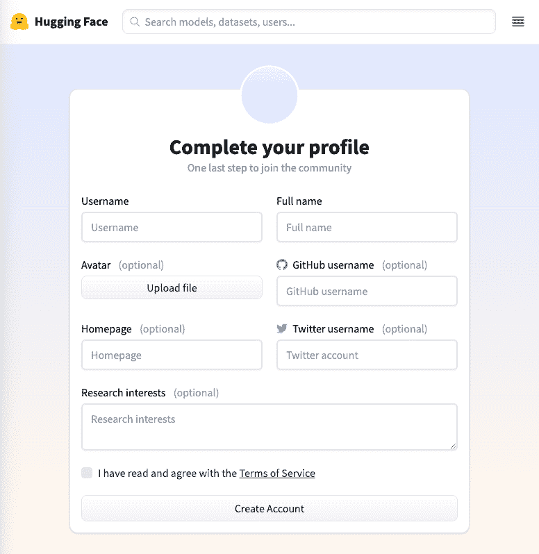

*图 1:拥抱脸，社区账号注册表单*

一旦您创建了一个帐户，您将被重定向到您的个人存储库。在此页面中，您可以执行许多操作，包括:

*   查看您的活动订阅源
*   查看您的个人资料和设置
*   创建新的模型、数据集或空间
*   查看拥抱脸社区当前的趋势
*   查看您所属组织的列表，并跳转到各自的区域
*   利用有用的资源和文档

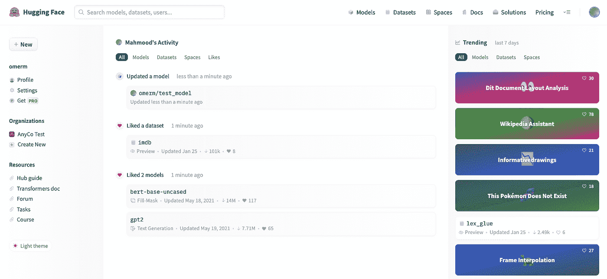

*图 2:拥抱脸，用户档案/存储库*

存储库的中心是您的活动提要，当您开始创建(或喜欢)模型、数据集和空间时，它会被填充。

现在我们已经开始运行了，让我们更深入地了解一下…

## **型号**

当你创建一个新的“模型”时，它实际上是一个与你想要共享的 ML 模型相关的文件的 Git repo。它拥有你所期望的所有好处，比如版本控制、分支、可发现性等等。

**💡我将在本节中描述的步骤(包括数据集和空间)都可以通过命令行使用** [**Hub API 端点**](https://huggingface.co/docs/hub/endpoints) **以编程方式实现。**

单击 Hub 中的“+ New”按钮，然后选择“Model ”,会将您带到一个对话框，您可以在其中指定名称和操作系统许可证的类型，您将根据该许可证贡献您的模型代码和相关资产。

您还可以控制您的模型的可见性，即将其公开，并使其对 Hugging Face 社区可见，或者在您的个人存储库或组织中保持其私密性。

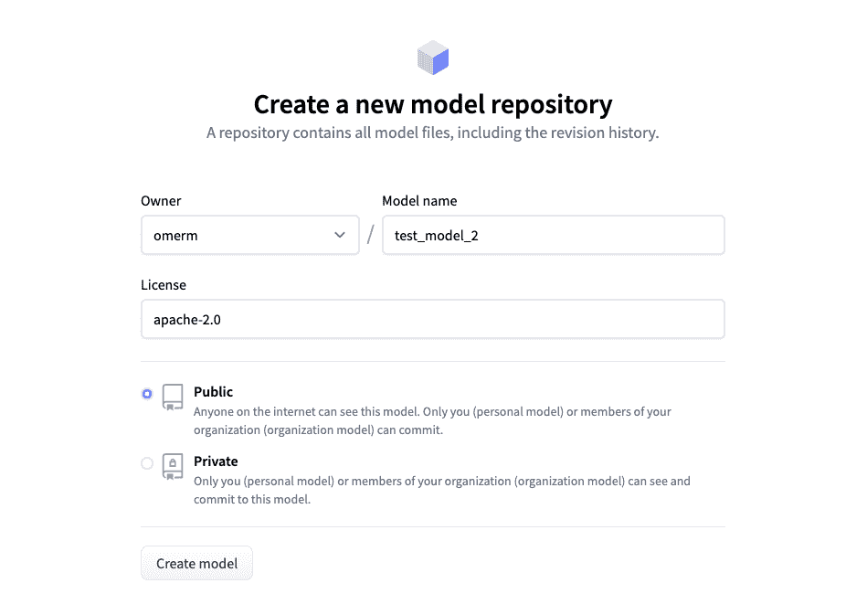

*图 3:拥抱脸，创建一个新的模型库*

创建模型后，您将进入存储库视图，默认情况下会选择“模型卡”选项卡:

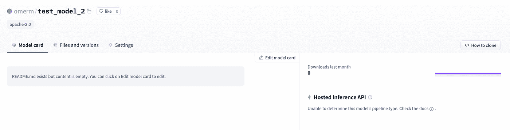

*图 4:拥抱脸，新模型库，模型卡*

对于普通的 Git 用户来说,“文件和版本”选项卡会很熟悉:

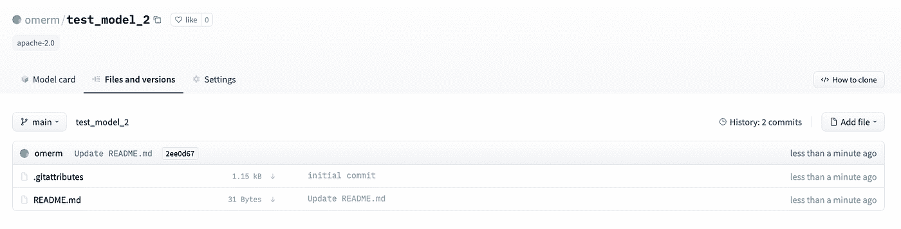

*图 5:拥抱脸，新模型库，文件和版本*

我的模型库目前是空的，但下面的截图显示了一个完全填充的模型卡对拥抱脸社区模型的要求:

*图 6:拥抱脸、Bert 基本模型(未封装)、模型卡*

**有几个不同的元素需要强调:**

1.  在顶部我们有模型名称，喜欢和紧接在与模型相关的标签之下。例如框架、模型类型和其他属性。
2.  模型卡的主体可用于给出模型的概述、如何使用它的代码片段、约束和任何其他相关信息。此项目的内容是通过用正确的标记填充模型库中的 README.md 文件来确定的。
3.  你可以训练模型来微调它，甚至通过指向一个 [AWS SageMaker](https://aws.amazon.com/pm/sagemaker/?trk=0d22a20b-6e4c-43a2-ba4b-16f68cde65b7&sc_channel=ps&sc_campaign=acquisition&sc_medium=ACQ-P%7CPS-GO%7CBrand%7CDesktop%7CSU%7CMachine%20Learning%7CSagemaker%7CGB%7CEN%7CText&s_kwcid=AL!4422!3!532556384303!e!!g!!aws%20sage%20maker&ef_id=Cj0KCQjw_4-SBhCgARIsAAlegrUxeNcb4-gSh-tBBtBUOmfFtZzkGxG1v4_MtS5h93Ch_yi2YYOZ0V0aAnjVEALw_wcB:G:s&s_kwcid=AL!4422!3!532556384303!e!!g!!aws%20sage%20maker) 实例，或者拥抱 Face 自己的 [Infinity](https://huggingface.co/infinity) 容器化基础设施来部署它。如果你想在你自己的代码中使用这个模型，'< / > Use…'将会弹出一个代码片段，告诉你如何基于用来构建这个模型的框架来导入它。另一个非常好的特性是 Hosted inference API，它允许您显示一个小部件，让用户将样本值传递给模型来测试其输出。托管推理 API 小部件由模型文件中包含的元数据决定。
4.  最后，您还可以看到关于哪些数据集用于训练模型以及使用模型的空间的元数据。

**💡拥有一个详细的模型卡是很重要的，因为它可以帮助用户理解何时以及如何应用你的模型。**

## **数据集**

创建新数据集的流程与创建新模型的流程非常相似。点击中心的“+新建”按钮，然后选择“数据集”。您可以指定名称、许可证类型、公共或私人访问。然后您会看到一个存储库视图，带有“数据集卡片”、“文件和版本”，类似于模型库中的内容。

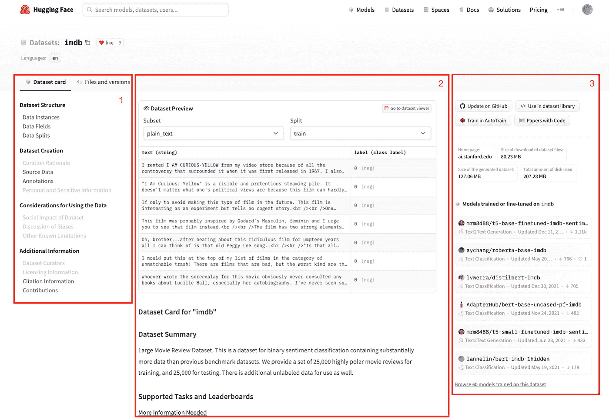

*图 7:拥抱脸、imdb 数据集、数据集卡片*

**再次调用关键元素:**

1.  除了数据集标题、喜欢和标签，您还可以获得一个目录，这样您就可以跳到数据集卡片主体中的相关部分。
2.  数据集卡的主体可以配置为包含嵌入式数据集预览。这非常方便，因为它显示了特性、数据分割和子集(如果有的话)。这些项目和先前项目的内容是通过用正确的标记填充数据集存储库中的 README.md 文件来确定的。
3.  最后，您可以快速链接到 GitHub repo，以及通过 Hugging Face python 数据集库使用数据集的代码片段。还有进一步的元数据，如数据集的来源、大小以及拥抱脸社区中的哪些模型已经在数据集上进行了训练。

## **空格**

共享空间给你一个地方来展示你的工作，在自我包含的 ML 演示应用程序的形式。如果你正在寻找灵感，有许多社区贡献的空间可供你查看。

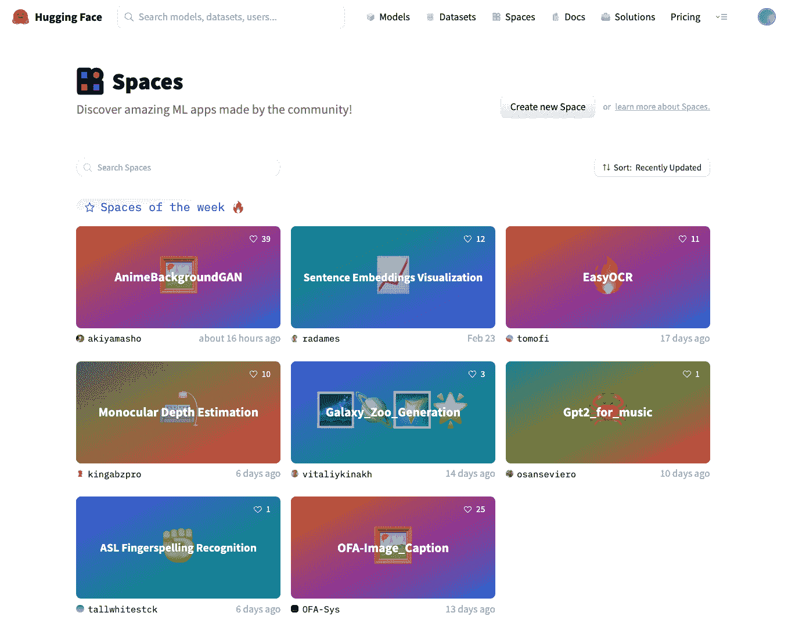

*图 8:拥抱脸，社区空间*

这是一个很好的方式来建立一个项目组合，可以在演示时使用，与组织中的同事或更广泛的 ML 生态系统协作。

要开始，请单击中心的“+新建”按钮，然后选择“空间”。这将把您带到一个对话框，您可以在其中指定空间的名称和许可证类型。

您还需要选择一个 SDK。在撰写本文时，你可以从两个基于 Python 的应用托管框架中挑选: [Gradio](https://gradio.app/) 或 [Streamlit](https://streamlit.io/) 。或者，你可以只使用自定义的 HTML。

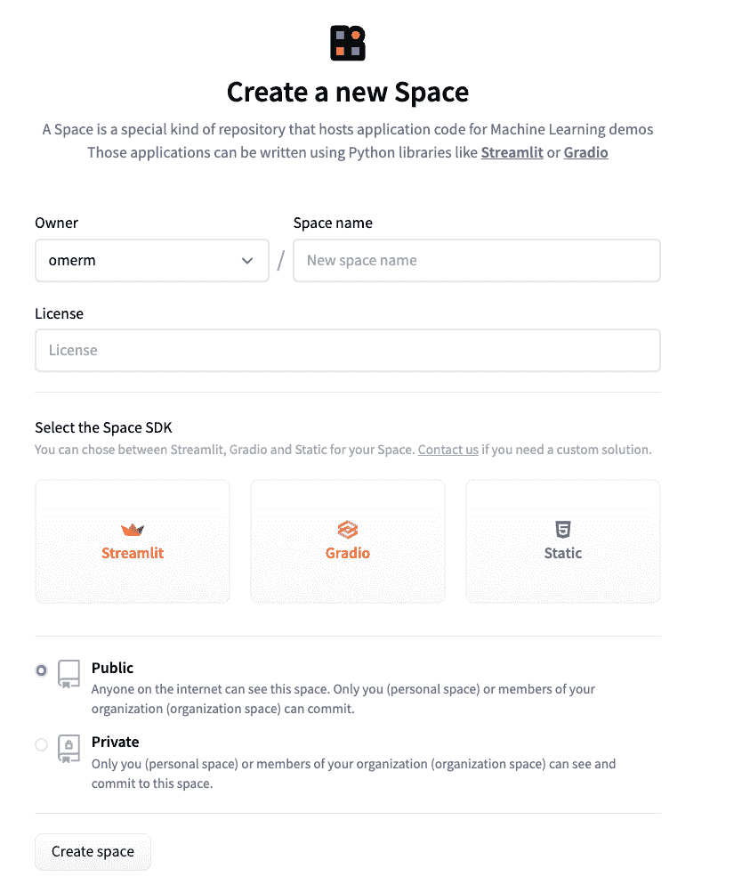

*图 9:拥抱脸，创建一个新的模型库*

与创建新模型或数据集时一样，一旦创建，您将被定向到空间存储库。应用程序卡是您的演示出现的地方。

为了方便起见，我只选择了自定义 HTML 选项，并通过“文件和版本”选项卡编辑了 index.html 文件。但是您可以在这里嵌入任何东西，包括 iFrame 中的内容。

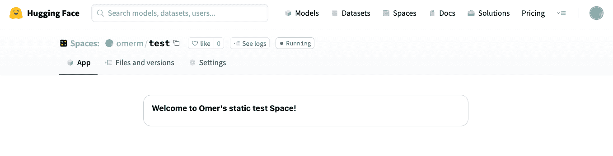

*图 10:拥抱脸、空间、App 卡*

创建共享空间并返回到您的个人资料后，您会看到它出现在您的活动订阅源中，并准备好与世界共享！

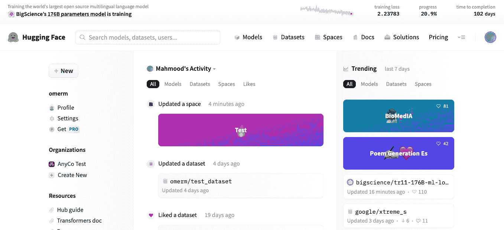

*图 11:拥抱脸，具有更新空间的用户简档/存储库*

# 🏄🏽‍♂️探索社区

## **社区模式**

在你的个人(或组织)存储库之外，你还可以探索拥抱脸社区贡献的所有数万个模型、数据集和空间。

您可以从位于网页顶部的顶级导航菜单中访问它们。

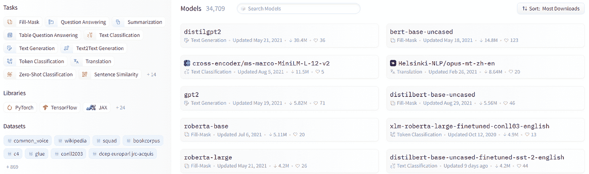

*图 12:拥抱脸，社区模特*

社区资源库中的模型的大致⅔已经在 PyTorch 中构建，但是 TensorFlow 和其他常见 ML 库中的每个主要任务通常都有替代方案。

每个模型都有一个模型卡，如上面的模型部分所示，带有作者提供的关键信息，以及一个托管的推理 API 来查看模型的样本输入和输出。在“文件和版本”选项卡中，有一个存储库视图中所有文件的列表，以及一个包含以前模型运行和保存以供参考的文件夹。

## **任务**

现在你可以花大量的时间在众多不同的社区模型中搜寻，试图找到一个可以帮助解决你正在努力解决的挑战的模型。

相反，拥抱脸通过提供模型的精选视图为你节省了麻烦，这取决于你试图使用人工智能处理的任务。

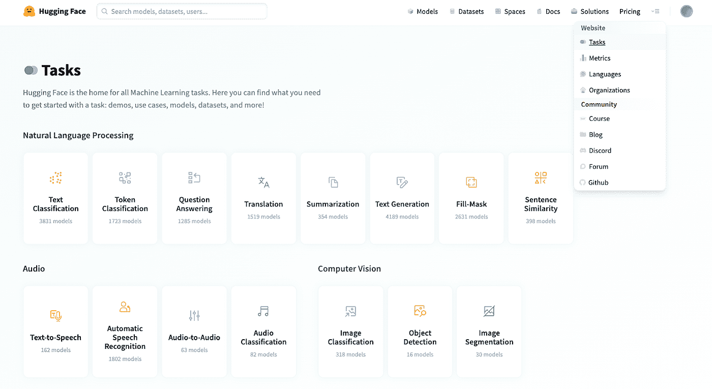

*图 13:拥抱脸、顶层导航和任务页面*

拥抱脸的大多数社区贡献都属于 NLP ( [自然语言处理](https://en.wikipedia.org/wiki/Natural_language_processing))模型的范畴。但是你也可以找到与音频和计算机视觉模型任务相关的模型。

每项任务的文档都以直观的方式进行了解释。除了图表，每个解释都附有一个 youtube 视频短片，以及使用推理 API 和链接社区制作的模型的演示链接。

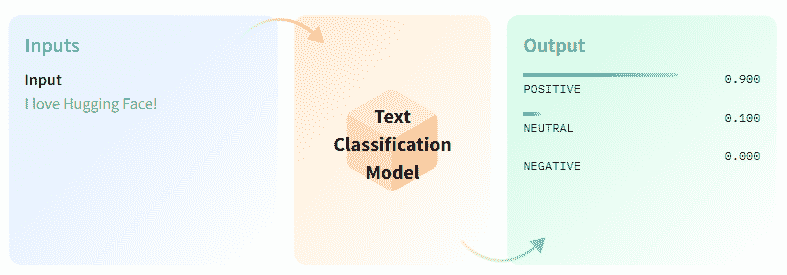

*图 14:拥抱脸、任务、文本分类文档*

还有对可能的用例以及任务变体的描述。许多任务描述页面将包括笔记本和培训脚本，以帮助入门。这些脚本涵盖了从设置和加载数据集到预处理(使用令牌化器)、模型比较和微调(使用训练器 API)的端到端流程。

# 📔把这一切都结合在一起！

在这最后一节中，我们将看看如何通过[变形金刚](https://huggingface.co/docs/transformers/index)、训练器和推理 API 以及 Python 笔记本来开始使用拥抱脸。

使用 Hugging Face 工具的一个主要优势是，您可以减少从头创建和训练模型的训练时间、资源和环境影响。通过微调现有的预训练模型，而不是从头开始训练，您可以在更短的时间内从数据到预测。

## 1.同步和认证

通过将您的笔记本与拥抱脸中心同步，拥抱脸鼓励并使您可以轻松地与拥抱脸社区的其他人分享您的制作或微调。如果您使用可以在您的用户资料的“[访问令牌](https://huggingface.co/settings/tokens)部分生成的令牌登录，它会将您的模型与网站同步。

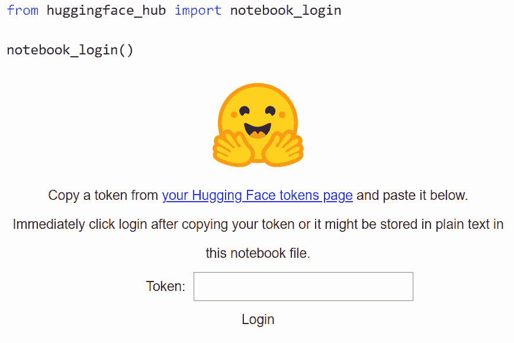

*图 15:拥抱脸、笔记本、认证*

**🧐注意——这里我们使用一个样板**[**cola batory**](https://colab.research.google.com)**环境，但是高级选项允许在 Amazon SageMaker 和 AutoNLP 中进行直接培训，以及多种部署方法，包括拥抱 Face 自己的 Infinity。**

## 2.数据准备

如前所述，[拥抱脸 Github](https://github.com/huggingface) 提供了一个很好的数据集选择，如果你正在寻找一些东西来测试或微调一个模型。

在这里，我们试驾拥抱脸自己的模型 [DistilBERT](https://huggingface.co/docs/transformers/model_doc/distilbert) 来微调一个问答模型。

一旦安装并导入了必要的库，我们就可以使用 Datasets 库在一行中加载数据集。拥抱脸数据集通常以 Pyarrow 格式构建，但是也可以导入 JSON 或 CSV 文件。

*图 16:抱脸，笔记本，加载数据集*

接下来，我们预处理训练数据。Transformers AutoTokenizer 功能用于简化流程。更好的是，许多记号赋予器是由 Rust 支持的“快速”记号赋予器，以实现更高效的处理。

样板文件 Colab 向用户展示了如何截断长文档，以及如何在标记时考虑上下文分割。拥抱脸还提供了工具，通过使用偏移映射来帮助将令牌映射回原始数据上下文。

有一个数据集的 map 方法可以将标记化应用于整个数据集。

*图 17:拥抱脸、笔记本、数据集准备*

## 3.根据您的需求微调模型

一旦数据集准备好了，我们就可以微调模型了。作为 transformers 库的一部分，有一个 AutoModelForQuestionAnswering 类，它是从模型检查点预先训练的。然后，我们需要做的就是定义 PyTorch 模型的训练参数，并将其传递给训练器 API。

*图 18:抱脸、笔记本、模特训练参数*

可以轻松设置超参数，以匹配您想要的结果/环境。

## 4.培训定制模型

以下代码行是您开始模型训练过程所需要的全部内容。

`trainer.train()`

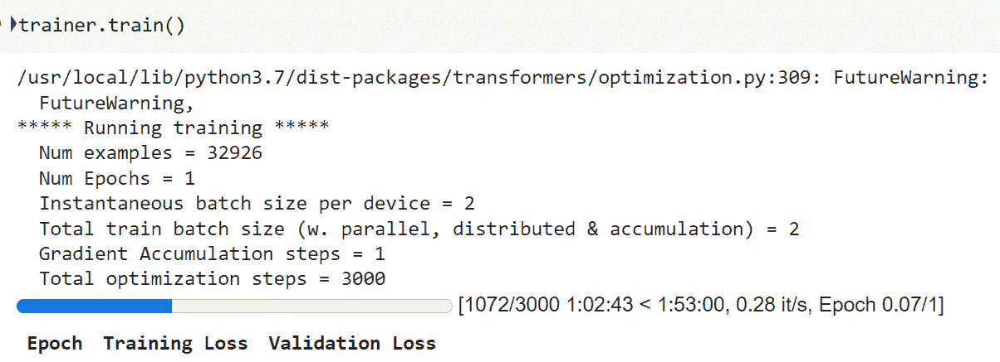

*图 19:抱脸、笔记本、模特训练*

## 5.模型输出

模型运行后，可以使用一行代码将它与教练 API 同步回中心:

`trainer.push_to_hub()`

样板 Colab 文档还包括一个模板，用于创建预测并将其后处理成有意义的输出。

一旦上传，你的模型卡将看起来像下面的截图，然后可以通过编辑进一步定制。

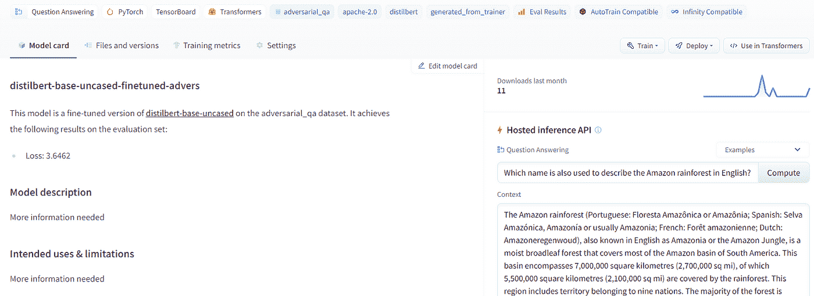

*图 20:抱脸定制款*

然后，您可以在 Hugging Face 网站上使用托管推理 API 在自动生成的模型页面上运行预测，或者将模型检查点加载到 Python 中，以开始基于微调后的模型进行预测。

另一个很酷的功能是，如果模型是在 TensorFlow 中创建的，您可以在 Tensorboard 中查看训练指标和模型指标。

现在，我们简要概述了什么是拥抱脸，如何开始共享模型和数据集，在社区中导航，以及如何在您自己的用例中重用现有的社区模型。

**👏特别感谢我的兄弟** [**塔希尔·马哈茂德**](https://www.linkedin.com/in/tahir-m-cfa/) **此贴的合著者！**

# 📚延伸阅读和有用的资源

*   课程[https://huggingface.co/course/chapter0/1?fw=pt](https://huggingface.co/course/chapter0/1?fw=pt)
*   交互式 API 市场[https://huggingface.co/models?pipeline _ tag =零次分类&排序=下载](https://huggingface.co/models?pipeline_tag=zero-shot-classification&sort=downloads)
*   代码库、示例和数据[https://github.com/huggingface/transformers](https://github.com/huggingface/transformers)