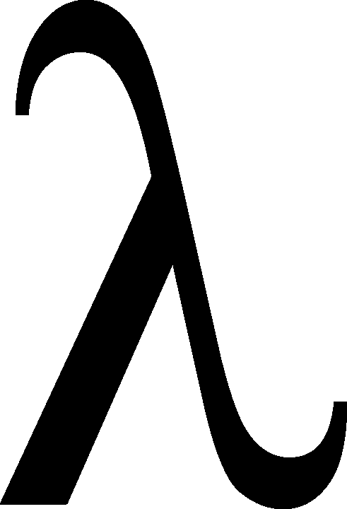

# λ里有什么？—第二部分

> 原文：<https://towardsdatascience.com/whats-in-a-lambda-part-2-6dc2fa89d2d1>

## 既然您已经学习了 Python 中的 lambda 函数，我将介绍一个数据处理示例。



照片由[在](https://pixabay.com/users/openicons-28911/)[图片栏](https://pixabay.com/)上打开图标

这是我之前的文章[的后续，Lambda 中有什么？一定要先查看一下——由于原文的受欢迎程度，我决定写这篇后续文章。在那篇文章中，我提到了 lambda 函数可以用于通过各种 Pandas 操作快速转换数据。在本文中，我将通过几个完整的例子来说明如何做到这一点。](/whats-in-a-lambda-c8cdc67ff107)

上次，我详细解释了 lambda 函数的语法。我不会在这里重复所有的细节，但在我们进入数据之前，我会给出一个更复杂的 lambda 的例子。

假设您有下面的函数，它将一个数字列表中的所有元素进行平方:

```
def square_list(nums):
     squared_list = []
     for item in nums:
          squared_list.append(item * item)
     return squared_list
```

有没有可能把这个相当复杂的过程翻译成一个 lambda 函数？当然可以！我们简单地使用相同的语法，并利用我们的好朋友，列表理解:

```
square_list = lambda nums : [item * item for item in nums]
```

瞧啊。我们已经把我们的函数简洁地浓缩成一行可读的代码。快速复习一下:我们的参数`nums`在冒号的左边，我们的返回值(构建一个新的平方列表的整个列表理解)在冒号的右边，我们通过变量赋值语法给函数命名为`square_list`。

现在我们已经解决了这个问题，让我们看一个将 lambdas 应用于熊猫数据处理的具体例子。假设您有以下名为`my_df`的数据框架，其中包含一些关于您的雇主希望您更深入分析的数据的汇总统计数据:

```
 mean   median       standard deviation
0    22      23                 1.7
1    33      25                 2.8
2    44      40                 4.9
3    55      55                 2.0
4    66      78                 1.0
```

当您浏览这个时，您意识到您想要对`standard deviation`列求平方，这样您就可以轻松地测量各自的方差。对于 lambdas，这是一个单行作业:

```
>>> my_df['standard deviation'] = my_df['standard deviation'].apply(lambda x : x * x)
>>> my_df
    mean   median       standard deviation
0    22      23                2.89
1    33      25                7.84
2    44      40               24.01
3    55      55                4.00
4    66      78                1.00
```

上面到底发生了什么？嗯，`.apply()`函数接收一些函数，并将其应用于所选列中的每个单独的值。这里，因为我们的 lambda 函数对单个值求平方，所以我们有效地对每一行的标准偏差值求平方，并将该列重新分配给新值。您可能还应该快速地将该列重命名为“variance ”,尽管我在这里没有提到它。

接下来，假设您想要将`mean`列转换为具有浮点值，但是您无论如何也记不起执行该操作的函数(提示:它是`my_df[‘mean’].astype(float)`)。而且，和往常一样，你懒得去查(或者可能你就是没有互联网连接)。兰达斯再次出手相救:

```
>>> my_df['mean'] = my_df['mean'].apply(lambda x : float(x))
>>> my_df
   mean    median       standard deviation
0  22.0      23                2.89
1  33.0      25                7.84
2  44.0      40               24.01
3  55.0      55                4.00
4  66.0      78                1.00
```

此时，您可能想知道 lambdas 的唯一潜在用途是不是与`.apply()`函数一起使用。答案是否定的。为了探索另一个更复杂的用例，我们将使用下面的数据框架，它由两个学生在各种作业中的成绩组成:

```
 name    letter grade  score
0   Kayla            A     92
1   Kayla            A     94
2   Kayla            A     97
3   Kayla            B     81
4   Kayla            B     83
5   Kayla            B     85
6    Arif            A     93
7    Arif            B     86
8    Arif            A     99
9    Arif            B     80
10   Arif            A     94
11   Arif            B     88
```

这学期快结束了，我们想完成一些事情。首先，我们希望以更清晰的格式存储数据，这样我们可以更容易地看到两个学生的成绩。此外，我们希望看到每个学生每个字母等级的平均分。然而，有一个小小的警告:根据教学大纲，每个学生每降低一个字母的分数就会得到他们的最低分，所以我们只想把最高的两个分数作为平均分数。这让事情变得有点复杂，因为我们不能只使用内置的`mean()`函数。

好吧，那就很多了。它的美妙之处？结合使用 lambda 函数和`[pandas.pivot_table](https://pandas.pydata.org/docs/reference/api/pandas.pivot_table.html)`函数，我们可以在一行代码中完成我们的任务:

```
>>> grades_df.pivot_table(index='name', columns='letter grade', values='score', aggfunc = lambda series : (sorted(list(series))[-1] + sorted(list(series))[-2]) / 2)letter grade     A     B
name
Arif          96.5  87.0
Kayla         95.5  84.0
```

这里有很多东西需要打开；让我们一步一步来:

*   首先，我们说我们想要创建一个数据透视表，将`index`设置为`'name'`，将`columns`设置为`'letter grade'`。这意味着我们希望数据透视表的每一行都是学生的名字，每一列都是字母等级。
*   接下来，我们将参数`values`设置为`'score'`。这意味着我们将查看数据透视表中`'name'`和`'letter grade'`的每个组合的`'score'`值。例如，对于组合`'Arif'`和`'A'`，值是由值`(93, 99, 94)`组成的熊猫序列，因为这些都是对应于原始数据帧中包含`'Arif'`和`'A'`的行的分数。
*   最后，参数`aggfunc`是我们的 lambda 函数发挥作用的地方。对于我们在上面的项目符号中创建的每个组合系列，`aggfunc`告诉 Pandas 我们希望如何将这些值聚合成一个值，该值实际上被放置在相应的 DataFrame 条目中。我们想要前两个分数的平均值。因此，我们的 lambda 函数接受一系列值，对其进行排序，取前两个值(使用[否定列表索引](https://stackoverflow.com/questions/11367902/negative-list-index))，并对它们进行平均。具体看一下`'Arif'`和`'A'`的例子，我们可以看到，从系列`(93, 99, 94)`中，我们取`99`和`94`的平均值，得出`96.5`——我们在数据透视表中看到的最终值。其他四个条目以相同的方式计算。

就我个人而言，我觉得大熊猫能在一条直线上完成所有这些令人印象深刻。也就是说，这是一个教学示例，说明 lambda 函数在 Pandas 中的使用，并不一定包含所有情况下最有效的解决方案。虽然在这个例子中对小列表来说没什么大不了的，但是像我们在 lambda 函数中所做的那样，对一个大得多的列表进行两次排序是很低效的。在这种情况下，最好定义一个只需要排序一次的传统多行函数。

在这里，我选择将简单的代码放在可以忽略的时间改进之上。像往常一样，您应该在您的特定用例中测量数据，并相应地决定解决问题的方法。

## 最后的想法

虽然我在本文中只说明了两种情况，但是 Pandas 包含了无数的操作，这些操作接受可选的函数，这些函数可以作为 lambdas 传入。我希望上面的详细介绍能够让您更好地理解在进行这种数据处理时如何应用 lambda 函数的知识。永远记住最终目标——更干净、更 Pythonic 化的代码。如果你记住这一点，你就成功了。

下次见，伙计们！

**想擅长 Python？** [**获取独家、免费获取我简单易懂的指南点击**](https://witty-speaker-6901.ck.page/0977670a91) **。想在介质上无限阅读故事？用我下面的推荐链接注册！**

<https://murtaza5152-ali.medium.com/?source=entity_driven_subscription-607fa603b7ce--------------------------------------->  

*我叫穆尔塔扎·阿里，是华盛顿大学研究人机交互的博士生。我喜欢写关于教育、编程、生活以及偶尔的随想。*