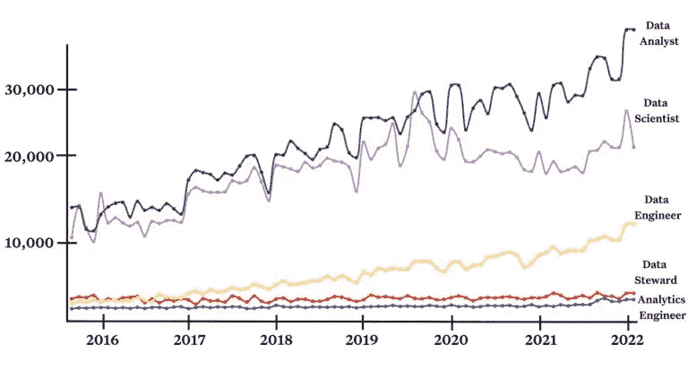
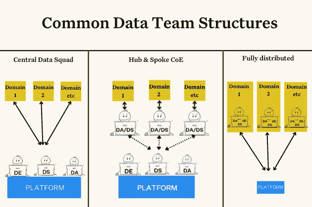
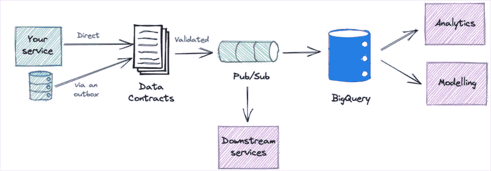
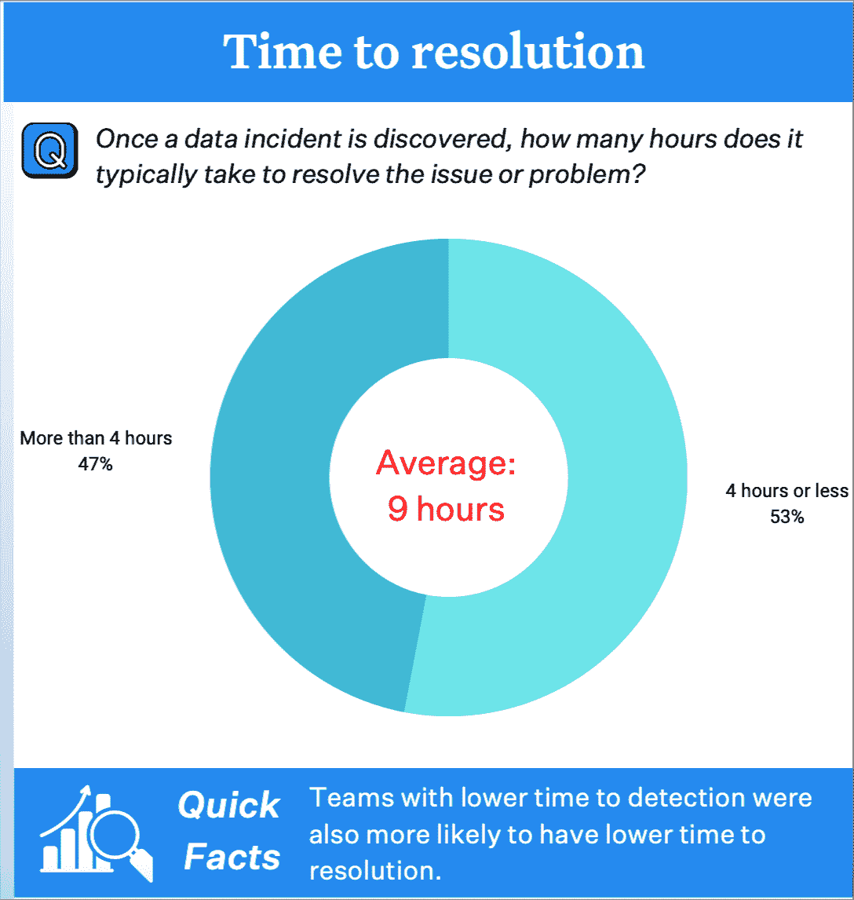

# 2023 年数据工程的下一步是什么？7 个预测

> 原文：<https://towardsdatascience.com/whats-next-for-data-engineering-in-2023-7-predictions-b57e3c1bf2d3>

一段时间内数据角色的搜索量。图片由蒙特卡洛提供，使用来自 ahrefs 的数据。

## 数据工程的未来会是怎样的？在这篇文章中，我分享了我对 2023 年及以后的一些预测。

年终预测文章是做作的，但它们是有目的的。它们帮助我们从日常琐事中解脱出来，考虑长期投资的方向。

当我们试图描绘一个正在向多个方向快速发展的行业的连贯的“大画面”时，它们也往往是一种谦逊的练习。我鼓励任何人去寻找一个需要从业者跟上时代的行业。

随着数据组织根据迫在眉睫的衰退评估并重新评估他们的优先事项，这些可能的方向具有了更多的意义，您的数据工程投资可以决定或破坏您公司保持敏捷、创新和竞争力的能力。

好消息是什么？需要是发明之母，我预测 2023 年将是帮助团队在[数据操作](https://www.montecarlodata.com/blog-dataops-and-the-future-of-the-modern-data-stack/)上节省时间、收入和资源的技术的辉煌一年，这样工程师就可以专注于构建、扩展和以更少的资源做更多的事情。

以下是我对明年一些最重要趋势的预测(排名不分先后)。

# 预测 1:数据工程团队将在 FinOps /数据云成本优化上花费更多时间

随着越来越多的数据工作负载转移到云，我预见数据将成为公司支出的更大部分，并且**将受到财务部门的更多审查。**

众所周知，宏观经济环境正开始从一个快速增长和获取收入的时期转变为一个更加注重优化运营和盈利能力的时期。我们看到越来越多的财务官在与数据团队的交易中扮演越来越重要的角色，因此这种合作关系也将包括经常性成本。

数据团队将仍然需要主要通过作为其他团队效率的力量倍增器和通过数据货币化增加收入来增加业务价值，**但是成本优化将成为越来越重要的第三条途径。**

这是一个最佳实践仍处于萌芽状态的领域，因为数据工程团队一直专注于速度和敏捷性，以满足对他们的特殊要求。他们的大部分时间都花在编写新的查询或传输更多数据上，而不是优化繁重/恶化的查询。

**数据云成本优化也符合数据仓库和 lakehouse 供应商的最大利益。**是的，他们当然希望消费增加，但浪费会造成流失。他们更愿意鼓励从高级用例中增加消费，如创造客户价值的数据应用，从而增加保留率。他们短期内不会参与其中。

这就是为什么你会看到拥有成本成为讨论的一个更大的部分，正如我在最近与 Databricks 首席执行官 Ali Ghodsi 的一次会议上的谈话中所说的那样。你还会看到所有其他主要参与者——big query、RedShift、snow flake——围绕突出了最佳实践和[特性](https://docs.snowflake.com/en/user-guide/warehouses-overview.html#auto-suspension-and-auto-resumption) [。](https://cloud.google.com/bigquery/docs/best-practices-performance-compute)

花费时间的增加可能来自额外的员工人数，这将更直接地与投资回报率挂钩，并且随着招聘受到越来越多的审查，这也更容易证明是合理的(FinOps foundation 的一项[调查预测，FinOps 专门员工的平均增长为 5 到 7 人)。随着数据团队的现有成员采用更多的流程和技术来提高数据可靠性等其他领域的效率，他们的时间分配也可能会发生变化。](https://data.finops.org/)

# 预测#2:数据团队角色将进一步专业化

目前，数据团队角色主要根据数据处理阶段进行划分:

*   数据工程师通过管道输入数据，
*   分析工程师清理干净，然后
*   数据分析师/科学家对其进行可视化并从中收集见解。

这些角色不会消失，但我认为会根据业务价值或目标进行进一步细分:

*   数据可靠性工程师将确保数据质量
*   数据产品经理将推动采用和货币化
*   DataOps 工程师将专注于治理和效率
*   数据架构师将专注于消除孤岛和长期投资

这将反映出我们的姐妹领域软件工程，其中软件工程师的头衔开始分裂成子领域，如 DevOps 工程师或站点可靠性工程师。随着职业开始成熟，变得更加复杂，这是一种自然的进化。

# 预测#3:数据变得更加复杂，但中央数据平台依然存在

图片由蒙特卡洛提供。

Zhamak Dehgani 最初概述的预测数据团队将继续向[数据网格](https://www.montecarlodata.com/blog-what-is-a-data-mesh-and-how-not-to-mesh-it-up/)过渡并不一定是一个大胆的赌注。几年来，数据网格一直是数据团队中最热门的概念之一。

然而，我看到更多的数据团队在他们的旅程中设置了一个中转站，将领域嵌入式团队和卓越中心或平台团队结合起来。**对于许多团队来说，这种组织原则给了他们两全其美的东西:分散团队的敏捷性和一致性，以及集中团队的一致标准。**

我认为有些团队会继续他们的数据网格之旅，有些会把这个中转站变成永久的目的地。他们将采用数据网格原则，如域优先架构、自助服务，以及像对待产品一样对待[数据](https://www.montecarlodata.com/blog-how-to-treat-your-data-as-a-product/)——但他们将保留强大的中央平台和数据工程特警团队。

# 预测#4:大多数机器学习模型(> 51%)将成功投入生产

我相信我们会看到普通组织成功地将更多的机器学习模型部署到生产中。

如果你参加了 2022 年的任何科技大会(他们回来了！)，你可能觉得我们都活在 ML 涅槃里；毕竟，成功的项目往往是有影响力和有趣的突出。但是这掩盖了一个事实，那就是大多数的 ML 项目在它们被发现之前就失败了。

2020 年 10 月， [Gartner 报告称](https://www.gartner.com/en/newsroom/press-releases/2020-10-19-gartner-identifies-the-top-strategic-technology-trends-for-2021#:~:text=Gartner%20research%20shows%20only%2053,a%20production%2Dgrade%20AI%20pipeline.)只有 53%的人工智能项目从原型阶段进入生产阶段——而且是在具有一定人工智能经验的组织中。对于仍在努力发展数据驱动文化的公司来说，这个数字可能要高得多，一些失败率估计飙升至 80%或更多。

存在许多挑战，包括:

*   商业需求和机器学习目标之间的错位，
*   不一般化的机器学习训练，
*   测试和验证问题，以及
*   部署和服务障碍。

我认为 ML 工程团队的趋势开始转变的原因是对数据质量的日益关注和使 ML 更可用的经济压力的结合(其中更易接近的界面如笔记本或数据应用如 Steamlit 起了很大作用)。

# 预测 5:数据契约进入早期采用阶段

一个数据协定架构的例子。图片由安德鲁·琼斯提供。

任何在 LinkedIn 上关注数据讨论的人都知道，数据合同是今年讨论最多的话题之一。原因是:它们解决了数据团队面临的最大的数据质量问题之一。

**意外的模式更改是数据质量问题的主要原因。**通常情况下，它们是不知情的软件工程师的结果，他们向服务推送了更新，却不知道他们正在下游的数据系统中制造混乱。

然而，值得注意的是，考虑到所有的在线聊天，数据契约仍然处于初级阶段。这一过程的先驱——像[查德·桑德森](https://www.linkedin.com/in/chad-sanderson)和[安德鲁·琼斯](https://www.linkedin.com/pulse/data-contracts-andrew-jones)这样的人——已经展示了它如何从概念走向实践，但他们也非常坦率地表示，在他们各自的组织中，这仍然是一项正在进行的工作。

我预测这个主题的能量和重要性将加速它在 2023 年从先驱者到早期采纳者的实现。这将为 2024 年的拐点做好准备，那时它开始跨越鸿沟成为主流最佳实践，或者开始消失。

# 预测 6:数据仓库和数据湖用例开始变得模糊

照片由[卢卡·布拉沃](https://unsplash.com/@lucabravo?utm_source=unsplash&utm_medium=referral&utm_content=creditCopyText)在 [Unsplash](https://unsplash.com/s/photos/lakehouse?utm_source=unsplash&utm_medium=referral&utm_content=creditCopyText) 上拍摄

回到上周，在你的数据快乐时光，你可能会说，“数据湖更适合流媒体、人工智能和更多数据科学用例，而数据仓库更适合分析用例，”而其他人则明智地点头。

在 2023 年说同样的话，你只会得到嘲笑和狂笑。

去年，数据仓库专注于流功能。雪花宣布 [Snowpipe streaming](https://www.snowflake.com/streaming-data/) 并重构了他们的 Kafka 连接器，以便当数据到达雪花时，可以立即查询，从而将延迟降低 10 倍。谷歌宣布 [Pub/Sub 现在可以直接流式传输到 BigQuery](https://cloud.google.com/blog/products/data-analytics/pub-sub-launches-direct-path-to-bigquery-for-streaming-analytics) 中，这使得将数据流连接到数据仓库变得前所未有的容易。

与此同时，像数据块这样的数据湖为存储的数据增加了元数据和结构。Databricks 宣布了 [Unity Catalog](https://www.databricks.com/product/unity-catalog) ，这是一个使团队能够更容易地将元数据等结构添加到他们的数据资产中的功能。

新的表格式已经成为一场军备竞赛，雪花宣布 [Apache Iceberg](https://www.databricks.com/product/unity-catalog) 用于流，而 [Unistore](https://www.snowflake.com/blog/introducing-unistore/) 混合事务-分析处理表(HTAP)用于事务性工作负载，而 Databricks 则强调其 [delta 表格式](https://docs.databricks.com/delta/table-properties.html)，该格式同时具有 ACID 和元数据属性。

你 2023 年快乐时光的一条更安全的线是哀叹你的商业利益相关者的期望——这是永远不会过时的经典。

# 预测#7:团队更快地解决数据异常

图片由蒙特卡洛提供。

Wakefield research 在 2022 年对 300 多名数据专业人士进行的调查显示，受访者**平均花费 40%的工作日在数据质量上**。那太多了。

数据停机时间是一个简单的等式:事件数量 x(平均检测时间+平均解决时间)。Wakefield 的调查还显示，组织平均每月经历 61 起事件，平均需要 4 个小时来检测事件，另外 9 个小时来解决事件。

在今年与数百名数据领导者的交谈中，我观察到许多人通过从静态硬编码数据测试转移到基于机器学习的数据监控，缩短了检测时间。

这很令人兴奋，因为自动根本原因分析有可能带来新的创新。分段分析、查询变化检测、[、数据传承](https://www.montecarlodata.com/blog-data-lineage/)等特性有助于将“数据为何出错”的可能性从无限缩小到极少数，无论问题是与系统、代码还是数据本身有关。

# 2023 年:大数据变得更小、更易管理的一年

当我们结束 2022 年时，我会将数据工程描述为处于一个独特的时刻，在这个时刻，存储和计算限制在很大程度上被消除了-大数据可以像它想要的那样大。钟摆会像往常一样再次摆动，但不太可能在明年。

因此，明年最热门的趋势将不再是优化或扩展基础设施，而是让这个扩大的世界变得更有组织、更可靠、更易访问的过程。

##

***我可能错了，但我在记录上。*** [***连接***](https://www.linkedin.com/in/barrmoses/) ***让我知道你对来年的想法和预测。***