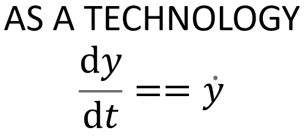
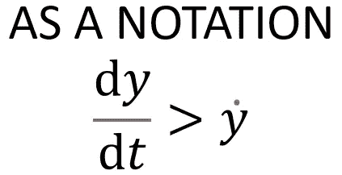

# 数据科学最好的语言是什么？

> 原文：<https://towardsdatascience.com/whats-the-best-language-for-data-science-1e6d09b6df88>

## 意见

## 这个问题的答案比你想象的更加微妙

Artturi Jalli 在 [Unsplash](https://unsplash.com?utm_source=medium&utm_medium=referral) 上拍摄的照片

*更新——特别感谢吉本浩纪将本文翻译成日语。查看* [*这里*](https://ainow.ai/2022/06/27/265588/) *。*

在最近的一次小组讨论中，我发现数据科学家在争论哪个机器学习框架更好:PyTorch 和 TensorFlow。我觉得好笑的是，这种争论的其他版本我之前已经听过无数次了。Python 还是 R？MATLAB 还是 Mathematica？Windows 还是 Linux？随着这些年来我学习了越来越多的编程语言，我发现问题不应该是哪种语言或框架是最好的，而是哪种语言或框架最适合手头的任务。

那么，创建机器学习原型的最佳语言是什么呢？如果你问五个数据科学家这个问题，你可能会得到五个不同的答案。要回答这个问题，你应该想一想你最习惯用哪种语言，以及该语言有哪些库和模型，这样你就可以尽快创建一个机器学习原型。

# 作为符号的编程语言与技术

我们通常将编程语言视为一种技术形式。编程语言都完成相同的开发机器代码的高级任务，因此可以被认为是等价的技术形式。然而，即使它们完成相同的任务，一种语言可能执行任务更快，或者甚至允许您完成另一种语言不能完成的其他更复杂的任务。当被视为一种技术形式时，语言在逻辑上是等价的。然而，从符号的角度来看，对于手头的任务，一种语言可能比另一种语言更好。

数学中的一个类比是计算函数导数的概念。为了完成这项任务，数学家需要使用一种形式的符号(图 1)。

图 1:微积分中用于计算导数的两种符号。左边的符号是由李布尼兹发明的，右边的符号是由艾萨克·牛顿爵士发明的。当被认为是一种技术时，这些在逻辑上是相等的。图片作者。

在图 1 的右边，我们有艾萨克·牛顿爵士开发的点符号。大约在同一时间，Gottfried Wilhelm Liebniz 左边的符号得到了发展。如果我们把这些符号看作技术，它们在逻辑上是相等的，因为它们都允许我们计算函数的导数。

然而，当我们把它们看作符号时，这两者并不一定相等。一种符号可能更适合某项任务。例如，Liebniz 的符号使得通过分离变量、分部积分和其他方法求解微分方程比牛顿的符号更直观。因此，我们可能会认为 Liebniz 的符号在求解微分方程时比牛顿的符号更强大(图 2)。

图 2:作为符号形式的导数是不等价的。Liebniz 的符号是一种优越的符号形式，它使得通过分离变量、分部积分和其他方法求解微分方程更加直观。因此，这是一个更强大的符号。图片作者。

如果两种不同形式的数学符号的有用性有不同程度的关联，那么编程语言也有不同程度的关联吗？绝对的！

# 优化创建初始原型所需的时间

在每一次关于哪种编程语言是最好的争论中，语言的计算性能似乎总是被提出来。举个例子【Peter Xie 的这篇文章显示 Python 比 C 慢 45000 倍，C 比 Python 快就意味着它是更好的语言吗？不一定。虽然我可以拿出一些[技巧](https://skl.sh/3dq3Iz0)来加速我的 Python 代码，但我认为人们忽略了真正重要的一点。开发人员和数据科学家的时间远比机器时间昂贵。

人们经常在第一次或第二次迭代中试图让他们的代码得到完美的优化。我认为，人们不应该优化机器时间，而应该优化他们为概念证明编写代码和最初向客户交付价值所花费的时间。

由[卢卡斯·布拉塞克](https://unsplash.com/@goumbik?utm_source=medium&utm_medium=referral)在 [Unsplash](https://unsplash.com?utm_source=medium&utm_medium=referral) 上拍摄

虽然 Python 的计算速度可能比 C 慢，但与 C 相比，我用 Python 创建机器学习模型所需的代码行更少，最终花费的时间也更少。在进行原型开发时，动态类型与静态类型之类的小事情会在速度上产生真正的差异。但这并不一定意味着 Python 是这项工作的正确语言，因为数据科学家使用的许多标准语言都有类似的功能和抽象。实际上，它似乎更多地归结于库，而不是核心语言。

如果你像我一样，你可能正在做大量的自然语言处理工作。我的经验是 Python 拥有最强大的 NLP 库。scikit-learn、NLTK、spaCy、gensim、textacy 等库允许数据科学家对文本数据进行快速清理、预处理、提取特征和建模。但是如果我想做数据分析或时间序列分析，我发现 R 中可用的包更强大。然而，如果我需要使用更复杂的时间序列方法，如递归神经网络，我经常会发现自己又回到了 Python，因为它的库非常适合深度学习。

当你开始使用深度学习等复杂的机器学习架构时，通常训练你的模型所需的时间会迅速增加。但是，随着计算能力的不断提高，培训时间越来越不成问题。事实上，我认为我们正在创造更复杂的机器学习，这在很大程度上是因为如此多的计算能力已经变得可用，并且组织正在竞相使用它的每一点。

最后，在为您的项目选择语言或库时，我建议选择一种能够优化您创建初始原型的时间的语言或库。当有人学习用一种语言编码时，他们实际上开始用那种语言思考。我自己也发现了这一点。我现在主要用 Python 编程，当我决定如何解决一个问题时，我会考虑如何用 Python 解决它。回顾我的职业生涯，当我学习新的语言时，我意识到，如果当时我使用的是一种语言，我会用完全不同的方式思考如何解决这个问题。

由[马库斯·温克勒](https://unsplash.com/@markuswinkler?utm_source=medium&utm_medium=referral)在 [Unsplash](https://unsplash.com?utm_source=medium&utm_medium=referral) 上拍摄

# 影响原型制作速度的因素

影响原型开发速度的一个主要因素是构建模型架构所花费的时间。我通常倾向于 scikit 这样的库——学习构建模型架构。我根本不需要做太多的工作来构建一个模型架构，它允许我快速地构建一个初始模型。我通常从最简单的模型开始，然后逐步增加模型的复杂性。只有在我完成了简单的模型之后，我才会开始构建更复杂的深度学习模型。在这一点上，我仍然在寻找能够使用 Keras 和 Tensorflow 等工具尽可能快地构建模型架构的抽象。

影响原型制作速度的另一个因素是训练初始模型所需的数据量。通常我们可以从一个不需要太多数据的简单模型开始。但是有时候简单的模型并不能满足我们的精度要求，所以我们需要使用更复杂的模型，这通常需要更多的数据。当可能需要一个月的时间来获取/创建更多的数据时，这最终会降低原型开发的速度。

为了加快获取/创建更多数据的过程，您可以尝试使用迁移学习技术或预训练模型。虽然您可能能够使用这些技术或模型更快地构建原型，但是您也可能将一些严重的伦理问题引入到您的原型中。

# 快速原型制作时的伦理问题

作为一名数据科学家，我们有责任确保我们的模型不会产生针对受保护类别的有偏见的结果。亚马逊经历了[惨痛的教训](https://www.reuters.com/article/us-amazon-com-jobs-automation-insight/amazon-scraps-secret-ai-recruiting-tool-that-showed-bias-against-women-idUSKCN1MK08G)。如果您使用的是预先训练的模型，您可能无法访问该模型所训练的数据集。即使您有它被训练的数据，您可能也不知道这些数据是如何被清理、预处理或采样用于训练和测试的。这些步骤中的每一步都可能无法消除数据集中的继承偏差。更糟糕的是，它可能会在数据集中引入甚至放大偏差。我只能说我自己，但我不相信我能在迁移学习过程中消除预训练模型中的偏见。因此，我对这种方法的使用非常谨慎，但当我确信与业务用例相关的风险有限时，我会让像[拥抱脸](https://huggingface.co/)这样的网站决定我使用哪个库。

在这种情况下，机器学习模型的力量实际上正在取代库的力量或指示我使用什么的语言。因此，我经常发现自己在 PyTorch 中从事更前沿的数据科学工作，但这涉及到使用迁移学习或直接使用另一个组织构建的模型，而没有任何迁移学习。

# **结论**

最终，经常发生的语言、库和模型之争被误导了。没有一种编程语言最适合数据科学。最好的编程语言是允许你最快地构建原型并向你的客户和/或最终用户交付价值的语言。

在构建原型时，不要马上优化你的代码。相反，优化数据科学家的速度。一旦您成功地证明了您的模型将解决手头的问题，您就可以使用一个分析器来帮助确定代码中的瓶颈在哪里。这允许您优化机器时间，但是在编写代码之前，您无法分析代码。不要本末倒置！确定您试图解决的问题类型，并选择将帮助您最快构建的最佳工具集。

# 参考

1.  [https://Peter-jp-Xie . medium . com/how-slow-is-python-comparated-to-c-3795071 ce 82 a #:~:text = It % 20 is % 20450% 2000 万%20loops，mode % 20 for % 20a % 20 better % 20 performance。&text = Yes % 2C % 20it % 20 is % 20 难以置信！，比 Python 快 45% 2c 000% 20 倍% 20% 20% 20](https://peter-jp-xie.medium.com/how-slow-is-python-compared-to-c-3795071ce82a#:~:text=It%20is%20450%20million%20loops,mode%20for%20a%20better%20performance.&text=Yes%2C%20it%20is%20unbelievable!,45%2C000%20times%20faster%20than%20Python)。
2.  【https://skl.sh/3dq3Iz0 
3.  [https://www . Reuters . com/article/us-Amazon-com-jobs-automation-insight/Amazon-scraps-secret-ai-recruiting-tool-that-show-bias-against-women-iduscn1 MK 08g](https://www.reuters.com/article/us-amazon-com-jobs-automation-insight/amazon-scraps-secret-ai-recruiting-tool-that-showed-bias-against-women-idUSKCN1MK08G)