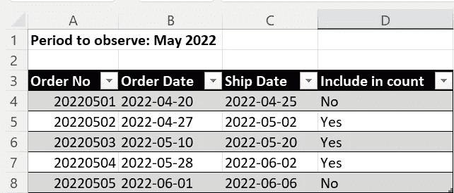
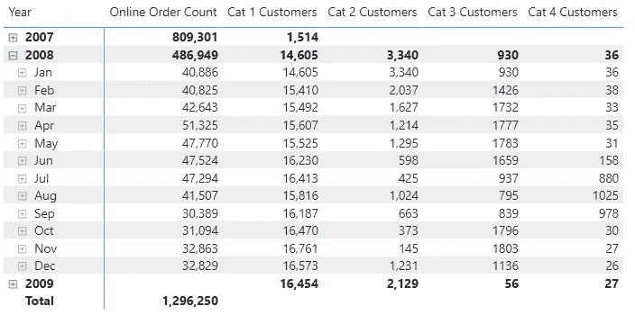
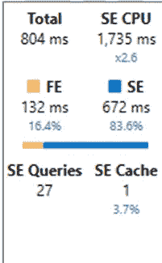

# 当一个计数变得疯狂时，或者如何在 DAX 中计数订单

> 原文：<https://towardsdatascience.com/when-a-count-goes-mad-or-how-to-count-orders-over-time-in-dax-850b55145f3>

## 当我们不得不扩大我们的范围，纳入比本期可见订单更多的订单时，会发生什么？


由[艾萨克·史密斯](https://unsplash.com/@isaacmsmith?utm_source=medium&utm_medium=referral)在 [Unsplash](https://unsplash.com?utm_source=medium&utm_medium=referral) 上拍摄的照片

# 我的委托人要求的

我的一个客户问了我以下两个问题:

1.  我想统计所有订单，包括特定期间的未结订单
2.  我希望根据一段时间内的订单数量对客户进行分类

这两个问题看似简单，但经过一番思考，我不得不再三考虑可能的解决方案。

要解决这两个问题，我们必须操作过滤器上下文，以包含比当前过滤器上下文中可见的更多的行。

现在，我将一次解决一个问题，并描述我是如何试图解决这些挑战的，以及在解决第二个挑战时，在找到正确的方法之前，我是如何走上错误的道路的。

# 数据模型

我在本文中使用了 Contoso 数据模型(参见下面的源代码和许可信息)。

数据模型如下图所示:


图 1 —数据模型

在线销售表与日期表有三种关系:

*   订单日期至今
*   截止日期至今(无效)
*   发货日期至今(无效)

# 第一个问题的挑战

第一步是为期望的结果定义一个真值表。

我们需要这样一个表来指定期望的结果:



图 2 —未结订单的真值表

如您所见，在观察期开始前创建但在观察期内发货的每个订单都被定义为未结订单。

此外，在观察期间创建的所有订单都必须包括在计数中。

# DAX 中的解

为了满足需求，我们需要创建两个度量。

1.简单订单计数

该度量对事实表中的订单数进行计数。

由于每个订单有几个订单行(订单中的每个产品一个)，我必须使用 DISTINCTCOUNT()函数来度量:

```
Online Order Count = DISTINCTCOUNT(‘Online Sales’[Sales Order Number])
```

此度量返回当前筛选器上下文中的订单数。

2.活动订单计数

这个衡量标准稍微复杂一点:

我必须包含所有 OrderDate 在观察期开始之前的未结订单(Date 表的实际过滤上下文)。

这是衡量标准:

```
Online order count (open orders) =VAR FirstActualDate = MIN( ‘Date’[Date] )VAR ActiveOrders =
    CALCULATE(
        [Online Order Count]
        ,CROSSFILTER(‘Online Sales’[OrderDate], ‘Date’[Date], NONE)
        ,’Online Sales’[OrderDate] < FirstActualDate
          && ‘Online Sales’[ShipDate] >= FirstActualDate
        )RETURN
    ActiveOrders
```

我使用[在线订单计数]来统计订单。

然后，我使用 CROSSFILTER()禁用与数据表的活动关系。

此函数确保过滤器上下文不会应用于此计算。
或者，您可以使用 ALL('Date ')来删除日期表上的实际过滤上下文。

然后，我使用在度量开始时定义的变量 FirstActualDate，只包含在实际周期/过滤器上下文之前创建但尚未发货的订单。

我试图编写一个度量来获取当前过滤器上下文中的所有订单和所有未结订单，如上面的真值表中所定义的。但是这种方法会导致非常复杂的测量。

因此，我决定更改度量的最后一行，将[在线订单计数]度量和新度量加在一起，以获得正确的结果:

```
RETURN
    [Online Order Count] + ActiveOrders
```

通过这一步，我可以用一种简单的方法在结果中包含所有其他订单。

# 第二个问题的挑战

这个要复杂得多。

确切的要求如下:

必须对每个客户进行观察，并根据过去 180 天的订单数量对其进行分类(以下要求根据我的客户的原始要求改编为 Contoso 数据集)。

1.  当客户下的订单少于 20 份时，该客户必须归类为“待联系”
2.  当客户下了 21 到 35 份订单时，该客户必须被归类为“普通客户”
3.  当客户下了 36 到 50 份订单时，该客户必须被归类为“好客户”
4.  当客户下了超过 50 份订单时，该客户必须被归类为“非常好的客户”

我的客户强调计算每天和每个顾客的分类。

在这个阶段，单一客户并不那么重要。但是随着时间的推移，观察所有客户的发展是至关重要的。

我的第一个想法是这样的:我需要知道每个客户的订单之间的距离。然后尝试根据这些信息计算每个客户的类别。

获得这个结果的最直接的方法是创建一个计算列。

另一种方法是创建一个衡量标准并动态计算这些信息。

每种方法都有优点和缺点。但是我确信计算列可以支持该解决方案，因为随着时间的推移，每个客户都会在类别之间发生变化。

但最终的解决方案是一个措施，因为客户可以在一个月内创建 100 个订单，但在接下来的三个月内只能创建 10 个，随着时间的推移，他将转移到另一个类别。

# 在达克斯寻找解决方案的路上

第一步是获得每个订单之间的天数距离作为计算列:

```
DistanceToPrevOrder =
    VAR CurrentCust = ‘Online Sales’[CustomerKey]
    VAR CurrentDate = ‘Online Sales’[OrderDate] VAR PrevOrder = CALCULATE ( MAX(‘Online Sales’[OrderDate])
                       ,FILTER(‘Online Sales’
                       ,’Online Sales’[CustomerKey] = CurrentCust
                         && ‘Online Sales’[OrderDate] < CurrentDate)
                       )VAR OrderDistanceDay =
    IF (NOT ISBLANK(PrevOrder), INT ( CurrentDate — PrevOrder ) )RETURN
    OrderDistanceDay
```

在这里，我使用上下文转换来获取每个客户和每个订单的前一个订单的日期。

要了解有关上下文转换的更多信息，请阅读本文:

</whats-fancy-about-context-transition-in-dax-efb5d5bc4c01>  

下一步是创建获得最终结果的方法。

我必须为每个类别创建一个度量。多种衡量标准是实现客户动态计数的唯一方法。

我的下一步是使用计算列生成结果。

但是用这种方法不可能得到正确的结果，因为当有订单时，这个度量只返回一个数字。

但是客户端每个周期需要一个数字。

我第二次尝试解决这一挑战时，采取了以下措施:

```
Customer to contact =VAR ActualDate = MAX(‘Date’[Date])
// Get only the rows where Max OrderDate per customer is ActualDate
        — 180 daysVAR Result = COUNTROWS(
                FILTER(
                   SUMMARIZE (
                         GENERATE(
                           ‘Date’
                           ,’Online Sales’
                           )
                           ,’Date’[Date]
                           ,’Online Sales’[CustomerKey]
                           ,”OrderCount”, CALCULATE (
                             DISTINCTCOUNT(
                               ‘Online Sales’[Sales Order Number]) )
                             )
                       ,’Date’[Date] < ActualDate
                            && ‘Date’[Date] >= ActualDate — 180
                            && [OrderCount] < 20
                       )
                   )RETURN
    Result
```

但是返回前两个类别的结果需要五分钟以上，这是不可接受的。

这个冗长响应的原因是 GENERATE()函数。

我试图用日期表中每个客户和每一行的每个组合生成一行。

我在 FILTER()函数中使用结果表来过滤出需要的行。为此，我使用上下文转换(CALCULATE(distinct count(' Online Sales '[销售订单号]))计算了 SUMMARIZE()结果中的 OrderCount 列

虽然我用 19，000 名客户的 Contoso 数据集得到了一个结果，但它不适用于我的客户数据。他的客户表上有超过 140 万行。

但是仔细观察发现结果也是不正确的。所以，这种方法是一个死胡同。


在 [Unsplash](https://unsplash.com?utm_source=medium&utm_medium=referral) 上 [engin akyurt](https://unsplash.com/@enginakyurt?utm_source=medium&utm_medium=referral) 拍摄的照片

为了找到一种新的方法，我不得不退后一步，理清思绪，从新的角度看待这个挑战。

我意识到，在基于日期层次结构创建报告时，我总是有一个日期上下文。我不必为每个日期和每个客户生成一个表来计算订单数。在那之前，我完全走错了路。

然后我把问题分成两个问题:

1.  过去 180 天内创建了多少订单？
2.  在过去的 180 天里，每位顾客有多少订单
    答:根据这些信息，我可以对顾客进行分类

第一项措施是统计过去 180 天的订单:

```
Orders last 180 Days =
    VAR Last180Days =
           DATESINPERIOD(‘Date’[Date], MIN(‘Date’[Date]), -180, DAY) VAR OrdersLast180Days =
                        CALCULATETABLE(
                             SUMMARIZE(‘Online Sales’
                                ,’Online Sales’[Sales Order Number])
                             ,Last180Days
                            ) VAR OrderCountLast180Days = COUNTROWS(OrdersLast180Days)RETURN
    OrderCountLast180Days
```

第一步是生成一个表，其中包含实际过滤上下文之前的所有日期— 180 天。

在第二步中，我使用 CALCULATETABLE()和 SUMMARIZE()获得这段时间内所有订单的列表。

第三步也是最后一步是计算第二步的行数。

现在我用它来计算每个客户的订单数。

对于此计算，我为第一个类别创建了以下衡量标准:

```
Cat 1 Customers =
    COUNTROWS(
        CALCULATETABLE(VALUES(‘Customer’[CustomerKey])
                         ,FILTER(‘Customer’
                               ,NOT ISBLANK([Orders last 180 Days])
                               &&
                               [Orders last 180 Days] < 20
                              )
                         )
                   )
```

因为我需要考虑每个客户，所以我必须遍历 customer 表并检查每个客户的订单数。

让我们从外到内来看看这个衡量标准:

1.  COUNTROWS()将使用每个客户的订单数来计算表的行数
2.  CALCULATETABLE()生成一个表
    a .在 CALCULATETABLE()内部，我使用 VALUES('Customer[CustomerKey])来获取所有客户
    b .然后，我使用 FILTER()根据每个客户的订单数来过滤 Customer 表

因为 FILTER()是一个迭代器，所以我利用上下文转换来获取每个客户过去 180 天的订单数。度量[最近 180 天的订单]获取实际客户作为筛选上下文，并计算每个客户的订单量。

我必须使用 NOT is blank([订单持续 180 天])来排除没有任何订单的周期。如果没有这种排除，即使没有订单，我也可以获得所有时期所有客户的计数。这仅适用于第一个订单之前和最后一个订单之后的所有期间。我们总是在这些边界之间得到一个结果。

结果是在过去 180 天内订单超过 20 个的客户列表。该列表中的行是 COUNTROWS()的输入。

结果如下图所示(所有四个测量值):



图 3 —最终解决方案的结果(由作者提供)

这种方法有以下两个优点:

*   我为每个客户创建了一个报告，因为每个客户的过滤上下文将预先过滤客户表。这样，我将得到每个客户的正确结果
*   结果的计算在很短的时间内就完成了



图 4—解决方案的查询性能(由作者提供)

您可以看到存储引擎执行了大部分工作(蓝色部分)。尽管该引擎有 27 个查询要做，但它们可以在很短的时间内并行执行。

然后，我将这个解决方案转移到我的客户的 Power BI 文件中，在他的客户表中有 140 万个条目。

第一个视频花了一分多钟才显示出结果。这是一个不好的迹象。

然后我在订单年份上设置了一个过滤器。Power BI 在不到一秒的时间内完成了结果的计算。

我必须看看性能，并与我的客户讨论，看看这是否可以，或者我是否必须尝试进一步优化解决方案。


安德烈·亨特在 [Unsplash](https://unsplash.com?utm_source=medium&utm_medium=referral) 拍摄的照片

# 经验教训

虽然第一个挑战的解决方案相对简单，但第二个挑战被证明要困难得多。

我的错误是开始用我的客户定义问题的方式来思考。这种想法是找到正确方法的一大障碍。

我不得不从他的表述中断开我的思考，开始从一个新的角度思考。

当我这样做的时候，我在相对短的时间内找到了解决方案。我只需要将挑战分解成更小的部分，这很有效。

回过头来看，我想建议不要在和你的客户讨论的时候开始寻找解决方案。首先，完成挑战的定义。然后坐下来休息几分钟，在将思维切换到“DAX 模式”后看看挑战。

很容易让人想到:“我知道这个挑战的答案”或“我必须做这个或那个”。虽然这种想法可能是正确的，但它有时会导致错误的方法。

就像在 DAX 中一样，你思维的上下文转换需要时间，而且并不简单。

# 参考

我使用 Contoso 样本数据集，就像我以前的文章一样。你可以从微软[这里](https://www.microsoft.com/en-us/download/details.aspx?id=18279)免费下载 ContosoRetailDW 数据集。

Contoso 数据可以在 MIT 许可下自由使用，如这里的[所述](https://github.com/microsoft/Power-BI-Embedded-Contoso-Sales-Demo)。

我扩大了数据集，使 DAX 引擎工作更努力。
在线销售表包含 7100 万行(而不是 1260 万行)，零售表包含 1550 万行(而不是 340 万行)。

<https://medium.com/@salvatorecagliari/membership> 