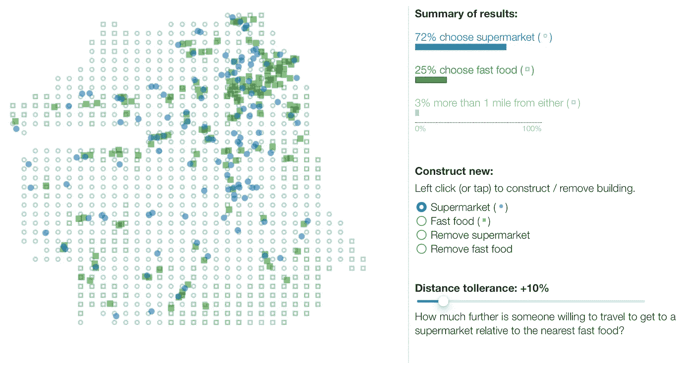
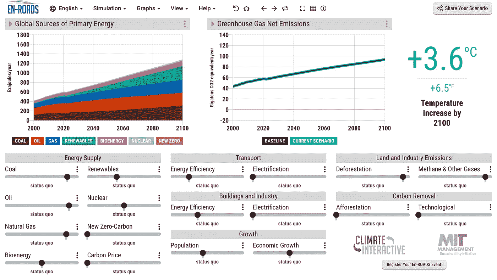

# 当准确性不够时:可视化和游戏设计

> 原文：<https://towardsdatascience.com/when-accuracy-isnt-enough-visualization-and-game-design-48b95425130a>

建模通常从定义一个要优化的度量标准开始，通常，这个“好”的定义遗漏了一些东西。[提高精确度会为歧视创造空间](https://www.reuters.com/article/us-amazon-com-jobs-automation-insight/amazon-scraps-secret-ai-recruiting-tool-that-showed-bias-against-women-idUSKCN1MK08G)，[优化利润会加剧不公平](https://www.technologyreview.com/2020/10/20/1009452/ai-has-exacerbated-racial-bias-in-housing-could-it-help-eliminate-it-instead/)，[不良行为会隐藏在良好的绩效指标背后](https://www.technologyreview.com/2021/07/30/1030329/machine-learning-ai-failed-covid-hospital-diagnosis-pandemic/)【1】【2】【3】。数据科学为优化提供了许多工具，但请考虑定义问题本身:什么使解决方案令人满意，什么行为意味着它能按预期工作？没有一个答案是[这个领域正在进行大量的工作](https://www.kdd.org/kdd2016/papers/files/rfp0573-ribeiroA.pdf) ( [包括需要提高学科本身的多样性](https://www.theverge.com/2019/4/16/18410501/artificial-intelligence-ai-diversity-report-facial-recognition))【4】【5】。然而，考虑两个有时不常见的工具可能会有所帮助:信息和游戏设计。

# 可视化:一个数字是不够的

一个“理想的”模型乍一看似乎是显而易见的:一个在从未见过的数据中进行预测时具有高准确度的模型。然而，考虑一个假设的计算机视觉产品，它以 92%的准确率识别受损的房屋。在一个[测试集](https://deepchecks.com/glossary/test-set-in-machine-learning/)中，六个城市样本对应一个农村样本，这可能意味着 50%的农村准确率和 99%的城市准确率[6]。不同的城市或街区呢？什么样的建模选择会使这种差异变得更糟？总结出一个数字隐藏了这种复杂性。

显示[可视化的线框，不仅仅是精度和回忆](https://www.slideshare.net/Samnsparky/user-centered-data-science-135680883/Samnsparky/user-centered-data-science-135680883)【7】。

团队经常在基础设施上花费资源来构建和维护模型，但是我很少看到有[信息设计师](https://segd.org/what-information-design)【8】【9】。从[的准确度到精确度和召回率](/accuracy-precision-recall-or-f1-331fb37c5cb9)绝对有帮助，但是按地区或在地图上显示这些指标呢？这看起来很简单，但构建超越汇总指标的可视化来询问多个维度上的性能，不仅使数据科学家，而且使更广泛的合作者群体能够对性能有更深入的理解，包括哪里有亮点，哪里出现差异(或不公平)。

# 游戏设计:我们不知道一切

可视化有助于理解目标绩效，但是错误的目标怎么办？考虑一个模型，该模型计算出在一个城市中何处激励创建新的健康饮食超市。我在旧金山建立了一个食物可用性模型。人们可以很容易地要求计算机放置超市，以优化健康和新鲜食品的获取，但这种模型不理解现有的社会中心，公共交通接入，收入不平等，这些地方的历史等。这些不同的因素有多重要？最优化可以达到市民认为不理想的数值理想解。

一个开源[互动模拟旧金山食物可用性的截图](https://foodsimsf.com)【11】。

然而，通过使[成为一个交互工具来交互地“测试”不同的解决方案](https://foodsimsf.com)，模型从*开出*一个答案变成了*对不同答案进行推理*的媒介【11】。工具使利益相关者能够将他们自己的知识带到问题中，围绕潜在的解决方案进行有根据的讨论，共同定义什么是理想的。人们可以引入模型中没有的视角，提出数据科学家可能没有考虑到的问题。数据团队如何设计这些工具？ [MLUX](https://medium.com/ml-ux/what-is-ml-ux-71d5e6d6ce9) 的学科解决了这些问题，而[游戏设计](https://www.youtube.com/watch?v=PMXf0e8n2Oc)也提供了关于[在复杂系统中培养能力](https://www.youtube.com/watch?v=Q_AsF3Rfw8w)的观点，为[获得理解](https://www.youtube.com/watch?v=-GV814cWiAw)精心制作[可访问的](https://www.youtube.com/watch?v=4NGe4dzlukc&list=PLc38fcMFcV_vvWOhMDriBlVocTZ8mKQzR)体验，以及[实验](https://www.youtube.com/watch?v=w1_zmx-wU0U)【12】【13】【14】【15】【16】【17】。

# 参与式设计

信息和游戏设计一起询问[工具如何实现新的思维方式](http://worrydream.com/MediaForThinkingTheUnthinkable/)以及模型如何不仅创造解决方案而且创造对话【18】【19】。理想情况下，这些方法的结合减少了其他人合作的障碍，使新的观点能够实质性地通知关于解决方案本身的决策或关于建模中未来步骤的推理。这种 echos [参与式设计](https://owl.purdue.edu/owl/subject_specific_writing/professional_technical_writing/effective_workplace_writing/participatory_design.html)，将利益相关者集中起来与工程师/设计师共同设计的方法【20】。这些用户参与解决方案的创建，而不是将解决方案带给用户。

著名的 EN-ROADS 模拟演示了让更多人参与对话的想法[19]。

这种头脑中的框架、可视化和游戏设计将 ML 从传统方法(或人类专业知识)的竞争对手转变为决策工具。这为人类合作者提供了一个新的*额外的*视角，并有助于实现一个比人类或机器单独实现的更全面、更明智的整体解决方案。

# 总结一下:理解的工具

可视化有助于解释一个系统或模型，而游戏设计可以帮助构建工具来推理不同的解决方案或行为。它们共同促成了类似参与式设计的东西。他们使模型的行为和参数对许多合作者是可访问的。当然，这些可视化和实验工具需要设计和技术人员。然而，最终，每个人都受益于将一个 ML 工具从一个独立的实体变成一个合作伙伴，增加和扩展人类对问题的理解，同时确保模型的[影响](https://www.gartner.com/smarterwithgartner/use-this-6-step-approach-to-get-buy-in-for-data-and-analytics-strategies)【20】。

*想在数据、设计和系统的交叉领域进行更多的实验吗？* [*关注我获取更多*](https://tinyletter.com/SamPottinger) *！*