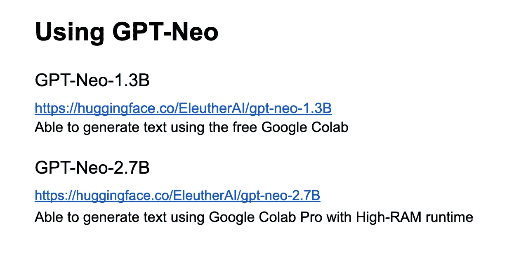
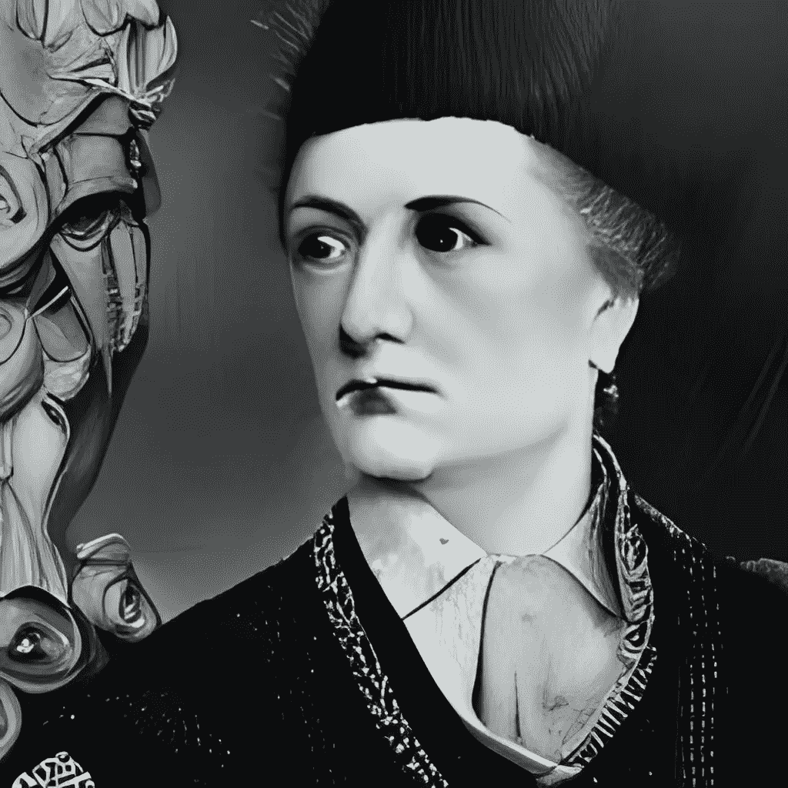

# 当人工智能写维基百科的时候

> 原文：<https://towardsdatascience.com/when-an-ai-writes-wikipedia-f7aa3eff9ebc>

# 当人工智能写维基百科的时候

## GPT 尼奥对我们了解多少？

诺贝尔文学奖得主，插图由[Ru-DALLE](https://rudalle.ru/en/)CC-BY

乔纳森·斯威夫特 1726 年的小说*格列佛游记*描述了一台“奇妙的机器”，它允许“最无知的人，以合理的费用，用一点体力劳动”来“在没有天才的帮助下，写哲学、诗歌、政治、法律、数学和神学方面的书。”

想象一下，将近 300 年后，当我偶然发现[伊莱瑟雷](https://eleuther.ai)版本的这台机器:[GPT-尼奥](https://github.com/EleutherAI/gpt-neo)时，我是多么惊讶和高兴。只需点击几下，我就能生成成千上万的单词。更具体地说，我能够为 118 位诺贝尔文学奖得主创建维基百科风格的传记，而没有研究的麻烦，没有空白页面的绝望，或者真的根本不需要劳动。

我偶然发现了 GPT-尼奥生成维基百科页面的能力。只需键入名字和姓氏，然后输入生活日期——例如，“多丽丝·梅·莱辛**(1919 年 10 月 22 日-2013 年 11 月 17 日)”——就可以创建一个完整的类似维基百科的传记，通常还会有一个类似真实维基百科文章底部的类别列表——“美国女小说家”或“密西西比意外死亡”，威廉·福克纳就属于这一类别。**

**我的挑战不是写作，而是阅读这几页，我做到了。我发现 GPT-尼奥在真正的学术意义上可能是一个胡扯:**

> **“说谎者是对真相感兴趣，知道真相，并故意歪曲真相的人。相比之下，胡说八道的人不关心真相，不知道或不关心什么是真的或假的。”伊恩·p·麦卡锡等人。al**

****

**尽管如此，GPT-尼奥还是很好地抓住了维基百科页面的感觉。1.3B(13 亿个参数)版本确定了 43 位文学奖得主为作者，9 位为诺贝尔奖获得者，而 2.7B 版本确定了 51 位获奖者为作家(包括 1.3B 版本确定的大多数，但不是所有人)。当我阅读这些传记时，我开始想知道 GPT-尼奥对书中毫不费力描述的个人“了解”多少。**

**“她最著名的作品是《最蓝的眼睛》，这是她职业生涯的主要部分，”GPT-尼奥这样评价托妮·莫里森。有人可能不同意《T2》《最蓝的眼睛》是莫里森最著名的小说，但它确实是她写的。对于海明威，机器指出“他的后期作品，如*《太阳照常升起》* (1924 年)、*《老人》&《海》* (1925 年)、*《过河入林》* (1933 年)和*《伊甸园》* (1939 年)，通常被描述为“历史小说”。“酒吧的日期取消了，但标题是海明威的。**

****

**作者托马斯·曼恩的肖像由[Ru-DALLE](https://rudalle.ru/en/)CC-BY 完成**

**然而，这种准确性是例外。一般来说，机械作家不在乎细节是否正确:**

> **“托马斯·曼恩是 12 本书的作者，包括《魔山》、《真理的魔力》、《现实的魔力》、《通货膨胀的魔力》和《一个没有素质的人》”。**

**它自信地将作品归功于它喜欢的任何人:“福克纳最著名的作品是*喧嚣与骚动*和*哈姆雷特树和其他故事*，而爱丽丝·门罗的全部作品包括*穿越时间的女孩*…随后是*我的生活是个谎言*和*彩虹的尽头***

**奖项和“第一次”占据显著位置。“1958 年，在他们的儿子出生后，[若泽·萨拉马戈]被葡萄牙文学院宣布为年度父亲”或者“在他去世几个月后，[米盖尔·安吉尔·阿斯图里亚斯]在《人物》杂志评选的 50 位最伟大的西班牙演员中名列第 24 位。”**

**有时，这些说法包含脚注:“[辛克莱]刘易斯于 1885 年 2 月 7 日出生于纽约市，在一个大家庭的九个孩子中排行第七，在十二个孩子中排行第十一。[1]“但它们是无处可去的脚注。其他时候，机械作家生成了一个“外部链接”部分，其中包含作者采访或书籍的链接，但我在互联网上搜索时没有找到。**

**总的来说，GPT-尼奥的发明——尽管有时很滑稽，通常不真实——有一种怪异的一致性，使它们令人信服。受试者的寿命和生活事件几乎总是与提供的日期相匹配。GPT-尼奥只是在出生和死亡之间虚构了这个故事，将真实的人编织到故事的叙述中——“1914 年，[奈丽·萨克斯]遇到了德裔犹太无政府主义者罗莎·卢森堡，”或者“贝克特受到了亨利·詹姆斯作品的影响”——并引用了一些话来支持这个主题的知名度:“美国桂冠诗人查尔斯·赖特(Charles Wright)曾在《纽约客》(the New Yorker)上形容品特是“英语世界最重要的作家之一。”"**

> **有时，作者自己也说:“在 1986 年的一次采访中，[鲍勃]迪伦说‘我对不跳舞的女孩有一种感觉。我是一个有问题的舞者。"**

**GPT-尼欧的胡扯技巧在描述所谓的哲学著作的冗长段落中表现得最为明显:**

> **按照欧肯的说法，人的意志可以从三个方面来理解:作为由神的意志的意志所决定的纯粹主体；作为一个没有意志的意志；作为一个意志，它是由一个更高意志的形象决定的…无意志的意志是纯粹的心理现象，是这种意志的形象。人是上帝意志的主体，但这并不意味着人有完整的人格。**

**GPT·尼欧写了关于“知识的极限和真理概念的问题”，“自由和决定论的概念”，以及“真理概念是否真的只是一个观点的问题。”**

**你可能会想，它是怎么学会这些的？**

**GPT-尼奥在“堆”上接受了训练，这是一个巨大的文本数据集，包括英语维基百科和许多其他语料库。它附带了这样的免责声明:“已知包含亵渎，猥亵，或其他磨料语言。根据您的使用情况，GPT-尼奥可能会产生社会不接受的文本。”**

**生成的文本不可接受吗？有时候，是的。有人提醒我维基百科已知的偏见吗？还有，是的。被称为“翻译家、记者和编辑”的[西格里德·温塞特](https://en.wikipedia.org/wiki/Sigrid_Undset)的工作是这样被表彰的:**

****

**作者西格里德·温塞特的肖像由[Ru-DALLE](https://rudalle.ru/en/)CC-BY 完成**

> **几件与她生活相关的物品正在乌普萨拉的艺术和文学博物馆与她生活中的其他纪念品一起展出。这些包括**她的婚纱、全家福、她丈夫的来信和一些私人物品。****

**路易丝·格吕克的传记开头提到她是“一名德国化学家和化学教授”。她是恩斯特·海因里希·格吕克的女儿”,然后她转而谈到了恩斯特·海因里希的成就。文本最终回到了她的工作上，但本该用来描述她成就的空间被她的家庭占据了，在这种情况下，是一个男人的工作。**

**机械作家[是否不成比例地提到了](https://www.washingtonpost.com/politics/2021/02/24/wikipedias-political-science-coverage-is-biased-i-tried-fix-it/)男性？它是用[不同的形容词](https://epjdatascience.springeropen.com/articles/10.1140/epjds/s13688-016-0066-4)来描述男女，还是把更多的篇幅用于女性主题的[个人生活](https://arxiv.org/abs/2106.01601)？我不确定。我的样本很小。在我观察的 118 位诺贝尔奖获得者中，只有 14 位是女性。然而，如果机械作者延续甚至放大人类生成的维基百科的已知结构偏见，我不会感到惊讶。**

**总的来说，我发现 GPT·尼欧的文章清晰明了，有时准确无误，但更多时候是错误的，而且完全没有引用。我在评估传记中的角色变成了一个令人生畏的事实核查角色，我不寒而栗地想到，如果机械的作者也选择编造一个参考书目来“证明”其主张，那么文本对一个不知情的读者来说会显得多么令人信服。**

**作为读者，我不相信机械的作者。但我的感觉对这台“奇妙的机器”来说毫无意义，它会愉快地生成文本，而不需要“体力劳动”，甚至根本不需要身体。**

> **电脑生成的传记耐人寻味，令人不安，有时还很有趣。我把这个 [**集合**](https://cdn.knightlab.com/libs/timeline3/latest/embed/index.html?source=1DP_Z3is7dyYFaEOMjMqe9PafSGR9RaaWnng_6AkEqQ4&font=Default&lang=en&initial_zoom=6&height=650) 的每一句开场白放在一起，给人一种作品的感觉。**

****了解更多:****

**席德·布莱克，利奥·高，，康纳·莱希，斯特拉·彼得曼，
[GPT-尼奥:大规模自回归语言建模与网格张量流](https://doi.org/10.5281/zenodo.5297715) (2021)，芝诺多**

**Leo Gao，Stella Biderman，Sid Black，Laurence Golding，Travis Hoppe，，Jason Phang，Horace He，Anish Thite，Noa Nabeshima，Shawn Presser，Connor Leahy， [The Pile:一个 800GB 的多样化文本数据集，用于语言建模](https://arxiv.org/abs/2101.00027) (2020)，arXiv.org**